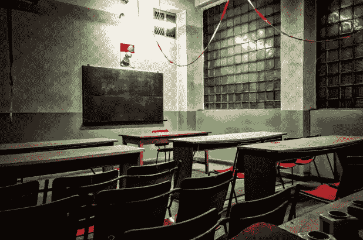
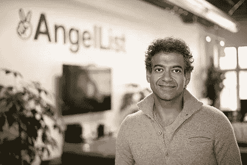
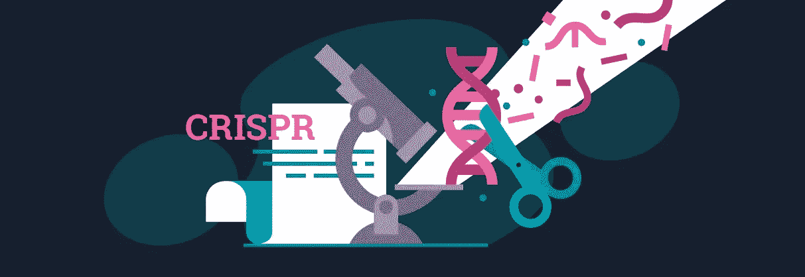
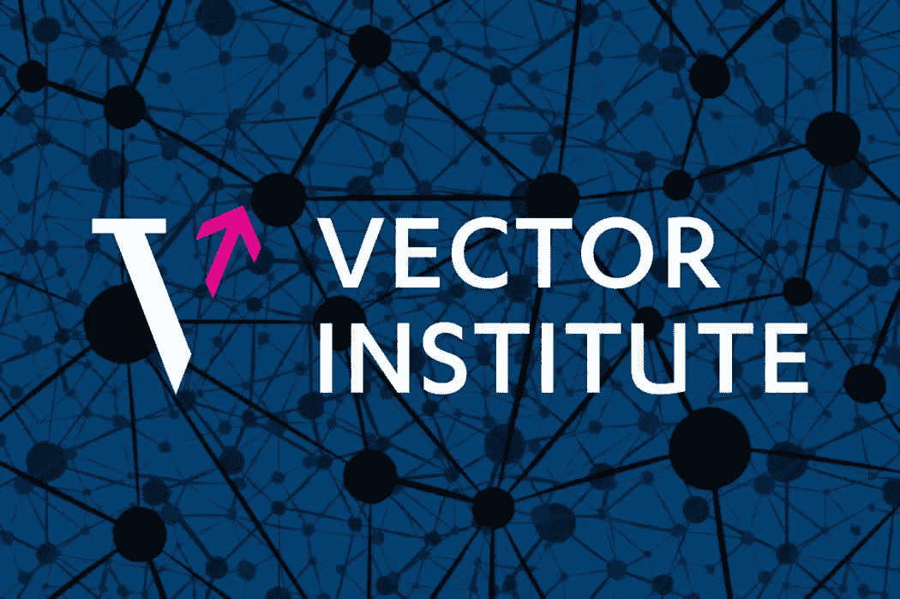
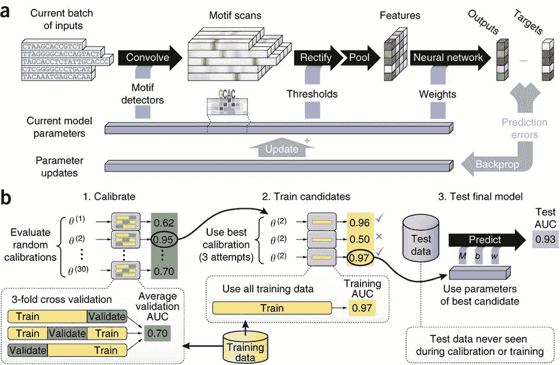

# 我作为高中生进入机器学习的旅程

> 原文：<https://medium.datadriveninvestor.com/my-journey-into-machine-learning-as-a-high-school-student-6c2ea57bf452?source=collection_archive---------4----------------------->

对于大多数高中生来说，我们的世界似乎围绕着学校、运动、朋友和课外活动。上学和做作业就像是一份全职工作，尤其是在高中，很少有时间从事其他活动和目标。我自己也很相似，对我所学和所做的大部分事情都没有质疑。

然而，在过去的一年里，我开始越来越多地了解基因组学和机器学习领域，我意识到有太多的机会让我了解更多！在当今世界，学校就像是一刀切的模式。我们的目标是培养普通工人，这一点在 300 多年来没有太大变化。

虽然在人类社会知识来源有限的时候，学校可能是有意义的，当书籍这样的东西对公众来说是不可及的，但今天的世界 ***与*** 有天壤之别。随着互联网和更快的通信链的出现，与以前相比，知识正在以指数级的速度被提取，并且降低了进入许多领域的门槛。

这并不是说学校不好，因为它对发展关键技能，如协作、职业道德和读写能力至关重要，并且对大多数孩子以后进入大专院校和获得工作是必要的。老师也是我们下一代的榜样，学校是我们认识未来的朋友、商业伙伴和经历的地方。然而，我们仍然被迫在课堂上记忆许多东西，如历史，而不是学习技能，如如何获得知识或管理我们的财务，这是我们在一个充满非法知识来源的时代迫切需要的，随着技术的发展，市场营销越来越多地参与到我们的日常生活中。

正如 AngelList 首席执行官 Naval Ravikant 所说的，“如果学校的主要目的是教育，互联网应该淘汰它。但学校主要是为了认证。”

AngelList CEO Naval Ravikant, whom I found to have really interesting ideologies.

# 我如何开始学习机器学习

自从我加入知识社会(Knowledge Society)以来，直到过去几个月，我才意识到这一点。知识社会是一个青年加速器，旨在向年轻人展示新兴技术，如人工智能、量子计算、基因组学和区块链。在那里，我对机器学习产生了新的热爱，从那以后，我一直在寻找将它融入快速发展的基因组学领域的方法。

在加入 TKS 之前，我对基因组学非常感兴趣。我写了一篇关于眼部遗传学领域现代疗法的文章，并写了几篇围绕 CRISPR-CAS9 及其功能以及当前问题(如不想要的删除)的文章。在前往 TKS 的途中，在阅读了机器学习在基因组生物学中的应用后，我意识到我想专注于机器学习，例如药物发现和识别基因表达。

在我刚开始学习的这段时间里，我开始向该领域的榜样学习，例如 Brendan Frey，他领导着 Deep Genomics，一家致力于利用深度学习创造遗传医学的公司，以及 Geoffrey Hinton，他被许多人称为人工智能的教父，也是技术和神经网络的先驱之一。为了扩展我的知识，我阅读了大量关于不同模型实现的论文和世界各地正在进行的研究。

The Vector Institute which aims to produce more deep learning grads than any other institution in the world — as part of an effort to produce, attract and retain top talent in Canada.

住在多伦多，我有幸称这个城市为家，它正迅速成为人工智能研究的温床。在过去的几个月里，我甚至能够在诸如 Re-Work 和多伦多机器学习峰会之类的会议上见到许多这些杰出的研究人员，并与他们谈论我作为一名开发人员所遇到和成长的不同问题！能够有幸见到像 Geoffrey Hinton 这样的研究人员，这就是为什么像 Re-Work 这样的会议对像我这样的学生来说是一个惊人的机会。

Diagram representing architecture of the DeepBind model and calibration phase steps (Source: Nature Biotechnology)

# 我当前的重点

在刚刚过去的这个寒假里，我把注意力集中在 CNN 上，并为围绕基因组学的不同问题开发模型。目前，我正在通过实现 DeepBind(弗雷实验室在 2015 年开发的工具)来创建一个用于蛋白质-DNA 结合预测的卷积神经网络。DNA 结合蛋白对转录极其重要，也就是从 DNA 编码 RNA 的过程，以及许多其他目的。使用这些模型，我们可以建立称为位置权重矩阵的东西来检测这些蛋白质的潜在结合位点。

我未来的一些目标是进一步开发基因组学周围的 ML 空间模型，并获得在实验室工作和在该空间进行研究的机会。我还想继续我两个月前开始的算法交易项目，并开发一个自然语言处理模型来帮助交易执行。

虽然在人工智能领域有无限的机会，但没有多少年轻人知道它们，甚至不知道如何开始学习这个领域。我认为，如果我们能够让更多的年轻人接触到为图像识别等简单项目设计基本模型，并将更多的行业导师带到高中和其他教育机构，我们就可以帮助刺激未来一代有抱负的开发人员的数量增长。我希望越来越多和我同龄的年轻人能够意识到这个领域的可能性，以及人工智能将如何颠覆几乎每一个行业。了解这些事情可能会帮助孩子们为他们的未来做出更好的职业选择(随着自动化的不断发展)，并有望创造一个更有生产力的经济。