# 我的机器学习之旅(上)——数据预处理

> 原文：<https://medium.datadriveninvestor.com/my-machine-learning-journey-part-i-data-pre-processing-374a023c2410?source=collection_archive---------8----------------------->

[](http://www.track.datadriveninvestor.com/BecomeDDItealI1)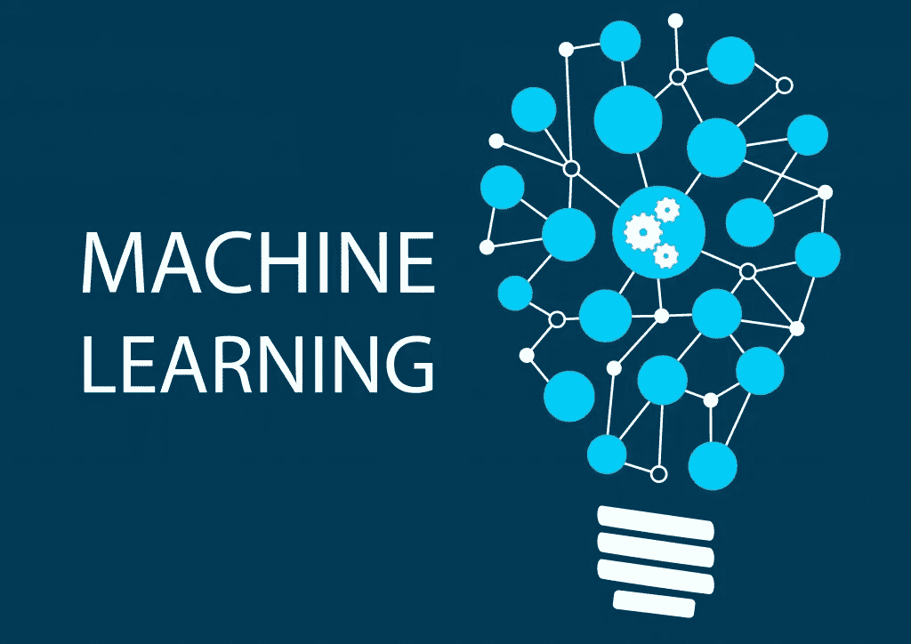

那是 2018 年 10 月 17 日下午 6 点，风在我的窗前轰然袭来。我从小睡中醒来，像往常一样——我拿起手机，去了 YouTube。感谢 YouTube 向我推荐了这个 Siraj Raval 的视频，他只是要求每一个机器学习爱好者每天至少花一个小时来学习或编写机器学习代码。我发现激励我的是每天都有一个要完成的目标，而不是一个要花费我所有时间和精力去实现的终生目标。

从下一刻起，我就完全投入到每天一小时的机器学习中。到目前为止，我的旅程一直很顺利，我可以肯定地说，任何登上这艘船的人都一定会到达目的地。

**注:**如果你和我一样，从机器学习开始，那么我强烈推荐你去上[这门由机器学习的两位专业人士——基里尔·叶列缅科和哈德林·德·庞特维斯教授的](https://www.udemy.com/machinelearning/)课程。

**数据预处理**是数据挖掘过程中的重要步骤。真实世界的数据可能是不完整的、不一致的、冗余的、有噪声的或干净的(如果你幸运的话)。坏数据使得训练过程中的知识发现非常困难。因此，我们执行数据预处理，以便我们的机器学习算法有一个干净的训练集来进行训练。

在本教程中，我将介绍一个简单的数据预处理示例，其中我们使用 Python 处理缺失数据、分类变量和要素缩放。

# **第一步:导入库**

*   库是一种工具，您可以使用它来完成特定的工作。在 Python 中导入和管理数据集的最佳库是 Pandas。

```
import pandas as pd
```

# **第二步:导入数据集**

*   接下来，我们将读取我们的 *custdata.csv* 文件。

```
dataset = pd.read_csv('custdata.csv')
```

*   让我们来看看我们的数据集:

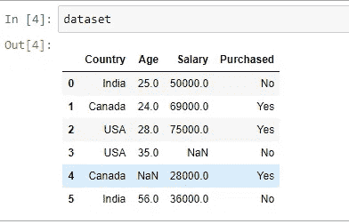

dataset

*   查看数据集，我们可以说我们需要处理三件事:

1.  缺失数据(NaN)
2.  分类变量(国家，购买)
3.  特征缩放

# 第三步:功能和标签

*   我们将使用特征(国家，年龄和工资)来预测标签(购买)。
*   因此，让我们将我们的特征和标签分开，因为有时我们不想对它们应用相同的变换。

```
dataset_features = dataset.drop('Purchased', axis = 1)
dataset_labels = dataset.iloc[:, 3].values
```

# 第四步:缺失数据

*   我们可以看到我们的数据集有两个缺失的数据。现在，有三种方法可以解决这个问题:

## 1)删除缺少数据的行。

`dataset_features = dataset_features.dropna(subset = ['Age', 'Salary'])`

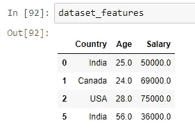

dataset_features (rows with NaN removed)

## 2)去掉整列。

```
dataset_features.drop(['Age', 'Salary'], axis = 1, inplace = True)
```

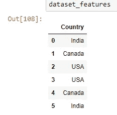

dataset_features (columns with NaN removed)

## 3)用某个值(平均值、中间值、零等)替换丢失的值。)

*   为此，我们将使用 scikit-learn 的*预处理*库。我们将从这个库中导入*估算器*类。

```
from sklearn.preprocessing import Imputer
```

*   接下来，我们将为该类创建一个对象*inputr*。[点击此处](http://scikit-learn.org/stable/modules/generated/sklearn.preprocessing.Imputer.html)查看*估算器*的参数。

```
imputer = Imputer(strategy = 'mean', axis = 0)
```

*   由于平均值只能在数字属性上计算，我们将创建一个没有文本属性的数据集副本。

```
dataset_num = dataset_features[['Age', 'Salary']]
```

*   现在是时候[拟合并转换](https://kite.com/python/docs/sklearn.preprocessing.Imputer.fit_transform)我们的*估算器*对象为*数据集 _ 数量*。

```
dataset_num = imputer.fit_transform(dataset_num)
```

*   我们来看看 *dataset_num:*

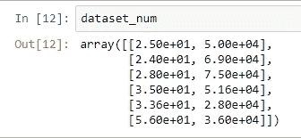

太好了！结果 *dataset_num* 是一个 numpy 数组(我们可以转换成 dataframe ),我们可以看到缺失的值已经被平均值替换了。

*   *估算器*实际上将平均值的结果存储在其中*统计 _* 实例变量:

```
imputer.statistics_
>>>array([3.36e+01, 5.16e+04])dataset_features.mean().values
>>>array([3.36e+01, 5.16e+04])
```

# 第五步:分类数据

*   我们的数据集有两个分类变量:国家和购买。
*   *国家*包含三个类别:

```
dataset_features.Country.unique()
```

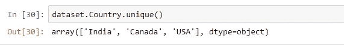

首先，让我们从数据集中获取分类属性。

```
dataset_cat = dataset_features[['Country']]
```

## 现在的问题是为什么分类数据需要被处理？

*   这是因为机器学习模型是基于数学方程的，所以如果我们在方程中保留文本或分类变量，那么它会导致一些问题。因此，我们对分类变量进行编码，即将文本编码成数字。(例如:美国= 2，印度= 1，加拿大= 0)
*   然而，这种编码有一个问题—由于 2>1>0，模型中的等式会认为美国>印度>加拿大，但我们知道事实并非如此。
*   这实际上是三个类别，它们之间没有关系顺序。因此，为了防止机器学习模型出现这个问题，我们使用虚拟变量。
*   虚拟变量用于将数据分类为互斥的类别。因此，我们将有三个独立的列，而不是一个列:

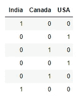

*   为了创建虚拟变量，我们使用另一个名为 *OneHotEncoder* 的类，它来自 scikit-learn *预处理*库。

```
from sklearn.preprocessing import OneHotEncoder
```

*   接下来，我们为 onehotencoder 类创建一个对象 *onehotencoder* 。然后，我们拟合并转换到我们的分类属性 dataset_cat。

```
onehotencoder = OneHotEncoder()dataset_cat_encoded = onehotencoder.fit_transform(dataset_cat).toarray()
```

*   应用 toarray()方法只是为了获得一个密集的 NumPy 数组，否则输出将是一个稀疏矩阵。

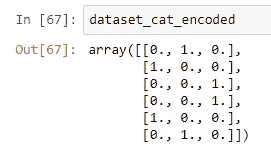

*   我们对我们的*购买的*列进行同样的操作。但既然是因变量，机器学习模型就会知道它是一个类别。因此，不需要一键编码。我们可以简单地使用 *OrdinalEncoder* 类将它们编码成整数。

```
from sklearn.preprocessing import OrdinalEncoderordencoder = OrdinalEncoder()
dataset_labels = ordencoder.fit_transform(dataset_labels.reshape(-1,1))
```

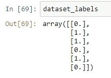

厉害！

# 步骤六:特征缩放

*   如果我们看看年龄和薪水栏，我们可以看到它们不在一个等级上。年龄在 25 到 56 之间，工资在 28k 到 75k 之间。
*   当自变量的数值属性具有非常不同的标度时，许多机器算法不能很好地执行。缩放数据的两种常见方式是:最小-最大缩放(标准化)和标准化。

## 最小-最大缩放

*   这里所有的值减去最小值，然后除以最大值减去最小值。在这种方法中，数据通常被缩放到 0 到 1 的固定范围。
*   为了实现最小-最大缩放，我们使用 scikit-learn 的*最小最大缩放器*。它还有一个 *feature_range* 超参数，如果我们不想让缩放从 0 到 1，可以使用它。

```
from sklearn.preprocessing import MinMaxScalerscaler = MinMaxScaler()
dataset_num_scaled = scaler.fit_transform(dataset_num)
dataset_num_scaled
```

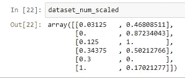

## 标准化

*   在标准化中，所有的值都减去平均值，然后除以方差。因此，具有零均值和单位方差的特征。
*   为了实现标准化，我们使用 Scikit-learn 的*标准转换器*。

```
from sklearn.preprocessing import StandardScalerstd_scaler = StandardScaler()
dataset_num_scaled = std_scaler.fit_transform(dataset_num)
dataset_num_scaled
```

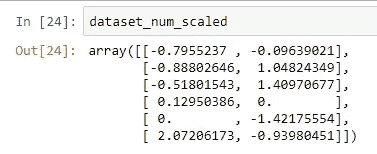

*   请注意，与最小-最大缩放不同，标准化无法保证异常值存在时的平衡特征比例。
*   然而，在存在离群值的情况下，最小-最大缩放可以在一个狭窄的范围内压缩所有的内嵌值。而标准化并没有受到离群值的太大影响。

正如我们所看到的，需要许多数据转换步骤，并且它们都必须以正确的顺序执行。我们实际上可以创建一个管道，为所有的转换提供一个单一的接口。

```
from sklearn.pipeline import Pipelinenum_attribs = ['Age', 'Salary']
cat_attribs = ['Country']num_pipeline = Pipeline([
    ('imputer', Imputer(strategy = 'mean')),
    ('std_scaler', StandardScaler())
])cat_pipeline = Pipeline([
    ('onehotencoder', OneHotEncoder())
])from sklearn.compose import ColumnTransformerfull_pipeline = ColumnTransformer(transformers = [
    ('numeric', num_pipeline, num_attribs),
    ('category', cat_pipeline, cat_attribs)
])
```

*   然后我们可以简单地运行整个管道并得到结果:

```
dataset_prepared = full_pipeline.fit_transform(dataset_features)
```

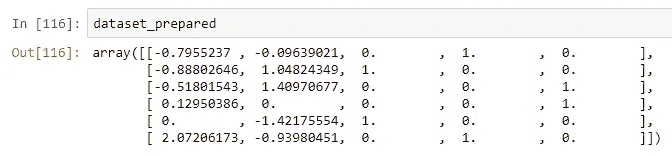

dataset_prepared

# 第七步:训练集和测试集

*   我们在数据集上构建我们的机器学习模型，即*训练集*，然后我们在*测试集*上测试我们模型的性能。为此，我们将使用 scikit-learn 的 *train_test_split()* 函数。
*   它有几个参数，但是我们将使用的是 *random_state* 来设置随机生成器种子。另一个参数是*测试大小*。这里就选它为 20%(0.2)。

```
X_train, X_test, y_train, y_test = train_test_split(dataset_prepared, dataset_labels, test_size = 0.2, random_state = 42)
```

# 结论

现在我们可以说我们的数据已经准备好训练我们的模型了！然而，在现实生活中，数据集是巨大的，但我相信这可以是一个很好的起点，以实践和学习，并在大型数据集上实施相同的策略。

[](http://www.track.datadriveninvestor.com/BecomeDDI1B)