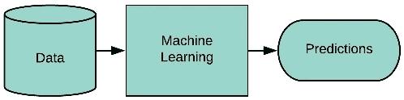
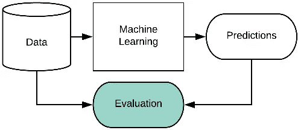
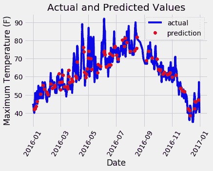
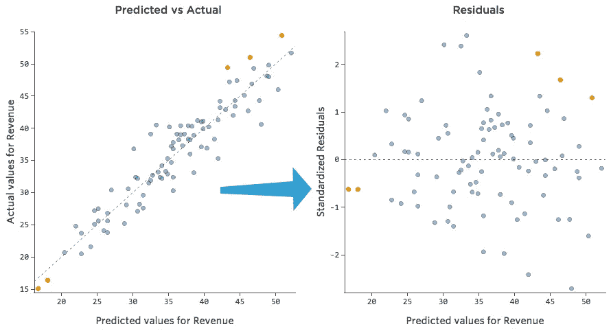
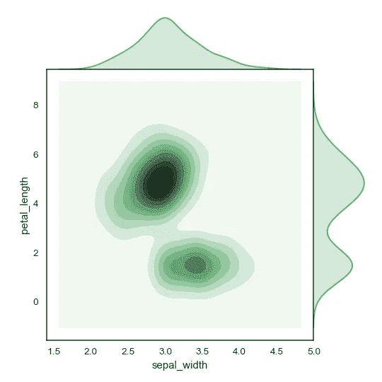
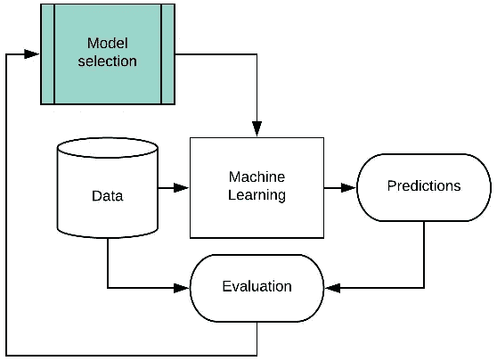
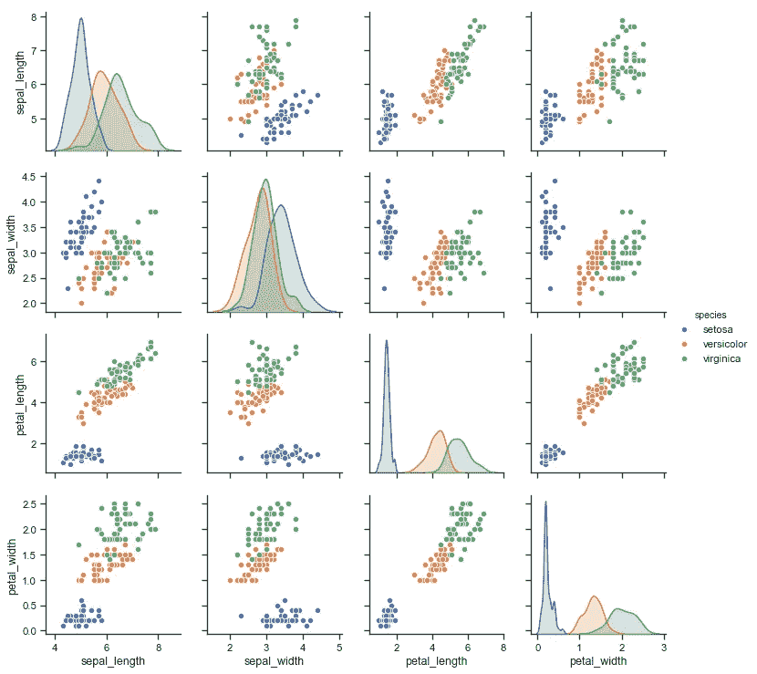
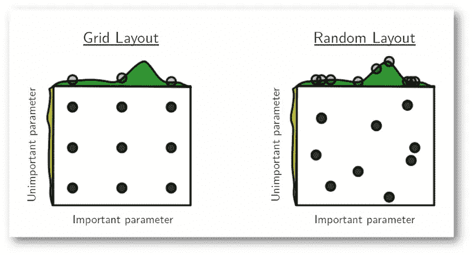
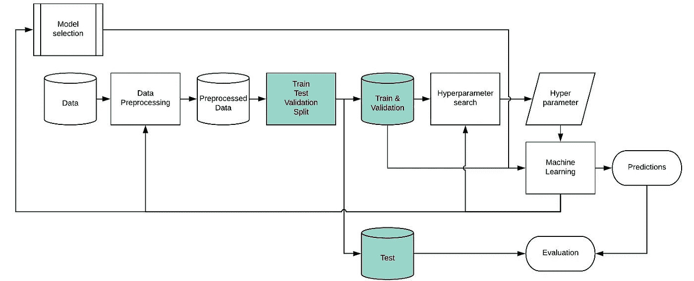
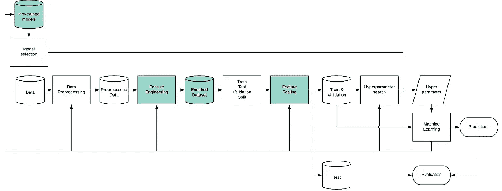

# (我的)机器学习工作流程

> 原文：<https://medium.datadriveninvestor.com/my-machine-learning-workflow-7576f7dbcef3?source=collection_archive---------4----------------------->

Take good care of your data and models. Photo by [Ander Burdain](https://unsplash.com/photos/1BhDhPBbHLA?utm_source=unsplash&utm_medium=referral&utm_content=creditCopyText) on [Unsplash](https://unsplash.com/search/photos/data?utm_source=unsplash&utm_medium=referral&utm_content=creditCopyText)

认知状态/动机:我的文件/文件夹命名和管理到处都是，我讨厌这样。我想标准化我的工作流程。因为我是一名学生，这意味着，像往常一样，我不够资格，过于固执己见

**TLDR** :我的机器学习工作流程，从简单到复杂，包括我在每一步使用的工具和资源。看图片。

Simple, isn’t it?

机器学习很简单。随便找些数据，选个算法，然后运行它。我个人是用 python 的。您需要的最基本的库是:

*   【http://www.numpy.org/ 
*   [https://pandas.pydata.org/](https://pandas.pydata.org/)
*   [https://scikit-learn.org/](https://scikit-learn.org/)

和以下可视化之一:

*   [https://matplotlib.org/](https://matplotlib.org/)(最基础，但很难做出漂亮的。)
*   [https://seaborn.pydata.org/](https://seaborn.pydata.org/)(得到了一些很酷的模板)
*   [https://altair-viz.github.io/](https://altair-viz.github.io/)(各方面都是最好的，除了性能和 5000 行的限制)
*   、或其组合

我真的很讨厌环境设置，尽管有[蟒蛇](https://www.anaconda.com)。我会更喜欢并推荐 [Google Colab](https://colab.research.google.com/notebooks/welcome.ipynb) 。它就像 Google Drive，但是是针对 Python 的。最棒的是，你可以在谷歌的服务器上使用 Tesla K80 GPU 免费运行你的代码[，最长可达 12 小时](https://www.kdnuggets.com/2018/02/google-colab-free-gpu-tutorial-tensorflow-keras-pytorch.html)。虽然以我的经验来看，通常我会在那之前断开连接。

> [DDI 编辑推荐— Python 机器学习:使用 Python、scikit-learn 和 TensorFlow 进行机器学习和深度学习](https://www.amazon.com/gp/product/1787125939/ref=as_li_qf_asin_il_tl?ie=UTF8&tag=ddi018-20&creative=9325&linkCode=as2&creativeASIN=1787125939&linkId=55cfe66166ca9272c5149a53f84d8a30)

有许多开放数据集可供练习:

*   这是我在谷歌搜索中第一次看到的，它相当不错。其中两个必须知道的是: [ImageNet](http://www.image-net.org/) 和 [CIFAR](http://www.cs.toronto.edu/~kriz/cifar.html) 。两者都是图像处理。
*   [MNIST 手写数字数据库](http://yann.lecun.com/exdb/mnist/)。这就像是机器学习、神经网络和 CNN 的“hello world”等价物。(也是上面链接中的第一个)
*   实际上有两个 MNIST。一个是手写数字，[另一个是时尚，也可以通过 Kaggle](https://www.kaggle.com/zalando-research/fashionmnist) 获得。
*   [https://www.kaggle.com/](https://www.kaggle.com/datasets)是一个必须知道的网站。它有很多数据集，包括 MNIST 和东道主的现金奖比赛。一些大学在他们的课程中举办“迷你比赛”，利用 Kaggle 作为平台。他们也有教程和自己的论坛社区。
*   [波士顿住房数据集，也在 Kaggle](https://www.kaggle.com/c/boston-housing) 上，是回归任务的一个很好的“hello world”。
*   加州大学欧文分校拥有一个很好的数据集集合。它包含了几乎在每个教程中都出现的最流行的分类数据集之一: [Iris](https://archive.ics.uci.edu/ml/datasets/Iris) 。还有[酒](https://archive.ics.uci.edu/ml/datasets/Wine)和[动物园](https://archive.ics.uci.edu/ml/datasets/Zoo)。

一旦你选择了一个数据集，接下来你需要做的就是选择一个算法。你不必自己编写，只需使用现成的模块，如 [scikit-learn](https://scikit-learn.org/stable/index.html) 。如果你真的对深度学习感兴趣，那么你可以选择 [Keras](https://keras.io) 。如果 Keras 对你来说仍然过于严格，你可以直接跳到研究人员使用的 [TensorFlow](https://www.tensorflow.org/) 或 [PyTorch](https://pytorch.org/) 。

但是如果你真的想成为一个[真正的程序员](https://xkcd.com/378/)，你最好自己编写自己的模块。玩笑归玩笑，我确实按照这个教程用 [11 行 python 代码编写了我的第一个神经网络。我从中学到了很多。而且我觉得，如果你是学这个的学生，而不仅仅是想快速肮脏部署的人，那 11 行字真的很值得打，就当是学习心得吧。](https://iamtrask.github.io/2015/07/12/basic-python-network/)

每种算法(从现在开始我将称之为**模型**)都有自己的一组数字，你必须调整它们。例如，一个神经网络中有多少个神经元？这些数字被称为超参数。现在，使用缺省值。

Evaluate your prediction

好的，所以你能够做出预测(或聚类)。但是他们有多好呢？ [Sci-kit learn 覆盖了你，它们提供了比我需要的更多的指标](https://scikit-learn.org/stable/modules/classes.html#sklearn-metrics-metrics)。标准的开始方式是使用[均方误差](https://scikit-learn.org/stable/modules/generated/sklearn.metrics.mean_squared_error.html#sklearn.metrics.mean_squared_error)进行回归，使用 [F1 得分](https://scikit-learn.org/stable/modules/generated/sklearn.metrics.f1_score.html#sklearn.metrics.f1_score)进行分类。

正如我希望这篇文章表明的那样，我是一个非常视觉化的人。当我进行回归时，我会绘制我的预测与标签(实际)值，以及残差图，以更好地了解我的模型正在做什么(或没有做什么)。对于分类，等价图是混淆矩阵。

How is my prediction doing? [https://towardsdatascience.com/random-forest-in-python-24d0893d51c0](https://towardsdatascience.com/random-forest-in-python-24d0893d51c0)

[Learn more about residual plot](http://docs.statwing.com/interpreting-residual-plots-to-improve-your-regression/) to understand your model better.

对于这种图，我更喜欢使用 [Seaborn 的 joinplot](https://seaborn.pydata.org/generated/seaborn.jointplot.html) ，因为它们很好地包括了两个轴上的直方图，并显示了重叠数据点的密度。我用 kind="kde "。注意他们是如何使用 UCI 虹膜数据集的。

I usually use [Seaborn jointplot](https://seaborn.pydata.org/generated/seaborn.jointplot.html) for Prediction vs Actual plot.

Try different models

好的，你评估了你的预测，并从中获得了很多洞察力。你能做什么？好吧，尝试一堆不同的模型，看看哪一个是最好的？要尝试的型号:

*   线性回归
*   多项式回归(添加一些正则化)
*   树木和森林
*   神经网络和深度学习
*   支持向量

Data are usually not clean. Remember, garbage in, garbage out.

任何处理过原始数据的人都知道它们有多难看。有时，您的数据分散在许多不同的表中，必须统一到一个表中。然后你会有丢失的值(null 和 NaN)，或者只是一串零或者某种[零岛](https://en.wikipedia.org/wiki/Null_Island)，或者数字大得愚蠢，这一定是一个错误。事情出错的方式有很多，而且大多数时候都是这样。数据预处理是任何数据科学/机器学习项目中最大的时间消耗者之一。你可以谷歌一下这些术语:

*   数据预处理
*   数据管理
*   数据争论
*   数据清理
*   数据准备

Visualize your data

同样，我喜欢对我的数据有某种“感觉”，所以我从来不会忘记有一个[散点图矩阵](https://seaborn.pydata.org/examples/scatterplot_matrix.html)。那幅图是用 Seaborn 完成的。Matplotlib 没有散点图矩阵的内置库，Altair 只需要很少的额外行。我发现 Seaborn 最适合这个。再次，UCI 虹膜数据集，它无处不在。

Time to tune our hyperparameters.

我知道我说过要从每个模型的默认超参数开始，但千万不要勉强接受。这是拷贝粘贴代码必须停止的时候了，停下来更好地理解你的模型在做什么。每个模型都有自己特定的超参数集，这就是为什么你必须很好地了解你的模型。超参数空间很大(即你没有时间检查所有可能的超参数组合)。您使用评估指标(例如 MSE、F1)来确定最佳超参数。

Don’t do grid search, do a random search.

当你实际进行超参数搜索时，不要进行网格搜索，而是进行随机搜索。有充分的证据支持它的理由。

Make sure your model generalize by splitting your data into train, test and validation set.

到目前为止，我们一直在“作弊”。我们在同一个数据集上训练、超参数拟合和测试我们的模型。这就像学生在考试和家庭作业中被问到完全一样的问题。他们可以只记住答案而不学任何东西。

想象一下，一个懒惰的老师，每年都出同样的选择题，甚至不改变问题/答案的顺序。学生可以从去年得到答案，并记住答案(ABCD)，不需要学习。这就是我们对我们的模型所做的。

解决方案是进行培训/测试拆分。让我们的模型在训练集上进行训练，并在测试集上进行测试，测试集是一个以前从未见过的集，以查看模型是否能够推广到以前从未见过的数据集。

什么是验证？训练集，用于训练模型中的参数。验证就是找出哪些模型(算法)、预处理和超参数是最好的。粗略地说，就是“训练”超参数。测试是为了测试。要了解更多信息，请搜索:

*   培训、测试、验证拆分
*   k 倍验证

请注意，在找出最佳模型(算法、预处理和超参数的组合)之后，通过验证集上的验证来测试您的模型，您可以通过整个训练集(训练+验证)来训练您的模型，然后使用测试集来测试它。

如果你想知道你的模型执行的有多好(在看不见的数据上)，测试很重要。如果你想向你的客户/经理/学术界的同行炫耀你的模型性能，你应该使用测试中的指标。如果您想展示您的模型比其他模型做得更好的经验证据，您也应该使用测试集的结果。

Learn about bias-variance trade-off. Image from [https://djsaunde.wordpress.com/2017/07/17/the-bias-variance-tradeoff/](https://djsaunde.wordpress.com/2017/07/17/the-bias-variance-tradeoff/)

这也是谈论[偏差-方差权衡](https://en.wikipedia.org/wiki/Bias%E2%80%93variance_tradeoff)的好时机。一个“记忆力/动力”低的模型是记不住答案的。但是，一个高“内存/功率”的模型将能够。如果你把你的模型设置得“太强大”，你将会冒这样的风险:只是盲目地“记忆”答案，而什么也学不到。换句话说，过度拟合。另一方面，如果您的模型太“弱”，它可能无法了解我们数据背后所需的复杂性。这就是所谓的欠拟合。在实践中，您可以通过超参数(如神经网络中的节点数)来调整大多数模型的“能力”。

这个想法是调整您的超参数，直到您在您的**验证**集上达到最佳评估指标。要了解更多信息，请搜索:

*   欠拟合和过拟合
*   偏差-方差权衡
*   正规化
*   学习曲线(x 轴可以是纪元，也可以是数据量)
*   (此外，学习如何照顾你的模特，每个模特需要不同的待遇。典型的第一步是确保你的模型适合极小的样本，少于 20 个。)

The full model.

**预训模特**。特别是深度神经网络非常渴求数据。即使在强大的机器上训练也需要几天。幸运的是，人们上传了预先训练好的模型供我们其他人使用。

**特色工程**。有时，我们可以想到更好、更有用的特性来节省训练时间和模型复杂性。创建(设计)这些新特征的过程称为特征工程。例子(前 3 个来自[这里](https://elitedatascience.com/feature-engineering-best-practices)):

*   **两个特性的区别:**你有特性 house _ built _ date 和 house_purchase_date。你可以利用他们的不同来创造房子年龄购买的特征。
*   **日期和时间特性:**假设您有一个特性 purchase_datetime。提取购买日期和购买时间可能更有用。您还可以聚合观察值来创建诸如 purchases_over_last_30_days 之类的功能。
*   **地理编码:**假设您有街道地址、城市和州。嗯，你可以[地理编码](http://geoservices.tamu.edu/Services/Geocode/)成纬度和经度。这将允许您在另一个数据集的[的帮助下，计算当地人口统计等特征(例如，中位数 _ 收入 _ 2 _ 英里内)。](http://www.pitneybowes.com/us/data/demographic-data.html)
*   将坐标/矢量从笛卡尔坐标转换到极坐标，反之亦然。
*   如果您正在处理时间序列，您可能希望检查傅立叶/小波变换。
*   [**数据扩充**](https://medium.com/nanonets/how-to-use-deep-learning-when-you-have-limited-data-part-2-data-augmentation-c26971dc8ced) 。人为增加数据点的数量。例如，如果您想训练一个模型来识别动物的图片，您可以通过添加所有现有数据的镜像图像来轻松地将数据集翻倍。

**特征缩放**又称标准化/规范化。没有这个很多模特都学不好。你可能也想试试 PCA / ZPA 美白。记住，在训练-测试-验证分割之后，执行特征缩放**。仅对您的训练集调用 fit()，并相应地转换()您的验证和测试集。**

# 经验评估

既然您有许多工具来调整数据流和模型的每个方面，就不要做不必要的假设。对于您所做的每一个更改，检查您的测试集，确保您所做的更改确实提高了您的评估指标。有一句妙语:“每当我解雇一名语言学家，我们的语音识别系统的性能就会上升”