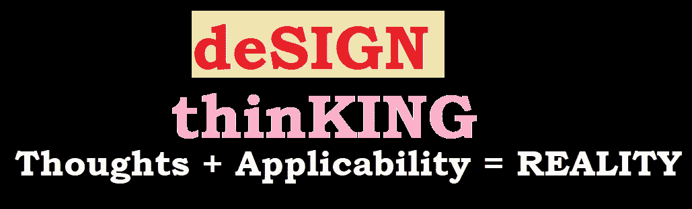

# 我的设计思维笔记

> 原文：<https://medium.datadriveninvestor.com/my-note-on-design-thinking-1cb1a733198f?source=collection_archive---------10----------------------->

几年来最热门的词……但并不太新。那么什么是设计思维——谁是设计思想家——为什么要适应它？？

D 设计思维……我可以在维基上看到更多的定义和内容——“设计思维是指认知、战略和实践过程，通过这些过程**设计**概念(新产品、建筑、机器等的提案)。)是由设计师和/或**设计**团队"
开发的，以便更容易理解——以我的方式…

 [## 面向 Noobs |数据驱动型投资者的数字身份

### 聪明人如何在增强现实中创造身份价值？我最近刚满 40 岁。作为一个生物…

www.datadriveninvestor.com](https://www.datadriveninvestor.com/2019/02/28/digital-identity-for-noobs/) 

D 设计思维简单来说就是你思考一个设计的方式，这个设计最适合满足最终用户需求的条件——称它为网站——称它为——称它为你生活的任何一部分——来解决你的需求或客户的需求

## 为什么需要设计思维？？

> 首先，我们需要思考吗？？？—想象一下，有了足够的钱后，你正打算买一套新房子。现在，你不能盲目地相信建筑公司来买房子…你将执行所有需要的检查，是的，最后你有了一个在 X 时间内准备好的房子。
> **设计思维从这里开始:**拥有一个家本身并不足以完成你的需求，你的家里面永远是你的选择。我可能需要一个音乐主题的房间，或者我的孩子们的房间应该像一个米奇主题。我需要一个清晰的想法，我应该需要什么，以确保房间的设计可以是我的选择…换句话说…按照我的想法。
> 
> **注**:我的设计只能应用于改变某些部分，而不是所有地方。我不能把我的洗手间搬到厨房，反之亦然，因为…如果你试图改变一些东西，整个系统可能会受到干扰。网站也一样:你不能测试网站访问者的耐心，他们会因为得不到有价值的信息而恼火。
> **所以……思考者必须像所有者和最终用户一样思考**

设计思考者的思维过程:
要成为一名设计思考者，你不需要成为创造者/程序员……就像上面的例子一样……我不需要成为土木工程师或建筑师来设计我的房间，但我需要给团队提供正确的意见，让他们能够简单方便地满足我的需求。要做到这一点，你需要:
1)清楚自己需要什么。这也意味着你需要成为一名**产品负责人**，他能够理解产品
2)你需要**想象**什么是最好的，什么是不可能的
3)理解局限性:并非所有事情都是可能的——可能是由于超出成本或人力等
4)价值投入，这可以带来更好的结果，但如果想法对市场有利，绝不妥协。
5)最后——像客户的解决方案提供商一样思考，并成为公司负责任的所有者
以上所有这些都有助于产品取得成功，只有思考者才能做到

# 想法+适用性=现实

如图片所示，你的思考过程将引导你思考对最终用户有价值的产品，考虑其适用性将引导设计过程走向现实，这就是设计思维的工作方式

设计思维不是一个仅限于软件产品的概念。
这可以应用在很多领域。事实上，你做的每一个动作都有一个设计思维过程…上图是设计思维的一部分(考虑到字母的形成可能会吸引用户)。事实上，我已经把它应用到我的烹饪方式、庆祝方式和看待事物的方式中

最后——这完全取决于你如何思考，就像在工作中思考一样……能够尊重最终用户需求的人被称为**国王
T21【他总是从需求角度思考的**设计思想家**。**

非常感谢你阅读这篇文章，我只是想让它简单得更好