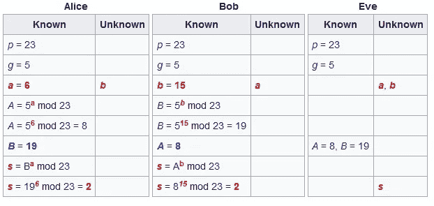
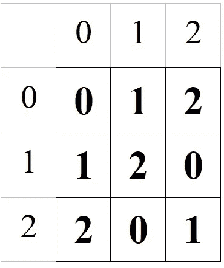
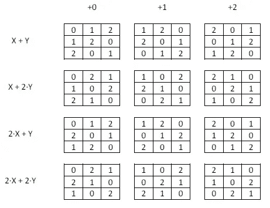
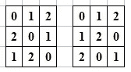
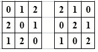
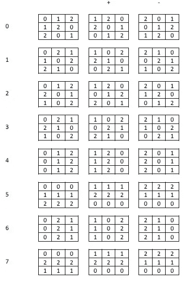
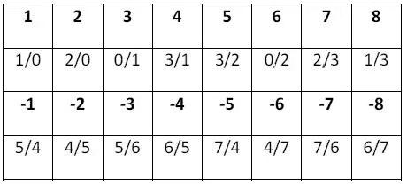

# 我自己的智能合同

> 原文：<https://medium.datadriveninvestor.com/my-own-smart-contract-8902dc006f07?source=collection_archive---------4----------------------->

[](http://www.track.datadriveninvestor.com/1B9E)

Photo by [Daniel Cheung](https://unsplash.com/@danielkcheung?utm_source=unsplash&utm_medium=referral&utm_content=creditCopyText) on [Unsplash](https://unsplash.com/search/photos/smart-robot?utm_source=unsplash&utm_medium=referral&utm_content=creditCopyText)

从一个新的代数中得到你自己的合同

有时寻找不同的方法来编写我们自己的安全系统是一个好主意。这将帮助我们加强应对任何类型的攻击。

让一个系统*安全的*不是它的武器造成的伤害，不是当你被抓住时罚款有多可怕，也不是保护它的墙有多厚…，这里有一个聪明的头脑，只有另一个聪明的头脑才能面对它。不管多少年过去了，一个智能机器人总是可以被一个比他自己更了解它的代理人拆下来。

考虑到没有智能系统能够承受好奇的心，在这里我的意图是训练你的好奇心来改善**安全**机制。

[](https://www.datadriveninvestor.com/2019/02/22/cybersecurity-non-profit-to-help-smes-fight-against-cybercrime/) [## 网络安全非营利组织帮助中小企业打击网络犯罪-数据驱动的投资者

### 一个名为全球网络联盟(GCA)的非营利组织发誓要改善…

www.datadriveninvestor.com](https://www.datadriveninvestor.com/2019/02/22/cybersecurity-non-profit-to-help-smes-fight-against-cybercrime/) 

# 一开始，有安全保障…

最初，研究一下我们所说的[智能契约](https://en.wikipedia.org/wiki/Smart_contract)的基本含义以及我们必须用什么技术来实现它会很有趣。

**智能合约**允许在没有第三方的情况下执行可信交易。这些交易必须是可追踪和不可逆转的。因此，目标是找到一种方法来确保支持者在某个日期签署了什么，避免损害他们继续签署新合同的能力的保密性。

为了实现这一点，我们需要允许两个步骤:首先，我们必须共享一个安全通道，然后用可以验证的部分信息来形式化协议。

共享安全信道最常见的技术是 Diffie-Hellman 密钥交换，其中每个支持者都有一个共同的秘密值，确保不受第三方的干扰。



If Eve guessed **a** or **b** values she could take the place of Alice or Bob.

通过暴力手段，第三方可以尝试用这样的代码猜出密码:

```
def aee(a, b):
    'Algorithm of Euclides Extended'
    'r0 = s0 * a + t0 * b'
    r0, r1, s0, t0, s1, t1 = a, b, 1, 0, 0, 1
    while r1 > 0:
        s0, s1 = s1, s0 - s1*(r0//r1)
        t0, t1 = t1, t0 - t1*(r0//r1)
        r0, r1 = r1, r0 % r1
    return r0, s0, t0from math import log       
def log2M(X, M):
    '2**Y % M == X '
    pot2 = lambda X: round(log(X, 2),0) == log(X, 2)
    Y = 0
    while not pot2(X):
        while X%2 == 0:
            X //= 2
            Y += 1
        N = int(log(X, 2))
        Y += N
        Z = aee(2**N, M)[1]
        if Z<0:
            Z+=M
        X *=Z
        X %=M
    return Y + int(log(X, 2))
```

或者知道一些在特定情况下会起作用的数学技巧，甚至可以尝试猜测解决方案。例如，如果有人能够找到 Diffie-Hellman 协议的一些密钥，他就能够破解 [RSA 协议](https://en.wikipedia.org/wiki/RSA_Secret-Key_Challenge)分解数字:

```
def factorPQ(PQ, log2 = log2M):
    M = log2(PQ+1, PQ)
    A = (PQ+1) % M
    D = A**2 -4*PQ
    if D<0:
        return []
    elif D==0:
        return [A//2]
    else:
        return [int(round(((D**.5)+ A)/2, 0)), 
int(round((-(D**.5)+ A)/2, 0))]
```

所以，有时候，我们需要使用非常大的密钥或者更复杂的协议，比如[椭圆曲线协议](https://en.wikipedia.org/wiki/Elliptic-curve_Diffie%E2%80%93Hellman)。甚至，你可以创建你自己的代数来创建你自己的智能契约。

这里你将有一个非常灵活的例子，以便技术可以结合起来。

# 代数

我提出的代数是基于使用比拉丁方更多的元素作为一个组的元素，而是双拉丁方。如果你喜欢用拉丁方创建你自己的操作符，或者用两个拉丁方创建每个组合，这将是你的选择。

首先，我向你们展示如果一个拉丁方块是这样的:



Each row of column has no repetitions

简单地说，双拉丁方是两个拉丁方的映射。

在这个代数中，我们将使用秩为 3 的拉丁方，因此我们可以使用这个模板:



There are 12 [latin squares](https://en.wikipedia.org/wiki/Latin_square) of rank 3

这个小组是由[亚瑟·凯莱](https://en.wikipedia.org/wiki/Cayley_table)研究的，所以这将是一个可能的实现。

在我们的研究中，我们将考虑我们的地图是否是一个[希腊拉丁方](https://en.wikipedia.org/wiki/Graeco-Latin_square):



For each (row, column) we can map every Z3² values.

所以，我们的符号应该有助于区分。但是，怎么做呢？使用我们的模板，我们可以通过它们的生成器定义一个双拉丁方，就像:



“2x+y+0”/ “x+2y+2”

如您所见，您可以用行号代替 x，用列号代替 y，结果将在应用模 3 后计算出来。上面的双拉丁方不是一个希腊拉丁方，因为你可以找到不同的( *x* ， *y* )，其中((2* *x* + *y* )%3，( *x* +2* *y* +2)%3)将返回相同的结果。

*   (0, 0) → (0, 2)
*   (1, 1) → (0, 2)
*   (2, 2) → (0, 2)

因此，现在我们将使用另一种符号，在这种情况下，我们将考虑秩为 3 的正方形的每个映射，但是对于每个( *x* ， *y* )关联不同的(*x’*，*y’*)，在这种情况下，我们的配置文件将是:



Every square is prepared to get a good map.

此时我们可以找到我们的第一个代码:

```
def genSquare(N, mod):
    if N==4:
        return lambda x,y: (y+mod)%3
    elif N==5:
        return lambda x,y: (x+mod)%3
    elif N==6:
        return lambda x,y: (-y+mod)%3
    elif N==7:
        return lambda x,y: (-x+mod)%3
    return lambda x,y: ((N//2+1)*x+((N%2)+1)*y+mod)%3
```

要测试它，就像这样简单:

```
def show(generator):
    'Shows a simple square from its generator'
    for x in range(3):
        for y in range(3):
            print (generator(x,y)," ",end="")
        print ("")
```

还有这个:

```
>>> show(genSquare(7,2))
2  2  2  
1  1  1  
0  0  0
```

所以，研究什么是拉丁方，现在我们可以得出双拉丁方是希腊拉丁方:



Positive: graeco-latin square, Negative: a non graeco-latin square

现在我们有了组中的 num-elem(正或负)与 3×3 = 9 个修饰符的组合。我们可以生成 Z3 的 8×9 = 72 个 graeco-latin squares 和 72 个非 graeco-latin squares 交换(x，y)值。

```
def decodDS(N):
 'Returns the params of a double-square'
 'N<0 Generates a non graeco-latin square'
 'N>0 Generates a graeco-latin square'
    if N<0:
        return (-1-abs(N+1)//9,abs(N+1)%9)
    return (1+N//9,abs(N)%9)def codDS(N,mod):
 'Returns the num-elem in group of a double-square'
    if N<0:
        return -(abs(N+1)*9+mod+1)
    return (N-1)*9+moddef genDS(N, mod):
 'Generator Function of values from params'
 'N<0 Generates a non graeco-latin square'
 'N>0 Generates a graeco-latin square'
    A = mod // 3
    B = mod % 3
    if N==-1:
        return lambda x,y: ((x+A)%3,(y+B)%3)
    elif N==-2:
        return lambda x,y: ((y+A)%3,(x+B)%3)
    elif N==-3:
        return lambda x,y: ((x+A)%3,(-y+B)%3)
    elif N==-4:
        return lambda x,y: ((-y+A)%3,(x+B)%3)
    elif N==-5:
        return lambda x,y: ((-x+A)%3,(y+B)%3)
    elif N==-6:
        return lambda x,y: ((y+A)%3,(-x+B)%3)
    elif N==-7:
        return lambda x,y: ((-x+A)%3,(-y+B)%3)
    elif N==-8:
        return lambda x,y: ((-y+A)%3,(-x+B)%3)
    else:
        NB=(N-1)//2
        NA=((N-1)%2)+1
        P1=[1,0,1,2,3,2]
        P2=[1,3,1,2,0,2]
        if NB%2==1:
            NA=P1[P1.index(NA)+1]
        if NB//2==1:
            NA=P2[P2.index(NA)+1]
        return lambda x,y: (
genSquare(NA,A)(x,y),
genSquare(NB,B)(x,y))
```

一些例子可能是:

```
>>> show(genDS(7,2))
(0, 2)  (1, 1)  (2, 0)  
(2, 1)  (0, 0)  (1, 2)  
(1, 0)  (2, 2)  (0, 1)  
>>> show(genDS(-7,2))
(0, 2)  (0, 1)  (0, 0)  
(2, 2)  (2, 1)  (2, 0)  
(1, 2)  (1, 1)  (1, 0)
```

这个组很有趣，因为我们可以想象一个连接所有方块的内部操作。

## 乘法双平方

我们对该产品最好的想法是能够猜测我们的双正方形是否是一个地图，什么地图是不同地图合成的结果。也许关于如何获得这段代码的解释比我想象的更复杂，所以你可以在这个[站点](https://archive.org/details/AlgebraOfTheSecureChannelsUnreviewed)研究我的旧文档。

```
def asterisk(x):
    L=[1, -6, 6, -7, 7, -4, 4, -1, 1, 2, -8, 5, -3, 8, -2, 3, -5, 2]
    return L[L.index(x)+1]def multiply(N1,N2):
    M=[[1,2,3,4,5,6,7,8],\
       [2,1,4,3,6,5,8,7],\
       [3,6,1,8,7,2,5,4],\
       [4,5,2,7,8,1,6,3],\
       [5,4,7,2,1,8,3,6],\
       [6,3,8,1,2,7,4,5],\
       [7,8,5,6,3,4,1,2],\
       [8,7,6,5,4,3,2,1]]
    X = M[abs(N1)-1][abs(N2)-1]
    if N2*N1<1:
        return -X
    return Xdef apply(A, B, modA=0, modB=0):
    'Multiplies two double-square'
    R = multiply(-A,B) if B<0 else multiply(asterisk(A),B)
    (x,y)= genDS(A,modA)(*genDS(B,modB)(0,0))
    return (R,3*x+y)
```

让我们测试一下:我们有三个希腊拉丁方:(2，0)，(3，5)和(7，1)

```
>>> show(genDS(2, 0))
(0, 0)  (1, 1)  (2, 2)  
(2, 1)  (0, 2)  (1, 0)  
(1, 2)  (2, 0)  (0, 1)  
>>> show(genDS(3, 5))
(1, 2)  (2, 1)  (0, 0)  
(2, 0)  (0, 2)  (1, 1)  
(0, 1)  (1, 0)  (2, 2)  
>>> show(genDS(7, 1))
(0, 1)  (1, 0)  (2, 2)  
(2, 0)  (0, 2)  (1, 1)  
(1, 2)  (2, 1)  (0, 0)
```

这意味着:

*   DS(7，1):0，0) → (0，1)
*   DS(3，5): (0，1) → (2，1)
*   DS(2，0):2，1) → (2，0)

问题是，向右复合后使运算一步到位的 DS 是什么:DS(7，1) →DS(3，5) →DS(2，0)。

我们要记住一般的规则:从右边乘就是得到一个右边的复合:DS(7，1)*(DS(3，5)*DS(2，0))

```
>>> apply(2, 3, 0, 5)
(-6, 3)
>>> apply(-6, 7, 3, 1)
(4, 6)
>>> show(genDS(4, 6))
(2, 0)  (1, 2)  (0, 1)  
(1, 1)  (0, 0)  (2, 2)  
(0, 2)  (2, 1)  (1, 0)
```

考虑到我们可以达到逆，这使得编码对称。

```
def modInverse(N,mod):
    'Calculates the inverse of the modificators'
    I=[[0,4,8,5,6,1,7,2,3],\
       [0,4,8,7,2,3,5,6,1],\
       [0,5,7,4,6,2,8,1,3],\
       [0,5,7,8,1,3,4,6,2],\
       [0,7,5,8,3,1,4,2,6],\
       [0,7,5,4,2,6,8,3,1],\
       [0,8,4,7,3,2,5,1,6],\
       [0,8,4,5,1,6,7,3,2]]
    return I[N-1][mod]def inverse(N,mod):
    'Calculates the inverse of a double-latin square'
    R = asterisk(N)
    if R==-6:
        R = 4
    elif R==-4:
        R = 6
    else:
        R = -R
    return (R, modInverse(N, mod))
```

现在举个例子:

```
>>> show(genDS(4, 6))
(2, 0)  (1, 2)  (0, 1)  
(1, 1)  (0, 0)  (2, 2)  
(0, 2)  (2, 1)  (1, 0)  
>>> show(genDS(*inverse(4,6)))
(1, 1)  (0, 2)  (2, 0)  
(2, 2)  (1, 0)  (0, 1)  
(0, 0)  (2, 1)  (1, 2)
```

对于每个映射( *x* 、 *y* ) → ( *x'* 、 *y'* )，逆将为( *x'* 、 *y'* ) →( *x* 、 *y* )。

# 我们的代数考试

现在我们有了一个加密工具。为了测试它的威力，我们可以准备一个对称的。为此，我们需要一些简单的编码工具。

也就是说，如果我们有一个字符串形式的消息，我们必须将它转换成一个数字列表。事实上，在我们想要工作的群体中。这段代码可以很好地工作:

```
def changeBaseSepar(listSource, baseTarget):
    'Generates a new number from a list where 0 is the separator'
    R=[]
    while True:
        X=listSource.pop(0)
        R.extend([Y+1 for Y in listInABase(X, baseTarget-1)])
        if not listSource:
            break
        R.append(0)
    return R
```

从一个数字列表(如每个字符的顺序)中，它将在 *baseTarget* 中生成一个数字列表:

```
>>> changeBaseSepar([103,434], 10)
[2, 3, 5, 0, 6, 4, 3]
```

所以当我们执行这段代码时:

```
def returnsBaseSepar(destino, baseTarget):
    'Generates a list from a number using 0 as separator'
    R=[]
    X=0
    for Y in destino:
        if Y==0:
            R.append(X)
            X=0
        else:
            X*=baseTarget-1
            X+=Y-1
    R.append(X)
    return R
```

…，我们将恢复原来的:

```
>>> returnsBaseSepar([2, 3, 5, 0, 6, 4, 3], 10)
[103, 434]
```

## 对称编码器

很简单，不是吗？嗯，我们可以创建自己的对称编码器和解码器:

```
import string
validCharacters = string.ascii_letters \
+ string.whitespace \
+ string.digitsdef ordChar(aChar):
    return validCharacters.index(aChar)def getChar(ordChar):
    return validCharacters[ordChar%len(validCharacters)]

def symmCodePositional(aMessage, aPasswrd):
    passwrdCoded = changeBaseSepar(
[ordChar(X) for X in aPasswrd],72)
    messageCoded = changeBaseSepar([ordChar(X) for X in aMessage],9)
    N = len(passwrdCoded)
    R = [genDS(*decodDS(passwrdCoded[i%N]))\
            (messageCoded[i]//3, messageCoded[i]%3) \
            for i in range(len(messageCoded))]
    return [3*A+B for (A,B) in R]def symmDecodePositional(encryptedMess, aPasswrd):
    passwrdCoded = changeBaseSepar(
       [ordChar(X) for X in aPasswrd],72)
    passwrdDecoded = [inverse(*decodDS(X)) for X in passwrdCoded]
    N = len(passwrdDecoded)
    R = [genDS(*passwrdDecoded[i%N])(encryptedMess[i]//3,       encryptedMess[i]%3) for i in range(len(encryptedMess))]

    R2= [getChar(X) for X in returnsBaseSepar(
       [3*A+B for (A,B) in R],9)]
    origMessage=""
    for A in R2:
        origMessage += A
    return origMessage
```

在上面的代码中，我们可以专门使用以下字符作为消息 everyone:

```
>>> validCharacters
'abcdefghijklmnopqrstuvwxyzABCDEFGHIJKLMNOPQRSTUVWXYZ \t\n\r\x0b\x0c0123456789'
```

因此，现在我们可以这样做:

```
>>> X = symmCodePositional("Original message", "myPassword")
>>> X
[6, 7, 7, 4, 2, 0, 5, 3, 0, 2, 0, 0, 7, 6, 5, 8, 0, 4, 5, 7, 4, 3, 6, 0, 2, 6, 0, 0, 0, 5, 4, 5, 4, 4, 0, 0, 3, 4, 6]
>>> symmDecodePositional(X, "myPassword1")
'Original message'
```

## 强力测试

考虑到这段代码与上面的代数一起工作，它可以被认为是一种证实那些操作没有错误的方法。但是如果你想毫无疑问地测试它，你可以使用蛮力:

```
def test_inverses():
    for X in range(72):
        (x,mx)=decodDS(X)
        (y,my)=inverse(x,mx)
        assert (-1,0)==apply(x,y,mx,my), "Fail in inverses"
        assert (-1,0)==apply(y,x,my,mx), "Fail in inverses"
    print ("Test sucessful.")def test_neuter():
    for X in range(-72,72):
        (x,mx)=decodDS(X)
        assert (x,mx)==apply(x,-1,mx,0), "Fail in neuter"
        assert (x,mx)==apply(-1,x,0,mx), "Fail in neuter"

    print ("Test sucessful.")def test_associativity():
    for X in range(-72,72):
        (x,mx)=decodDS(X)
        print(".",end="")
        for Y in range(-72,72):
            (y,my)=decodDS(Y)
            (xy,mxy)=apply(x,y,mx,my)
            for Z in range(-72,72):
                (z,mz)=decodDS(Z)
                (yz,myz)=apply(y,z,my,mz)
                assert apply(xy,z,mxy,mz)==apply(x,yz,mx,myz),"Fail"
    print("")
    print("Test sucessful.")
```

要测试它，您只需键入:

```
>>> test_inverses()
Test sucessful.
>>> test_neuter()
Test sucessful.
>>> test_associativity()
................................................................................................................................................
Test sucessful.
```

您将在文件 [digmoney.py](https://archive.org/download/AlgebraOfTheSecureChannelsUnreviewed) 中找到所有这些代码。

# 提议的共享保密信道的协议

两个合作伙伴之间签署的任何合同都相当于一个保密渠道:其中一部分是保密的，以便签署更多的排他性合同，另一部分是公开的，以便让人相信合同是什么。

为了设计智能契约，你可以使用两个独立工作的对称编码器，这样它们就可以互换(你可以应用一个编码器 A，然后是 B，从应用 B 开始，然后执行 A，结果应该是一样的)。虽然首先我们要准备一些工具。

## 蒙特卡罗系统

几年前，当我十几岁的时候，我想出了一个简单的机制来改进蒙特卡罗系统。我敢肯定我没有发现任何新的东西，但拥有我们自己的技术来提高安全性是一个迹象，表明我们有本能使事情更安全。

蒙特卡洛方法是一种用于随机抽样的机制。在安全方面，它可以用来给消息添加噪声。假设你想对信息进行编码，这样每个人都知道是谁编码的，但是没有人知道你能读到什么。

正如有人向我解释的那样，蒙特卡洛的算法试图获取一个四位数，并将外部数字与内部数字相乘。

也就是说，如果我们从数字 **2395** 开始，将生成的下一个值将是**25**x**39**=**0975**，因此随着更多的零出现，下一个值将向更小的数字收敛。并且该性能根本不理想。

一个很好的练习就是决定如何改进这个算法。我可以提出这样的代码:

```
def montecarloSistem1011(N, cyfers=8):
    even = 0
    odd = 0
    while N>0:
        even *= 11
        odd *= 11
        A = N%100
        even += 1 + (A//10)
        odd += 1+ (A%10)
        N //= 100
    M = even * odd
    R = 0
    while M > 0:
        R *= 10
        R += M % 11
        M //= 11
        R %= 10**cyfers
    return R
```

它的作用是通过从基数 10 变为基数 11 来消除乘法时的 0，从而防止它收敛。

## 更简单的工具

总顾问建议，在必要时，我们将 smart 合同提供给那些依赖 fecha 的公司，因为这是一个非常好的合同:

```
def temporalSign(aPasswrd, time, digits = 20):
    'Generates a sign from two strings aPasswrd and time'
    def encode(aString):
        'Converts the string in a number of 8 digits'
        S=0
        for C in aString:
            S*=256
            S+=ord(C)
            S%=10**8
        return S C = encode(aPasswrd)
    M = encode(time)
    M = montecarloSistem1011(M)
    R = []
    while digits>0:
        if M%5==0:
            R.append(C%72)
            digits-=1
            merge(R,M)
        M=montecarloSistem1011(M)
        C=montecarloSistem1011(C)
    return R
```

当使用签名时，它将包含日期，因此我们已经可以使用这个签名来加密消息，或者与其他签名一起操作。

```
def applySign(sign, codedMessage):
    'apply a sign to coded message'
    N=len(sign)
    R= [genDS(*decodDS(sign[i%N]))\
            (codedMessage[i]//3,codedMessage[i]%3) \
            for i in range(len(codedMessage))]
    return [3*A+B for (A,B) in R]def multiplySigns(sign1, sign2):
    R=[]
    for i in range(len(sign1)):
        (F1,M1)=decodDS(sign1[i])
        (F2,M2)=decodDS(sign2[i])
        R.append(codDS(*apply(F1,F2,M1,M2)))
    return Rdef invertSign(sign):
    return [codDS(*inverse(*decodDS(X))) for X in sign]
```

也可以使用函数作为 *merge* (List，Permutations)，交换列表的元素，如

[](https://medium.com/@jumadaru/how-convenient-graeco-latin-squares-are-884bcfb9e1fb) [## 希腊拉丁方是多么方便

### 从时间表创建到加密机制

medium.com](https://medium.com/@jumadaru/how-convenient-graeco-latin-squares-are-884bcfb9e1fb) 

## 协议

作为一个原始的例子，这是我推荐的协议。此处，原始文档与 ***salt*** 合并:添加数据，目的是使猜测没有密码的原始信息变得更加复杂。

1.  **爱丽丝**有两个秘密数字 **P1** 和 **P2** (整数)。
2.  **鲍勃**有两把秘钥 **C1** 和 **C2** (字符串)。
3.  拟签订合同 **Doc** ，由 **Alice** 生成， **Bob** 接受。
4.  **鲍勃**为那个日期生成他的符号:
    a .**C1 '**=【ordChar(X)for X in**C1**】
    b .**C2 '**=【ordChar(X)for X in **c .**F1**= temporal sign(**C1 '**，date(now)** 
5.  ****Alice** 接收 B ( **pSignB** ) 的公共标志，生成一些文档 **Doc** 和 **Spam1** 字符串。**
6.  **爱丽丝对文件进行编码，然后根据标准 **P1** 将它们合并。
    a .**Doc '**= changeBaseSepar(**Doc**，9)
    b .**S '**= changeBaseSepar(**spam 1**，9)
    c .**CodDoc**= merge(**Doc '**+**spam 1**， **P1****
7.  ****摆锤**从**摆锤**处接收 **CodDoc** 。然后， **Bob** 应用第二个键的逆键。
    a. **iF2** =反转符号(**F2**)
    b .**iDoc**= apply sign(**iF2**， **CodDoc** )**
8.  ****爱丽丝**从**鲍勃**处接收 **iDoc** 。 **Alice** 解合并编码文本，她拯救了感兴趣的部分(Doc’)，现在编码为**iDoc’**。
    a .**iDoc '**= merge(**iDoc**，-**P1**)[:len(**Doc '**)]**
9.  ****爱丽丝**将结果与 **D1 的**和一个新的垃圾邮件( **Spam2** )字符串合并。
    a .**spam 2 '**= changeBaseSepar(**spam 2**，9)
    b .**double cdoc**= merge(**D1 '**+**iD1 '**+**spam 2 '**， **P2** )**
10.  ****鲍勃**接到 **DoubleCDoc** 。然后，他应用密钥 **S2** (使用 **F2** )。
    a. **合同** = applySign( **F2** ， **DoubleCDoc** )**
11.  ****爱丽丝**收到**合同**，她必须找到 **Doc'** 和一个 **Bob** 的公示牌在它的位置上不融合。
    a .**Doc '**+**pSignB**= merge(**合同**，-**P2**)[:len(**Doc '**)+len(**pSignB)**]**
12.  ****爱丽丝**或者**鲍勃**可以看到 applySign( **pSignB** ，**Doc**)=**契约** : **鲍勃**使用了他的两个秘密数字，**爱丽丝**无法知道。**

**还有其他一些协议，理解它们的最好方法是找到一种方法来破坏它们。所以，这就是问题所在:你认为这个易碎吗？为什么有效？**