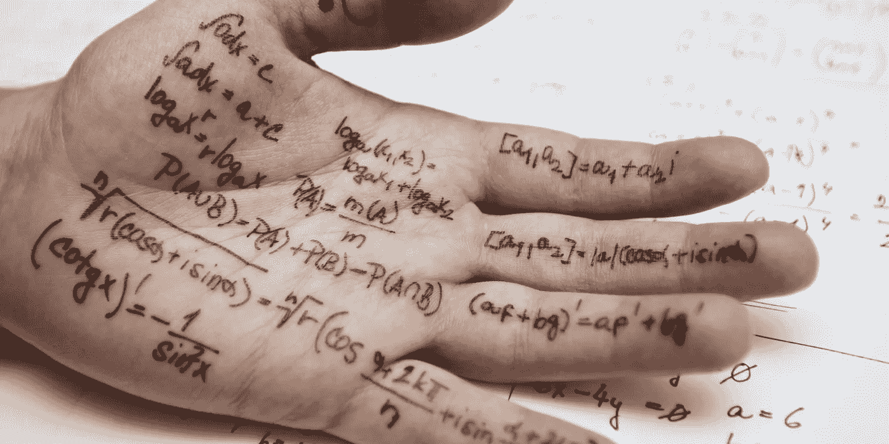

# 我个人的用于物体检测的深度学习备忘单

> 原文：<https://medium.datadriveninvestor.com/my-personal-cheat-sheet-of-deep-learning-for-object-detection-9e496f8a58dd?source=collection_archive---------6----------------------->

source: [https://dg0ddngxdz549.cloudfront.net/images/cached/images/remote/http_s3.amazonaws.com/ns.images/newspring/editorial/articles/newspring.blog.hero.discipline.cheating_1700_850_90_c1.jpg](https://dg0ddngxdz549.cloudfront.net/images/cached/images/remote/http_s3.amazonaws.com/ns.images/newspring/editorial/articles/newspring.blog.hero.discipline.cheating_1700_850_90_c1.jpg)

最近想搭建一个系统，检测一些图像数据中的物体。于是，我开始学习*基于区域的卷积神经网络* (RCNN)及其演化，已经存在的 CNN 模型等。对我来说，这很难理解，因为参考文献中出现了许多新的术语。

因此，为了克服这一点，我详细阐述了我的参考读物中出现的所有特殊术语。

1.  **CNN** 是一个神经网络，它有一个特殊的层，即卷积层(和池层)。在传统的 CNN 模型中，最后一层通常是密集层。
2.  **RCNN** 是一种特殊的细胞神经网络，是第一代 RCNN 模型，使用选择性搜索算法提出一些包围盒来覆盖我们想要检测的对象。首先，我们应用选择性搜索算法获得一些包围盒(区域建议)。然后，把这些提议的区域放到 CNN 模型中
3.  **Fast-RCNN** 是第二代 RCNN 模型。这个模型比 RCNN 快(Fast-RCNN > RCNN)。原始输入图像被送入 CNN 模型进行特征提取。之后，我们使用选择性搜索获得一个区域提议，并将其扭曲到感兴趣的*区域* (RoI)层，使其矩阵大小固定(提议的区域有许多可能的形状)。在它们有一个固定的尺寸后，将它们送入密集层来预测它的类别并确定包围盒。
4.  **Faster-RCNN** 是第三代 RCNN 模型。这个模型比 Fast-RCNN(Fast-RCNN>Fast-RCNN>RCNN)要快。该模型消除了慢速选择性搜索算法的使用。为了获得地区提案，我们使用*地区提案网络* (RPN)。
5.  **特征提取**是获取密集层(或前一层)之前的常规 CNN 模型最后一层的输出。
6.  **特征图**是特征提取得到的矩阵。
7.  **选择性搜索**是一种建议算法，它通过使用基于图的[分割方法](http://cs.brown.edu/~pff/segment/)基于像素的强度对图像进行过度分割来工作。
8.  **RoI 层**是一个特殊的池层，使提出的区域尺寸与神经网络的下一个密集层相匹配。
9.  **RPN** 是一个有两个头的神经网络。一个用于分类背景或前景，另一个用于定义边界框区域。
10.  **锚点**是 fast-RCNN 中建议区域的中心。
11.  ***交集超过并集* (IoU)** 是区域提议的评估度量。它被公式化为重叠面积/并集面积。
12.  **非最大抑制**是一种确保物体只被探测一次的方法。这是通过应用一些阈值来完成的。

如果我在深度学习中发现了与对象检测相关的新术语，我会在未来添加这个列表。

参考资料:

[https://towards data science . com/r-CNN-fast-r-CNN-faster-r-CNN-yolo-object-detection-algorithms-36d 53571365 e](https://towardsdatascience.com/r-cnn-fast-r-cnn-faster-r-cnn-yolo-object-detection-algorithms-36d53571365e)，2019 年 2 月 3 日访问

[https://www . learnopencv . com/selective-search-for-object-detection-CPP-python/](https://www.learnopencv.com/selective-search-for-object-detection-cpp-python/)，2019 年 2 月 3 日访问

[https://tryo labs . com/blog/2018/01/18/faster-r-CNN-down-the-rabbit-hole-of-modern-object-detection/](https://tryolabs.com/blog/2018/01/18/faster-r-cnn-down-the-rabbit-hole-of-modern-object-detection/)，2019 年 2 月 3 日获取

[https://deepsense.ai/region-of-interest-pooling-explained/](https://deepsense.ai/region-of-interest-pooling-explained/)，2019 年 2 月 3 日访问

## 来自 DDI 的相关故事:

 [## 用 7 个步骤解释深度学习

### 和猫一起

medium.com](https://medium.com/datadriveninvestor/deep-learning-explained-in-7-steps-9ae09471721a)  [## 股票市场投资的机器学习

### 当你的一个朋友在脸书上传你的新海滩照，平台建议给你的脸加上标签，这是…

medium.com](https://medium.com/datadriveninvestor/machine-learning-for-stock-market-investing-f90ad3478b64)