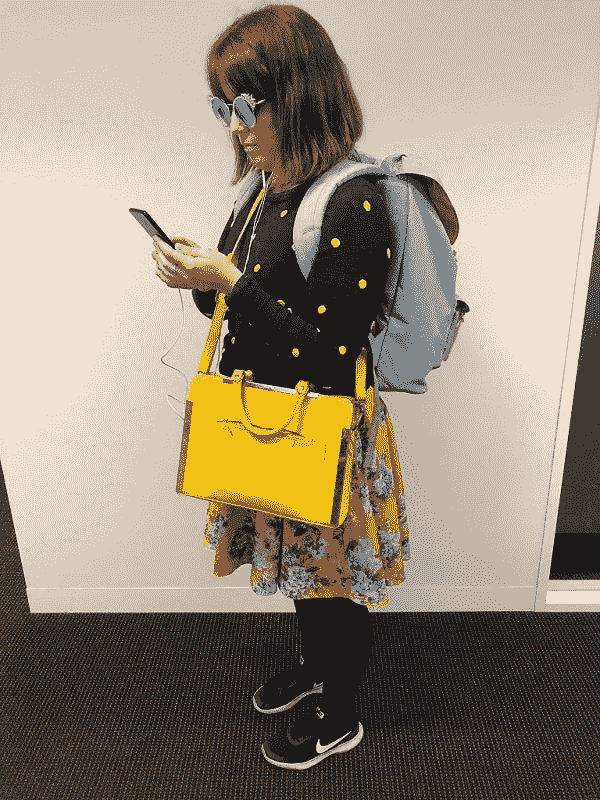
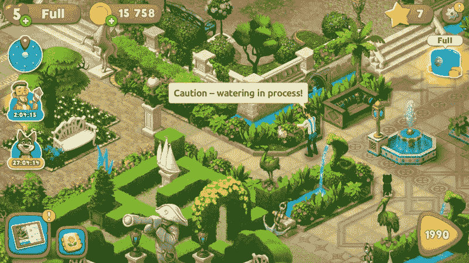

# 我的无手机通勤

> 原文：<https://medium.datadriveninvestor.com/my-phone-free-commute-661786732964?source=collection_archive---------15----------------------->

前几天在街上，一个男人对我破口大骂。我走在回家的路上，我被困在《植物大战僵尸》的一个特别紧张的时刻，当他走过时，他咕哝着“ *FUCK* ing 愚蠢”，真正强调的是他妈的，而几乎没有强调“ing”。我只能假设这是指我几乎真正的恐慌，因为我全神贯注于手机上的虚拟僵尸。

我们可以假设。但是你看。在我们深入了解这个问题之前，我应该澄清一下，他会把那个*他妈的*扔给我可能还有其他原因:

*   我带着一个手提包*和*背包，因为我喜欢带一本书，这大概是我拥有大量包的唯一借口
*   我走路的时候，我的鞋子发出很小的吱吱声，因为我已经穿破了，而且我太小气，不会再买新的了
*   我穿了很多颜色，我的意思是，很多，就像一个非常大的蹒跚学步的孩子和一个时髦的小丑。

An artist’s re-creation

谁知道呢，真的。我的某些事情困扰着他。我们假设是手机，因为也许我应该提到我们也差点相撞的事实，这肯定是我们双方 50%的过错，但无论如何。也许更是他的错，因为他没有僵尸要对付。

在我步行上下班的时候，我的手机总是拿在手上，这在社会上是完全不可接受的。大多数其他形式的通勤是可以的。如果你乘火车、公共汽车或电车，把所有的时间都花在手机上是没问题的。读文章，看网飞，玩游戏，做你想做的事。那些受过训练人真幸运！只是沃克一家不高兴。哦，还有骑自行车的。好吧，如果我们吹毛求疵的话，我想司机也是。

但是我一天走两个小时。一小时上班，一小时回家。两个小时是很长的一段时间，只是散步，不做其他事情。我觉得无聊。

当我告诉他们我在用手机散步时，人们会对我品头论足，好像我应该接触大自然什么的。听着，我走路去上班并不意味着我是某种嬉皮士树欣赏者。树很好。非常漂亮。不需要每天紧握我的手，感叹他们雄伟的树干。我选择步行，因为我很容易被我个人空间里的陌生人激怒，我喜欢赢得 Fitbit 挑战，它每天为我节省大约 7 美元，然后我可以证明花在无意义的废话上是合理的。

然而。最近我更新了我的 iOS，它给了我这个新的闪亮的屏幕时间统计屏幕。突然，它告诉我在花园风景上花了多长时间(我后悔亚历克斯说“下载这个可爱的游戏”的那天，我说“好吧”，如果我能发明一个时间机器，从一开始就不要搬到澳大利亚，以避免这种非常真实的上瘾)。

I see the irony in looking at these trees instead of real ones. But look! Level 1,990! … Holy shit. Someone save me from myself.

Gardenscapes，Messenger，Instagram 和 Twitter 以及所有这些东西让我眼睛抽搐，让我处于实际的身体危险之中，并且真的可能不会改善我的生活。我说“真正的身体危险”，但公平地说，我只撞过一次杆子*，那是最近，我给朋友们发信息，告诉他们在做了那件事之后，要对我的羞辱负责。但还是。我忍受了轻微的擦伤！是时候做出改变了。*

*我决定试着把手机放在包里走回家。我会放一些播客(我不是怪物)，但全程都没有屏幕。我手边放了一个笔记本做笔记。第一张纸条上写着“伟大的儿童书籍创意——如果我是一天的鸭子会怎么样？”。*

*好吧，当然，然后呢？*

*谁知道呢。*

*他们不可能都是赢家。*

*我非常了解自己，知道自己能多快地跟上潮流。因此，当我不带手机在街上昂首阔步地走着时，感到一股熟悉的沾沾自喜涌上心头，我并不感到意外。我离开屏幕还不到五分钟，就已经开始对人们品头论足，在心里嘲笑他们，认为他们被埋在屏幕里错过了太多的生活和机会。他们不像我一样开明，我想，我的手紧握和松开困惑发生在他们身上的事情。*

*但这不全是身体上的退缩。专注于我的行走开启了新的可能性。我可以在草地上或不平坦的表面上跋涉，现在我的眼睛集中在我的脚要去的地方，而不是在保持笔直和狭窄的同时模糊地看着我的周围。有一次，我走到一个标志前，上面写着人行道已经关闭，我公然无视了这个标志。我在打造我自己的路！实现梦想！成为未来！(而且所有的建筑工人都已经回家了)。*

*我注意到了以前没有注意到的东西。盛开的树、橱窗展示、壁画。我抑制住想拿出手机拍下我只看到的东西的冲动，因为我没有手机；因为我觉得这是一种欺骗，也许还会导致矩阵中的小故障。*

*当我回到家的时候，我觉得我已经取得了一个伟大的胜利。我头脑清醒，呼吸平稳，没有擦伤。*

*但是我会每天都这样做吗？*

*[领主号](https://letsgetmilkshakes.com/2018/10/18/my-phone-free-commute/)*

*我手机上的树需要我。*