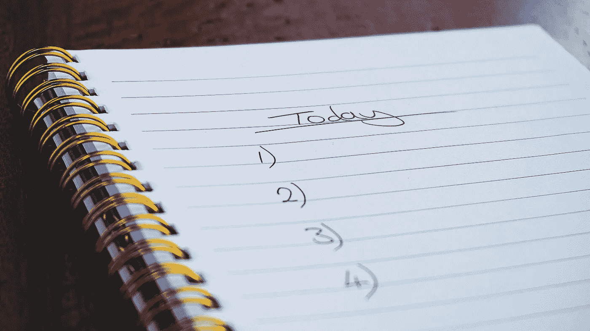

# 我的生产力挣扎:如何克服它们的 10 个技巧

> 原文：<https://medium.datadriveninvestor.com/my-productivity-struggles-10-tips-on-how-i-overcame-them-bfb5700d32d1?source=collection_archive---------3----------------------->

## 更聪明地工作，而不是更努力

又是在家工作的一天。你今天有很多事情要做，但是你真的能完成你计划要做的每一件事吗？

你可能认为你会完成你开始写的那本电子书，或者有机会观看你推迟的网上研讨会重播。

 [## 跑步摆脱疯狂:锻炼如何提高你的生产力——数据驱动型投资者

### 没有比锻炼更好的方式来开始一天的工作了。我试着一周至少做四天，在…

www.datadriveninvestor.com](https://www.datadriveninvestor.com/2018/10/23/running-to-get-rid-of-the-crazy-how-working-out-increases-your-productivity/) 

然而，有太多的任务要完成，你不知道从哪里开始，你感到不知所措。

即使你知道你有大量的工作要做，你仍然在想你可以在 YouTube 上观看的所有有趣的视频，或者看看你的朋友在脸书上发布了什么。所有这些都有助于更好地分散注意力。

**你需要保持高效，专注于最重要的事情。有这么多事情发生，底线是你必须努力确保你的一天是值得的。**

如果你在家工作时效率低下，以下 10 条建议可以帮助你重回正轨。

# 1.你每天浪费一个小时只是想弄清楚你需要做什么

如果你不知道一天中你需要做什么，那可能是因为你没有合理地计划你的一天。仅仅因为你在你的时间表上有灵活性，那并不意味着当你醒来的时候你不需要有一个计划。

即使你没有很多任务要做，你仍然需要写下你需要做的事情。

> 我建议你做的第一件事是从一个简单的任务清单开始。这个待办事项清单将会成为你每天的行动指南。

当你开始着手你的项目时，你的待办事项清单会确保你不偏离轨道。它还会帮助你跟上那些你可能已经忘记的小任务。

在遵循你的待办事项清单仅仅一周后，如果你在周一花几分钟写下一周的待办事项清单，你会惊讶地发现周五之前你已经完成了多少待办事项清单上的任务。

我还建议你每天检查你的待办事项清单，看看你已经完成了多少任务，并确保你添加了任何新任务。

# 2.你很难对别人说“不”

虽然在家工作很好，但是如果你不能和那些争夺你注意力的人划清界限，你将一事无成。

让别人知道你需要专注于你的工作，这不是粗鲁也不是自私。此外，如果你不能专注于你需要做的事情，你实际上是在损害你的业务。

确保你周围的其他人明白，即使你在家工作，你的工作时间也是严肃的，就像你有一份固定的办公室工作一样。

# 3.不要按优先顺序排列你一周的任务

虽然看起来你需要先处理更紧急的任务，然后再处理稍后到期的任务，但是按优先级排列你的待办事项列表并没有什么帮助，因为你不一定有精力按这个顺序完成每一项任务。

当你感到无聊或疲惫的时候，你曾经尝试过做一件困难的事情吗？

很可能你没走多远。你可能花了两倍的时间来完成这项任务，或者你在开始和完成一小部分后就完全筋疲力尽了。

不管一项任务是否紧急，你都需要组织好你的任务，确保你在最有热情的时候去完成它们。

# 4.睡一会儿

当你累了或者这几天睡眠不足时，你有没有尝试过做一项复杂的任务？

试图用咖啡因来补充睡眠不足的问题是行不通的。

相反，你需要去睡觉。睡眠对大脑的功能至关重要，你需要确保每天晚上有 7 到 8 个小时的睡眠，以帮助你在工作时间以最佳状态工作。

# 5.当你感觉最有效率的时候工作

不是每个人都是早上 6:00 起床，准备出发，出发，出发的人。一些人喜欢在下午工作，而另一些人一天中最有效率的时间是在晚上或夜间。

重要的是要认识到你在一天中什么时候处于工作效率的顶峰，并在那个时候工作。研究证明，大部分工作都是在工作日的几个小时内完成的。

没有人能稳定地工作八小时或更多。因此，为了利用这些高效的时期，确保你把那些更难的任务留到你知道你会在合适的时间完成它们的时候。

然后你可以利用一天中较慢的时间来完成那些不太重要的任务或需要完成的家务。当你把最困难的任务放在工作效率最高的时候，你会感到成功，因为你知道你实际上完成了最困难的工作。

# 6.留出一段时间打电话

有时候，当你在工作的时候，你接到一个电话，你觉得你必须马上接。如果你专注于你的工作，这是最糟糕的事情。

不要一接到电话就马上接，而是在你的日程表中留出一段时间专门用来接电话。此外，把你可以打电话的时间限制在下午一两个小时。

让人们知道，这是你唯一可以打电话阻止那些不在乎界限、执意打断你工作流程的人的时间。

> **提示:**如果你很难想出一个拜访时间表，也许这是一个好迹象，表明你需要外包或改善你的潜在客户创造工作，这样浪费时间的人就不会在随机时间给你打电话。

# 7.关闭提醒和通知

暂时关闭电脑和移动设备上的推送通知可以帮助您专注于手头的任务。仅仅忽视它们可能是不够的。

如果你难以集中注意力，你也需要静音。当你完成工作后，你可以重新打开它们，看看你错过了什么。

很有可能你不会错过太多。这些更新很可能是你在工作时可能忽略的东西。

对你工作效率最大的打击就是当你正努力集中注意力的时候，一个警报打断了你。不要破坏自己。

# 8.短暂休息

通常，在午饭后的下午，我的注意力开始下降。当我以前在办公室工作时，我们有一个健身房，所以我会去举重，休息一下。

通过这样做，当我回到办公桌前准备结束一天的工作时，我感到更有活力。虽然这在家里不起作用，除非你有一个家庭健身房，但你可以通过在户外散步来做一个修改版本。

快速休息有很多好处，也就是说你的精力会得到恢复。你会摆脱开始产生的厌倦感。

虽然有些人建议把锻炼作为一种休息，但如果你度过了紧张的一天，你总是可以利用休息时间通过冥想来放松。

**与此同时，你需要记住，你的休息只是一次休息。**你不应该休息太久以至于不想回来工作。休息不应该是你结束一天工作的前奏。

所以给你的休息设定一个时间限制。休息 15 分钟就可以了。这段时间足够短，可以帮助你重新集中注意力，而不会让你觉得拖延是可以的。

# 9.定期清理

当你在家工作时，很难跟上所有进入你家的东西，尤其是如果你有孩子的话。如果你没有时间进行常规的深度清洁，你应该确保把房子其他地方的所有东西都放在远离你办公室的地方。

这样你的办公室就不会变成孩子的游戏室或存放垃圾的地方。如果你发现事情开始失控，计划每周清理并扔掉一些东西可能是个好主意。

说到保持办公室清洁，除尘、吸尘和擦拭电子设备。这样你就能一直感觉你是在一个干净平静的环境中工作。

虽然这听起来有点乏味，但当你的办公室看起来像一个你想要工作的地方时，你实际上会更有效率。

# 10.利用生产力应用进行纵向扩展

既然你已经让自己井然有序，你也应该在你的计划中使用一些生产力应用程序。虽然你不能假设一个生产力应用程序会解决你的所有问题，但它可能会让你的一些事情变得更容易。

我建议你探索一些免费试用，看看生产力应用程序是否可以帮助你在你方便的时候用更少的时间做更多的事情。

# 我想做的是…

…写一些你可能会联想到的其他创业者正在经历的事情。如果你喜欢这篇文章，请马上在脸书上分享。

我的社交媒体链接: [**推特**](https://twitter.com/diyafshane) ， [**Mix**](https://mix.com/diyafshane) ，[博客](http://10krealvisitors.com/)