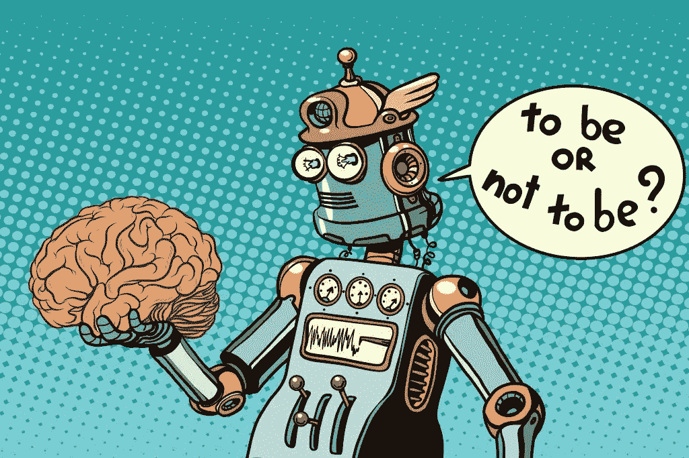

# 我和人工智能的约会:盐和胡椒

> 原文：<https://medium.datadriveninvestor.com/my-rendezvous-with-artificial-intelligence-salt-pepper-bf5fe2446240?source=collection_archive---------28----------------------->

这些天，每个组织都在谈论人工智能及其在产品和服务中的实现。我想知道这些说法中有多少是真的，又有多少只是在他们的营销活动中使用了流行词汇。

在我的市场调查期间(我在班加罗尔 IT 中心的小巷里正常逛了一圈)，我在市场上遇到了各种声称致力于人工智能的公司。

在对这些公司的进一步调查中，关于这些组织如何以及在哪里利用人工智能方法，结果让我呆若木鸡。这种效果并不是因为他们惊人的花哨网页或其内容；而是他们产品的目的！

这些基于人工智能的产品实际上想要实现什么？基本上，人工智能的目的是什么？让我们试着研究一下答案。

**人工智能:背景**

在机器中复制人类智能的愿望始于几个世纪前，当时亚里士多德等爱好者开始致力于分类学或知识库(人工智能的关键)。在那之后，许多伟大的好奇的头脑在创建知识库的旅程中尽了自己的一份力量，直到图灵机出现。

*换句话说，计算的想法变成了现实。*

在继续之前，请浏览一下与哨兵一词无关的有感觉的定义(矩阵系列粉丝的直白困境！)

***有情***

*形容词*

*含义:能够感知或感觉事物*

艾伦·图灵(Alan Turing)在他的研究论文中提出的最多的问题围绕着证明计算机是否可以有知觉的想法。对机器的测试也被称为图灵测试或模仿游戏(以证明任何机器是否足够聪明来通过图灵测试)提到了一些非常有趣的论点，如“*来自意识的论点”*陈述了机器是否可以复制情感或价值观，如诚实、爱等。还有一个被称为“洛夫莱斯女士的反对”的论点，它指出机器是否可以创造/引发想法。

简而言之，整个论点分为两类

1.  能模仿人类本身就是智慧的证明吗
2.  智力本身仅限于情感、创造力、艺术或基本上通过图灵测试。

之后的研究工作集中在这两个回答关键问题的论点上——“一台机器应该做什么来证明自己足够聪明？”。有数以千计的测试被提出来回答和证明这一点，但同样，智力没有唯一的定义。

我说的时间线是 90 年代左右。

杰弗里·摩尔的书《跨越鸿沟》中提到了一个例子，每个想法都需要一个愿景和一个目标，才能让世界相信它。同样代表了像人工智能这样的想法，尽管一些机构做了大量的工作，但由于缺乏这样的盔甲，人工智能在 1990 年代初面临着人工智能温特和莱特希尔报告的打击。

从那时起，科学界就朝着人工智能的摩尔定律努力——为它制定愿景和目标！他们致力于推进这项技术，从而祝福人工智能的存储能力和计算能力真正实现。2019 年的我们，比我们的前辈更加稳定和强大。让我们看看人工智能和我们是如何互相帮助的。

Shutterstock

***苹果之罪***

在浏览《AIMA 》(人工智能:一种现代方法)这本书的一些摘录时，我完全理解作者们为定义人工智能的意义所做的努力。

人工智能是斯坦·李在《奥创时代》中描述的那种机器吗——拥有类似人类的大脑，有能力进行理性思考？

这本书的作者支持“理性”的定义，并推导出“智能代理难题”，其中系统从外部环境收集输入，并相应地在后来定义相应的行动。

目前市场上的人工智能产品可能通过做市场研究或研究竞争对手的产品，致力于环境方面和我们(用户和创造者)创造的行动。当我们开始更多地关注特定的问题，而不是了解问题在领域中的整体地位时，理性思维就失去了价值。

现在的一些产品只是收集数据的一种方式，这样我们就可以训练我们的人工智能引擎，然后通过向其他组织出售相同的数据来赚钱。

然后是产品(被称为 AI)，它们实际上可以取代人类的工作，从而为一个组织节省成本。但是在这里，机器只是简单地模仿人类已经做得很完美的任务。机器可能在短时间内完成这项任务，但我认为那台机器不够智能，因为它没有任何理性可言。

因此，虽然在实际开发 rational AI 方面有一些真正的发展，但我们也有一些“以它的名义”的产品在市场上将其减少为一个简单的营销噱头。

声称致力于人工智能的行业应该更专注于人类理性思维有限的任务，当然也是为了更大的利益。目标应该是帮助机器帮助人类，而不是将人类从整个等式中移除。

整个竞赛游戏的目的是一起解决一个问题！这是一场国际象棋比赛(证明某人是否聪明的古老例子)，我们仔细选择步骤来实现一个目标，当比赛结束时，每个棋子都在同一个盒子里。