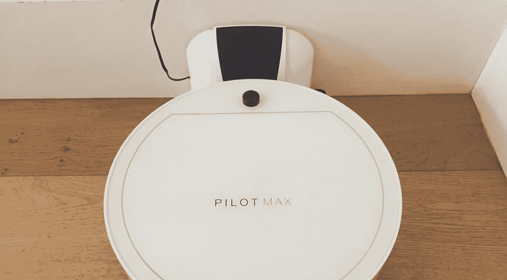

# 我的机器人吸尘器是创造力的未来

> 原文：<https://medium.datadriveninvestor.com/my-robot-vacuum-cleaner-is-the-future-of-creativity-40f00d92e674?source=collection_archive---------16----------------------->

Max in a rare moment of actually finding his charging post.

我有一台机器人吸尘器。这是一辆白色的 [Pilot Max](https://vimeo.com/134094372) ，可以让它在厨房地板上飞奔，为我们捡起碎屑。它不可避免地被家人称为马克斯，它很受喜爱，非常可爱。也是他妈的没用。然而，它给我上了一堂关于人类和机器人如何合作的课。

因为我手头太紧，无法拿出一台[戴森 360 Eye](http://www.dyson.co.uk/vacuum-cleaners/robot/dyson-360-eye.aspx) 机器人吸尘器，它可以用摄像头扫描房间空间，并计算出它应该去哪里，所以我只剩下一台“盲人”吸尘器，它必须通过距离传感器导航，使它能够避开障碍物(主要是)，并依靠其核心移动算法来计算出下一步去哪里。

这个核心算法才是我的问题。它要么是由一个精神病患者编写的，要么是由一个非常有幽默感的人编写的。让马克斯自己去处理，你会发现他朝着与你想要清理的污垢完全相反的方向走去，绕着(大)圈子在同一个地方清理几次，或者偶尔试图爬进冰箱。这简直让人抓狂。

把马克斯举起来，让他指着你想要捡起的泥土，他会不可避免地向后倒，毫无理由地旋转。让他沿着墙跑，他会莫名其妙地中途停下来，寻找新的地方。马克斯最终会清理整个房间的地板，但这需要几个小时，而且效率低得令人难以置信。相反，这家人通常会举起和放下马克斯，责骂和表扬他，就像他是一只宠物一样。这是变得疯狂的拟人化。实际上，马克斯不能独立工作。

但是，虽然我自己扫地更快，但并没有更有趣，这就是关键的区别。因为我学会了爱马克斯，所以我现在学会了和他一起工作。我不再责骂一个听不见我说话的机器人，也不再自己做这项工作，而是开始学习马克斯的行为，解读他的动作和决策算法，并预测他。通过这样做，和他一起清扫，我现在可以把泥土刷到他的路上，看着他为我捡起来。是的，他仍然很不可预测，但这种不可预测性增加了一些乐趣，它变得有点像一场游戏，而且工作完成得比我自己做要快得多。

在这个场景中，Max 缺少的只是一个机器学习循环，这样他就可以开始学习我的行为，我们就可以离开了，很快就可以清理房间，并隐喻性地互相击掌，因为 Max 在出色完成工作后会自动前往他的充电站。

我认为这是我们创意中心的未来。目前，创意中心仅限于人，但他们将越来越多地看到人和机器人之间以软件形式存在的合作伙伴关系，这种软件是核心算法和机器学习的结合。

事实上，我们喜欢认为我们的创意中心只是人，但现实是算法已经在创意开发过程中发挥了重要作用。这些算法隐藏在谷歌和脸书等平台的背后，但这些是创意人员在寻找灵感和信息时会询问的地方。他们帮助回答这样的问题，“其他人是如何解决类似问题的？”，‘我的想法以前有人做过吗？’或者‘我能摆脱或避免的当前趋势是什么？’。谷歌已经以一种粗略的方式从你以前的搜索行为中学习，给你它认为与你更相关的回应。我们通常喜欢关注创造性灵感的灵光一现，但事实是，构建一个伟大的创造性想法需要做大量繁重的工作。许多现代创意可能无法使用这些算法驱动的平台。

现在，想象这些算法不是由平台独立持有，而是由你持有，并且是你特有的。想象一下，你用得越多，这些算法就变得越聪明，它们可以更多地了解你和你喜欢的工作方式。想象一下，你可以指导他们完成复杂微妙的任务，并得到你想要的聪明的结果。你会有一个完全数字化的创意伙伴，一个创意伙伴机器人。

你的创意伙伴机器人可以接受指令去做你需要做的创意工作，甚至通过搜索你尚未阅读的电子邮件来预测需要做的工作，并在你知道你需要它之前完成它。它可以给你提供灵感——它知道你喜欢的东西和你甚至不知道你想要的其他东西。它可以让你来回思考，让你更快地解决问题，或者实现你独自无法实现的飞跃。你会了解彼此的弱点和习惯，并解释它们，学习以更聪明、更协作的方式前进，就像你和人类伙伴一样，但数字伙伴比人类伙伴有很多优势。

你的数字伙伴会一直很有耐心，它不会在你中途打断你(除非你知道应该这样)。它会接受指示，不会抱怨。它会以你认为最有效的方式给你惊喜和挑战。它可以在你休息的时候通宵工作，当你准备好第二天早上参与时，仍然精力充沛地进行项目的下一阶段。它可以同时处理多个项目，永远不会感到困惑或疲惫。它可以帮助你更有组织性和纪律性。它就像一个最好的朋友，一个管家和一只宠物，它会变得越来越聪明，越来越像你。核心算法、机器学习、API 连接和聊天机器人界面的结合让这一切变得触手可及。

像我和马克斯一样，你必须找到适合你的设置。你必须找到推拉和态度的结合，才能把工作做得最好。也许你会坚持你的人类创意伙伴，但有一个共同的创意机器人知道你俩。或者你可以在一个机器人可以一起工作的环境中，每个人都有一个创意机器人。但我怀疑，随着技术的进步，许多创意者将开发自己的数字创意大脑，以增强他们独特的人类能力，使他们能够更快、更好、更有效地独自创作。一个有创意的人和他们的创意机器人之间的关系将是独特和特别的，就像我和马克斯的关系一样。有些像宠物，有些更有挑战性。

这也可能打开二级市场。开发出优秀创意机器人的优秀创意人员或许可以将它们出租给其他创意人员。或者他们可以分享和交换机器人以获得新的灵感，或者获得针对专业创意领域(如虚拟现实或金融行业)优化的机器人。机器人可能会变得足够聪明，能够自己解决简单的创意挑战，创意人员可以在不占用自己工作时间的情况下出租自己的机器人。机器人可以同时处理多项任务。一些创意人员甚至可能选择花时间训练一群专业机器人，他们可以出租这些机器人，而不用自己解决问题。

现代创意已经包含了大量的数字输入，这只会增加，我们的创意数字服务只会变得更加智能。未来是学习软件和人之间的一种新的创造性伙伴关系，一种不断增长和发展的关系，这种关系将产生越来越好的创造性结果。

现在，如果有人能为我重新编程马克斯，我们也能把我的厨房地板弄好。我知道我应该买戴森牌的，我知道戴森牌的会更好，但它也会显得冷酷和独立。马克斯需要我，我们一起工作，这很有趣。马克斯让我成为更好的清洁工。