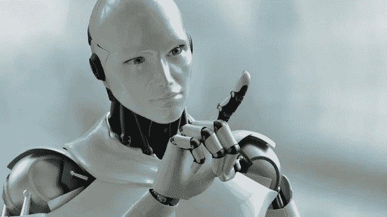

# 我的机器人命运

> 原文：<https://medium.datadriveninvestor.com/my-robotic-destiny-a58dc867cc4?source=collection_archive---------6----------------------->

公园的长椅他不记得了，他记得清清楚楚的是他最后一次来这里的事情。大约三年前，戴恩一边走路一边发短信，他被一只大腹便便的猪绊倒了，又被一个拿着冰淇淋蛋卷的老太太绊倒了，最后落在了这个他最终会爱他胜过粒子物理的女人身上。和往常一样，这头猪很好，戴恩用一些硬糖安抚了老妇人。然后，他要求女人，维罗妮卡，让他为他的笨拙给她买晚餐。戴恩已经看到这个概念为其他人工作，但不认为它会为他工作，所以当她同意时，戴恩震惊得石化了——只有在维罗妮卡最终确定计划时才能点头同意。这样做，他跟着她进入了一个三年的梦。他一直认为，他能有这种感觉的唯一方式是，如果他弹跳的重力比地球或月球上的重力小 83.3%。戴恩知道其他人会认为这很可悲，在 25 岁遇到他的第一个女朋友，可能是因为他知道月亮的确切引力，但对他来说这是完美的。

 [## 模式和机器人:一个复杂的现实数据驱动的投资者

### 哈耶克的名著《复杂现象理论》(哈耶克，1964)深入探讨了复杂性的话题，并断言…

www.datadriveninvestor.com](https://www.datadriveninvestor.com/2019/03/04/patterns-and-robotics-a-complex-reality/) 

维罗妮卡乘火车而不是出租车，这将使她比平时晚。她希望在那段时间里，宇宙中的某些东西会发生变化，她将不必遵循她的任务目标。戴恩不会介意维罗妮卡迟到，她总是这样。不是因为他无可救药地爱着她，而是因为戴恩总是很早，是她所见过的最有耐心的人。她知道这就是为什么她爱他，为什么她必须和他在一起。尽管事情本不应该是这样的，但戴恩还是被选中了，因为他的社交笨拙，无法与他人沟通。这些特质受到重视，因为它们被认为有助于她避免任何浪漫纠葛。现在这对她没什么好处。她知道和他在一起不是她的一部分，现在她知道为什么那些爱着的人既恨又崇拜。她爱戴恩，但她也知道她必须和他分手，再也见不到他。

戴恩坐在长椅上，拿出手机，加载了一个他编写的应用程序。他称之为外星攻击者——他是一名分析师，用对数字和计算的热爱来弥补自己创造力的不足。从某些标准来看有点不人道，但这就是他，他没有为此找借口或撒谎。游戏的任务是解决公式，让你更准确地射击，摧毁入侵地球的外星人。这是他一生的故事——任何书呆子的希望，也许是他如此喜欢这个游戏的原因。一只狗叫了起来，戴恩抬起头，看见太阳快要触及地平线便关闭了游戏。他看了看时间，猜测还有十分钟，开始阅读他和维罗妮卡之间的短信。

维罗妮卡在长椅和戴恩等待的地方的另一端进入公园。她已经接受了没有计算来解释她的爱，只有她爱戴恩。她所知道的是戴恩最可爱的地方:他的短信。他认为这是人们所想到的最聪明、最机智的陈述，但坦率地说:我们不是。她想象着他坐在自己的隔间里，从自己热爱的工作中抽出时间。他可能花了几个小时想她，苦苦寻找完美的文本来打动她，因此她爱他们。她希望她能和戴恩永远呆在这里，但那不是她的任务规划。戴恩注意到太阳已经在地平线下了一半，然后看了看表。发生了什么事？维罗妮卡现在应该已经到了。出什么事了吗？如果她会比平时晚到，为什么她没有给他发短信？如果她没有很快出现，这将对他精心安排的剩余时间产生巨大的冲击。她还好吗？

“你好，我可爱的小人国书呆子，人类，”他听到维罗妮卡甜美、温柔、和谐的声音。他对她无聊的枕边谈话笑了笑；他爱她。他转过身来，看到她穿着一件绿色太阳裙，遮住了她苍白的乳白色皮肤，反射着落日的余晖，让她容光焕发。"那么……"他开始问她，她打断了他。“我只是想让你知道，事情不应该是这样的，”她艰难地说着，努力寻找着合适的措辞。
“喜欢什么？”
“当我遇见你的时候，”她继续说道，“那不是出于选择，而是为了我的工作，”她说完，她看到戴恩的眼睛因愤怒而眯了起来。
“有人付钱让你来见我，”他要求道，声音中的温柔现在变成了愤怒的刻薄语气。
“不是……是……事情比这更复杂，”她看到爱情的负面影响和复杂性，再次挣扎。“我全是鼓膜，”他不那么生气地回应道，她知道接下来会发生什么会压垮他。“闭上你的眼睛，”她命令道，他瞪着眼睛，“求你了，”她轻推了他一下，他照办了

维罗妮卡把右手食指变成了螺丝刀，打开左手腕上的检修板，拧开三个螺丝，然后松开左手。在手腕内部，她的静脉由光纤和微型马达的肌肉以及钛韧带组成。“睁开眼睛，”她命令道，戴恩睁开眼睛看到了维罗妮卡的手。

“我是一个机器人，”当他的眼睛变红，他后退一步时，她打消了所有的疑虑。“到底是什么……怎么……”戴恩哑口无言。
“我被编程来模仿外星物种，渗透他们的社会，并向我的主人汇报，”维罗妮卡用一种她不喜欢的过于就事论事的语气说道。“哇啦哇啦，”戴恩转身离开时几乎是在大叫。
“我从未想过要伤害你，”她试图说。“你没有我怎么会爱上一个机器人，”他试图推开她。“这就是我们的爱情的独特之处，它不应该存在，但它存在，”当他开始走开时，她恳求道。“等等，”他继续走着，她喊道，“我需要你的帮助，”她边喊边开始追赶他。当她试图解释时，他继续不理她。“我的主人，他被雇来毁灭地球，”她心领神会，“我们必须阻止他，”她说完，戴恩看向她。为什么，这样我就可以再次心碎了？也许这次是被一个玩具，”他在转移视线之前对她大发雷霆。她知道他需要空间，于是转向公园外的城市。

戴恩坐在他的三层楼砖砌公寓楼的顶上，看着这个城市在迅速消失的阳光的柔和温暖的覆盖下忙碌着。他知道自己一直与众不同，是个被拒绝的人，是个机器人:真的吗？他拿出自己的牢房，装上外星人的攻击，想知道如果他甚至不能爱上自己种族的一员，他怎么能拯救地球。他知道他和维罗妮卡在一起的梦想已经结束了，他只是另一个书呆子，他会发现手机比一个人更有陪伴。

太阳不见了；街灯将城市笼罩在熟悉而模糊的光芒中，这让她感到温暖和满足。她非人的内脏让她觉得在人造光下比在阳光下更舒服，她接受了这一点。除了当她和戴恩在一起的时候，当她在他身边的时候有了一些不同，尽管自从他们第一次见面以来，她每一秒钟都在对他撒谎。讽刺的或诗意的，她还没有决定，她也爱他，因为同一时间。

她发现自己拐进了一条小街，这条小街比一条小巷好不了多少，只有几个嘶嘶作响的灯泡贴在砖砌建筑的侧面。想到戴恩坐在他的楼顶，她知道他在那里；她把一个罐子踢到了巷子里。小隆隆声回荡远离它，因为它滚到了对一个遥远的墙壁停止，维罗妮卡感到空虚通过她的身体共鸣。她想念戴恩，担心他的未来和这个星球的未来。他在那里跌倒，然后砰的一声落在小巷的中央。维罗妮卡在他身边；她把他翻过来，然后看着他的眼睛，擦去他下唇的血。

"不要因为我而自杀，"她一边帮戴恩坐下，一边命令道。“少来这套，”他指着上方回应道。维罗妮卡弯下脖子，看着悬浮在他们上方 10 英尺处的一个人类身体中她外星主人的眼睛。她所能想到的就是戴恩回来了——或者回来了。“我很抱歉，”她说着与他对视。
“你骗了我，”他回应道，她的主人向他们飞去。他们互相跳开了。“但是如果你的种族要生存下去，你需要帮助我，”她靠着小巷的一堵墙喊道。
“我不能相信你，”他吼道，避开了飞行人类的攻击，维罗妮卡知道这不会有什么效果，就停止了翻白眼。“如果我的主人得到了我的存储驱动器中的信息，他就能获得毁灭地球的许可，”她大叫着跑向他，而他则躲进了一个小壁龛里。“我知道我们直到现在才开始战斗是有原因的，”他看着别处说道。
“为什么？“因为你是个骗子和机器人，”戴恩勃然大怒，“我从未对你撒过任何谎，”他说完，维罗妮卡没有受伤。他说的都是真的，但我知道他们现在有更紧急的事情。她正要回应时，戴恩从壁龛跑出来，被她主人的靴子踢中了脸。他倒在地上，她看到一个歪鼻子跳到他身边。“不，”他急促地喘息着，“你不能……”戴恩知道他失败了，外星人赢了。“你真的想现在就谈论我们的关系吗？”她一边要求一边把他拽回壁龛里。戴恩藏起来了，她就暴露了；她爬起来准备面对她的主人。他向她扑来；他跳了起来，绊倒了，然后滚到了地上，导致她的主人从一堵墙边转向她。

在凹室的掩护下，戴恩坐在那里看着攻击。他的肌肉因恐惧而紧绷——他从未如此接近任何真正的危险。然后他的肺停止了。他屏住呼吸，因为他看到自己失去了外星人的维罗妮卡；这不是他所期望的。他不能动，不能呼吸，也不能眨眼；他所能做的就是盯着看。

维罗妮卡滚到了一个停车点，单膝跪地，看到她的主人从上面攻击。他从藏着的武器鞘中抽出一把刀，朝维罗妮卡的脸挥去。戴恩凝视着。刀片划破了维罗妮卡的脸颊，留下了一个三英寸长的伤口，涌出猩红的鲜血。维罗妮卡看到伤口时退缩了，疼痛像闪电一样穿过她的脸。血从她的下巴滚下来，溅在地上。

戴恩可以呼吸或思考。他只知道维罗妮卡受伤了——你能伤害一个机器人吗？他不知道答案，但承认看到维罗妮卡受伤引发了内心的愤怒和恐惧，这种愤怒和恐惧比他所知道的还要强烈。他跑到她身边，试图扯掉衬衫上的绷带，但不出所料，他悲惨地失败了。在她身边，他拉着她的衬衫，直到她举起一根手指，变成了一把刀。他抓住她柔软、温柔的手，用它从他的衬衫上剪下一条，然后放到她的脸颊上。她看着他，绿蓝色的眼睛穿透了他的眼睛，他的心脏停止了跳动，永远不会再跳动了。他知道他必须和她在一起，不管她是什么。

戴恩微笑着，维罗妮卡知道他感受到了她的感受。她从他手里抢过绷带，擦去脸上的血，戴恩看着伤口迅速愈合。

“了解机器人的一个好处，”她微笑着对他说，“我是为战斗而生的，”她说完，转向她的主人。

戴恩看着他的骑士机器人女人攻击。她是风:优雅而沉默。她就是那条河:强大、无情、扭曲。她抓住主人的脚，把他拖到地上，开始殴打他。她是太阳:所有人都可以看到的明亮的灯塔。她是一棵 100 英尺高、直径 18 英寸的树:一年能产生 6000 磅氧气，这是维持他生命的要素——维罗妮卡。

维罗妮卡没有殴打她的主人；外星人没有动。她转向从壁龛里出来的戴恩。外星人已经死了；他们拯救了地球。维罗妮卡跑向他，他们拥抱在一起。维罗妮卡把下巴搁在戴恩的肩膀上，离他的耳朵只有几英寸远，低声说道。

“我爱你；没有这些，我不可能做到。”他知道她说的是实话。更重要的是，如果没有他，她不可能打败外星人，那么他做到了，他拯救了地球，找到了他一生的爱。现在他所要做的就是想办法告诉他的父母他爱上了一个机器人。