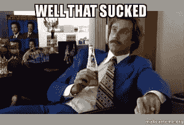
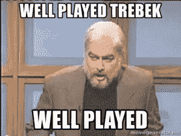

# 我的 ICO 骗局故事

> 原文：<https://medium.datadriveninvestor.com/my-story-of-an-ico-scam-c91e7d67bc09?source=collection_archive---------3----------------------->

一个 ICO 骗局骗了我 2 英镑。坦率地说出这一切是如何发生的，这样你就可以避免同样的事情发生。你可以说我愚蠢，但我知道这样做的风险。

你会认为我会生气，我有点。**但是，我只是失望。ICO 骗局是对 crypto 的一大批评，它让许多人不敢进入。**

我们都想在密码投资上赚钱。为了继续这样做，我们需要新的人、新的资金和持续的兴趣。被骗的人不是这样做的。

**下面是 ICO 骗局是如何发生的。**

首先，一个人在 Reddit 上联系了我。以下是所说的内容。

[–]**发自**[**NathanielSmith87**](https://www.reddit.com/user/NathanielSmith87)**发于 1 个月前**

嘿，伙计，你有兴趣加入一个 ICO 联营集团吗？我们正在寻求扩大到更多的成员。我们拥有许多即将发布的大型 ico 的私人预售权限。如果你有兴趣，请告诉我。

[–]致[纳撒尼尔史密斯 87](https://www.reddit.com/user/NathanielSmith87)1 个月前寄出

是的，我会感兴趣的。你是怎么设置的？

[–]**发自** [**纳撒尼尔史密斯 87**](https://www.reddit.com/user/NathanielSmith87) **发于 1 个月前**

*优秀！这是我们不和*[*https://discord.gg/YAC9vj*](https://discord.gg/YAC9vj)*的链接，只要你有空，我可以把你介绍给我们的合格投资者和我们研究的一些成员，他们可以回答你可能有的任何问题。*

于是我进入了 Discord 组，注意到 time 登录时有 10 个成员，名字是 **CE Pooling** 。我怀疑是否知道所有的 ICO 骗局。然后事情变得有点奇怪。

四名成员通过语音聊天采访了我。他们想知道我在加密方面的背景，我投资的硬币，我的一些优势，以及我做这个有多久了。

然后他们告诉我这个团体的情况，每个成员都尽到了自己的职责。要么研究，接触创造硬币的人，要么投资经验。我将成为一名研究员。

我的工作是研究即将推出的 ICO，并通过 Discord 向他发送信息。所以，这就是我一个多星期以来所做的。

我仍然不确定这是否合法。那几个人花时间采访我，似乎是一个骗局需要做很多工作。人们也在小组中做研究和交谈。

第二周，他们说有一个 ICO 可以进入，那就是夸克链。

每个成员都可以贡献他们想要的以太币，但是最少要贡献 10 以太币。**我绝不会寄那么多。**

**我通知主要人物(威廉)我只能发送 2 以太。**这些人我一个都不认识，我想在做出更多贡献之前看到结果。威廉说那很好。

5 月 18 日我寄出了我的乙醚。

接下来的两周，我继续给他们发送 ICO 信息。所有成员仍在小组中讨论。

后来有一天我打开 Discord 发更多 ICO 信息，这个团就不见了。我当时就知道了；他们骗了我。

这就是全部的故事。他们的 ICO 骗局成功了。我觉得自己很蠢吗？

不，我做的时候就知道有风险。我认为这是一项风险投资。**如果行得通，那就太好了，如果行不通，那就这样吧。**

联营集团的人也不能完全受到指责。没有规定，所以他们没有违反任何法律。除了是不道德的混蛋。

我将不会参加任何 ICO 池很长一段时间，如果有的话。这并不意味着我不想投资 ICO。监管有助于防止 ICO 骗局的发生。但是这并没有解决真正的问题。

**投资 ICO 必须成为合格投资者，这是个问题。**只要这一点到位，人们就会继续寻找进入 ICO 的途径。泳池将是最好的方式。

**这是成为合格投资者的条件** - *一个人必须拥有至少 100 万美元的净资产，不包括主要住所的价值，或者在过去两年中每年至少有 20 万美元的收入(如果已婚，则为 30 万美元的总收入)*

许多人因为不符合这些标准而错过了大好的投资机会。这不仅适用于加密，也适用于许多其他投资。

他们说这样做的原因是为了保护人们。不允许他们赔钱，他们输不起

政府在告诉我们把自己的钱投资到哪里以及如何投资，这种情况必须改变。

有些财务顾问不符合认证标准。然而，他们可以告诉人们如何投资和在哪里投资。去他妈的。

如果人们没有赚到足够的钱来获得合格投资者的资格，这是否意味着他们不够聪明来投资自己的钱？

**如果你不能用你的钱做你想做的事情，那么谁在控制？**

我们需要摆脱这个过时的合格投资者标签。

**否则，人们会继续想办法投资于不允许他们投资的东西。**

*原载于*