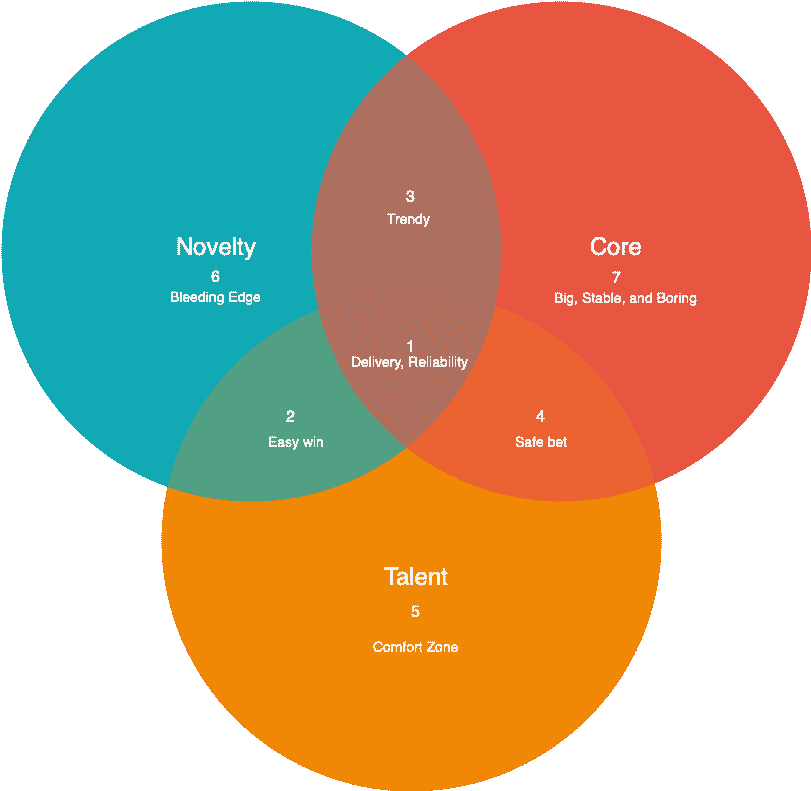

# 我选择技术的系统

> 原文：<https://medium.datadriveninvestor.com/my-system-for-choosing-tech-a7ad444fb36b?source=collection_archive---------7----------------------->

当你为业务的主要部分选择技术堆栈时，我总是建议考虑 3 个不同的指标。

*注意:此讨论是关于长期解决方案的，并不适用于快速的、类似概念验证的需求。在不同的帖子中寻找。*

**核心:**这是否解决了您业务中的核心问题，因此对于持续快速地提供高质量的服务非常重要。

**新鲜感:**这是以一种新的、创新的方式来满足一种需求，还是这是一种常见的、已经被解决了上百次的东西。

**人才:**您的团队(以及在较小程度上，您所在地区的可用人才库)在特定解决方案中是否具有优势。

意识到你的问题在这张图上的位置:

从这一点上来说，这些指导方针通常会根据您所在的航段来制定:

1.  这是一个非常重要的问题，因为它既是你业务的核心，也需要一种新颖的方法。由于你的团队在相关技术上有优势，这通常是正确的选择，除非这种新奇需要创新，而已知的解决方案无法提供这种创新。如此重要的东西意味着你必须能够可靠而快速地交付它。
2.  一个需要新奇但不属于你核心业务的问题通常是一个外围服务，可以让你达到更好的结果。例如，帮助产品团队的创新分析解决方案或高级自动化营销解决方案，它们并不是您实际“销售”的产品人才优势意味着这是一个让团队在他们的舒适区巡航并快速收获回报的好地方，除非创新需要一个特殊的解决方案。
3.  当你需要一些新奇的东西，并且它是你业务的核心时，尽管你没有现有的经验，我倾向于寻找一个有活跃和可行的社区的解决方案，并且有上升的趋势。它不一定是最安全或最稳定的选择，但它需要有活力和生产力。
4.  作为你业务的核心但不需要新奇的东西是一个重要的标准问题，但已经被解决了很多次。例如简单的 REST API、标准的面向用户的 web 应用等。鉴于团队在这一领域有经验，就顺其自然吧。没有必要去疯狂，因为这是一个“无聊”的问题，这里的创新不太可能帮助你的业务。
5.  这是非常外围的东西，因为它不是业务的核心，也不需要新奇。我建议简单地使用团队习惯的东西，而不是在这里浪费周期。通常以认证机制、电子邮件发送能力等形式。
6.  一个有趣的问题是:一些不是业务核心的东西，但是需要一些创新，你的团队不知道现有的解决方案。这是尝试新的热门事物并让团队进行实验的主要选择。新的解决方案通常更容易创新，然而由于这不是什么太重要的事情，选择错误的代价不会太大。
7.  选项 *4 的对应选项(*假设团队没有先前的经验)，是你可能应该选择一个大的、已知的、稳定的和无聊的选项。没有人愿意在一个微不足道的软件上花费时间，尤其是当它对你的操作很重要的时候。

这些指导方针是我们开始讨论和验证的基本点。永远记住，把事情复杂化不是目标。

*Aviv Ben-Yosef 2018 —原载于*[*avivbenyosef.com*](https://avivbenyosef.com/my-system-for-choosing-tech/)