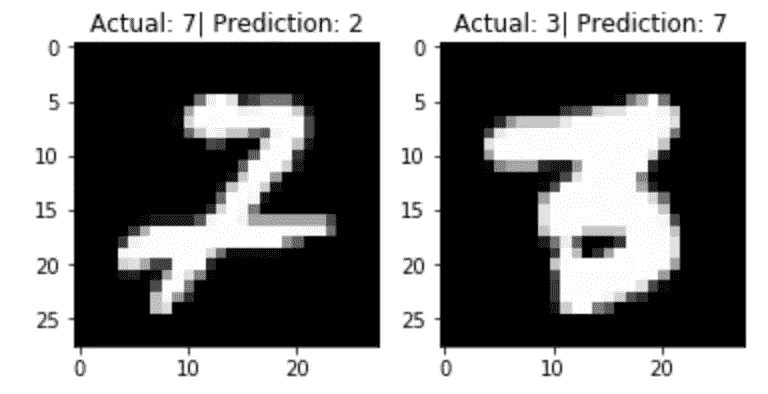

# 我对 MNIST 数据集的看法

> 原文：<https://medium.datadriveninvestor.com/my-take-at-the-mnist-dataset-97304dff2057?source=collection_archive---------7----------------------->

我想重温机器学习的经典“Hello World”…经典的“MNIST 数据集”。快速复习 MNIST 数据集包括的内容:

这是一个 28 x 28 格式的分类手写图像数据集。

*   60，000 张训练图像
*   10，000 张测试图像

长话短说，我能够构建一个分类器，它能够以 **~98%** 的准确度检测测试集。在我的 MacBook 上训练大概花了二十分钟。

# 手头的任务

1.  建立一个从 60，000 张图片的训练集中学习的 CNN
2.  测试测试集中剩余的 10，000 张图片，看看我们做得有多准确
3.  我还决定输出一些没有正确分类的图像，作为一种健全性检查

# 我们开始吧

这是我用 Keras 在 TensorFlow 上构建的卷积神经网络的总结。

```
Layer (type)                 Output Shape              Param #   
=================================================================
conv2d_8 (Conv2D)            (None, 24, 24, 32)        832       
_________________________________________________________________
max_pooling2d_7 (MaxPooling2 (None, 12, 12, 32)        0         
_________________________________________________________________
conv2d_9 (Conv2D)            (None, 8, 8, 64)          51264     
_________________________________________________________________
max_pooling2d_8 (MaxPooling2 (None, 4, 4, 64)          0         
_________________________________________________________________
flatten_3 (Flatten)          (None, 1024)              0         
_________________________________________________________________
dropout_3 (Dropout)          (None, 1024)              0         
_________________________________________________________________
dense_4 (Dense)              (None, 100)               102500    
_________________________________________________________________
dense_5 (Dense)              (None, 10)                1010      
=================================================================
Total params: 155,606
Trainable params: 155,606
Non-trainable params: 0
```

# **情侣指针**

我承认有一个问题是理解输入/输出形状，它允许我将输入图像漂亮地附加到 CNN 上。让我们回顾一下。

*   现在重要的是 x_train 和 x_test 是图像的*数据。所以图像被转换成 numpy 数组，其中包含组成图像*的*文字值。通过从 x_train 打印出一个样本，然后使用 plt.imshow()绘制它，我们可以很容易地确认这一点*

```
randomIndx = np.random.randint(60000)print("Random Index: {}".format(randomIndx))
plt.imshow(x_train[randomIndx], cmap = 'gray')
plt.title(y_train[randomIndx])
print("Shape of image: {}".format(np.shape(x_train[randomIndx])))Random Index: 14418
Shape of image: (28, 28)
[[  0   0   0   0   0   0   0   0   0   0   0   0   0   0   0   0   0   0
    0   0   0   0   0   0   0   0   0   0]
 [  0   0   0   0   0   0   0   0   0   0   0   0   0   0   0   0   0 continues ...
```

上面的值组成了下图。


让我们也熟悉一下 y_train。

```
y_trainOut[59]: array([5, 0, 4, ..., 5, 6, 8], dtype=uint8)
```

好的…所以 y_train 有它们对应的索引的值。因此，第一个值“5”是第一个图像所属的类。这很重要，因为我们必须将它转换成 Keras 可以理解的一次性编码格式。我们稍后再做。

好吧…目前我们知道些什么？

## x _ 火车:

*   尺寸:(60，000 x 24 x 24)
*   60，000 张大小为 24 x 24 的 1 个灰度通道的图像

## y _ 火车:

*   尺寸:(60，000 x 1)
*   60，000 个包含相应图像值的标签

## x _ 测试:

*   尺寸:(10，000 x 24 x 24)
*   1 个灰度通道的 10，000 张 24 x 24 大小的图像

## y _ 测试:

*   尺寸:(10，000 x 1)
*   包含相应图像值的 10，000 个标签

## 下一步是什么？

让我们使用来自`keras.utils`的 hand `to_categorical`函数将我们的 y_train 和 y_test 转换成 one-hot 编码矩阵。

`y_train = to_categorical(y = y_train, num_classes = 10`

这是把我们的 y_train 转换成

```
array([5, 0, 4, ..., 5, 6, 8], dtype=uint8)
```

变成这样…

```
array([0., 0., 0., 0., 0., 1., 0., 0., 0., 0.], dtype=float32)
```

其中列表示它是哪个值。因此，由于第 6 个索引被点亮，这意味着第一行是数字 5。

我们继续对 y_test 做同样的事情。

# 火车！

好酷…让我们训练这个家伙！

```
model.fit(x_train, y_train, epochs = 10, batch_size = 1000)Epoch 1/10
60000/60000 [==============================] - 39s 648us/step - loss: 10.4201 - acc: 0.3453
Epoch 2/10
60000/60000 [==============================] - 39s 645us/step - loss: 9.8047 - acc: 0.3886
Epoch 3/10
60000/60000 [==============================] - 37s 620us/step - loss: 5.5528 - acc: 0.5855
Epoch 4/10
60000/60000 [==============================] - 37s 613us/step - loss: 0.1894 - acc: 0.9427
Epoch 5/10
60000/60000 [==============================] - 37s 614us/step - loss: 0.1073 - acc: 0.9667
Epoch 6/10
60000/60000 [==============================] - 37s 619us/step - loss: 0.0781 - acc: 0.9761
Epoch 7/10
60000/60000 [==============================] - 37s 615us/step - loss: 0.0670 - acc: 0.9802
Epoch 8/10
60000/60000 [==============================] - 37s 617us/step - loss: 0.0557 - acc: 0.9829
Epoch 9/10
60000/60000 [==============================] - 37s 619us/step - loss: 0.0475 - acc: 0.9846
Epoch 10/10
60000/60000 [==============================] - 37s 621us/step - loss: 0.0410 - acc: 0.9872
```

# 试验

让我们来测试一下！

## 预测

```
predictions = model.predict_classes(x_test)
```

## 评价

```
evaluate = model.evaluate(x_test, y_test)10000/10000 [==============================] - 3s 261us/stepprint("Loss: {}".format(evaluate[0]))
print("Accuracy: {}".format(evaluate[1]))
```

**损耗**:0.039771064763779576
**精度** : 0.9876

我还想看到分类器错误预测的图像…所以我做了一个快速 for 循环来获取错误预测的索引

```
wrongPredictionIndexes = []
i = 0for actual, prediction in zip(y_testClasses, predictions):
    if actual != prediction:
        wrongPredictionIndexes.append(i)
    i = i + 1
```

现在，我可以随机遍历不正确预测的索引，并可视化分类器出错的索引。

```
randomIntList = np.random.randint(len(wrongPredictionIndexes), size = 2)
print(randomIntList)plot = 1
plt.figure()
for randomNum in randomIntList:
    plt.subplot(1,len(randomIntList),plot)
    imageIndex = wrongPredictionIndexes[randomNum]
    plt.imshow(x_test[imageIndex], cmap = 'gray')
    plt.title("Actual: " + str(y_test[imageIndex]) + "| Prediction: " + str(predictions[imageIndex]))

    plot = plot + 1
```



你可以在 GitHub 上找到我的 iPythonNotebook，我在那里包含了更详细的代码版本。

[https://github.com/mustafahoda/MNIST](https://github.com/mustafahoda/MNIST)