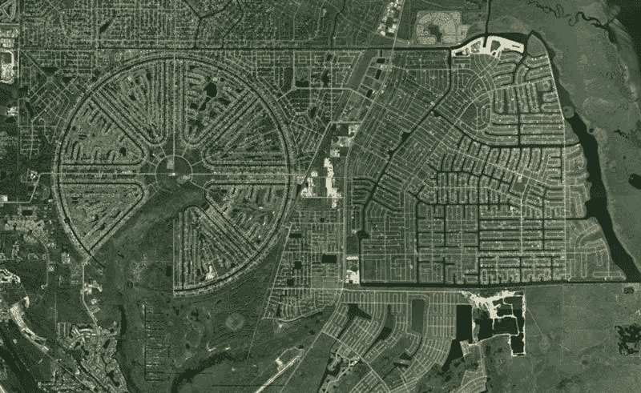
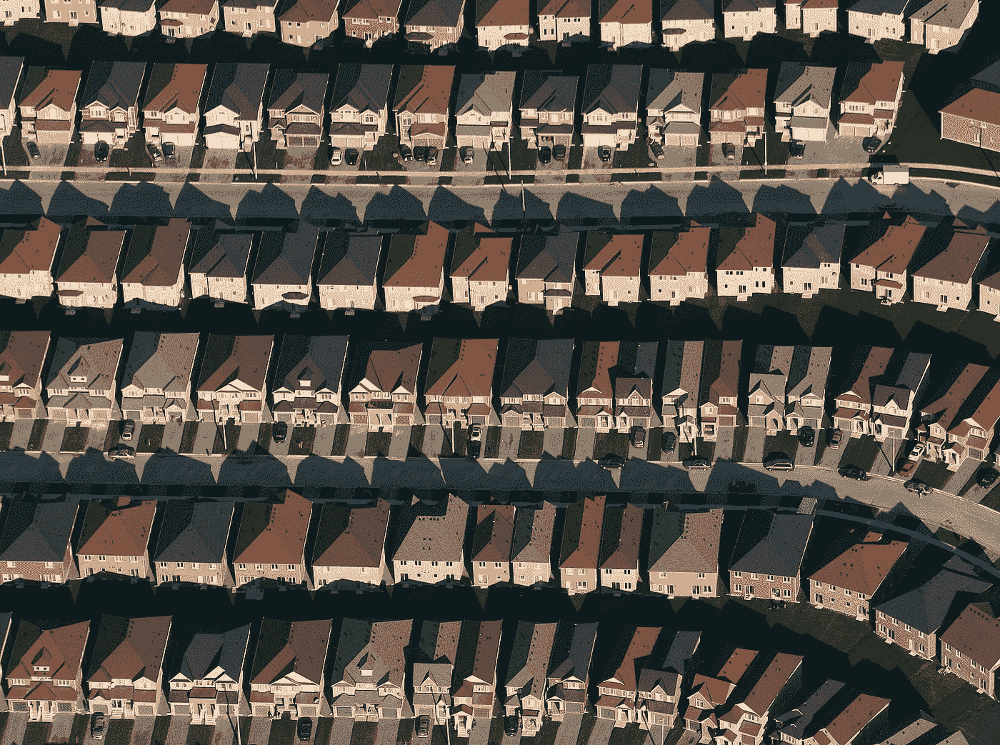

# 人工智能与建筑之我见

> 原文：<https://medium.datadriveninvestor.com/my-thoughts-on-ai-architecture-c8806b826273?source=collection_archive---------7----------------------->

## 建筑和城市设计的未来如何？

上周，我在 DC 华盛顿的美国建筑师协会参加了一个关于建筑和人工智能的活动。

我参加是因为人工智能的话题最近吸引了我的注意力，尤其是在阅读了尤瓦尔·诺亚·哈拉里的书和关注了 T2·杨安泽之后。许多工作(如卡车司机和呼叫中心工作人员)正在被早期的自动化浪潮所取代，这一点已经被接受。由于我最近从佛罗里达州大学毕业，获得了可持续发展&建筑环境的学位，我对建筑师(以及所有其他建筑环境设计师)将如何受到自动化的影响非常感兴趣。

 [## 人工智能与创意:作为创意引擎的 BigGAN |数据驱动的投资者

### 的确，2018 年可以被视为人工智能创造的创造力全盛时期的开始。当然可以…

www.datadriveninvestor.com](https://www.datadriveninvestor.com/2019/02/13/ai-creativity-biggan-as-a-creative-engine/) 

当面对人工智能和自动化可能会如何影响建筑的问题时，大多数建筑师都不愿意接受人工智能能够以某种方式设计出与人类建筑一样漂亮和实用的建筑的想法。这是很自然的，因为我们没有人愿意想象我们的工作(这是我们身份的一个巨大部分)可以被一个无意识、无生命的算法取代。讨论的要点围绕着人工智能如何能够产生成千上万种不同的设计和计划，但无法区分好的和坏的。把两个浴室放在一起是个好主意吗？把厨房放在主卧旁边怎么样？中央的窗户应该是圆形的，而侧面的窗户应该是矩形的吗？据房间里的建筑师说，这些是只有人类建筑师才能做出的决定，因为它们通常植根于艺术、文化或其他人类情感。他们认为，如果人工智能要建造一座建筑，它将缺乏任何能够唤起情感和感觉的艺术表达。

我仔细听着这种思想交流，直到我意识到他们不是在谈论整个建筑行业，而是专注于整体中的“明星建筑”或“顶级建筑”部分。如果你看看美国的整个建筑环境，它已经看起来好像人工智能已经设计了它的大部分:

Computer chips or cities? Florida’s suburbs often look as if they were designed by some other form of intelligence.

尽管文化和品味、商业和经济、联邦和地方法规严重塑造了今天的建筑和城市，但看起来艺术家和建筑师肯定没有发挥巨大作用。每个郊区看起来都一样，中产阶级城区的每栋新建筑看起来都一样，每个新的办公园区或配送中心看起来都一样，这是有原因的:建筑师很贵，而建筑可以很容易地由工程师建造。在其他国家，有不同的成本，几乎每个人都可以享受个性化的家居设计。他们要么自己建造，要么请得起建筑师。在美国，普通人只能从预先设计好的房子中选择，这些房子可能不完全符合他们的需求、愿望和品味:

The average person in the United States can’t afford a personalized house and is limited to a few replicated models.

我认为，如果人工智能能够设计出和人类一样好甚至更好的建筑，这不是一个时间的问题，这是一个 T2 什么时候和 T4 如何设计的问题。

**When** :人工智能永远存在于云中的任何地方，因此只需要一个人或组织来收集必要的数据并设计正确的算法，然后可以在没有任何额外成本的情况下无限复制，同时收获所有的节省。这可能发生在明天、明年或十年后，但一旦发生，它就会一直存在。

**如何**:和其他任何技术一样，人工智能不会导致某种结果。技术的使用方式会产生好的或坏的结果。例如，汽车是一项伟大的技术，但却被不明智地使用了。互联网是另一项技术，它承诺用简单易得的知识连接整个世界，然而我们可以就其目前的用途进行争论。人工智能也是如此。我们可以选择使用人工智能来为大众设计越来越便宜的千篇一律的建筑和城市，而人类建筑师变得更加排外。或者，我们可以获得更实惠的个性化设计的好处，这些设计基于与人工智能的*共生关系来建造我们都想要和需要的建筑和城市。想象一下，有一种算法可以根据大数据推断出你的住房需求，就像网飞和 Spotify 知道你的电影和音乐品味一样。你认为建筑行业会如何发展？想象一下，如果算法可以从数百万种房屋风格中提取，并推断出哪种风格最适合您的需求，同时立即起草数千种不同的设计方案供您挑选。人类建筑师/工程师所要做的就是在设计过程中充当人类向导，并在施工文件上签字。当然，开发人员必须适应非标准化的结构。如果我们能享受更实惠的建筑，也许我们能负担更昂贵的个性化建筑。*

这看起来有些牵强，而且很可能是不可能的，但是我认为我们应该讨论我们想要什么样的未来。一个是个性化设计属于精英，一个是人工智能和个性化建筑的好处在整个社会公平分配。