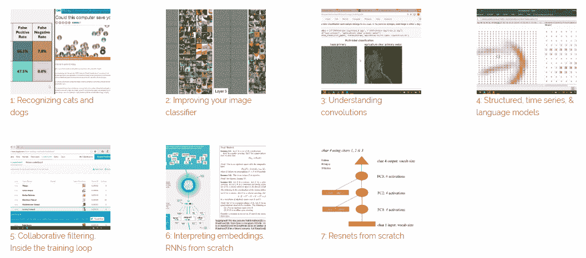
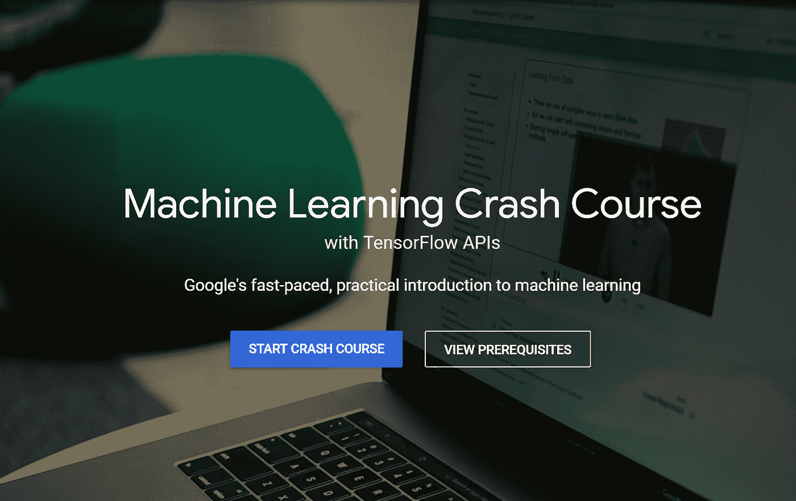
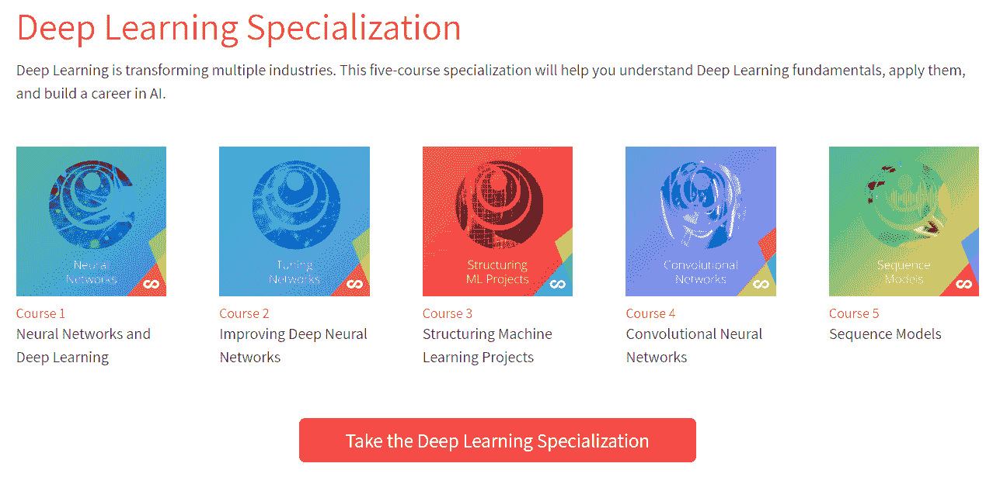
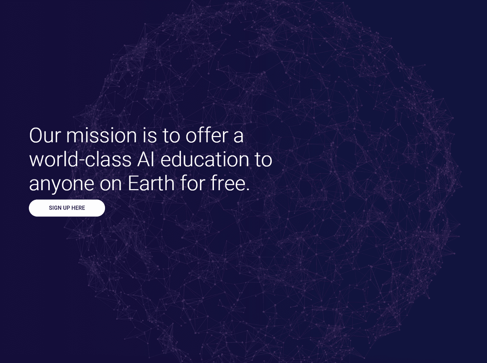
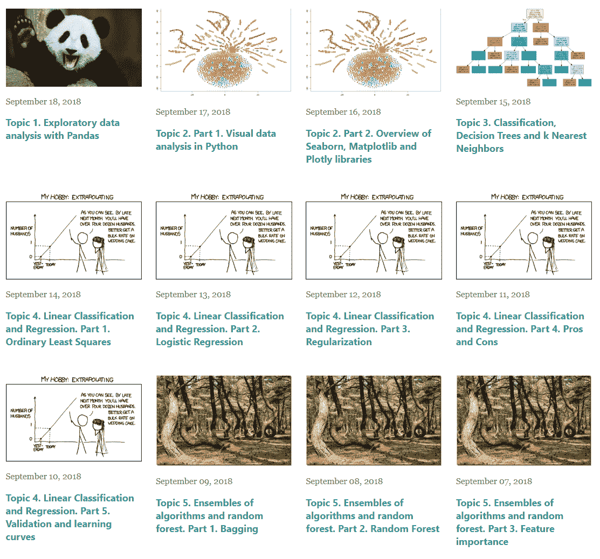

# 我推荐的学习深度学习和机器学习的前 5 个地方

> 原文：<https://medium.datadriveninvestor.com/my-top-5-recommended-places-to-learn-about-deep-learning-and-machine-learning-f95153a847e?source=collection_archive---------3----------------------->

继续我的#100DaysOfMLCode，如果你对学习 ML 和 DL 感兴趣，这些是我正在关注和推荐的一些课程。

Tractica 发布了机器学习(ML)领域最令人震惊的统计数据之一。据该公司称，ML 将从 2016 年的 14 亿美元增长到 2025 年的 598 亿美元。

在不到十年的时间里，这是一个巨大的增长。有趣的是，还没有多少人利用这个市场。事实上，Kaggle 认为[只有 4.5%的自报科学家/数据研究人员](https://www.kaggle.com/surveys/2017)从事与 ML 工程密切相关的工作。

如果这意味着什么的话，那就是市场在现阶段非常宽松。如果你也想进入这个新兴的领域，这里有一些你可能想学习的地方。

# 很快。人工智能

我最喜欢 [Fast 的一点是。AI](http://www.fast.ai/) 是他们如何让他们的机器学习和深度学习课程对所有人免费。很快。AI 提供了一门机器学习课程和两门深度学习课程，在所有这些课程中，他们还确保所有这些课程都没有广告。这给你最好的学习体验，让你集中注意力，甚至不需要你付出一分钱。

在你得出“免费并不总是好的”的结论之前，你可能想看看这个平台(和课程)背后的一个大脑。众所周知，杰瑞米·霍华德是卡格尔团队的一员。相信我，只有几个人能更好地理解曼梯·里。

# 谷歌

谷歌通过其开发者论坛，也开设了一门关于人工智能的课程。被称为谷歌机器学习入门的课程是你在互联网上可以接触到的最广泛的初学者课程之一。

Google 让你免费获得你需要知道的一切，从入门元素到 ML 的嵌入。事实上，他们还提供了一些现实世界中的例子，说明如何应用 ML 来使课程更加实用。

# 深度学习。人工智能

吴恩达博士是人工智能和人工智能领域的又一位权威。他通过[精心制作一门独特的课程](https://www.deeplearning.ai/)来带领感兴趣的学习者熟悉 DL，从而将这种专业知识推向了前台。

他在平台上提供的课程承诺教你人工智能所需的一切——开发算法或建立一家公司。除此之外，课程内容引以为豪的不仅仅是教你如何编写算法，而是让它们发挥作用。

# AI-Siraj Raval 学校

Siraj Raval 在科技领域已经有一段时间了，几乎什么都尝试过。现在，他在 ML 网站上教授一门为期 10 周的强化学习课程(名为“Move 37”)，而且还是免费的。关于他的方法应该注意的一点是，它们可能更适合稍微高级的学习者。

即使初学者也可以学习这些课程，他们也需要该领域的先验知识才能完全理解 Raval 的方法。

# 开放式机器学习课程

OpenDataScience 的[团队让机器学习的概念变得如此可爱和易于理解。](https://mlcourse.ai/)

该课程被组织成一个正规化的准入为基础的计划，使标准更好地到位。他们还通过在每个模块结束时分配作业来平衡理论和实践。

虽然这里的课程对初学者完全友好，但至少在你注册之前，你应该有一些数学和 python 编码的知识。

这是我目前最想学习机器学习的 5 个地方。如果你关心从有经验的提供者那里获得高质量的信息，那就是。这里没有提到任何其他令人惊叹的平台吗？请在评论中与我分享。