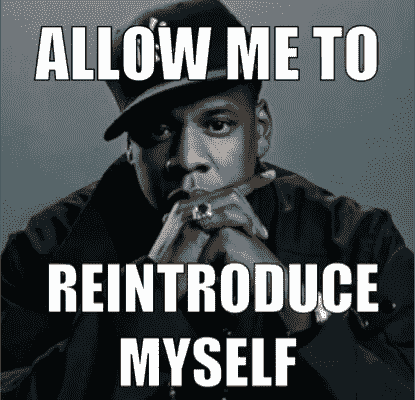

# 我对 2018 年及以后的最佳加密选择

> 原文：<https://medium.datadriveninvestor.com/my-top-crypto-pick-for-2018-and-beyond-51c787e072fe?source=collection_archive---------15----------------------->

“person holding round gold-colored Bitcoin” by [Andre Francois](https://unsplash.com/@silverhousehd?utm_source=medium&utm_medium=referral) on [Unsplash](https://unsplash.com?utm_source=medium&utm_medium=referral)

Crypto 在 2018 年的大部分时间里都相当停滞。2017 年曾经出现的过山车已经成为过去。2018 年出现了更多的政府干预和金融批评，区块链经济的整体状况陷入混乱。我们已经看到许多深刻的金融专家成为区块链运动的主要批评者。比如说…

# 比尔·哈里斯

INTUIT 的首席执行官和 PAYPAL 的联合创始人

*“比特币是骗局。在我看来，这是一个巨大的抽水转储计划，世界从未见过这样的情况……加密货币最适合一种用途:犯罪活动。因为交易可以是匿名的——执法部门无法轻易追踪谁买谁卖——它的使用被非法行为所控制。”*

正如许多人所知，区块链经济中的定价行为被新闻所主导。好消息和坏消息，没有办法回避:加密价格在这个时候是投机性投资。

# 好消息就在这里。

区块链技术有可能改变我们即将到来的未来的经济。大多数投资者需要了解一个基本原则，当谈到区块链投资。

# **多研究，多忍耐**。

如今市场上有成千上万的密码，其中很大一部分是骗局。马上想到 Dogecoin 和 BitConnect。这些是确定的骗局硬币，只要稍微研究一下底层技术、业务用例，并阅读这些硬币的白皮书，几乎所有投资者都可以理解这一点。另一个需要考虑的重要事项是，区块链技术非常新。市场一开始会很不稳定，就像大多数首次公开募股首次在全球证券交易所上市时一样。

随着围绕区块链新闻的所有这些 FUD(恐惧、不确定性、怀疑)，找到具有良好商业实践记录、有能力的团队以及与知名公司合作历史的区块链公司是很重要的。

在 2018 年的剩余时间以及以后，有一枚硬币对我来说非常突出。那枚硬币是简单的代币。对于那些不知道什么是简单令牌的人来说…

*定义直接来自 OST 的白皮书(不属于 21 世纪金融)*

*Simple Token ["OST"]是一种 EIP20 令牌，OpenST 是一种在主流消费应用中支持令牌经济的协议。我们着手解决的业务和技术挑战是，让主流消费应用能够以可扩展和加密可审计的方式，从部署自有品牌的加密支持令牌经济中受益，而无需铸造和维护自己的可公开交易的 EIP20 令牌。OpenST 协议允许在公用事业区块链上创建公用事业令牌，而这些令牌的价值由价值区块链上的加密资产支持。*

其影响是 OST 可以与 ETH 智能合同配对，从而增强技术的力量。通过为其他公司创建品牌和创建自己的令牌创建框架，OST 使区块链的创建过程变得简单(讽刺)。我认为 OST 是区块链创造的建筑公司，该公司将与 ETH 支持的智能合同配对，以确保建造高质量的区块链产品。如果这不是真实世界的价值，那么我不知道什么是。

市值约为 1，700 万美元，每枚硬币 0.04 美元，这个价格也不是天文数字。

关于 Simple Token 值得注意的另一件重要事情是，他们拥有业内最好的团队之一。首席执行官杰森·戈德堡(Jason Goldberg)是该项目的负责人，他在互联网创业方面有超过 18 年的经验，OST 有一个可以走在路上的领导者。

话虽如此，如今市场上有很多有价值的区块链初创公司，但结合现实世界的价值、合理的评估和经验丰富的团队，21 世纪金融将在未来几年寻找 OST。

*更多信息:*

 [## OST |区块链基础设施赋能新经济

### OST 是一个面向拥有数百万用户的企业的公共区块链平台。推出您自己的品牌代币，将您的…

ost.com](https://ost.com/)  [## OST (OST)价格、图表、市值和其他指标| CoinMarketCap

### 获取 OST 价格、图表和其他加密货币信息

coinmarketcap.com](https://coinmarketcap.com/currencies/ost/#tools) 

*   *JP*

*原载于 21stFinance.com*