# 我对 2020 年去中心化金融的五大预测

> 原文：<https://medium.datadriveninvestor.com/my-top-five-decentralized-finance-predictions-for-2020-90015b904b03?source=collection_archive---------4----------------------->

节日快乐，好人！

随着 2020 年悄悄向我们走来，这是预测和预言的季节。这让我意识到，我是多么怀念能够在一个格式良好的 PowerPoint 文档中进行大量的定量分析。我意识到这一点，因为几位区块链行业分析师已经发表了绝对精彩的作品，应该成为你来年的参考。如果你读了除了这份时事通讯之外的任何东西，你一定要读:

1.  [区块链资本 2019 年回顾](https://www.slideshare.net/KinjalShah147/blockchain-capitals-2019-year-in-review)
2.  【2020 年梅萨里研究加密论文
3.  [DappRadar 2019 dapp 行业回顾](https://dappradar.com/blog/dappradar-2019-dapp-industry-review/)

# 分散财务概述

因此，让我们把整个镜头缩小到分散金融。关于金融科技和区块链的重叠有很多要说的，但让我们找到前沿的最边缘，并专注于此。我说的是建立在大型、分布式、开源、可编程基础设施上的金融制造引擎。我说的是全球电子货币，在监管框架之间飞来飞去，找到弱点，在任何人注意到之前建造复杂的大教堂。我说的是系统性风险，以及在谷歌、脸书、蚂蚁金服和苹果肢解银行后，金融服务最有可能的未来。

为了让你跟上进度，这里有一些基础知识。如果你已经知道了基本知识(你这个无政府主义魔鬼！)向下滚动查看下面的预测。

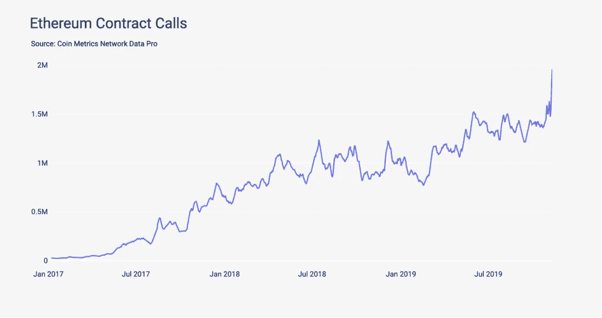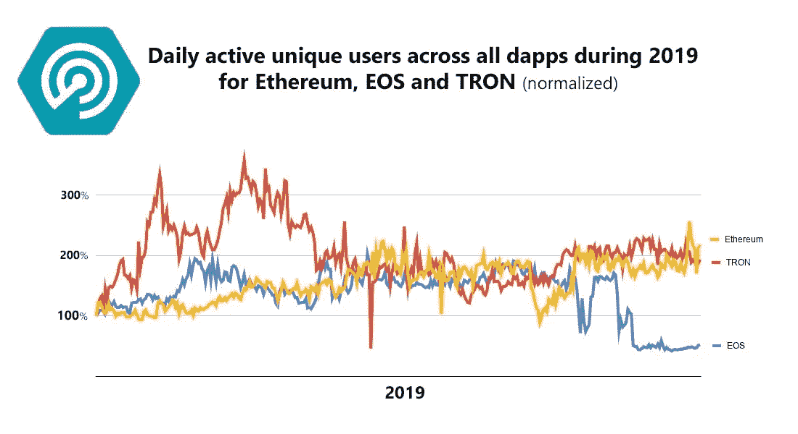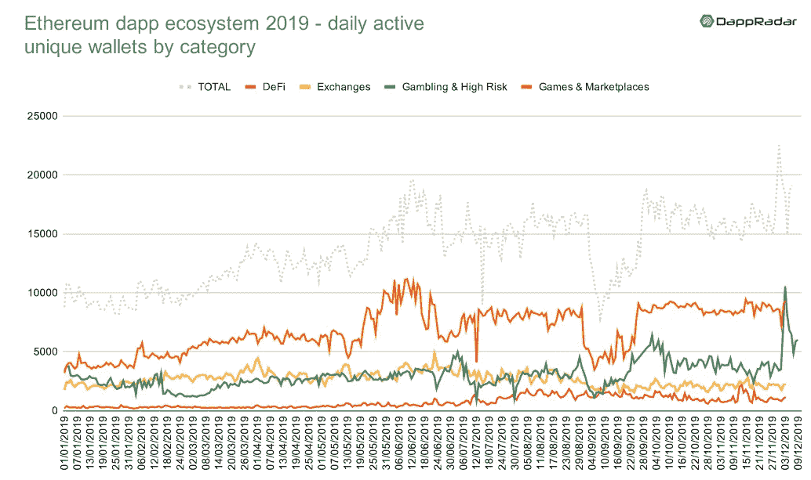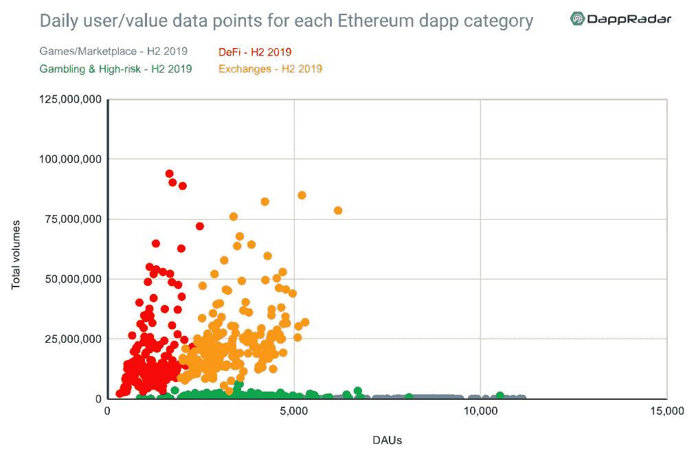

以太坊是去中心化财务软件的[领先平台](https://coinmetrics.substack.com/p/coin-metrics-state-of-the-network-44c)，句号。EOS 和 TRON(两个获得大量资助的竞争对手)是这一细分市场的 Windows phone。如果假定有利的话，这些平台在游戏和博彩业比在真正的金融基础设施上有更好的[。但成为领导者并不意味着庆祝行业的胜利——以太坊的分散式借贷和交易每天有大约 2500 名用户。另一方面，美国只有 8000 名注册财务顾问，对冲基金、私募股权公司和家族理财室就更少了。因此，2500 名用户并不一定很小，只是碰巧这些用户在交易量方面动了真金白银(见上面应用程序中的纵轴)。你可以看出我对这个问题犹豫不决。这里有一个很好的梅萨里的引用来总结它:](https://medium.com/dappradar-com/the-dapp-ecosystem-in-2019-what-just-happened-fca801c8bdc7)

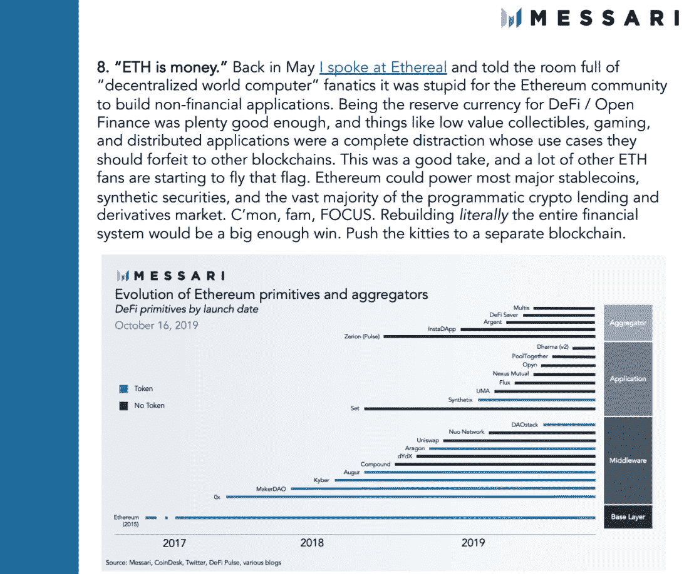

构成上面提到的 DeFi 原语的这些应用程序类别是什么？下面我通过每日独特钱包，一个受欢迎程度的代理人，走过主要的金融协议。第一个用例是分散的交易所——一些直接的点对点交易。API 集成到其他应用程序开始成为采用的杀手级特性。例如，如果你有一个支付应用程序，并且需要交易一项资产，集成 Uniswap 的[是一个快速的解决方案。值得注意的是，交易所在存储数据的位置以及是否/如何形成订单方面确实有所不同。](https://docs.uniswap.io/frontend-integration/connect-to-uniswap)

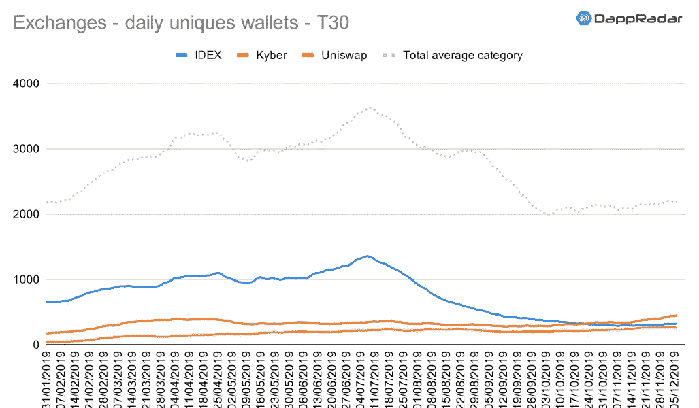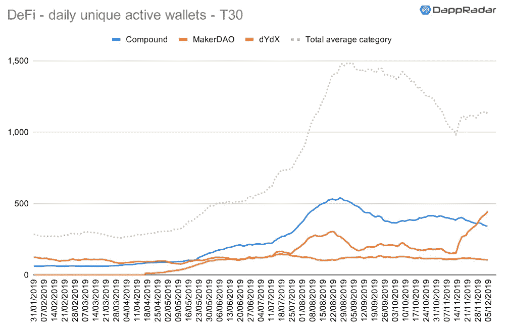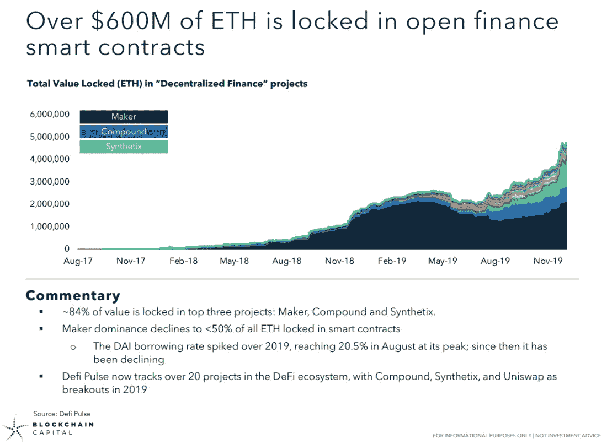

上面的借贷产品有点复杂。在 MakerDAO 的案例中，你将一些乙醚放入一个黑盒子作为抵押，然后得到一笔与美元挂钩的贷款，由这个盒子作为抵押。如果你收回你的以太，你会被收取一个由开放治理社区决定的利率。像 Compound 这样的其他东西本质上是一个证券借贷市场——你可以获得一些市场清算利率，以借出比特币等资产，有人出于交易或对冲目的借入这些资产。拥有加密经济固有的利率非常有帮助，但我们仍然缺乏基于实际承保和链外风险的贷款。

 [## 总部位于瑞士的 ETP 进入加密交易市场|数据驱动的投资者

### 虽然金融市场几乎没有沉闷的时刻，特别是在引入…

www.datadriveninvestor.com](https://www.datadriveninvestor.com/2019/03/10/swiss-based-etp-enters-the-crypto-trading-market/) 

支付也在向以太坊蔓延，你可以从与美元挂钩的稳定货币的增长中看出来。最大的一家，Tether(暂时抛开其不确定的历史)最近将其技术基础设施转移到以太坊，并已经产生了可观的交易价值。根据下面的区块链资本，近 40%的 stablecoin 市场是基于以太坊的系绳，占整体交易价值的 80%。戴是马可道发行的德非土生土长的稳定币，保留的比例很小。我猜想这是因为戴最初只是以乙醚为抵押，而据称有(数十亿美元)现金支持。值得注意的是，戴现在能够接受多种类型的抵押品。

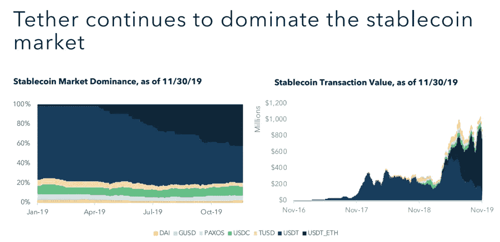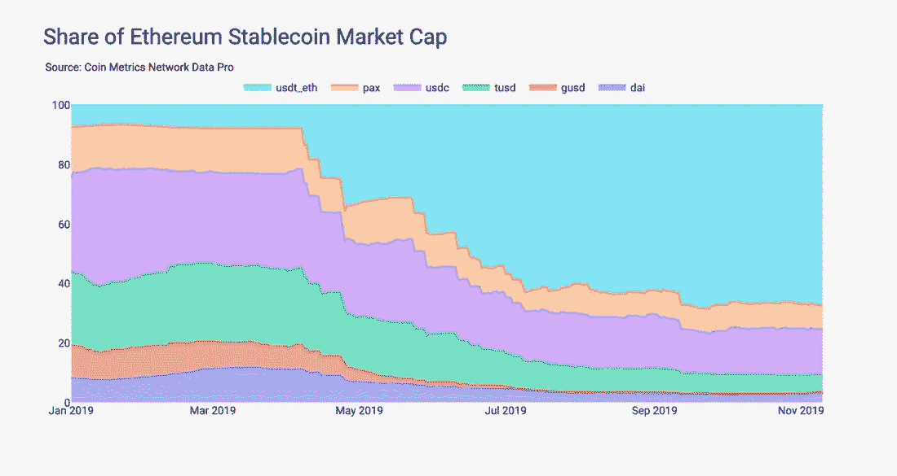

除了核心金融产品，我们还开发了多种服务和特殊资产类别。首先是带交易和再平衡的自动化资产配置——来自 [Set Protocol](http://tokensets.com/) 的财富管理服务。

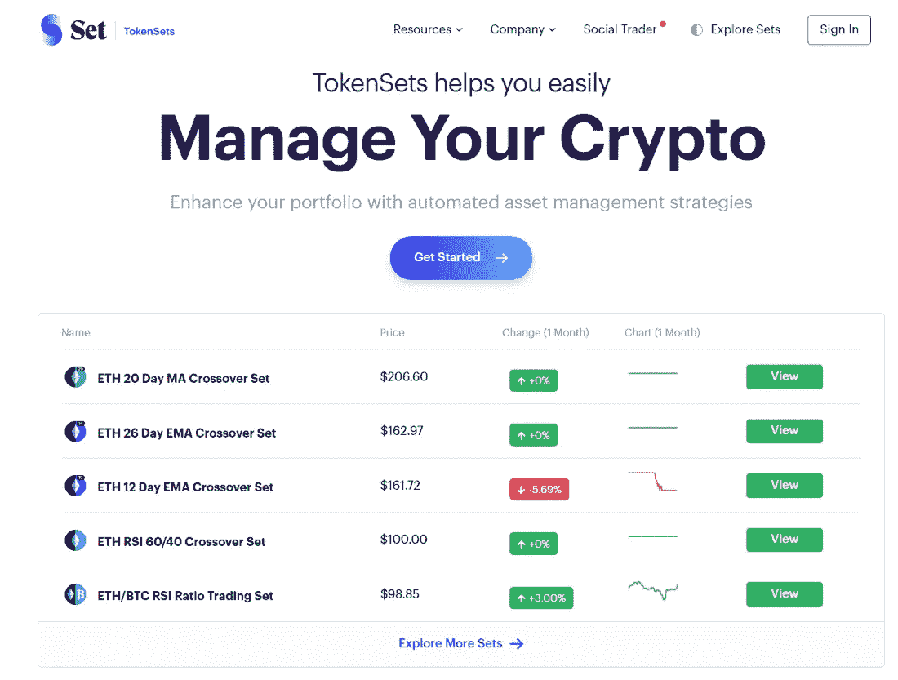

接下来，你可以随意购买由 [Nexus Mutual](https://nexusmutual.io/) 软件中介的保险。

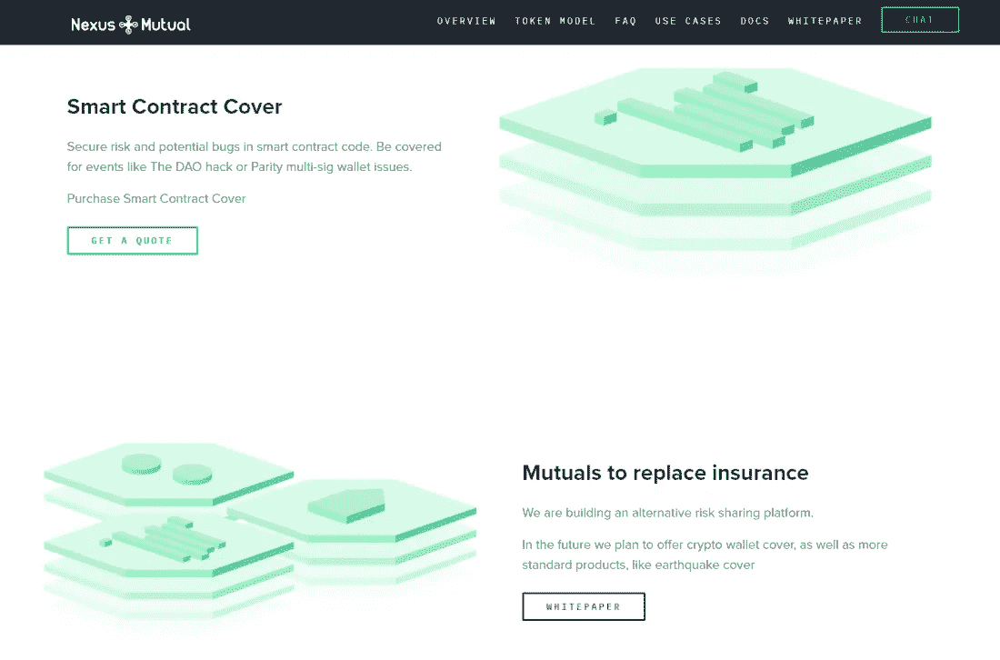

或者，如果你想变得真正复杂，这里有几个项目一直在构建合成资产和衍生品(见 [UMA](https://umaproject.org/) 和 [Synthetix](https://www.synthetix.io/) )。没有什么比古老的金融工程更能撬动一个小市场了！

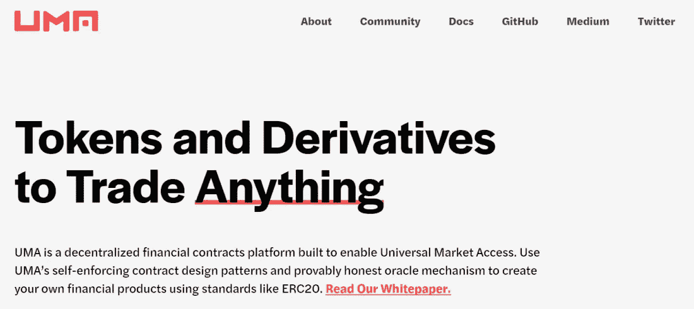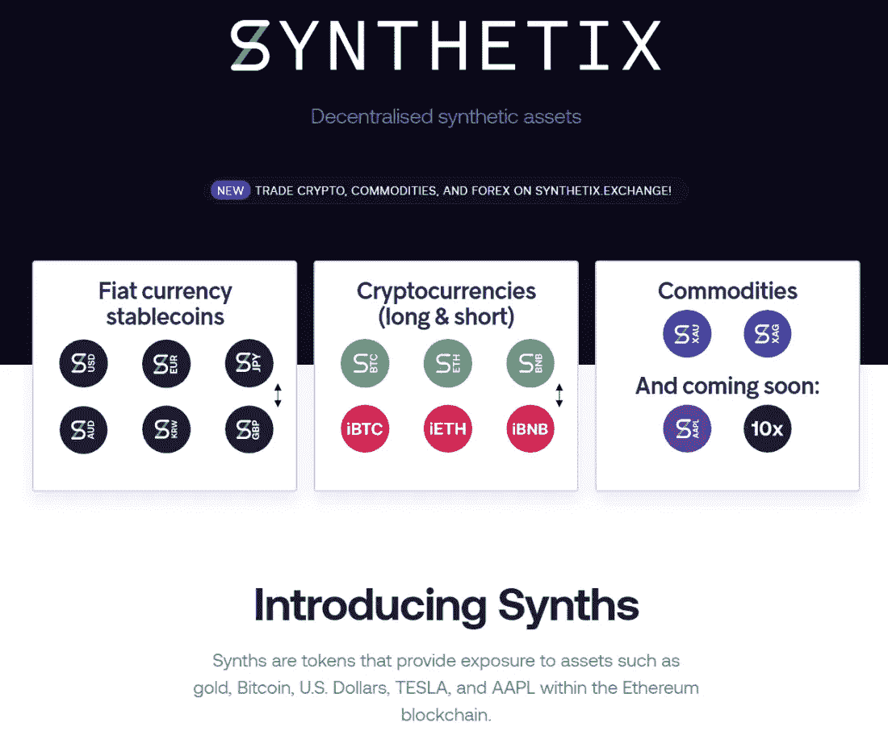

我没有提到“赌注”这个更广泛的概念。这一特性将在未来几年内嵌入以太坊，但已经存在于其他各种区块链协议中。主要的想法是，通过拿出你的一部分钱，作为“股份”，你可以获得一个自然利率和一定程度的治理控制权(即，介于股权投票和股息收益率之间)。这种财务承诺还履行了确保数据链本身的历史准确性的功能，就像耗电的采矿在比特币中的作用一样。一些赌注区块链已经推出，并提供垃圾债券类型的利率。参见[赌注奖励](https://www.stakingrewards.com/)和下图，以及[比特币基地](https://www.coinbase.com/staking)提供该服务的大型金融科技公司的示例。

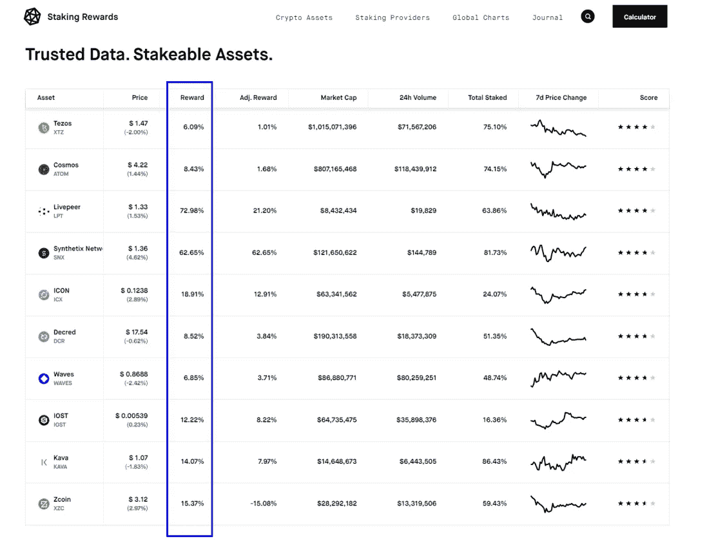

很快，你将能够使用这些不同的服务，从头到尾地完成你的财务生活。一年前，它们是断开连接的，很难使用，除非你喜欢安装浏览器插件和下载奇怪的互联网软件。这一点现在已经不那么真实了。鉴于加密原生金融产品激增，用户聚合应用开始出现。无论领导者是[阿金特](https://apps.apple.com/us/app/argent/id1358741926)、[英斯塔达普](https://instadapp.io/)、[泽里昂](https://zerion.io/)还是其他什么人，以区块链为基础的互联网都将获得更多的资金。这就像看着 Mint.com 在 2007 年崭露头角。

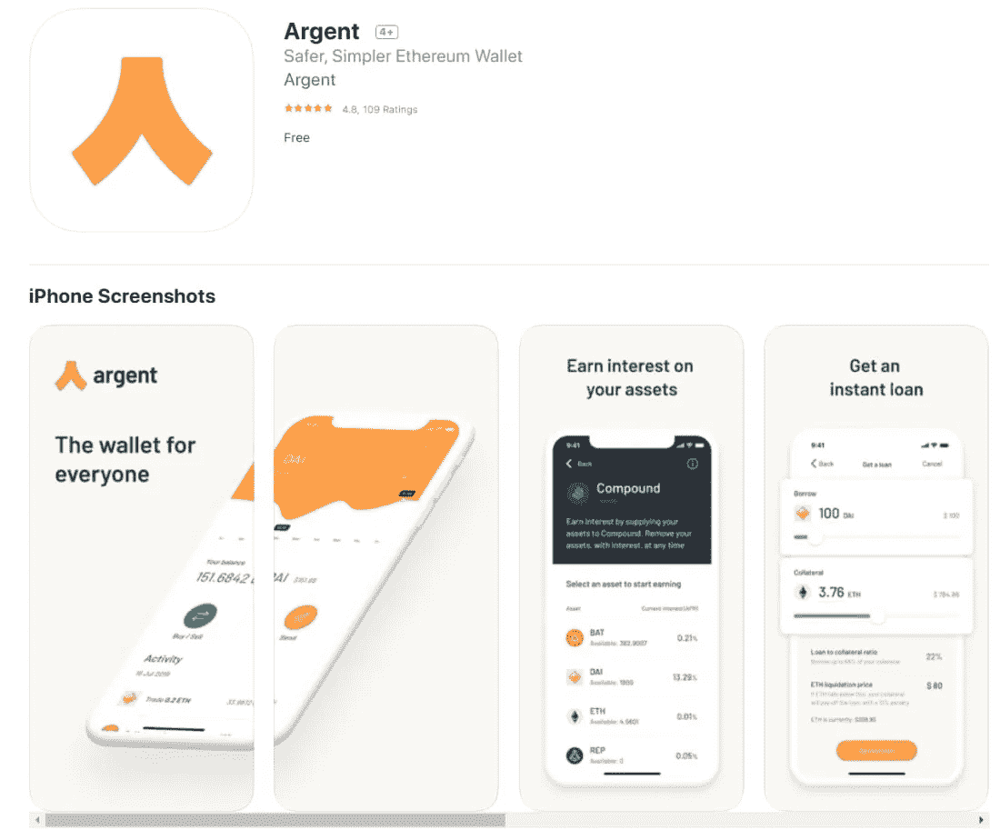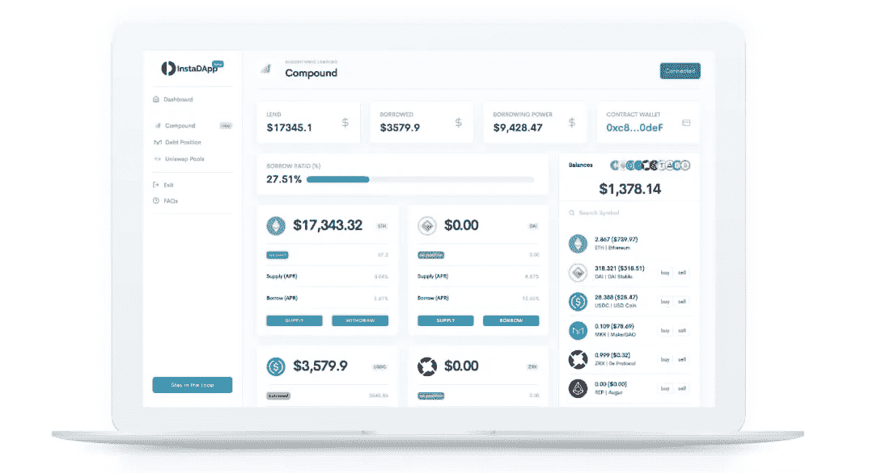

那么未来会是什么样子呢？

# 2025 年 DeFi 的五大预测

**(1)一旦商业模式建立，Robinhood、SoFi、Revolut 和 Square 等全球金融科技冠军将进入并赢得加密竞赛**

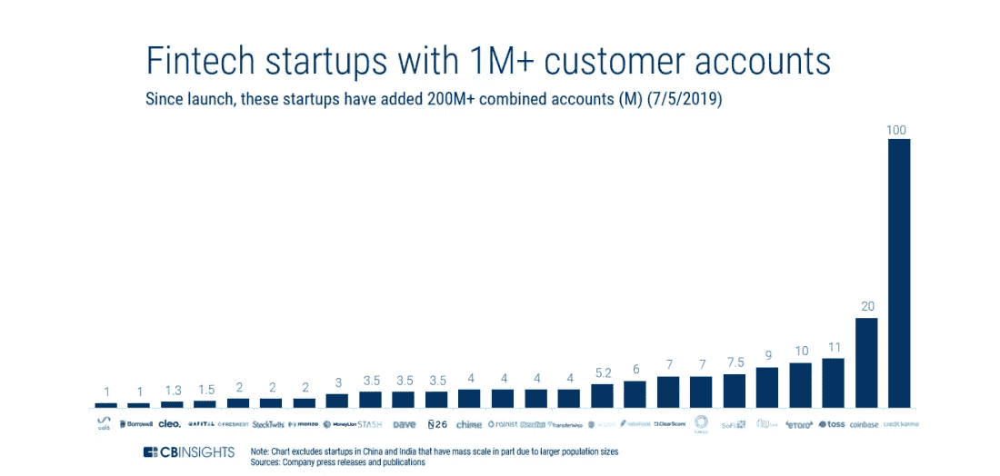

加密聚合器没有明显的赚钱方式。他们可以尝试扩展到数百万用户，然后收取订阅费。但他们错过了传统金融机构用来补贴免费服务的收入流。例如，你可以从 Schwab roboadvisor 获得免费的理财建议，但你将为构成投资组合的 ETF 支付管理费。您还将把您在 Schwab 资金账户中持有的现金的一些利息收入让给 Schwab。嘉信理财持有的一系列许可证和监管实体使其能够经营、代理和管理资产，并收取这些市场费用。

在 DeFi 中，金融制造业的经济状况是极其不确定的——因为它们是开源的，我相信它们将趋向于零。一旦你发明了一个软件，并将其作为开源项目发布，自动化就出现了。这是协议，不是公司。因此，用户聚合器可以被现任者快速复制和吸收。以比特币基地和币安早期的“跑马圈地”竞争为例，这种竞争导致了围绕这些回报的价格战，蚕食了新公司的潜在收入来源。此外，实际接触客户资金会立即使这些应用程序成为受监管的托管人或汇款人或财务顾问，这意味着很大的合规成本，但收益甚微。

另一方面，已经有半打移动应用——都是金融科技的独角兽——拥有许可证和数百万用户。如今，Square、Robinhood、Revolut 和其他一些公司都提供加密交易。这最有可能通过机构的集中式加密交换中的综合账户来实现。如果 DeFi 项目的字母汤变得足够吸引那些移动应用的用户，他们将积极地进行功能竞争。我还认为，消费者金融科技甚至会在与企业区块链的竞争中胜出，如高盛、摩根大通和桑坦德银行。如果你从软银筹集资金，你必须承担很大的风险，而银行将需要另外 5 年来触及真正的赤字。

**(2)风险管理和监管透明度在 DeFi 中至关重要，因为杠杆和系统相关性威胁着生态系统**

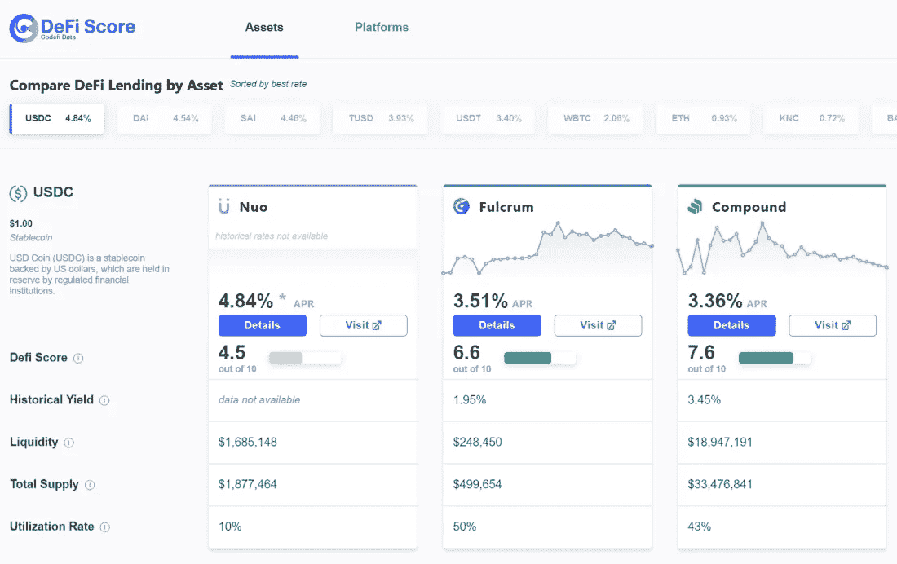

这个空间很大程度上是自我参照和递归的。如果它被一些强有力的基本活动所锚定，那就很好。想象一下监狱的香烟经济。或者更少争议的是，想象一下登上月球，建立一个殖民地，开发一种基于月球岩石的新货币。创造基于月球岩石的合成衍生品是好的，只要人们做些事情来赚取这些月球岩石。如果他们只是在为借款创造市场，然后从贷款中获取利息，并以此作为更多借款的抵押品，那么，我们知道 2008 年是什么样子。为了更好地了解这个俄罗斯娃娃问题，看看[挑衅](https://thedefiant.substack.com/p/are-defis-money-legos-creating-systemic)。

例如，如果像 Maker(选择您最喜欢的一个)这样的核心协议爆炸了怎么办？这可能吗？crypto 2016 年在风险投资(DAO)方面的尝试在一次壮观的黑客攻击中失败，导致了一场存在危机，成本[5 亿美元](https://coinmarketcap.com/currencies/ethereum-classic/)和[SEC 警告](https://www.sec.gov/news/press-release/2017-131)。crypto 2017 年在投资银行(ICOs)的金融尝试导致了长达一年半的泡沫，随后数千种资产的价格下跌了 90%，结果抹去了 5000 亿美元的市值。crypto 2019 年在银行和贷款方面的尝试肯定会遇到一些问题，特别是考虑到这些协议的软件集成和用户集中。

总的来说，我发现这种破坏令人鼓舞——每一次，这个行业都做得更好一点。更多的工具被创造出来。形成疤痕组织。吸取教训。为此，愚蠢错误的唯一解药是透明度和数据。当着眼于高收益的未来科技投资时，也许要考虑风险而不仅仅是回报！当考虑去中心化软件时，这种风险会以什么形式出现？你的对手是谁？这个系统是什么样子的？我们在 ConsenSys 一直在深入研究这个问题——参见 [DeFi Score initiative](https://app.defiscore.io/assets/usdc) 。当然，随着这个领域变得越来越受欢迎，监管者也会问同样的问题。提供良好答案的数据和分析服务将经受住这场风暴。

**(3)分散金融软件将由中央银行和政府复制并在全国推出**

要么这太明显了，要么我完全疯了。几乎地球上的每个国家都在试图理解推出央行数字货币(CBDC)意味着什么。2019 年的两个症状导致了这种热潮——脸书的天秤座和中国的数字元。这些举措都不是真正的加密货币，因为它们既不是不可信的，也不是未经许可的。但两者都受到比特币的启发和推动。其结果是，瑞典聘请了[埃森哲公司创建电子克朗试点](https://www.coindesk.com/accenture-picked-to-build-swedens-e-krona-digital-currency-pilot)，欧洲中央银行[正在探索 CBDC](https://www.ledgerinsights.com/digital-euro-central-bank-digital-currency-cbdc/) ，无数其他会议正在闭门举行以制定应对措施。

也就是说，当我想到政府支持的金融基础设施时，我会想到美国的自动清算所、英国的更快支付计划(Faster Payments initiative)以及整个欧洲对开放银行 API 的 PSD2 监管。类似地，国家监管通常要求学生通过公私实体贷款，提供社会保障或养老金，以及某种形式的医疗保险。也就是说，政府肯定是在经营跨资产类别的公共金融基础设施。如果比特币转变为 CBDCs，或许 DeFi 可以取代公共服务。

想象一下房利美作为一个智能合同运行——由美国政府操作，或者审计和控制。它可以将来自制造商的抵押属性与第三方包销商的服务结合起来。这可能是整个过程外部的“oracle”承保人，或者是经过培训以评估属性的嵌入式机器学习算法。或者，想象一个智能合同，以税收优惠的方式分配退休收入，类似于[施瓦布老一代的 roboadvisor】。然而，这个软件是由劳工部建立和审计的。这样一个版本的世界预示着大量加密资产的采用。它还假设 DeFi 的理念与国家利益有重叠——我认为为了帮助最需要的人，我们必须解决这个问题。](https://riabiz.com/a/2019/12/20/schwab-set-to-launch-shoe-that-dropped-subscription-retirement-income-robot-that-acts-like-a-virtual-annuity-and-produces-predictable-check)

**(4)现实世界的资产将通过赌注激励被吸收到 DeFi Borg 立方体中，这将是太空的一大胜利**

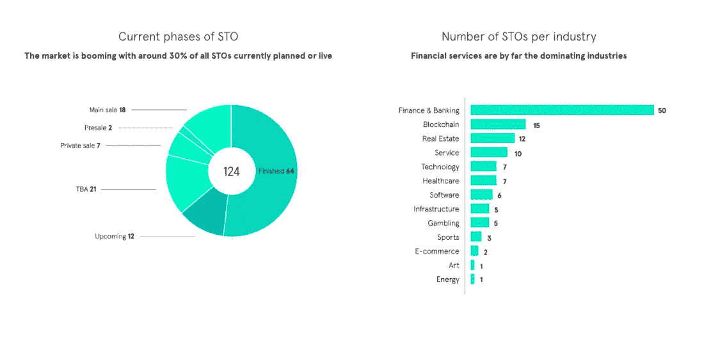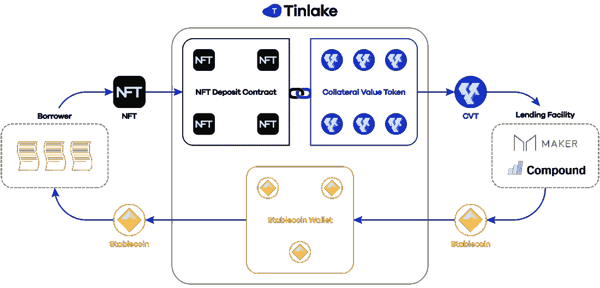

听着，我知道你对企业区块链和安全令牌产品感到厌烦。两者都没有产生许多人所希望的短期影响，而且给人的印象是，金融机构仍在袖手旁观。虽然桑坦德银行在以太坊主网上发行债券是事实，但 komgo 和 Vakt 等供应链财团正在大规模移动贸易，中国科技公司正在跨大地域安装区块链发票 **—** 这些发展并没有激发大众的想象力。同样，STO 和 IEO 的销量[未能赶上 ICO 周期](https://medium.com/blockstate-finance/the-global-sto-study-2019-c9e93c66252d)的大肆宣传。然而，这是经济采纳之旅中必不可少的一步。

我将提出两个项目。第一个是[图](https://www.ledgerinsights.com/blockchain-fintech-figure-raises-100-million/)，这是一个房屋净值贷款平台，在专有的区块链上记录和管理其贷款。Figure 已经筹集了超过 1 亿美元，由 SoFi 的创始人运营，并迅速将区块链变成了一个特色，而不是主菜。第二个是来自离心机的[丁莱克。现在，这家制造商不仅仅接受乙醚作为抵押品，离心机正致力于将其他金融产品作为与美元挂钩的稳定货币发行的抵押品。这些东西可以是任何东西，从发票到房子——只要把它们放进一个加密箱就行了。](https://medium.com/centrifuge/tinlake-bringing-individual-non-fungible-assets-to-defi-f5ff0c77cadd)

我可以想象在一个世界里，赌注是去中心化网络上利率的主要来源。当你的钱闲置时，你就把它用于为每个人的金融基础设施创造网络安全，并获得利息。这可能是一个更大的利息收入来源，因为它可以吸收更多的资金用于生产性活动，而不是(1)一个治理机构设定发行债务的利率，或(2)一个借入资产进行交易的市场利率。为了达到这种兴趣，你可能想投入传统资产，从你的经纪投资组合，到你的房屋净值，甚至只是一个还款承诺。这座桥可能是由 DeFi 企业家建造的。或者，它可能只是由金融机构建立起来的，就像图中那样。全球无违约风险利率的不利之处在于，它是对那些不知道它存在的人的征税。当其他人都参与进来，而你没有，它会通过通货膨胀侵蚀你的购买力[。听起来熟悉吗？](https://howmuch.net/articles/rise-and-fall-dollar)

**(5)不要做空比特币，尽量把它的价值拉到 DeFi 机器里。**

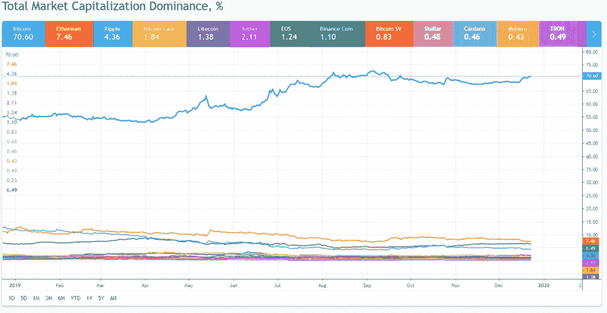

这张图表说明了一切——比特币仍然是最具系统相关性的加密资产。DeFi 越能想出如何将比特币拉入以太坊，对所有人来说，水就涨得越高。

**说够了！节日快乐，感谢阅读。**

# 想要更多吗？

*   通过订阅此处，直接在您的收件箱中获取此文章[。](https://lex.substack.com/)
*   在 Twitter 上找到我[这里是金融科技](https://twitter.com/lexsokolin)和[这里是数字艺术](https://twitter.com/uaesthete)。
*   你可以在 ConsenSys Codefi 上下载一些软件，看看它们是如何为数字资产、区块链金融企业、分散化金融还是加密支付提供支持的。
*   想给我寄张便条吗？[随时联系](https://www.lexsokolin.com/contact)。