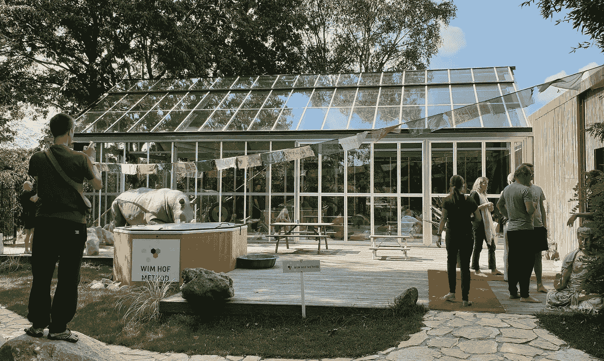
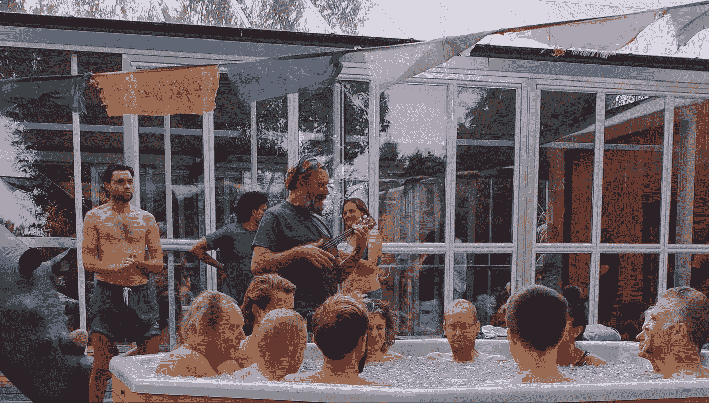
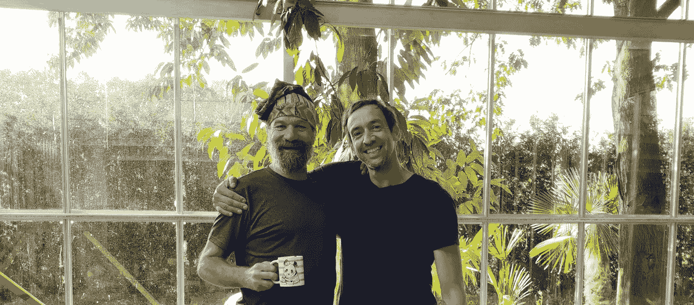

# 我和维姆·霍夫的周末

> 原文：<https://medium.datadriveninvestor.com/my-weekend-with-wim-hof-d801ebfcc1e?source=collection_archive---------10----------------------->

与此同时，传奇人物****的家中，一名教练的 t 恤上写着这样的口号。但主要角色是冰人自己。整整两天，他热情地邀请了一群不同的与会者。瑞典人、澳大利亚人、英国人、墨西哥人、葡萄牙人、美国人，当然还有荷兰人和一些比利时人，我就是其中之一。****

**正是对最佳健康、个人成长和有意识生活的迷恋，把我们所有人带到了维姆居住的荷兰村庄斯特罗。我们一起聆听了“踢当权派的小腿，热爱每一分钟”的反领袖维姆·霍夫的第一手哲学。题目？呼吸、冷疗和意愿的力量如何能根除感染和疼痛，并在一个动作中扩展你的意识。**

# **一个执行任务的冰人**

**40 多年来，维姆·霍夫一直在尝试呼吸和冷疗。这些年来，他不仅引起了媒体的兴趣，也引起了医学界的兴趣。后者被他一次又一次的“超人”成就所迷惑。在北极赤脚跑马拉松，穿着游泳短裤攀登珠穆朗玛峰，在极地冰层下游泳 66 米……维姆的生理似乎没有受到影响。而任何普通人的器官在这些努力的早期就会停止运作。**

**每次维姆在医院的研究部门展示他非凡的技能时，著名的医生都会检查他们的 fMRI 扫描仪和其他设备。仅仅通过控制他的思想，维姆就能够影响他自己的血液水平并调节他的体温。教授、医生和科研人员感到困惑。但是维姆说，每个人都可以学习如何做到这一点。**

**“是时候进行范式转变了。宗教和传统(制药)医学曾有过机会。“我们需要的一切都已经存在了，”维姆开始说道:“寒冷存在于自然界，我们都有呼吸。”Wim 希望改变世界，引领科学研究以自然的方式治愈人类和世界的一系列问题。想想风湿病等慢性炎症，还有疼痛、抑郁和更强意识的治疗。**

****

# **超越时空的呼吸**

**早上我们听维姆的故事。他讲述了他是如何发明了维姆·霍夫方法并颠覆了医学界。我们从呼吸练习开始。持续的呼吸，深深的吸气，深深的呼气。闭上眼睛，躺在充满自然光的彩色房间的瑜伽垫上。维姆的大嗓门定下了节奏。在他的喊叫声中，他提醒我们在更大的故事中所扮演的角色:我们正在为一项科学研究协议的准备做出贡献。我们都是试验品，微笑着做志愿者。我们总共呼吸将近一个小时，直到我们的血液被充分碱化。

在第五个呼吸环节结束时，有最后一次深呼吸的进出。我们再一次屏住呼吸。毫不夸张地说，紧张局势加剧了。维姆敲了一下巨大的铜锣，声嘶力竭地喊道:“控制局面！”我们将所有积聚的能量通过大脑，完全放松我们的身体。一种非常高频率的强烈振动占据了我的身体。在我的头脑中，我发现自己处于光和能量的辐射源中。我的脸似乎被困在一个巨大的微笑中。我就那样躺了几分钟。极乐，没有其他方式可以形容。“靠你自己的供给获得快感”，我明白了！如果你正确地练习，所有的时间和空间感都会消失。“在你身体的每个细胞中都有一个宇宙，你可以成为一名时间旅行者”，维姆说。我已经被说服了。**

# **全心投入到冰浴中**

**下午休息后冰浴在等着我们。我不太喜欢冷水。除了在夏天喝凉水，我更喜欢避免喝凉水。当我去公共游泳池游泳时，我已经觉得水太冷了，即使我一直在动。“面对寒冷就像面对任何随机的压力。你可以把它变成一次真正愉快的经历，”维姆告诉我们。这里有三个要素起着关键作用:呼吸，排除外界，意图的力量。呼吸并向内聚焦，而不是你周围正在发生的事情。检查！"**

**然后就是意向。“在你的意图中，你已经可以先睹为快，看看寒冷会对你造成什么影响，你会有什么反应。通过内化这种情景，你可以克服对寒冷的恐惧。此时此刻，你完全展现出你最好的一面。寒冷是一个很好的老师”，维姆继续说道。“如果你不专注，你就会吃亏。但如果你全神贯注地投入进去，欣快将等待着你。”威姆从 17 岁开始就一直在做冷的实验。他知道自己在说什么。**

****

# **转移边界和转型**

**十二人一组，我们进入冰浴，只有我们的头伸出冰块。我们坐直，手放在大腿上。温度:2°C(36°F)时间:3 分钟。我闭上眼睛，专注于缓慢深呼吸。起作用了！每个人都成功了，毫无疑问。边界已经改变，这一点很明显。那也适用于我。把我的冷厌恶记在心里，我从来没有想过我能做到这一点。**

**"维姆强调，你甚至可以走得更远. "进入潜意识。像这样的练习会立即产生一种新的思维模式:我能。去吧。这个！掌控你自己的思想。你不需要用意念去搬石头。抬起你自己。开心点！当你唤醒你的头脑时，你唤醒了内在的神经病学。“团队中的气氛既轻松又愉快。**

# **将边界移动得更远**

**第二天，维姆告诉我们其他层次的感官观察:[超感知觉](https://en.wikipedia.org/wiki/Extrasensory_perception)、[本体感受](https://en.wikipedia.org/wiki/Proprioception)和[内感知觉](https://en.wikipedia.org/wiki/Interoception)。我以前从未听说过这些术语，但我怀着极大的好奇心接受了它们。维姆继续讲述呼吸如何改变品牌和心灵的化学反应。只要在那里，相信你的心。不需要思考。这就是你如何超越恐惧，实现真正的成长。维姆指出:“开玩笑地对待它，相信你需要的一切都已经准备好了。”。他势如破竹，宣布在今天的呼吸训练后，他有信心这个团队能够坚持下去，甚至享受六分钟的冰浴。**

**这个小组已经准备好迎接挑战了。“跟随你的直觉”，维姆建议。阳光灿烂，每个人都在保持状态，对我们自己的供应有点高。六分钟…不用想。我们在边缘摆动双腿，坐在冰冷的水中，开始呼吸。我在寻找一个能让我享受这种体验的点。与此同时，维姆一边弹着尤克里里，一边唱着欢快的歌曲。我们十二个人都在水里，脸上带着灿烂的笑容。六分钟以惊人的速度过去了。再一次，边界发生了变化，这是任何人，尤其是我，都无法想象的。**

****

# **日常生活中的有意识融合**

**与 Wim 共度的这个周末对所有参与者来说都是一次真正的转型体验，因为它触及了我们的本质，改变了我们。至少这是我从后来讲述的所有故事中可以编造出来的。下一步其实就是用这段经历做点什么。例如，每天洗冷水澡。如果你不像我一样是一个冷水迷，你可以从温水开始，最后加入冷水，直到你能够在它下面站一分钟或更长时间。就我而言，我已经开始了，而且效果显而易见:我以更多的精力和注意力开始了我的一天。**

**尝试呼吸练习，亲身体验它如何改变你的身体和心灵。我每天早上冥想 20 分钟左右，然后在此之前或之后锻炼。但是自从周末和 Wim 在一起后，我很高兴地抽出一些时间来进行这种日常的能量提升。在维姆·霍夫方法的网站上，你可以报名参加[免费迷你课程](https://www.wimhofmethod.com/free-mini-class)来了解寒冷适应、呼吸和意图的自然力量。尝试一下，像世界上成千上万的其他人一样，体验你如何以一种自然的方式，从你自己的力量中，控制你的身体和思想。**