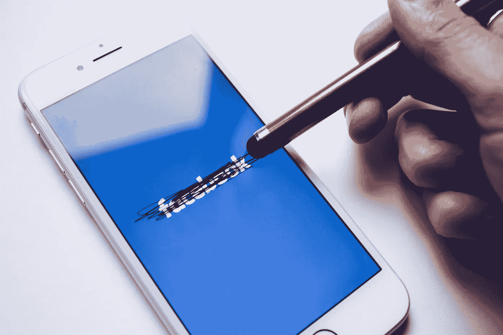

# 我远离脸书和 Instagram 一年多了，这就是我学到的。

> 原文：<https://medium.datadriveninvestor.com/my-year-without-instagram-and-facebook-29c4648aa40a?source=collection_archive---------6----------------------->

Image courtesy: Unsplash

如果你和我一样是千禧一代，你可能也想知道我应该什么时候离开这个背着这么久的背包。我知道，你也知道；我们都是假装的。它真的很空洞，吸走了我们所有的创意，但这是一个难以接受的事实。我们已经把它变成了一种习惯，那就是“假装直到我们成功”

不仅如此，它占用了我们大量的时间。只是通过一个 app 才发现，我太消耗这些平台了，他们一周差不多要花 21 个小时(我一周睡 49 个小时)。你可以用任何简单的应用程序计算你的时间，你也会知道我们有多少宝贵的时间被消耗在那些被研究人员称为“无限池”的“无限池”中。

就像暴饮暴食和狂看电视一样，*暴饮暴食也已经成为我们生活方式的一部分，即使这真的很剥夺，我们也觉得完全正常。*

*我深入研究了为什么我们如此痴迷于这些特定的社交媒体平台，我发现了令人难以置信的见解。我发现它们对我们来说也是一种逃避。每当你感到脆弱、焦虑的时候，你会立刻变得焦躁不安，这正是这些特殊平台发挥作用的地方。为了让自己忘记烦恼，现在*的痛苦*。*

*为了摆脱这种负担，真正腾出时间做最重要的事情，我从 Instagram 和脸书上下来，计算我能为其他重要的事情腾出多少时间。*

*以下是我离开脸书和 Instagram 时能做的一些令人惊奇的事情*

***1。培养新的阅读习惯。***

*当我没有登录我的社交媒体账户时，我想如果我能把时间花在阅读上而不是向下滚动会很好。所以我开始读我一直想读的文章。*

***2。做笔记。***

*我喜欢的一点是，当我什么都不做的时候，我可以记下我观察到的东西。我能够观察到很多平常从不关心的小事。这让我更加意识到我的存在。*

***3。与和我在一起的人交流。***

*当你把头离开手机屏幕的时候，你就可以和外面的人联系了。在很多情况下，当我不看屏幕的时候，我能够交到朋友。*

***4。寻找替代品。***

*我们都出于这样或那样的目的需要社交媒体，而在脸书和 Instagram 之外，我发现了一种全新的社交媒体范式，LinkedIn，它让我熟悉了专业的社交媒体，这是一种与后者完全不同的媒体，你可以从中受益匪浅。我能够联系到一些有影响力的人，他们可以帮助我找到工作，甚至更多。与其他替代方案不同，这种方案更有成效。*

***5。练习意志力。***

*这个实验让我锻炼了我的意志，锻炼了我选择或不选择特定社交媒体的意志。起初，正如我提到的，这对我来说很难，但实践我的选择意志对我是谁产生了重大影响。我实际上控制着我想做的事情和我不想做的事情。*

***6。安抚我的焦虑。***

*在某种程度上，我们都归结于自己的脆弱，我们对自己感到焦虑，但今年我决定，不管有多难，我都要面对它，我要面对我内心的焦虑。今天，每当我焦虑时，我可以简单地肯定自己，我发现自己意识到了这一点。
但是**如何让自己远离这些极易上瘾的无限泳池？***

# *我是这样做的:*

*头脑有一种被你想要摆脱的东西卡住的倾向，也就是说，你越抗拒，它们就越顽固。所以，我试着抵制诱惑，这是一个强有力的行动，实际上抵制诱惑。我一直在寻找与他们联系的方法，但是我一遍又一遍地关注自己。然后我承诺一周时间远离这两个平台。令我惊讶的是，它成功了。然后我把这个方法延伸了一个多月。*

*这些是我在那段时间渴望的诚实的自白。有时候，我只想打开并滚动一小会儿，但我再次停下来，思考我从它们那里获得的价值，这让我放松了一些。*

*此后两个月，我完全从我的思想中解放出来，而不是从那些特定的平台中。我已经失去了登录这些账户的诱惑。我没有足够的动力去偷看它们。这给我上了最重要的一课:这些瘾持续下去只是时间问题。如果你想戒掉它们，你有可能做到。*

# *以下是我从这个实验中学到的:*

***1。没有不好的 app，只有不好的习惯。***

*我开始意识到，任何社交媒体都没有什么不好，因为它们都服务于某种目的。事实上，社交媒体在某些情况下相当有用。但我发现我有问题，我对这些特定平台的看法有问题。习惯，我们不断地轻推他们的习惯是不好的。有效利用，你一定能从中获益。*

***2。寻找某种无限的水池是正常的。***

*作为人类，我们都以这样或那样的方式坐立不安，我们大多数人出于同样的目的使用社交媒体。我们只是想远离现实，这样我们就可以忘记自己。所以，这不是一个因使用社交媒体而感到内疚的问题。更重要的是你如何使用它，而不是你为什么使用它。*

***3。除了向下滚动，还有太多的东西需要探索。***

*只有当你抬起头时，你才能真正看到并感受到有多少东西需要探索，就像我离开 Instagram 和脸书后，我才开始了解 LinkedIn 及其对我职业生涯的好处。*

***4。戒掉任何瘾都是有可能的。***

*我现在 101%确定的一件事是，你可以摆脱任何上瘾，只需要一点时间练习和承诺，你就可以摆脱任何东西。*

***5。时间远比什么都宝贵。***

*其中最重要的一课是发现时间是你拥有的最有价值的资产；这是一种资产，如果以正确的方式投资，可以收获许多果实。*

# *结束语*

*我不知道我是否会再次回到这些平台，但我确信我可以选择是否要这样做。大多数人可能认为你可能会与你所爱的人失去联系，但可悲的是，不，这是另一个借口，让你在那里多呆一会儿，或者永远。在这个高度互联的世界，你总能找到人。总之，如果你愿意，你可以成为这些平台的主人而不是奴隶。*

*既然你来了，能帮我个忙吗？我全心全意地写作，很想知道你对这篇文章的感受。所以，请喜欢，评论和分享你的想法，让我知道我做得怎么样。[*E-mail*](http://Kartikayshastri@gmail.com)*me，关注我上*[*Twitter*](https://twitter.com/kartikayshastri)*或*[*LinkedIn*](https://www.linkedin.com/in/kartikayshastri/)*。**