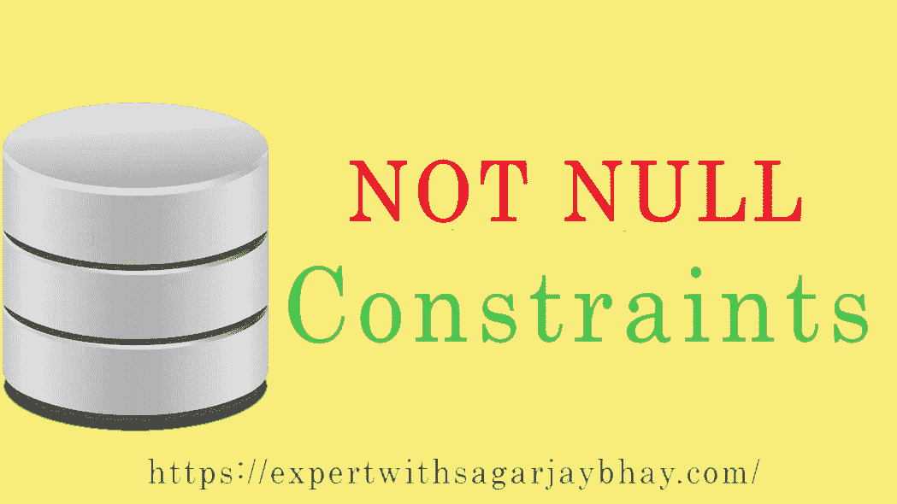

# MySQL 约束—非空

> 原文：<https://medium.datadriveninvestor.com/mysql-constraint-not-null-fe7cac88ddcf?source=collection_archive---------6----------------------->

C#基础教程点击:[https://www.udemy.com/learn-csharp-with-sagar-jaybhay/](https://www.udemy.com/learn-csharp-with-sagar-jaybhay/ )

Web API 2-。Net Core In depth In 5 Hours 点击:[https://www . udemy . com/we b-API-2-net-Core-In-depth-hrs-with-Sagar-jaybhay/](https://www.udemy.com/web-api-2-net-core-in-depth-in-5-hrs-with-sagar-jaybhay/)

大家好，在上一篇文章中我们学习了 MySQL 约束，在这篇文章中我们将通过例子学习 NOT NULL 约束。我们走吧。

MongoDB with。Net 核心课程链接= >【https://www.udemy.com/mongodb-with-net-core-sagar-jaybhay/ 

什么不是空约束？

MySQL NOT NULL 约束表中的列不允许存储空值，默认情况下，列可以保存空值。

以下是具有 NOT NULL 约束条件**语法**的 CREATE TABLE 语句:

创建表 table_name(

column1_name 数据类型()不为空，

column2_name 数据类型()不为空

);

C#基础教程点击:[https://www.udemy.com/learn-csharp-with-sagar-jaybhay/](https://www.udemy.com/learn-csharp-with-sagar-jaybhay/ )

Web API 2-。Net Core In depth In 5 Hours 点击:[https://www . udemy . com/we b-API-2-net-Core-In-depth-hrs-with-Sagar-jaybhay/](https://www.udemy.com/web-api-2-net-core-in-depth-in-5-hrs-with-sagar-jaybhay/)

**具有非空约束的 CREATE TABLE 语句示例**:

因此，我们将在这里用 CREATE TABLE 语句创建 Employee 表

创建员工表(

EID INT 不为空，

First_Name VARCHAR (255)不为空，

姓氏 VARCHAR (255)不为空，

地址 VARCHAR (255)，

主键(EID)

);

MongoDB with。Net 核心课程链接= >[https://www.udemy.com/mongodb-with-net-core-sagar-jaybhay/](https://www.udemy.com/mongodb-with-net-core-sagar-jaybhay/)

当已经使用 **ALTER TABLE** 语句创建了表时，可以创建 NOT NULL 约束。下面是语法和示例:

**使用 ALTER TABLE 语句创建 NOT NULL 约束的语法**:

更改表表名

MODIFY column_name 数据类型()不为 NULL

C#基础教程点击:[https://www.udemy.com/learn-csharp-with-sagar-jaybhay/](https://www.udemy.com/learn-csharp-with-sagar-jaybhay/ )

Web API 2-。Net Core In depth In 5 Hours 点击:[https://www . udemy . com/we b-API-2-net-Core-In-depth-hrs-with-Sagar-jaybhay/](https://www.udemy.com/web-api-2-net-core-in-depth-in-5-hrs-with-sagar-jaybhay/)

**使用 ALTER TABLE 语句在 Employee 表上创建 NOT NULL 约束的示例**:

我们已经创建了具有非空约束的 employee 表，现在我们想在 Address 列上添加非空约束。

更改员工表

修改地址 VARCHAR (255)不为空；

现在，在地址列上添加了 NOT NULL 约束。

MongoDB with。Net 核心课程链接= >【https://www.udemy.com/mongodb-with-net-core-sagar-jaybhay/ 