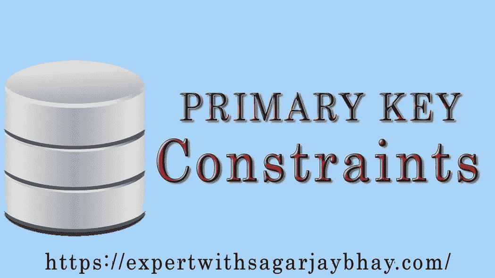

# MySQL 约束—主键

> 原文：<https://medium.datadriveninvestor.com/mysql-constraint-primary-key-a04d1ac9badb?source=collection_archive---------11----------------------->

C#基础教程点击[https://www.udemy.com/learn-csharp-with-sagar-jaybhay/](https://www.udemy.com/learn-csharp-with-sagar-jaybhay/ )

Web API 2-。net Core In 5 小时深度点击:[https://www . udemy . com/we b-API-2-net-Core-In-depth-5-hrs-with-Sagar-jaybhay/](https://www.udemy.com/web-api-2-net-core-in-depth-in-5-hrs-with-sagar-jaybhay/)

 [## 雅虎财经 API 的 6 个替代方案——数据驱动投资者

### 雅虎财务 API 是新的财务 API 万岁！雅虎财务 API 长期以来一直是许多公司的可靠工具。

www.datadriveninvestor.com](https://www.datadriveninvestor.com/2019/02/25/6-alternatives-to-the-yahoo-finance-api/) 

大家好，在上一篇文章中，我们学习了 MySQL 约束——UNIQUE，在这篇文章中，我们将通过例子学习主键约束。我们走吧。

MongoDB with。Net 核心课程链接= >【https://www.udemy.com/mongodb-with-net-core-sagar-jaybhay/ 

主键是什么？

MySQL 主键约束唯一地标识了表中的每一行，并且它为访问表创建了一个唯一的索引，访问速度会更快。在 MySQL 中，主键的列不能有空值，并且必须包含唯一值。

一个主键在一个表上只有一个，如果主键与多个字段一起使用，那么它们被称为组合键。

**语法 1** 用 CREATE table 语句创建主键。

创建表 table_name(

column1_name 数据类型()主键，

column2_name 数据类型()不为空，

column3_name 数据类型()不为空

.

.

);

MongoDB with。Net 核心课程链接= >[https://www.udemy.com/mongodb-with-net-core-sagar-jaybhay/](https://www.udemy.com/mongodb-with-net-core-sagar-jaybhay/)

**语法 2**

创建表 table_name(

column1_name 数据类型()，

column2_name 数据类型()，

主键(列名)

.

.

)

**例 1** 用 CREATE table 语句创建主键

创建员工表(

eID INT 主键，

eNAME VARCHAR (255)不为空，

eAGE INT 不为空，

EAD address VARCHAR(255)不为空

);

C#基础教程点击:[https://www.udemy.com/learn-csharp-with-sagar-jaybhay/](https://www.udemy.com/learn-csharp-with-sagar-jaybhay/ )

Web API 2-。Net Core In depth In 5 Hours 点击:[https://www . udemy . com/we b-API-2-net-Core-In-depth-hrs-with-Sagar-jaybhay/](https://www.udemy.com/web-api-2-net-core-in-depth-in-5-hrs-with-sagar-jaybhay/)

**例 2**

创建员工表(

eID INT 自动增量，

eNAME VARCHAR (255)不为空，

eAGE INT 不为空，

eADDRESS VARCHAR (255)不为空，

主键(eID)

);

C#基础教程点击:[https://www.udemy.com/learn-csharp-with-sagar-jaybhay/](https://www.udemy.com/learn-csharp-with-sagar-jaybhay/ )

Web API 2-。Net Core In depth In 5 Hours 点击:[https://www . udemy . com/we b-API-2-net-Core-In-depth-hrs-with-Sagar-jaybhay/](https://www.udemy.com/web-api-2-net-core-in-depth-in-5-hrs-with-sagar-jaybhay/)

当已经使用 ALTER TABLE 语句创建了表时，可以添加 PRIMARY KEY 约束。下面是语法和示例:

**语法**

更改表表名

添加主键(列名)

**例子**

更改员工表

添加主键(eID)；

MongoDB with。Net 核心课程链接= >[https://www.udemy.com/mongodb-with-net-core-sagar-jaybhay/](https://www.udemy.com/mongodb-with-net-core-sagar-jaybhay/)

如果要删除已创建的 PRIMARY KEY 约束，则按照以下步骤操作:

**语法**

更改表表名

删除主键；

**示例**

更改员工表

删除主键；

C#基础教程点击:[https://www.udemy.com/learn-csharp-with-sagar-jaybhay/](https://www.udemy.com/learn-csharp-with-sagar-jaybhay/ )

Web API 2-。Net Core In depth In 5 Hours 点击:[https://www . udemy . com/we b-API-2-net-Core-In-depth-hrs-with-Sagar-jaybhay/](https://www.udemy.com/web-api-2-net-core-in-depth-in-5-hrs-with-sagar-jaybhay/)

MongoDB with。Net 核心课程链接= >[https://www.udemy.com/mongodb-with-net-core-sagar-jaybhay/](https://www.udemy.com/mongodb-with-net-core-sagar-jaybhay/)