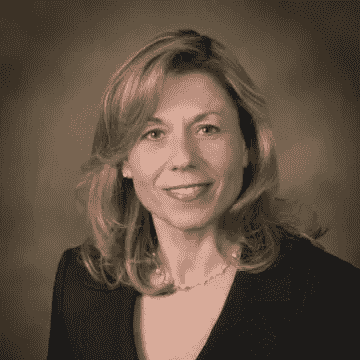

# 有抱负的企业家和发明家的专利流言(播客第 3 集)

> 原文：<https://medium.datadriveninvestor.com/mythbusting-patents-for-aspiring-entrepreneurs-and-inventors-podcast-episode-3-4b6624f57de2?source=collection_archive---------49----------------------->

如果你是一名企业家或发明家，并且正在考虑为你的产品/想法/发明申请专利，这就是适合你的播客。我们将打破关于专利的常见误解，并提供关于你为什么需要专利、如何获得专利以及谁应该申请专利的见解。

****

**Sherrie Flynn, Patent Attorney at Coleman & Horowitt, LLP**

**谁是我的客人？**

**在这一集的播客中,*困惑的创始人*加州专利律师[来自 LLP Coleman&Horowitt](https://www.linkedin.com/in/sherrie-flynn-22382733/)的 Sherrie Flynn 加入了我们。Sherrie 在商业和机械工程领域拥有 30 多年的经验，代表客户进行知识产权注册和执行，包括专利、商标和版权、商业和商业侵权以及建筑。Sherrie 为客户获得了从物理/机械和化学发明到虚拟现实产品的专利。**

****你会学到什么？****

**雪莉·弗林帮助我们澄清了关于专利的错误观念，因此你可以更好地理解为什么你需要专利，如何获得专利，以及谁应该申请专利。Sherrie 涵盖了从申请专利的机制到时间表、成本和所有权转移的所有内容。她甚至以一个有趣的事实作为结尾，关于美国专利和商标数据库中有多少发明。**

****怎么会牵扯进来？****

**关注我们在 [SoundCloud](https://soundcloud.com/valleyinnovators) 上的播客系列，发推特给我们 [@ValleyInnov，](https://twitter.com/ValleyInnov)或者给我们发一封[快速电子邮件](mailto:info@valleyinnovators.com)告诉我们您希望我们在未来的节目中报道的与产品、领导力和成长相关的话题。**

**关于布兰登·洛佩兹**

**Brandon Lopez 是[硅谷创新者](https://www.valleyinnovators.com/)的联合创始人，他的使命是从硅谷带来最佳实践和联系，帮助创始人取得成功。Brandon 在 LinkedIn 和 Salesforce 等企业公司以及分析、社交媒体和生产力领域的初创公司拥有超过 15 年的营销和产品领导经验。**