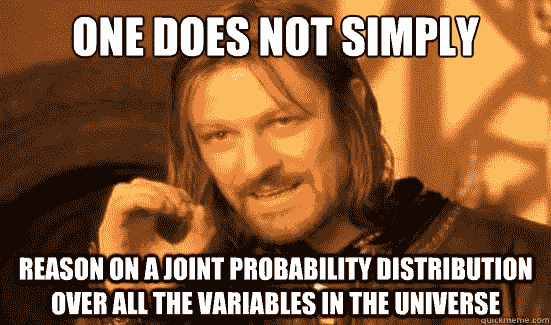

# 朴素贝叶斯

> 原文：<https://medium.datadriveninvestor.com/naive-bayes-d36e57d80652?source=collection_archive---------4----------------------->

[http://wiki.lesswrong.com/mediawiki/images/b/b3/Boromir.png](http://wiki.lesswrong.com/mediawiki/images/b/b3/Boromir.png)

有没有想过如何神奇地将你的电子邮件归类为垃圾邮件或不是垃圾邮件？我们今天要讨论的这个算法就是它背后的魔力。朴素贝叶斯是一种受监督的机器学习算法，其灵感来自于你一定学过数学的贝叶斯定理。它的工作原理是条件概率。

Source: Wikipedia

上面的公式是不是看起来很熟悉？这是朴素贝叶斯算法的核心。所以只是提供一个公式的概述，它是贝叶斯定理的表示，其中 A 和 B 是两个事件，P(A)和 P(B)分别是事件 A 和事件 B 发生的概率，彼此无关，P(B|A)是事件 B 发生的条件概率，假设 A 已经发生。

考虑可能值为真或假的“k”个属性，因此我们需要一个大小为 2^ k 的联合分布表。为了训练分类器，我们必须训练所有这些值，当“k”很大时，这是不可行的。输入朴素贝叶斯！

朴素贝叶斯使用条件依赖的假设来减少问题。正是这种假设使得贝叶斯定理显得幼稚。这里考虑 P(d1 d2 d3|h ),而不是试图计算每个属性值的值，假设它们在给定目标值的情况下是有条件独立的，并计算为 P(d1|h) * P(d2|H)等等。例如，假设您的数据包含短语“芒果茶”，朴素贝叶斯将这两个词视为单独的属性，即单独的“芒果”和单独的“茶”，即使存在名为“芒果茶”的东西。鉴于现有的数据类型，这是一个非常强有力的假设，但朴素贝叶斯仍然能够在分类任务中表现良好。

考虑下面的例子，为了更加清楚，我们需要将动物分类为哺乳动物还是非哺乳动物:

## 朴素贝叶斯的优势

1.  不需要大量的训练数据
2.  它超级快
3.  简单且易于实施
4.  处理连续和离散数据

## 朴素贝叶斯的缺点

1.  对条件独立性做了非常强的假设
2.  如果属性的概率为 0，则需要拉普拉斯校正

## 结论

尽管有过于简化的假设，朴素贝叶斯分类器在许多真实世界的情况下工作得相当好，比如在文档分类和垃圾邮件过滤中。它们非常快速和简单。

我希望这能帮助你开始使用朴素贝叶斯算法。如有任何评论或建议，请通过 *ratikpuri1998* @gmail.com 联系我。如果你喜欢这篇文章，请为它鼓掌！

#机器学习#互联网