# 朴素贝叶斯——概率算法

> 原文：<https://medium.datadriveninvestor.com/naive-bayes-probabilistic-algorithm-68d5a6647738?source=collection_archive---------1----------------------->

[](http://www.track.datadriveninvestor.com/IntelSplit)

在本文中，我们将了解贝叶斯定理，它是朴素贝叶斯的基础。它是如何工作的，为什么叫朴素贝叶斯，朴素贝叶斯的优缺点，朴素贝叶斯分类器的不同类型，最后是 Python 中的一个例子。

先决条件:先决条件:[机器学习](https://medium.com/datadriveninvestor/machine-learning-demystified-4b41c3a55c99)

## 什么是贝叶斯定理？

*   贝叶斯定理使用事件的条件概率。事件应该像掷骰子一样互斥。
*   贝叶斯定理假设预测值或输入要素相互独立。
*   贝叶斯概率与信任度有关。它给出了事件发生的可能性。它利用与事件相关的条件的先验知识来实现这一点

## 逐步解释贝叶斯定理

我们有两家生产轮胎的工厂。工厂 1 每小时生产 60 个轮胎，工厂 2 每小时生产 55 个轮胎。生产的轮胎中有 2%有缺陷。工厂 1 生产 55%的缺陷轮胎，工厂 2 生产 45%的缺陷轮胎。

***一厂生产的轮胎有缺陷的概率是多少？***


把所有的信息。

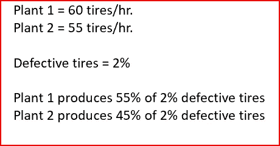

Available information

贝叶斯定理描述了由 plant1 制造的有缺陷轮胎的概率。这是根据工厂 1 制造的轮胎的先验知识和工厂 1 制造有缺陷轮胎的可能性来进行的。

**让我们一步步分解。**

首先，找出在不考虑工厂 1 或工厂 2 的情况下生产的有缺陷轮胎的概率。这也被称为**先验概率**


发现**工厂 1 制造有缺陷轮胎的可能性或条件概率。**同时找出工厂 2 制造缺陷零件的条件概率 **y**

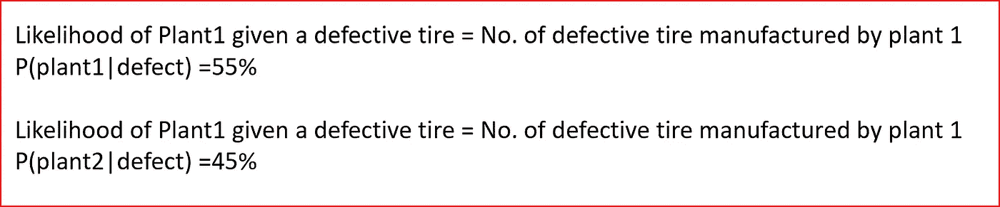

Likelihood or conditional probability

下一步是找到**边际可能性**

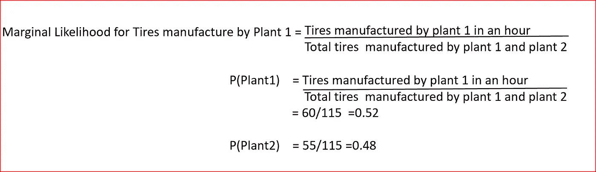

Marginal Likelihood

将所有这些放在一起，用贝叶斯定理计算工厂 1 生产的轮胎有缺陷的概率。

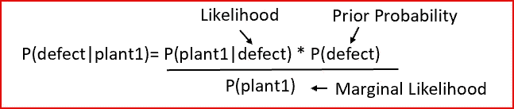

Bayes Theorem

现在把所有的数字放在一起，根据贝叶斯定理得到概率

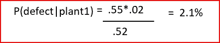

probability of tire manufactured by plant 1 is defective

工厂 1 有 2.1%的可能性制造有缺陷的轮胎。

计算工厂 2 制造有缺陷轮胎的概率

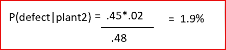

probability of tire manufactured by plant 2 is defective

让我们检查一下我们的数字

如果我们有 1000 个轮胎，520 个在工厂 1 生产，480 个在工厂 2 生产。

生产的 1000 个轮胎中有 20 个有缺陷。

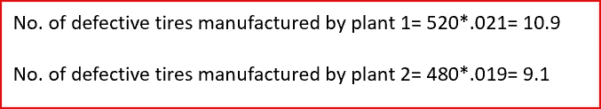

这将有助于清楚地理解贝叶斯定理。永远记住轮胎和贝叶斯定理。

***朴素贝叶斯定理在机器学习中是如何应用的？***

我们有一个数据集，其中有 10 个好轮胎和 10 个有缺陷的轮胎。基于新轮胎的负荷指数和速度等级，我们希望预测新轮胎是好的还是有缺陷的。我们将使用朴素贝叶斯算法进行预测。

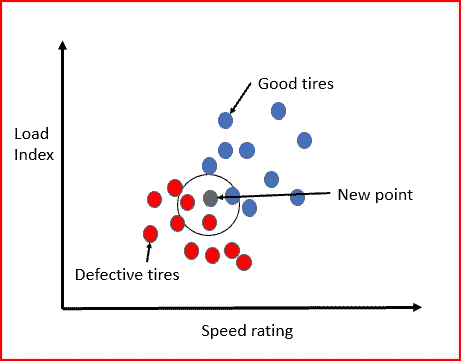

给定新的点 X，我们计算有缺陷轮胎的概率。然后，我们计算新的点 X 的好轮胎的概率。比较好轮胎和有缺陷轮胎的概率。一个概率较高的将是对 x 的预测。

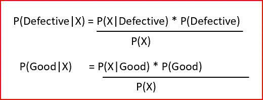

计算后验概率，求先验概率，似然，边际似然。

***一个轮胎好的概率有多大？***

找出合格数据点的数量除以数据点的总数

***轮胎有缺陷的概率是多少？***

找出缺陷数据点的数量除以数据点的总数

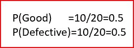

prior probability

***随机点好的可能性有多大？***

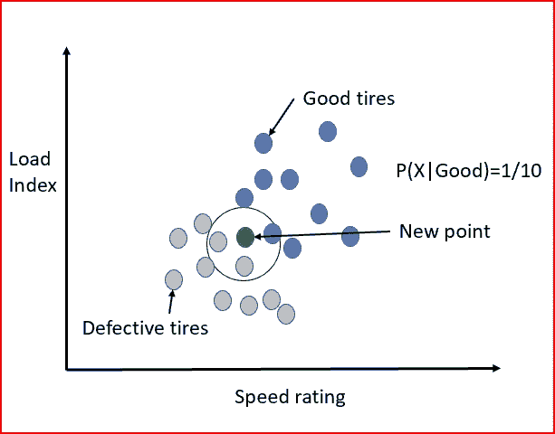

***随机点有缺陷的可能性有多大？***

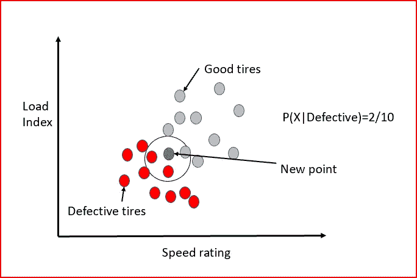

***新点 X 落在圆内的边际概率是多少？***

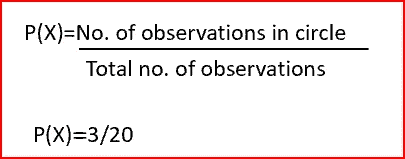

现在输入数字

p(Good | X)=[(1/10)*(10/20)]/(3/20)= 0.33

p(缺陷| X)=[(2/10)*(10/20)]/(3/20)= 0.66

所以我们预测新的点 X 将有缺陷

**P(缺陷|X) > P(好|X)**

## 为什么朴素贝叶斯是朴素的？

朴素贝叶斯假设输入要素相互独立。现实生活中可能并不总是这样。因为这个假设是天真的，因此是朴素贝叶斯算法。

朴素贝叶斯是一种概率算法。我们计算单个输入特征的条件概率。如果输入要素是相关的，那么它们会被计算两次，给出不正确的概率。因此，对于朴素贝叶斯分类来说，为了获得更好的预测，具有彼此独立的输入特征是很重要的

## **朴素贝叶斯算法的利弊**

**朴素贝叶斯算法的优点**

*   适用于大型数据集
*   对于多类分类表现良好
*   计算速度快

**朴素贝叶斯算法的缺点**

*   假设预测器独立。在现实生活中，这可能不会每次都发生。

## 不同类型的朴素贝叶斯分类器

有三种类型的朴素贝叶斯分类器

*   **高斯**

> 所有特征都是连续的，并且具有正态分布。
> 
> 我们计算输入要素的平均值和标准差。这有助于总结每一类的分布和概率。
> 
> 示例:信用卡欺诈检测，输入特征是不同季度的交易金额

*   **伯努利**

> 输入要素是二进制的。
> 
> 例子:垃圾邮件检测，这里我们把常用词转换成二进制变量。0 表示文档中不存在单词，1 表示文档中存在单词。

*   **多项式**

> 最适合具有离散特征的分类。
> 
> 多项式分布通常需要整数特征计数。
> 
> 示例:产品分类为电子产品、服装或杂货。为描述不同产品类别的所有单词创建一个频率分布。

## 朴素贝叶斯的 Python 示例

[数据集](https://archive.ics.uci.edu/ml/datasets/zoo) —这是一个预测动物类型的动物园数据库。

我们将使用**多项式朴素贝叶斯分类器，因为我们的特征是离散的**。

导入所需的库

```
import numpy as np
import pandas as pd
from sklearn.metrics import accuracy_score
```

数据以 zoo.csv 格式保存在默认的 Jupyter 文件夹中。

将数据读入 dataset_1

```
dataset_1 = pd.read_csv(‘zoo.csv’)
```

浏览数据集中的数据

```
dataset_1.info()
```

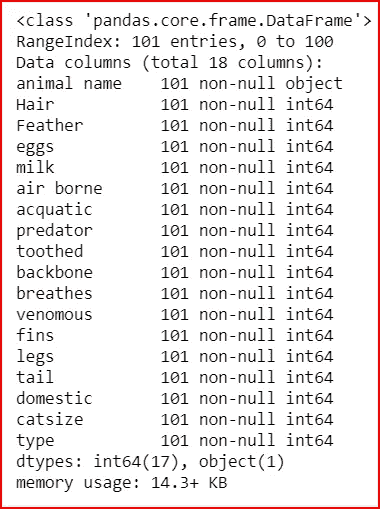

打印数据集中的 2 行以理解数据

```
dataset_1.head(2)
```

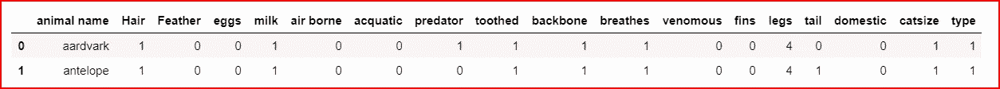

dataset_1.head(2)

创建输入特征 X 和输出或目标变量 y。对于输入变量，我们删除第一列 animal 和 type，并获取所有其余变量。类型是目标特征

```
X= dataset_1.iloc[:,1:17]
Y= dataset_1.iloc[:,-1]
```

将 dataset_1 拆分为训练集和测试集。测试集将占数据集 _1 的 40%，训练集将占数据集 _ 1 的 60%

```
from sklearn.cross_validation import train_test_split
X_train, X_test,Y_train, Y_test = train_test_split(X, Y, test_size=0.4)
```

创建多项式朴素贝叶斯分类器

```
MNB = MultinomialNB()
```

将训练数据拟合到 MNB 分类器，然后进行 X 检验预测

```
MNB.fit(X_train, Y_train)
Y_pred =MNB.predict(X_test)
```

寻找准确性

```
print(accuracy_score(Y_test, Y_pred))**o/p:0.8048780487804879**
```

即使输入特征不是相互独立的。动物既可以在空气中传播，也可以在水中传播，就像某些品种的鸭子一样。即使假设被违反，朴素贝叶斯也能给出更好的结果。

现在，您已经准备好自己探索朴素贝叶斯算法了

# 如果你喜欢这篇文章，请鼓掌！

[](http://www.track.datadriveninvestor.com/IntelSplit)