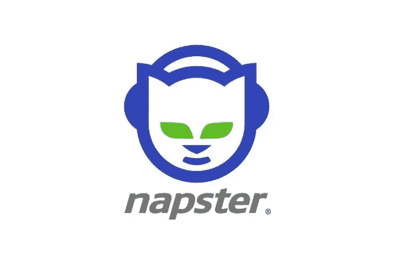
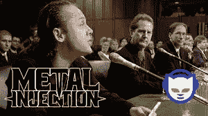

# NAPSTER 和比特币轶事

> 原文：<https://medium.datadriveninvestor.com/napster-and-bitcoin-anecdote-3825b0daf6f5?source=collection_archive---------18----------------------->

当 Napster 在 1999 年出现时，它允许人们通过互联网免费与任何人分享他们电脑上的音乐。它在年轻人中非常受欢迎，很快就获得了 8000 万注册用户。

Napster logo, Image Source- [Napster](http://www.napster.com/NapsterUsageGuide.pdf)

音乐产业起诉 Napster，声称这将增加盗版和减少他们的音乐销售。特别是金属乐队以侵犯版权和非法使用数字音频接口设备为由起诉了他们。
就在那之后，苹果发布了 iTunes，并组织了数字音乐产业。

Source- [Metal Injection](https://www.youtube.com/watch?v=sIFeNVKcHcU)

今天，音乐产业在数字平台上蓬勃发展，人们可以“免费”获得音乐。
事实上，人们消费的内容比以往任何时候都多。
YouTube 和其他平台的出现使这成为可能。

在互联网和社交媒体出现之前，政府完全控制着主要媒体出版物。互联网让每个人都可以通过自己的博客和网站成为出版商。社交媒体甚至给了人们直接与政府联系并提出问题的权力。政府努力控制互联网，电信公司想在网络上创造垄断。但是今天人们可以自由地在网上发表任何反对任何人的言论。脸书、Instagram、Twitter 等网站为人们提供了向世界分享想法和想法的机会。

A post on Twitter, Source- [Postcard](https://postcard.news/twitter-india-policy-head-deletes-her-tweet-after-people-question-her-choice-of-abusive-words/)

技术把出版的权力从政府手中夺走，交给了大众。

比特币出现在 2009 年金融大危机的时候。加密有可能从银行和政府手中夺走经济权力，并让给人民。

Photo by [Thought Catalog](https://unsplash.com/@thoughtcatalog?utm_source=medium&utm_medium=referral) on [Unsplash](https://unsplash.com?utm_source=medium&utm_medium=referral)

政府正努力限制加密技术的发展，陈述各种安全原因及其负面影响。但是技术找到了保持进步的方法，积极的影响战胜了消极的潜力。