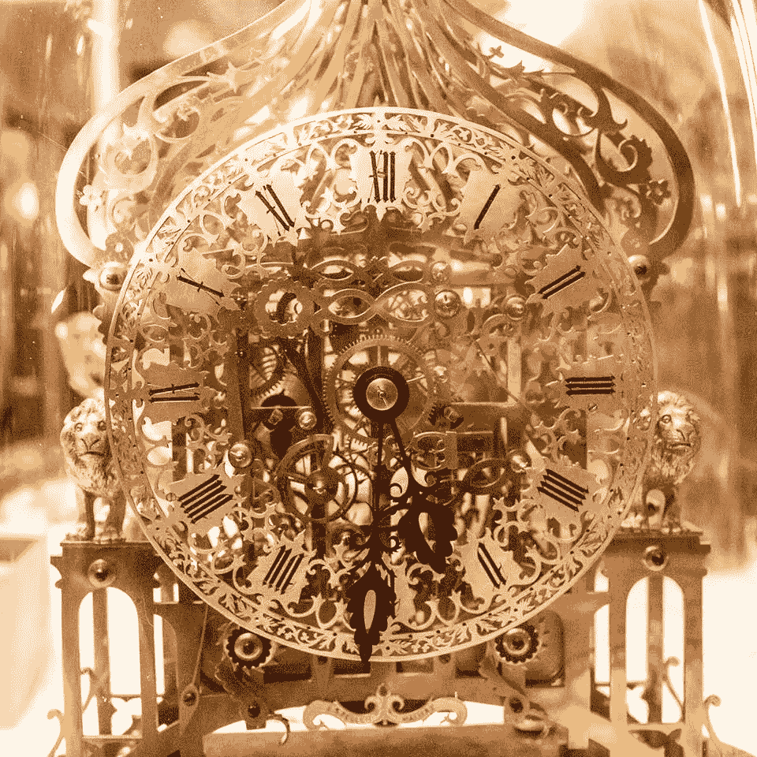

# 大数据时代的(非)小说:一个预测

> 原文：<https://medium.datadriveninvestor.com/narrative-art-in-the-age-of-big-data-a-prediction-7bd4a5b920ee?source=collection_archive---------58----------------------->

这篇文章的目的是预测主流叙事艺术，我指的是电视和音频系列，也许还有电影，在 10-15 年后会是什么样子。我的预测是这样的:我们将花时间观看或聆听*人*，那些碰巧拥有戏剧性或喜剧性有趣生活并记录了这些生活的日常人。人们将成为一种娱乐形式，并将挤出对作家创作的虚构叙事的需求。

有几个原因综合在一起，让我认为这个预测，虽然可以说是令人惊讶和难以置信的，但有点不可抗拒。原因如下:

*(审美理性)*在活着的数十亿人中，有相当一部分人过着比小说能想出的任何东西都更有趣的生活，关于真实人物的叙事艺术比这种关于虚构人物的艺术更具审美吸引力。

*(监视原因)*我们做的很多事情都被记录下来，没有理由认为这将会停止，提供原始材料——图片、声音文件、电影——以形成视听叙事。

*(连接原因)*人们之间的交流距离比以往任何时候都近，使人们的日常生活能够走出去，得到认可，并获得观众。

所以，想想这个:有些人过着戏剧性或喜剧性的有趣生活。约翰·b·麦克勒莫尔是广受好评的播客《S-Town》的中心人物，不要破坏任何东西，他本质上是一个非常有趣的人:深刻、多面、聪明、有趣、古怪。如果我想起我在过去五年里读过的小说的主角，很少有人比得上他，我觉得他们是多么引人注目，至少这在很大程度上是因为他是真实的。我对约翰的感觉远远超过典型的文学主角，因为他的经历是真实的，从社交媒体网站上很容易找到的对他的感情流露来看，许多人似乎也有同样的感觉。

当然是 YMMV，但是我不需要停止我的经验:这只是一个数字游戏。谷歌告诉我，2018 年 5 月，世界人口为 76 亿。那是*很多*的人。我希望这能打动你，正如统计数字所显示的那样，生活在戏剧力量上与任何作家所能提供的最好的东西相匹敌。这是我的主张的美学原因:外面有好的真实故事。

当然，情况一直都是这样:正如俗话所说，真相可能一直都比小说更奇怪。不同的是它没有被记录。从历史上看，过着有趣生活的人能够记录下来的几率非常非常低。直到最近，一个人能够用视听手段记录自己生活的可能性几乎为零。

这已经改变了，这就是监视的原因。我们现在都有能够记录我们每个动作的设备；此外，我们使用服务的主要目的之一就是准确地跟踪我们的每一个行动，以便更好地向我们投放广告。这一直是许多反乌托邦猜测和小说的主题，但据我所知，美学后果尚未得到认可，即有趣的生活现在可以记录下来，这些记录可以成为叙事小说新作品的形式。

所以让我们承认，外面有比虚构的生活更有趣的生活，而且现在有一个很好的机会，他们将被记录下来，从而可以形成小说。

如果没有办法让这些故事流传出去，让这些故事得到观众和决定其他人看什么的人的关注，那还是没有用的。但是连通性的原因保证了这一点:S 镇又是一个很好的例子。约翰能够简单地给《美国生活》的制片人发电子邮件。人们很容易忘记这一事实，但直到最近，一个贫穷、与世隔绝的农村人被媒体精英听到的机会还是非常低的。但这已经改变了，这意味着这些故事现在可以在人群中传播，要么被发送给制片人，要么更有可能的是，被创作者上传并被人群发现。

If you get this reference, think about what a great symbol it is — it would take a good artist to come up with it. That it forms the part of an actual person’s actual life just makes it all the more powerful

这就是这篇文章的主要观点:在未来，由于上述原因，我们应该期待以前被遗忘的数以百万计的有趣的日常生活中的一些将被记录下来，供子孙后代传播，并作为娱乐消费。事实上，我们已经看到了这一点，这是有争议的，因为有大量广受好评的真实犯罪纪录片，如《制造杀人犯》、《连环杀手》和《楼梯》。我认为，我们将会看到这种趋势被放大并扩展到犯罪类型之外。

这将导致许多有趣的伦理和哲学问题。这些已经对上述节目的观众或听众产生了压力。把一个人的生活当作一种娱乐，尤其是当一个死人不能选择退出的时候，这符合道德吗？当一点一滴的故事给我们带来戏剧性的令人满意的惊险情节时，制片人会误导我们吗？或者他们只是党派性的，站在某一方，只想证明他们的主题是无辜的或有罪的或好的或坏的，视情况而定？我不知道这些问题的答案，但如果我在这篇文章的中心点是正确的，我们将不得不在未来正视它们。