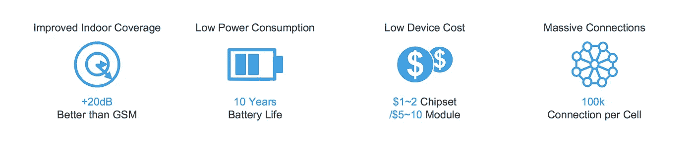
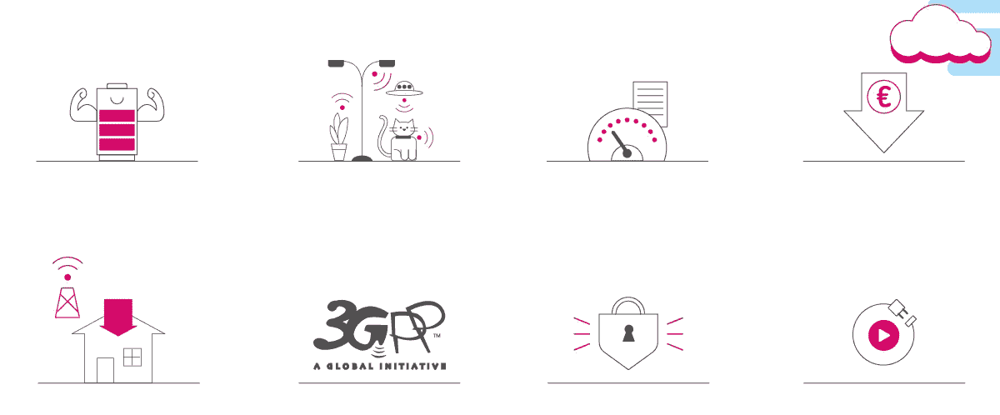
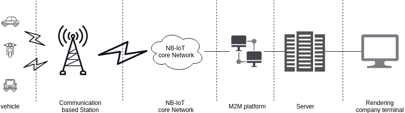

# 适用于汽车租赁系统的窄带物联网…

> 原文：<https://medium.datadriveninvestor.com/narrowband-iot-for-vehicle-rental-system-2a7ebe1aca96?source=collection_archive---------7----------------------->

Photo by [Samuel Zeller](https://unsplash.com/@samuelzeller?utm_source=unsplash&utm_medium=referral&utm_content=creditCopyText) on [Unsplash](https://unsplash.com/search/photos/vehicle-rent?utm_source=unsplash&utm_medium=referral&utm_content=creditCopyText)

如今，大多数人都想环游世界。如果一个人想环游世界或探索不同的国家，那么这个人需要一辆车。如果这个人不是很富有，那么他会租一辆车去探索这个地方。全世界有这么多汽车租赁公司。在这篇文章中，我想建议一个方便的方法，可以证明对汽车租赁公司有用。这是我在 Medium 的第 24 篇文章。

现在人们都在谈论 5G，但他们中的许多人并不真正了解窄带物联网。首先，我们来讨论一下什么是窄带物联网。窄带物联网有什么优势？数百万台设备将通过物联网连接起来。这对通信网络来说是一个巨大的挑战。而今天，数百部智能手机可能会在一个无线蜂窝中注册。据我们所知，未来典型的移动网络将会有几千种设备或传感器。网络的负担将会非常高，能源消耗将会急剧增加。这个问题的解决方案是所谓的窄带物联网和窄带机器传感器网络。该网络通过覆盖广大区域的 3gpp 无线电波运行。与此同时，它们能够穿过厚厚的混凝土墙，到达地下深处建筑的偏远角落。这些传感器每周一天甚至一个月只传输一次小数据包，并且它们消耗很少的能量。

例如，在机器传感器网络中，当自动售货机需要补充或必须修理时，它们将能够独立、及时地报告。必要时，路灯可以打开或调暗。停车位会显示何时可用或被占用。窄带物联网为不同行业使用物联网提供了广阔的机会舞台。一个主要的例子是智能城市，其中许多窄带物联网解决方案相互通信，使城市更加舒适和安全。

对于这个建议的系统，我们可以使用 Quectel BC95 和 GPS 模块来跟踪车辆。Quectel 供应 Quectel BC95。Rending 公司的所有者可以购买并将其安装在您的车辆上。现在有许多服务提供公司支持 NB-IoT。渲染公司应该开发一个 M2M 平台，他们可以有一个服务器来保持跟踪历史。下面附上整体系统的架构。

Overall architecture

## 结论

NB-IoT 不仅适用于汽车租赁系统，也适用于许多系统。我们可以用 NB-IoT 代替 GPRS。评论你的建议。

***感谢您阅读至此。如果你喜欢这篇文章，请分享、评论并发表👏几次(最多 50 次)。。。也许会对某个人有帮助。***

***关注我的***[***Twitter***](https://twitter.com/TheSabesan)***和 Medium 如果你将来对这些更深入、更翔实的文章感兴趣的话！***