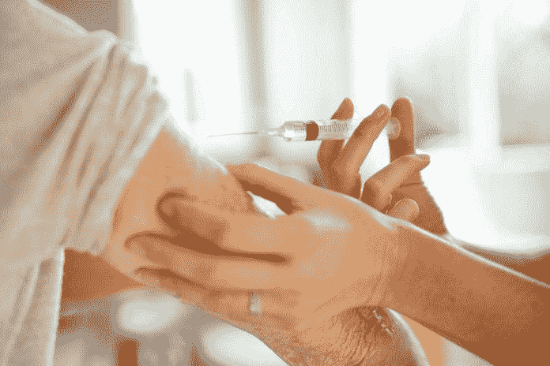
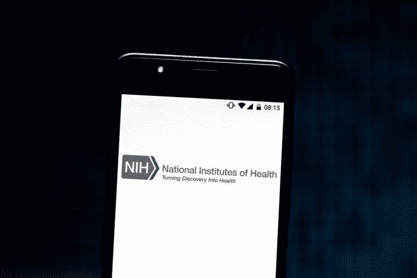

# 美国国立卫生研究院想要你的血液、尿液和“数据”——接下来是什么？

> 原文：<https://medium.datadriveninvestor.com/national-institute-of-health-wants-your-blood-urine-and-data-what-is-next-978afee19dfb?source=collection_archive---------6----------------------->

NIH

在最近的一份出版物中，美国国立卫生研究院(NIH)宣布启动一项名为“我们所有人计划”的倡议。这凸显了该机构向医药个性化迈出的第一步。虽然它包含一些争议，但更有趣的是他们对人口目标的选择；服务不足的社区。他们选择的理由是在政府长期虐待他们之后赢回一群公民的信任！因此，为了重建逐渐消失的信任，他们需要招募超过一百万的参与者。这项研究将涉及从每个参与者身上采集六瓶血液，尿样，腰围测量，访问个人电子健康记录，从附着在个人手腕上的可穿戴传感器中挖掘的数据，可能还有社会安全号码！

拟议研究“我们所有人”研究计划的细节发表在[2019 年 8 月 15 日版的《新英格兰医学杂志》2019 上；381:](https://www.nejm.org/doi/full/10.1056/NEJMsr1809937)668–676。

 [## 大笔资金和尖端技术:人工智能/人工智能投资将如何革新医疗保健…

### 在过去几年人工智能(AI)和机器学习(ML)的显著发展中…

www.datadriveninvestor.com](https://www.datadriveninvestor.com/2018/03/22/big-money-and-cutting-edge-technology-how-investment-in-ai-ml-will-revolutionize-the-healthcare-industry/) 

美国国立卫生研究院最近[向加利福尼亚州伯林盖姆的一家健康技术公司](https://www.nih.gov/news-events/news-releases/nih-funds-genetic-counseling-resource-ahead-million-person-sequencing-effort)提供了 460 万美元的初始资金，以启动第一个全国性的遗传咨询资源。

美国国立卫生研究院的愿景显然旨在反映基因组学和生物传感器技术的进步，据该机构称，这些技术为疾病的精细分类奠定了基础，有助于增强预后，改善正在进行的临床干预，并有助于形成新的疗法。它的使命是招募至少 100 万愿意通过电子健康记录(EHR)分享其私人信息的个人，为基因组研究和其他实验室评估捐献生物标本。它还要求他们回答一系列的调查问题，同时进行标准化的身体测量。参与者的数据很可能会通过传感器和移动健康设备进行实时监控，每个人都会被联系以了解即将到来的研究前景。

这看起来很奇怪，因为 NIH 正在进行的研究强调在与当局分享大量关键信息的交换中建立公众信任；到目前为止，没有表现出有效保护敏感信息的意愿的组织。更进一步，好奇心的旗帜将不可避免地随着该机构对服务水平低下的社区的选择而升起，以吸引研究志愿者的最初来源。

国家卫生研究院计划如何实施个性化或精确医疗，以重新赢得那些在过去受到虐待的社区的信任，这本身就是一个有争议的问题。包含上述争论的层面很少，包括个性化医疗的一个定义，以及它到底意味着什么；双数据安全性、所有权和 HIPAA 合规性；三大使命与愿景不同步；第四，代表性不足的人口。

要了解什么是个性化医疗，首先需要了解特定医疗护理或服务的价值。当我们试图在医疗保健框架内应用质量和价值时，有各种各样的定义来代表质量和价值。但是几乎无一例外都倾向于忽略它们的真正含义。[服务](https://medium.com/@Adamtabriz/healthcare-personalized-care-and-us-how-are-we-doing-ba281230d327)或产品的质量和价值不是放之四海而皆准的，因为它必须根据特定地点和时间的个人需求和偏好来确定、定制和调整。同时，对于将[风险和收益比](https://medium.com/datadriveninvestor/personalized-healthcare-vs-population-health-application-of-risk-benefit-ratio-25022a497635)概念化为任何个性化医疗护理的基本驱动力来说，也是至关重要的。

个性化医疗保健、个性化医疗和精准医疗是我们在当前医疗保健领域经常听到的三个热门词汇。精准医疗的时代可以追溯到 20 年前，当时弗朗西斯·柯林斯博士发布了一份关于人类基因组计划的基础文件。从那时起，精准医疗的概念就被交替使用为个性化医疗保健和个性化医疗。柯林斯博士的基因组学理论纯粹基于基因还原论的概念，声称理解基因对于理解人类行为的各个方面至关重要。在我看来，他对个性化医疗保健的看法是一个极具争议的问题。在我过去的几篇文章中，我在[提到了个性化医疗、医疗保健和精准医疗的抽象概念。因此，我不打算深究细节，因为我已经在本文中提供了一些链接。但是我必须强调——“我们所有人计划”的核心使命是另一个曲解后三个定义的例子。个性化医疗保健、医学和精确医疗在其特定应用角色的范围内确实重叠；然而，决不是，他们互换指同一颁布。](https://medium.com/writers-guild/the-true-meaning-of-personalization-and-precision-personalized-healthcare-personalized-medicine-f5b68a26a042)

**对国家卫生研究院使命的批评**

事实是，个性化医疗的定义是什么，它的范围是什么，确实是一个值得关注的问题。在 NIHs 提出的研究中，个性化医疗的概念仅仅指向“精确医疗”,因为它主要集中在基因组学和 DNA 测序上。现实中，个性化医疗有许多方面，包括但不限于伦理、个人选择、质量和个人价值。收集 DNA 进行测序并利用[深度学习](https://www.datadriveninvestor.com/glossary/deep-learning/)算法进行研究是成功利用基因组科学的基础。但是数据安全性、所有权和 HIPAA 合规性仍然是一个持续存在的问题。该行动计划目前定义不清，无法证明该机构的主要工作是保护患者的敏感数据。

在基因组学和生物传感器方面取得进展仅仅是为了满足该机构的真正使命，即在不被重视的群体中建立信任的基本原理下建立数据库筒仓，因此意味着双重标准。

**大局**

显而易见，NIH 的重点主要是基因测序和基因组数据库的扩展。它也将丰富其他组织和机构对精确医疗的信息可用性。企业数据挖掘热潮是真实的。每个行业都在以很少甚至没有成本的方式实施各种数据收集策略。他们现在就想要，而且他们打算在立法者采取必要行动之前快速行动。例如，在管道上追求无人驾驶汽车技术的汽车行业已经在大都市的每个角落实施了低成本的踏板车，作为城市和数据[采矿](https://www.datadriveninvestor.com/glossary/mining/)仪器的测绘工具。[在挖掘原始数据方面，医疗保健也是一个不变的目标](https://medium.com/datadriveninvestor/medicine-f-d-a-62d3121042cd)。

健康科技公司正在打磨消费者的 DNA。立法者要么不情愿，要么根本无力阻止这一趋势。软件和技术公司正在公开交易有关公民在线搜索历史、行踪、怀孕等努力以及习惯的详细信息，从长远来看，这些信息注定会带来灾难性的后果。

**字里行间**

[数据挖掘](https://www.datadriveninvestor.com/glossary/data-mining/)是 21 世纪的淘金热。通过可穿戴设备元数据、诊所就诊和实验室测试结果的方式访问患者的健康信息，是患者支付数十亿美元个人专有信息的免费渠道。NIH 伙伴关系和误导性的研究计划是不道德的，必须被视为非法。得不到充分服务的社区非常绝望，因为他们是数据采矿业和信息开发的脆弱猎物。在政府游说者的帮助下，它将利用制药和保险业的财政收益来确保企业卡特尔的利益。

基因简化论是利用个人隐私和主权的廉价理论基础。类似的方法也可以在干细胞研究和再生医学行业中看到 [亚马逊的 Alexa](https://medium.com/datadriveninvestor/trusting-technology-is-not-the-same-as-trusting-its-architects-has-alexa-earned-that-reliance-91129fa44303) 是另一个例子，在这个例子中，与英国国家卫生系统合作保护的实体将以很小的成本获取无尽的个人数据来源。

“浑水摸鱼”描述了美国国家卫生研究院的倡议，它不同步地展示了富有远见的理想，但没有明确的实际目标。该计划描述了一个完美的场景，即利用政治对抗手段，鞭笞公民，让他们的公司账户充满价值数十亿美元的信息。这种模式将有助于大量的元数据在企业垄断和回扣的网络上共享，以建立一种消费者商品，[人工智能](https://www.datadriveninvestor.com/glossary/artificial-intelligence/)技术由消费者支付，开始，并可能用于进一步控制大众。

[大数据](https://www.datadriveninvestor.com/glossary/big-data/)和干细胞基因组学是两个合作促进其快速扩张的科学学科，因为基因组测序和获取私人公民组织样本的策略的成本大幅下降。

患者的不信任是真实而公正的。但是，认为赢回他们的信任将意味着更多地从他们那里骗取有价值的数据(无论是私人数据还是个人数据)是虚伪的。

基因还原论的概念很极端。这与希波克拉底个性化医学所代表的理念相矛盾，即“不伤害，有时治愈，经常治疗，永远舒适”的理念。

精准医疗代表了工具、策略和科学协同工作，以增强个性化医疗护理。基因组学和其他技术可以归入精准医学的范畴。因此，它们都是个性化医疗保健的子类别。

**解决方案**

精准医疗需要挖掘患者数据的想法并不是关注的主题。然而，主要问题是关于什么、谁的信息以及如何收集、操纵和共享数据。此外，对于确定提取数据的主要合法所有者至关重要。在上述问题得到解决之前，社区不信任是可以理解和合理的。由于“我们所有人计划”倡议的不透明性，那些错误信任的人很可能不知道他们行为的负面影响。

*原载于 2019 年 9 月 7 日*[*【https://www.datadriveninvestor.com】*](https://www.datadriveninvestor.com/2019/09/07/national-institute-of-health-wants-your-blood-urine-and-data-what-is-next/)*。*

 [## 美国国立卫生研究院想要你的血液、尿液和“数据”——接下来是什么？|数据驱动…

### 在最近的一份出版物中，美国国立卫生研究院(NIH)宣布启动一项名为“我们所有人…

www.datadriveninvestor.com](https://www.datadriveninvestor.com/2019/09/07/national-institute-of-health-wants-your-blood-urine-and-data-what-is-next/)  [## 美国支持对非法药物使用进行筛查——这是一项仓促的举措，进口不足|数据驱动…

### 非法药物使用筛查；美国预防服务工作组的认可:惊人数据的优点…

medium.com](https://medium.com/datadriveninvestor/u-s-endorsed-screening-for-illicit-drug-use-a-hasty-move-with-feeble-import-data-driven-3f5e5c083a39)  [## 政府在医疗保健中的角色是什么？

### 有没有去过医院，却被医疗账单吓了一跳？政府控制着我们的医疗保健…

medium.com](https://medium.com/@Adamtabriz/what-is-the-role-of-government-in-healthcare-1b781c92783a)