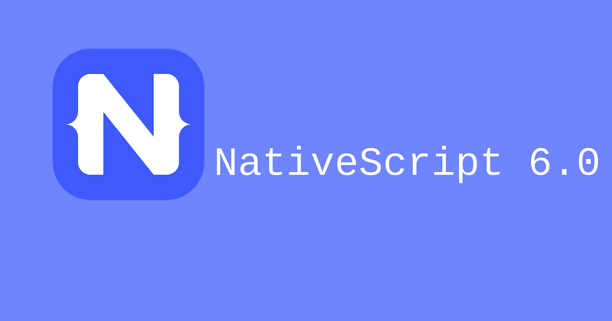

# NativeScript 6.0 更新 JavaScript 框架的改进和新功能

> 原文：<https://medium.datadriveninvestor.com/nativescript-6-0-update-improvements-and-new-features-of-javascript-framework-b9cd1efda4f8?source=collection_archive---------6----------------------->

最近，我们看到了 NativeScript 6.0 的发布，这是一个名为 Progress 的开源网络的最新版本。对于使用 JavaScript 和其他广泛使用的语言创建原生移动应用程序来说，这很方便。最新版本允许更快地更新应用程序和更小的应用程序二进制文件。最新版本将引起企业客户的特别兴趣，因为它允许更快地交付高质量的跨平台应用程序。它给了用户最好的体验。在我们开始解开该版本中包含的所有内容之前，让我们回顾一下什么是 NativeScript。

# 什么是 NativeScript？

正如我们上面提到的，NativeScript 是一个开源框架，但使它脱颖而出的特性是，您可以通过 JavaScript 访问本机 API。用 NativeScript 创建的应用程序具有用常用编程语言和集成编写的平台原生用户界面。其中包括 Vue.js、CSS、Angular 和 TypeScript。它的主要目标是创建具有丰富功能的现代应用程序。除了已经提到的所有内容之外，这里还有一些额外的信息向您展示 NativeScript 有多受欢迎:

 [## 2019 年最值得学习的编码语言|数据驱动的投资者

### 在我读大学的那几年，我跳过了很多次夜游去学习 Java，希望有一天它能帮助我在…

www.datadriveninvestor.com](https://www.datadriveninvestor.com/2019/02/21/best-coding-languages-to-learn-in-2019/) 

*   在 2015 年 3 月发布后不久，它在 GitHub 上获得了 3000 颗星星和 1500 多名 Twitter 粉丝。
*   今天市场上有 700 多个插件。
*   创造 NativeScript 的公司 Progress 在 Gartner 魔力象限中被称为“有远见的人”。
*   现在我们已经了解了 NativeScript 的所有内容，让我们更仔细地看看最新版本中包含了什么。

# 里面有什么？

NativeScript 6.0 包括以下改进和功能:

1.  您现在可以将构建 Android 应用的速度提高 30%，iOS 的启动时间减少了 10%。
2.  就 Android 而言，现在官方支持标记模式“无”。虽然这提供了性能改进，但用户可能会遇到错误或崩溃，因为一些对象可能会被过早地收集。因此，需要一些额外的代码来确保只要 JavaScript 组件还在运行，Java 对象就不会被释放。
3.  引入了一些新的布局，包括 TabView，它使您能够创建更复杂的布局，而不必编写太多的代码。
4.  所有 NativeScript 应用程序现在都将与 webpack 模块捆绑器完全集成。这确保为任何给定的体系结构选择合适的文件大小。
5.  一个更好的简化的商店批准过程提供了更快的上市时间。
6.  Angular 8 和 Ivy 渲染器现已包含在内。

一家移动应用开发公司通常需要在使用 NativeScript 还是 Ionic 之间做出选择。考虑到这一点，下面是这两个框架之间的一些差异。

# NativeScript 与 Ionic

最重要的区别之一是，NativeScript 应用程序可以直接在您使用的设备上运行。它不需要交叉编译任何东西或任何浏览器交互。Ionic 将需要一些插件来提供类似本机的外观。他们都利用了开发人员喜欢使用的 Angular JS，而且他们做了几乎相同的事情，但是使用了不同的模型。Native 有明显优势的领域是用户体验。Ionic 无法与它通过移动就绪功能提供的结构相匹配。

话虽如此，Ionic 本身就是一个很好的框架。它在所有主要平台上都提供了出色的性能，并允许开发人员使用 Angular，这在 Ionic 2 和 3 中也很明显。缺点是它使用 WebViews 来创建界面，并依赖插件来访问设备的硬件。最终，选择将取决于你试图创建的应用程序的类型、需求和最终用户。

# 试试 NativeScript 6.0

开发人员对这个新版本感到兴奋，考虑到我们上面提到的所有特性，很容易明白为什么。NativeScript 使他们能够用一个 JavaScript 代码库创建应用程序，可以在 iOS、Android 和其他平台上共享。根据 Progress 的说法，最新版本将允许多达 70%的代码在移动和网络应用中重用。NativeScript 利用 Android 和 iOS 上内置的 JavaScript 虚拟机来访问这些平台上的原生用户界面元素和 API。

如果你是一个插件作者，验证你的产品与 Webpack 和 AndroidX 兼容是至关重要的。这将消除你的插件的现有用户过渡的任何障碍。如果您需要一些帮助，NativeScript 提供了一些已经成功过渡到最新版本的插件示例。所以，你可以看到他们是如何做到的。

重要的是要记住，这个新版本是一年半的工作和 NativeScript 不懈努力的结果，目的是让 Webpack 家喻户晓。用户将有几周时间来尝试 NativeScript，并发送他们的反馈意见。然而，考虑到 NativeScript 网站和开发人员社区上可以看到的所有宣传和兴奋，可以很有把握地说它将会大受欢迎。这是一个真正重要的发展，值得花时间尝试一下 NativeScript 的最新版本。

*最初发布于*[*https://sky well . software*](https://skywell.software/blog/nativescript-6-0-update/)*。*