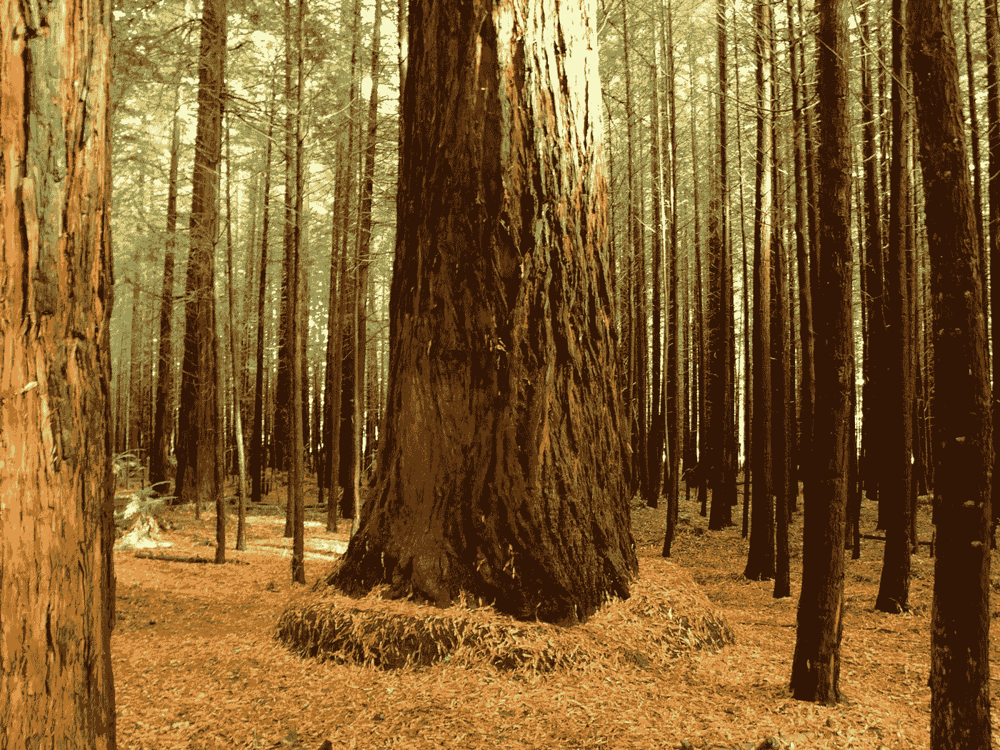

# 自然智能，意识还是灵魂？和生命的真正价值

> 原文：<https://medium.datadriveninvestor.com/natural-intelligence-conciusness-or-soul-and-the-real-value-of-life-4abb64d25628?source=collection_archive---------8----------------------->

Credit: Gavin Mills

我曾经努力通过科学的光学视角来调和我看待生活的方式，以及我作为一个人的情感和自我认知。

在事情的科学方面，我的观点包括不可知论(T2)、物理定律、进化生物学、适者生存，甚至更高层次的概念，如心理学(T4)和行为精神病学。

然而，我人类的一面，能够感受情感，如愤怒、
恐惧，最重要的是爱……很难接受
导致的虚无主义，即我们，甚至整个人类物种、
等于什么，也就是说，什么都不是，只是
宇宙中的一粒尘埃。

然而，失去亲近的人的痛苦感觉非常真实，对吗？毫无疑问，痛苦是一种东西，它是我们认知的自然属性，但我们的意识(或灵魂)确实能感觉到它。

每当我们感受到强烈的情绪时，就会释放出一股化学物质。在大脑中，这导致了神经元的舞蹈
相互交流，跨越
大脑的距离，更不用说错综复杂的
模式，我们甚至还没有开始破译任何
被称为认知的高级组件，一群
新的突触就在此刻产生。

我们将科学作为人类追求的一个重要目标，我们在太空中建造了望远镜来观察宇宙中最遥远/最古老的事物，我们建造了粒子加速器来揭开构成生命的神秘面纱，然而我们中的许多人还没有能够欣赏人类的生活，特别是我们认为与我们很亲近的单身人类的生活，然而最终却忽视了对这种感觉采取行动。

这些我们所爱的人，我们为之哭泣的人，会为之而死的人，碰巧是由宇宙创造的，也就是说，许多事情必须恰到好处，包括在大爆炸后大约 30 万年宇宙突然膨胀之前的那些微妙时刻。

对于地球这个我们目前所知的能够支持生命存在的星球来说，很多事情都必须正确的出现。然而生命的开始仍然是一个谜，可能需要很多机会，更不用说它必须在我们记录在案的所有大灭绝事件中幸存下来。

11 个参数控制宇宙。11 是这么小的一个数字，
然而 11 个参数描述了整个宇宙和存在。

这 11 个参数，产生了一个主要由
质子、中子和电子组成的奇异配置，你称之为……你。因此，你、你的父母、你的兄弟姐妹、你的后代、你认识的每一个人、你爱的每一个人、你讨厌的每一个人，每一个人都是由这些微不足道的参数创造出来的。

你应该开始欣赏宇宙为你创造的人，并开始认识到你也是为他们而创造的。

关于这种欣赏最有趣的事情是
它应该超越你的情感而存在，
也就是说，即使你的
祖先没有进化出情感，你仍然可以感觉到。

你的聪明、理性、有思想的人类部分/你的
意识，应该能够欣赏所有上述的
。

这需要有一个灵魂远离我们的
习俗和规则，在我看来，当你开始剥离其他生物的层次，并欣赏他们的系统和过程时，你就处于一种更高的思维形式。

如果我们把爱定义为对某种东西的深深欣赏，那么它实际上能够超越我们通常所说的情感而存在。那么，如果不是一种情感，
那是什么呢？一个由低级成分构成的结构，就像生物学中的其他事物一样？