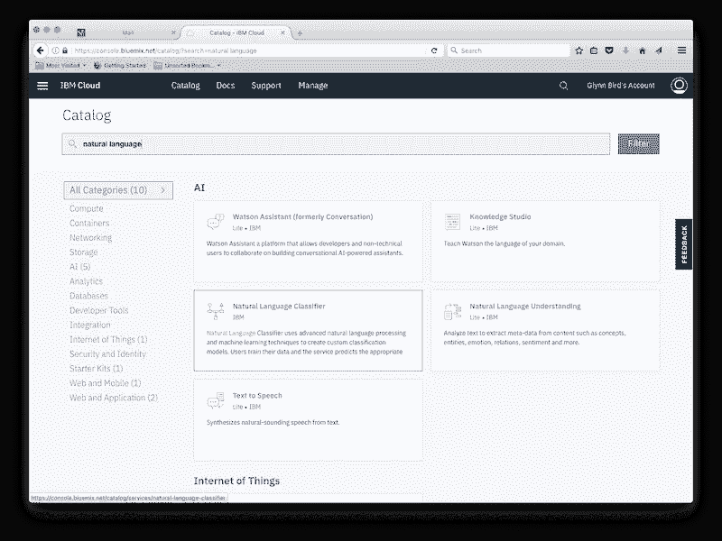
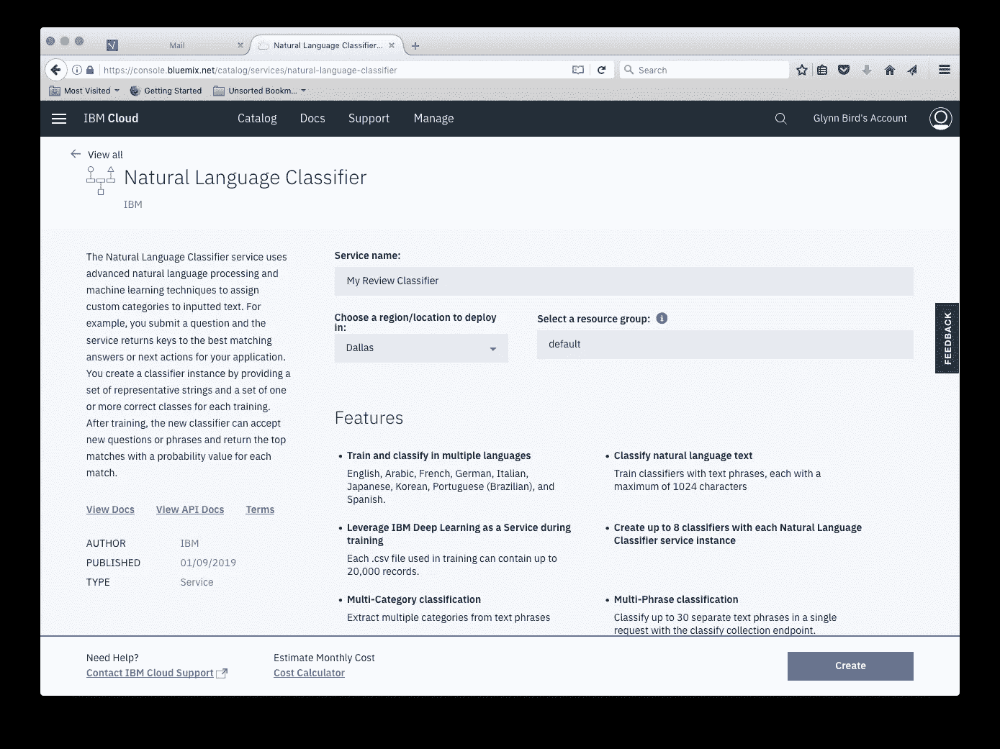
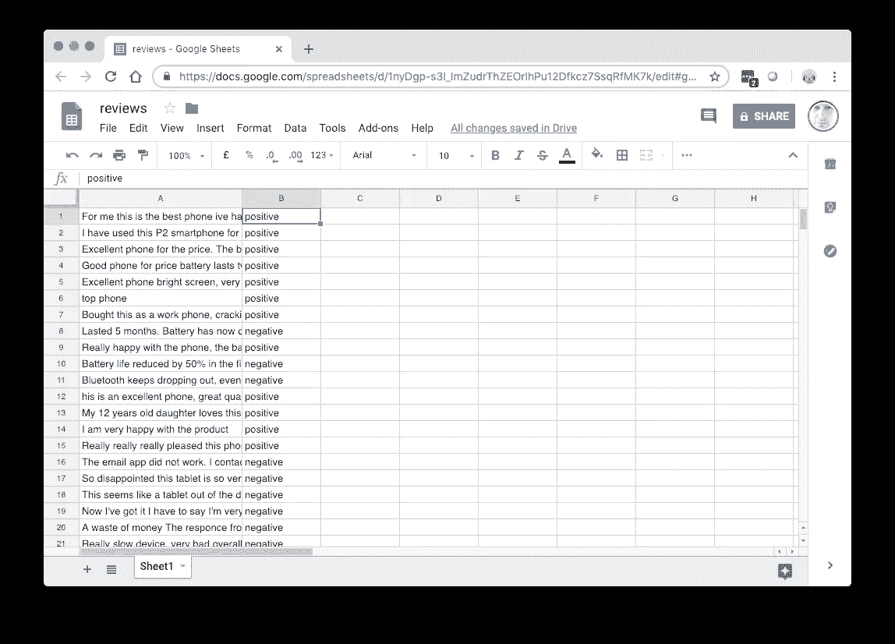

# 用 CouchDB 进行自然语言分类

> 原文：<https://medium.datadriveninvestor.com/natural-language-classifcation-with-couchdb-5a5396b86207?source=collection_archive---------12----------------------->

[](http://www.track.datadriveninvestor.com/1B9E)

## 在这篇文章中，我们将结合 Apache CouchDB 数据库和 [IBM 的沃森自然语言分类器(NLC)服务](https://www.ibm.com/watson/services/natural-language-classifier/)来自动判断网站上的评论是正面还是负面。

假设我们在一个电子商务网站上捕获产品评论，并将它们作为 JSON 存储在 CouchDB 数据库中:

```
{
  "_id": "product885252:review1005252",
  "date": "2019-01-26T15:22:41.000Z",
  "product_id": "885252",
  "product_name": "Gourmexia Smoothie Blender B662X",
  "reviewer": "susan1982",
  "review": "Very well made device. Works straight out of the box - really happy!"
}
```

过一段时间，我们的数据库将保存大量的评论，我们的用户可以通过这些评论来帮助他们做出购买决定。为了能够在网站上以正面和负面两栏显示评论，我们需要将评论分为正面和负面，并将该“摘要”存储在评论 JSON 中

```
{
  "_id": "product885252:review1005252",
  "date": "2019-01-26T15:22:41.000Z",
  "product_id": "885252",
  "product_name": "Gourmexia Smoothie Blender B662X",
  "reviewer": "susan1982",
  "review": "Very well made device. Works straight out of the box - really happy!",
  "summary": "positive"
}
```

当用户添加到评论中时，我们需要从用户那里捕获这种新的“摘要”数据，或者我们可以通过使用人工智能来推断评论是积极的还是消极的。通过用一些参考评论训练自然语言处理(NLP)模型，它应该能够对它没有看到的评论进行分类。

没有任何自然语言处理的经验，最好使用云服务，如[沃森自然语言分类器(NLC)服务](https://www.ibm.com/watson/services/natural-language-classifier/)。


Image by [Patrick Tomasso on Unsplash](https://unsplash.com/photos/Oaqk7qqNh_c)

# 签约雇用

只需通过搜索“自然语言”在您的 [IBM Cloud](https://www.ibm.com/cloud/) 仪表板中添加一个新的 NLC 服务:



Sign up for the Natural Language Classifier on IBM Cloud

选择服务名称并选择服务将运行的地理位置:



Choose your service name and geography

记下随您的供应服务一起交付的`URL`和`API Key`——我们稍后会用到它们。

接下来，我们需要训练我们的模型。

# 培训用数据

为了训练服务，我们需要给它一个 CSV 文件，其中包含正面和负面评论的例子。CSV 文件包含两列:第一列包含审查文本，第二列包含分类(肯定/否定:

```
terrible product. Rubbish,negative
The best thing I've ever bought! Recommended!, positive
I was really pleased with this device. Would buy again,positive
Total waste of time. Returned for a refund,negative
```

幸运的是，我们可以从 CouchDB 数据库中提取大量现有的评论文本。我使用了 [couchimport](https://www.npmjs.com/package/couchimport) 命令行工具，它允许我们将 CouchDB 数据导出为 CSV 文件:

```
couchexport — db reviews — delimiter “,” > reviews.csv
```

然后，我们可以将这些数据加载到一个电子表格中，删除这些列，这样我们就只有评论文本和一个正面/负面列。



Produce a two-column spreadsheet and export to a CSV file.

NLC 的最佳实践是在您的训练数据中使用少于 60 个单词的文本，最好从评论中删除对产品功能的冗长阐述，并保留用户对产品或服务发表意见的部分。

然后是填充第二列的艰苦过程。这是建立数据集的一次性过程，该数据集将训练 Watson 能够自动对未来的评论进行分类。完成后，将两列电子表格导出为 CSV 文件，我们就可以开始培训了。NLC 文档建议在训练集中每个分类有 5-10 条记录。

# 培养

Watson NLC 服务全部由 HTTP API 提供支持，因此我们可以使用 *curl* 从命令行完成所有工作。为了节省一些输入，让我们将 NLC 服务 URL 和 API 键放在环境变量中:

```
export URL="[https://gateway.watsonplatform.net/natural-language-classifier/api](https://gateway.watsonplatform.net/natural-language-classifier/api)"
export APIKEY="9955882a8785grneYRRXpg5M3wBq1XwY7798gstcUm
```

我们现在准备使用我们的`reviews.csv`文件来训练我们的分类器:

```
curl -i --user "apikey:$APIKEY" \
     -F training_data=[@reviews](http://twitter.com/reviews).csv \
     -F training_metadata="{\"language\":\"en\",\"name\":\"ReviewClassifier\"}" \
"$URL/v1/classifiers"
```

上面的命令给分类器一个名称，并指定编写审查数据的语言，并上传`reviews.csv`文件。(如果你收集不同语言的评论，每种语言都需要一个分类器)。

作为响应，API 返回一些 JSON:

```
{
  "classifier_id" : "9cccc4x485-nlc-1438",
  "name" : "ReviewClassifier",
  "language" : "en",
  "created" : "2018-12-20T11:05:53.740Z",
  "url" : "[https://gateway.watsonplatform.net/natural-language-classifier/api/v1/classifiers/9cccc4x485-nlc-1438](https://gateway.watsonplatform.net/natural-language-classifier/api/v1/classifiers/9cccc4x485-nlc-1438)",
  "status_description" : "The classifier instance is in its training phase, not yet ready to accept classify requests",
  "status" : "Training"
}
```

这表示我们正在训练的模型的`classifier_id`,并表明训练正在进行中。请记下这一点，因为我们稍后将需要它来查询模型。让我们将它存储在一个环境变量中，这样我们就不必一直输入它了:

```
export CLASSIFIERID="9cccc4x485-nlc-1438"
```

我们可以通过调用第一个请求传入的`classifier_id`中的另一个 API 来检查模型训练是否完成:

```
curl --user "apikey:$APIKEY" \
  "$URL/v1/classifiers/$CLASSIFIERID"
```

几分钟后，对这个 API 调用的响应将表明训练已经完成，我们准备好进行下一步了。

# 分类新数据

现在模型已经训练好了，我们可以向它传递以前从未见过的新数据，它将确定它是“正面”还是“负面”:

```
curl -G --user "apikey:$APIKEY" \
  "$API/v1/classifiers/$CLASSIFIERID/classify" \
  --data-urlencode "text=The item was terrible and did not work"
{
  "classifier_id" : "9cccc4x485-nlc-1438",
  "url" : "[https://gateway.watsonplatform.net/natural-language-classifier/api/v1/classifiers/9cccc4x485-nlc-1438](https://gateway.watsonplatform.net/natural-language-classifier/api/v1/classifiers/9cccc4x485-nlc-1438)",
  "text" : "The item was terrible and did not work",
  "top_class" : "negative",
  "classes" : [ {
    "class_name" : "negative",
    "confidence" : 0.9608260421942736
  }, {
    "class_name" : "positive",
    "confidence" : 0.03917395780572638
  } ]
}
```

结果数据将向您显示

*   `top_class` -哪种分类最合适。
*   `classes` -模型赋予每个类的置信度的分解。

对于我们的用例，我们可以简单地将`top_class`值添加到我们的 review JSON 中。

# 接上水管

剩下要做的就是在从 web 前端提交新产品预览时调用“classify”API 端点，并在我们存储的 JSON 中显示“top_class”值。调用可以在任何地方进行，但是如果您在地理上尽可能靠近您的应用服务器的地方提供您的 Watson 模型，您将获得最小的延迟。

任何编程语言都很容易访问 HTTP。下面是一个 Node.js 函数，它对传入的字符串进行分类:

Sample Node.js code to classify new review text.

可以按如下方式调用它来提取“top_class”值:

```
const c = await classify('this product is terrible')
console.log(c.top_class)
```

# 有用的链接

*   [15 分钟内上手 AI](https://medium.com/ibm-watson/get-started-with-ai-in-15-minutes-28039853e6f3)
*   [IBM 的沃森自然语言分类器(NLC)服务](https://www.ibm.com/watson/services/natural-language-classifier/)
*   [IBM Cloudant](https://www.ibm.com/uk-en/cloud/cloudant)