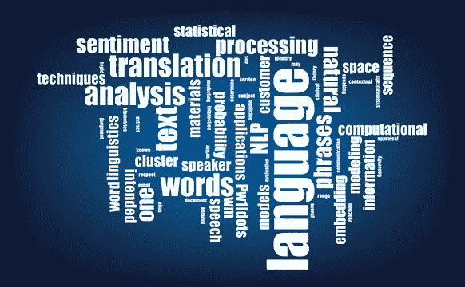
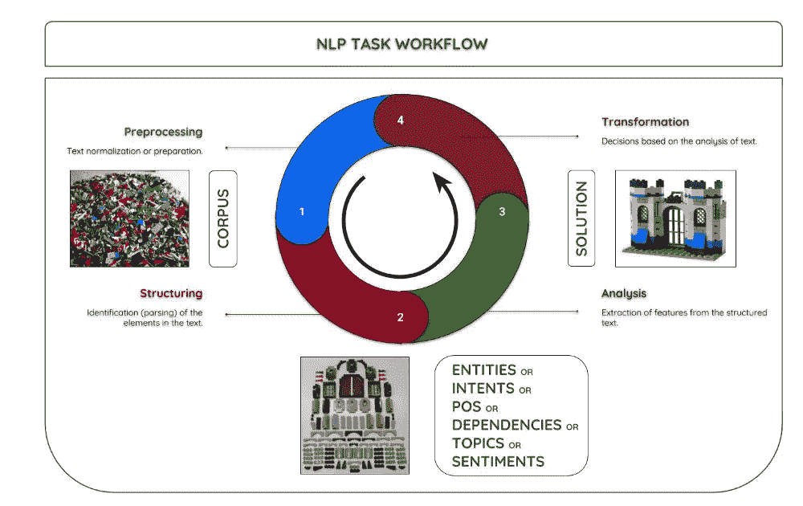

# 自然语言处理

> 原文：<https://medium.datadriveninvestor.com/natural-language-processing-dd831607a9c0?source=collection_archive---------35----------------------->

Source : [AnalyticsVidhya](http://www.analyticsvidhya.com)

如今，每个人都在处理海量数据。数据包括很多东西:世界各地的人之间的通话记录，一天内的推文，不同人之间交换的 WhatsApp 消息。从这些数据中提取一些重要的东西或者使其变得有用是非常耗时的，并且需要付出大量的努力。从文本数据中提取有用信息的过程称为自然语言处理(NLP)。

我们可以在不同的算法和不同的计算中使用这些提取的信息。

所以基本上，通过使用 NLP 及其组件，我们可以组织无组织的数据，并可以执行许多自动化任务。现在我们将讨论它的不同功能和技术。

1.  **词干化:**将单词还原为其词根或原始形式的过程。词干化可以把相关的词归到同一个词根。例如，好、更好、最好可以分别简化为**【好、更好、最好】**。
2.  词条满足:将一组单词简化为词条或词典形式的过程。它考虑词类，即一个词在句子中的意义，然后将这组词简化为引理。例如，好、更好和最好可以满足于**好。**
3.  **单词嵌入**:一种可以用来以实数的向量形式表示自然语言的技术。它们非常有用，因为现在的计算机不能处理自然语言。他们使用实数识别自然语言中单词之间的关系。
4.  **词性标注**:将句子中的单词标注为名词、动词、形容词的简单方法。
5.  **情感分析**:主观分析的一种形式，使用自然语言处理技术来识别不同的情感。这些情绪可以由不同的消费者拿出一些关于他们观点的信息，通过语音分析或文字分析来判断情绪。
6.  **语义文本相似度**:识别两个或多个文本在文本意义方面的相似性，而不是分析任何文本的语法的过程。我们在这里谈论的是相似之处，而不是关系，这两件事是完全不同的。
7.  **文本摘要**:这是一个通过识别数据的重要点并使用这些点创建摘要来缩短文本的过程。文本摘要的主要目标是通过最大限度地缩短文本来保留最大量的有用信息，而不改变原文的含义。

## 了解 NLP 项目的工作流程

Source : [Medium](http://www.medium.com)

1.  **预处理**:一个非常基本的定义就是清理脏的、无组织的数据，使之成为结构化的数据。自然语言处理可以被认为是一套工具，可以用来为不同的目的构造自然语言。这里有一些有用的信息，我们的数据集被称为*【语料库】*，因为它是由文本信息组成的。使用 NLP 对数据进行预处理，这被称为文本规范化或数据准备。
2.  **结构化**:这个过程包括识别需要的元素。我们已经讨论了结构化数据所需的一些技术。
3.  **分析**:提取执行不同任务的特征。
4.  **转换**:将收集到的信息转换成某种可解释的来源，以便做出决策、观察、分析的过程。