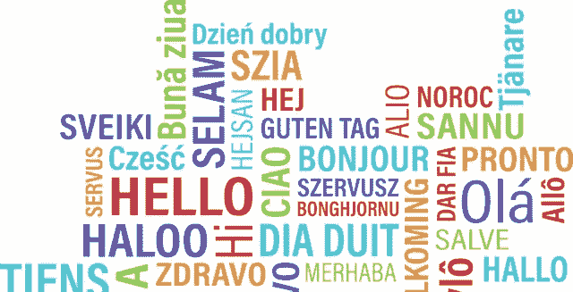

# 自然语言处理(NLP)——简单说

> 原文：<https://medium.datadriveninvestor.com/natural-language-processing-nlp-in-few-words-546c4dfeda17?source=collection_archive---------4----------------------->

# [自然语言处理](https://engmrk.com)

> *自然语言处理是一个与计算机理解、分析、操纵和潜在生成人类语言的能力有关的领域。*

人类语言可以是英语、法语、西班牙语或任何其他我们日常交流使用的语言。计算机或任何编程语言都不理解人类语言。例如，他们不知道“自然”这个词是什么意思。他们看到它有六个字符长，但是单个字符没有任何意义。

一个很好的例子就是垃圾邮件的分类。我们阅读电子邮件，并根据内容判断电子邮件是否是垃圾邮件。类似地，电子邮件服务器根据正文内容、主题以及可能的电子邮件域来确定收到的电子邮件是否是垃圾邮件。第二个例子是自动完成，谷歌基本上是根据你已经输入的内容和其他人通常用相同的短语搜索的内容来预测你感兴趣的搜索内容。第三个例子是自动纠正，MS word 试图帮助您纠正拼写错误。其他例子可能是情感分析、主题建模、文本分类和句子分割或词性标注。

# [自然语言工具包(NLTK)](https://engmrk.com)

自然语言工具包(NLTK)是 Python 中处理自然语言处理任务最常用的包。它是一套开源工具，最初于 2001 年在宾夕法尼亚大学创建，目的是使用 Python 构建 NLP 过程更容易。自从最初开发以来，这个包已经通过开源用户的广泛贡献得到了扩展。NLTK 通过为您提供基本的工具，基本上为构建任何 NLP 过程提供了一个快速的起点。我们可以将这些基本工具链接在一起以实现最终目标，而不是从头开始构建所有这些工具。

# [**参考:**](https://engmrk.com)

Derek Jedamski 的用于机器学习的 NLP 和 Python 基础培训

# [关于我:](https://engmrk.com)

我是一名专业的工程师、热情的程序员、热情的数据科学家和机器学习学生。你可以通过 engmrizwank@gmail.com 联系我或者访问 https://engmrk.com