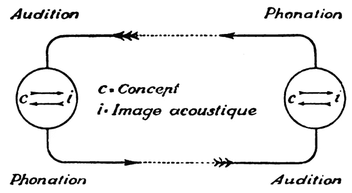

# 自然语言研究需要数据驱动理论

> 原文：<https://medium.datadriveninvestor.com/natural-language-research-needs-data-driven-theory-f65a208f5db7?source=collection_archive---------7----------------------->

How can we tackle natural language if we have linguistic models like [this](https://upload.wikimedia.org/wikipedia/commons/e/e8/Saussure-cours-p-028.png)?

在社交聊天机器人上，姚[发表了一篇关于最流行的自然语言处理方法](https://medium.freecodecamp.com/how-natural-language-processing-powers-chatbots-4-common-approaches-a077a4de04d4) (NLP)的详细而平易近人的概述，其中强调了指导这些方法的理论。我发现她的总结很有趣，因为我是一名以数据为中心的语言学家(社会语言学和语料库语言学)，与计算机科学家和程序员合作制作文本分析工具。在我看来，姚的总结指出了自然语言处理进展如此缓慢的三个关键原因:

1.  NLP 研究由非常聪明、计算复杂的人主导，他们对语言的了解远不如计算机。
2.  当 NLP 研究人员与语言专家合作时，是与最终来自基于哲学(而不是科学)的传统的语言学家合作，[，并且使用内省和直觉而不是数据](http://web.stanford.edu/~wasow/Lingua_data.pdf)。
3.  基于数据的语言科学方法——T4 涌现理论和面向数据的学科，如[社会语言学](http://repository.cmu.edu/cgi/viewcontent.cgi?article=1013&context=english)和[语料库语言学](http://www.uni-klu.ac.at/iaa/downloads/CORPUS_LINGUISTICS_-226_THE_BASIC_FORM_OF_LINGUISTIC_ANALYSIS_NDobric.pdf)——在 NLP 研究中使用得更少。

想想这句来自麻省理工学院媒体实验室的话(Yoa 引用了这句话):

> *语言是以经验为基础的。与根据其他单词定义单词的字典不同，人类根据与感觉运动体验的关联来理解许多基本单词*

对于外行人来说，这听起来很合理，但这与基于对现实世界的经验观察的科学方法不一致:实际上，语言是基于与其他人的社会互动的*。想象语言如何工作的理论和基于数据的理论之间存在巨大的脱节，后者承认人类从周围的人那里学习语言。NLP 研究人员喜欢在他们的工具和方法中使用数据，但是他们经常从非数据驱动的语言理论出发工作。*

*没有基于数据的理论来指导研究存在一个严重的问题:基于直觉的模型，如**句法** / **语义** / **语用**限制了研究。你可能听说过“所有的模型都是错的，但有些是有用的”，但有些模型既错又不太有用。当你开始以数据为基础研究语言时，你必须放弃像*句法*这样的想法(语言使用背后有隐藏代码的想法)，因为它与数据不符。[在现实世界中，语言没有固有的系统或代码——它有一个*涌现的结构*:世界上有数百种结构化的说话方式，在我们说话和写作时缓慢但不断地变化和发展，最终基于大量的社会互动](https://pdfs.semanticscholar.org/a37e/a863e3623850e77be7ab947b77f1ec3e46f6.pdf)。*

*以数据为基础的模型可能更有用，它将语言视为一个多层次的整体，每个层次都是相互联系的。*

1.  *词汇:词汇层次的语言。*
2.  *词汇语法:在单词的*类型*层次上的语言。*
3.  *主题:主题层次的语言*主题层次的语言*或信息层次的语言*。**

*尽管这个模型是错误的，但我们至少有一些实际有用的东西。我们可以思考人类是如何识别流派的，例如*哥特式*(废弃的地方、家庭秘密、恐惧等)。).但我们也可以使用机器来做同样的分类:在词汇层面，通过查看最频繁的词频( *him* 、 *his* 、 *was* 等)。)，或者在词汇语法层面通过立场标记(转述事件、人称代词、恐惧等)。因为可以看到这些级别是作为一个整体联系在一起的，所以我们现在有多种功能可以用作钩子，以便机器可以更好地完成现实世界的任务，例如整理数百万份文件以找到相关文件，对社交媒体帖子进行分类以检测潜在危险，或者了解暴力极端分子的在线招募技术。*

*目前关于自然语言处理的工作，无论是理解消费者态度这样的商业任务，还是通用语言人工智能(可以像人类一样“阅读”的计算机)这样的登月目标，都需要基于数据的语言理论。如果没有这一点，NLP 中的计算专家就会沦为技术人员:深入了解他们的工具，但也不知道这些工具应该应用在哪里/做什么。*

*不过还是有希望的。在姚的文章中，她总结的 NLP 的四种方法中的最后一种是“交互式学习方法”她引用斯坦福大学计算机科学教授 Percy Liang 的话:*

> *“语言本质上是互动的……我们如何表现知识、背景和记忆？也许我们不应该专注于创造更好的模型，而是更好的互动学习环境。”*

*我们在语言中做的所有事情——选择具有上下文相关效应的特定单词，通过风格移动微妙地构建姿态——都是数十亿次智能人类交互的结果。因此，如果我们希望人工复制人类语言智能的能力和用途，我们最好记住，智能的特征是社会性和互动性。*