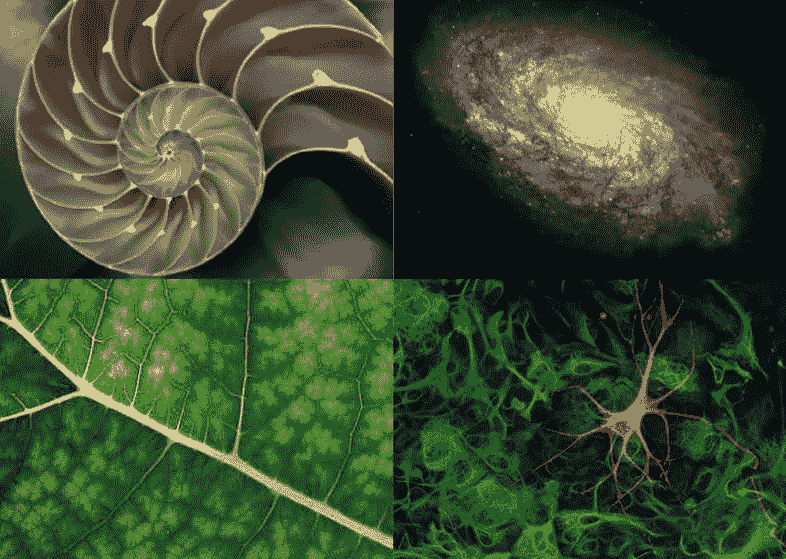

# 自然是生产性社会的有效模式

> 原文：<https://medium.datadriveninvestor.com/nature-is-an-efficient-model-for-productive-societies-4b237ab71a1f?source=collection_archive---------14----------------------->

当我们审视人类社会时，我们会立即注意到混乱的行为和有序的行为。因为自由意志而混乱。我们对环境变化的敏感性经常会扰乱我们的正常生活，从而扰乱其他人的生活。因此，我们认为人类是不可预测的。我们的社会是有序的，因为几千年前，我们建立了行为规则，以尽量减少社会紧张。然后，我们的生物学遵循一定的规则，因为所有人都是以同样的方式构建的，总体上几乎没有差异。这些让我们在混乱中变得有些可预测。

我们不去想它，因为它一直都是这样的。秩序与混乱和谐共存。尽管人类互动的不可预测性，我们还是很有效率。

如今，我们有如此多的方法来衡量行为，跟踪动作，交流，情绪状态等等。我们可以使用人工智能、互联网云和越来越多的传感器来捕捉描述人类活动的成堆信息。科学家和社会学家，比如经常被提到的马斯洛，也已经发现了是什么让人类生存。我们现在明白，我们的情绪是大脑产生的化学物质，向我们的身体发送信号，驱使我们采取行动。我们了解自然世界，了解我们如何受到它的影响，以及它如何影响我们。我们对大脑如何转化为社会互动的理解还只是皮毛，但我们知道这并不神奇。我们知道我们周围的环境每时每刻都在影响着我们，我们也无时无刻不在影响着我们的环境。

我在之前的一篇文章中写过世界是如何保持物理和化学平衡的。因为我的观点是基于有效的研究和事实，我认为描述我们周围影响整个星球的化学方程式的恒定平衡是很重要的。名言“蝴蝶翅膀的颤动在地球的另一边造成飓风”说明了在像地球这样的封闭化学系统中物质和能量是如何联系在一起的。因为我们实际上是这个世界的一部分，所以我们的混乱行为产生了波及整个星球的多米诺骨牌效应，就像涟漪效应一样。因此，我们的社会处于不断混乱的变化之中。然而，我们的行动和反应遵循基于我们大脑和情感工作方式的既定规则。我们观察我们社会中秩序和混乱之间的芭蕾。

如果你记得你的科学课，分子总是反应以保存尽可能多的能量。科学家称之为能量守恒定律。为了生产大自然无法自己创造的小部件，我们需要花费比最终产品所含能量更多的能量。我们强迫物质朝着更高的能量非自然成形，而不是物质自然分解成更低的能量状态。我们的社会称之为建筑，这是对的。随着人类的成熟，我们没有意识到的是，我们一直在使用低效的生产方式。迄今为止，我们没有利用消耗尽可能少的能量的自然力来保持世界的化学平衡，而是破坏了这种平衡来建造我们需要的东西。我们对地球的物质和能量如何相互联系和平衡缺乏了解的结果是破坏自然秩序。我们可以把它称为负面环境影响或其他术语。

但是，我们又一次对世界的化学、物理定律以及生物如何相互作用有了更多的了解。因此，我们可以更聪明地建造我们需要的东西。

有了正确的理解，我们可以拥有一个富有成效的社会，同时在自然高效率的物理法则，即自然法则的范围内工作。

由于自然是以有组织的混乱方式运作的，为了高效并与我们的星球和谐相处，我们必须在这种有组织的混乱的规则下进行建设。如果我们使我们的建筑过程适应地球的化学平衡，我们的过程也将是高效的，同时对环境的破坏更小。

此外，除了生产商品，如果我们使我们的社会模式适应自然的低能量模式，我们的社会互动也将是低维护的，感觉更自然，更有效。我们必须停止试图控制每个人做的每一件事。相反，我们应该理解人类的核心情感，社会的有组织的方面，并让彼此自由实验。我们应该自己犯错，在最低限度的社会规则下混乱地互相碰撞。

我们经常因为旧传统和信仰带来的恐惧而限制我们的自由。我们的祖先在过去创造了古老的传统和信仰，在那里我们不了解物理世界，也不知道人类有多可预测，知道大脑在某些刺激下如何工作。出于对未知的恐惧，我们无知的过去给了我们行为准则和道德准则。随着信息的获取，我们今天有足够的理由拒绝大多数传统和信仰，只保留那些符合世界现实的传统和信仰。我们必须根据我们对世界和自己身体越来越多的了解来调整我们的社会规则。

随着我们掌握的所有技术和不断增长的理解，我们可以从自然界中发现的有组织的混乱中吸取教训，拥有一个规则最少的社会。这几条新规则在生活的沙盒周围形成了边界，在那里人类互动的混乱可能发生。我们可以设计一个高效的社会，同时从地球上获取我们需要的东西。

关键是巧妙的设计。我们可以应用我在另一篇文章中写过的一个概念，叫做[“沙盒管理原则”](https://medium.com/datadriveninvestor/the-importance-of-seeing-the-world-as-a-chemical-system-9bca0c52587c)。。

简而言之，当我们没有长期的压力时，人类是社会性的，给予和爱(比如持续害怕失业或生活在帮派社区等等)。…).当压力较低时，人类社会会自我管理，偶尔会发生意外。这种已知的行为是每个活着的人的生物学的产物，所以它是可预测的行为。在我们基因编码的规则中，可能会有混乱。然而，一个不可预测的混乱社会，爱和分享根植于个人动机中，并不具有威胁性。相反，听起来很完美。毫无疑问，这样一个低压力的社会仍然会有困难，因为混乱意味着系统的偶尔失衡，导致人口中周期性的压力，这将导致一些反社会行为。但是有了正确的检查，社会通过治愈那些偏离轨道的社会成员来自我调整。

这种带有最小规则的社会模式只在最小的慢性压力下有效。我们将在这种有组织的混乱中生活得很好，几乎不需要像司法机构和矫正机构这样昂贵的矫正社会系统。一个健康、低压力的社会能够自我管理。

为了创造这个新的社会，我们需要重新思考我们是谁，我们为什么在这里。从根本上说，我们的存在不是为了工作和恐惧未来。我们的身体被设计来追逐快乐和避免负面情绪。我在我的第一本书[“工程天堂:你准备好了吗？”](https://www.amazon.com/Engineering-Paradise-Are-You-Ready/dp/1773705784)。人类需要的是我们的身体生存所需要的:食物、水、住所和安全。随着人工智能和自动化的应用，人类需要的是发现自己在社会中的位置。发现一个人在世界上的位置是一个个人的旅程，与其说是基于生物学，不如说是基于我们在寻求快乐时的个人经历。

为了创造这个高效而又多产的社会，我们所需要的只是愿意重新设计我们的世界。我们的社会经济和政治制度已经过时，而且往往已经过时。我们可以做得更好。

如果你希望建立一个更美好的世界，没有比现在更好的时机了。