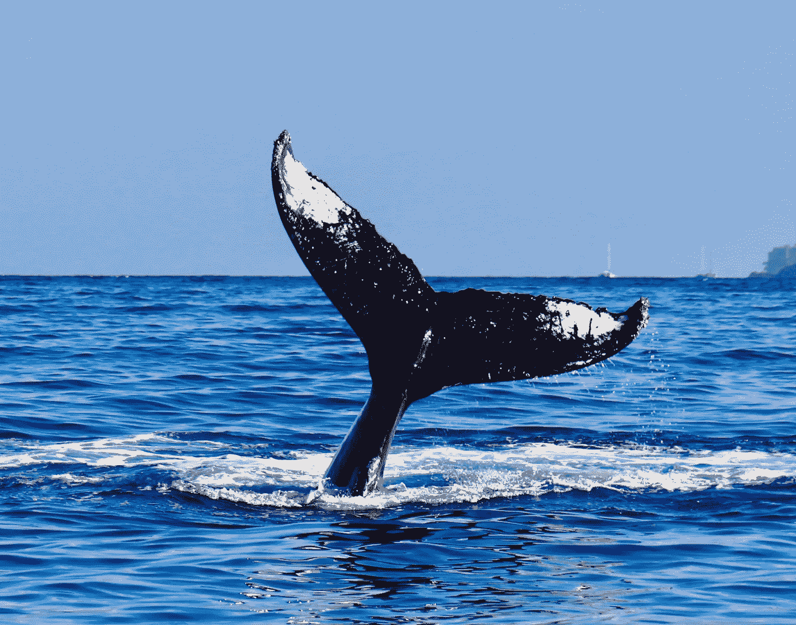
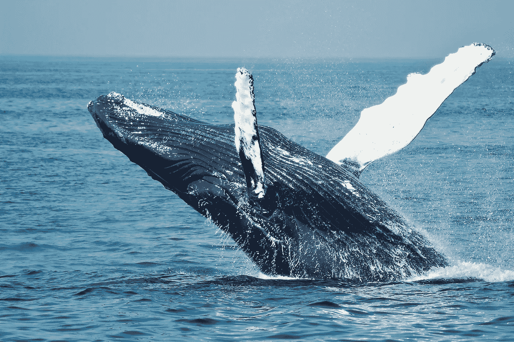
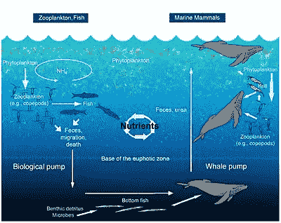
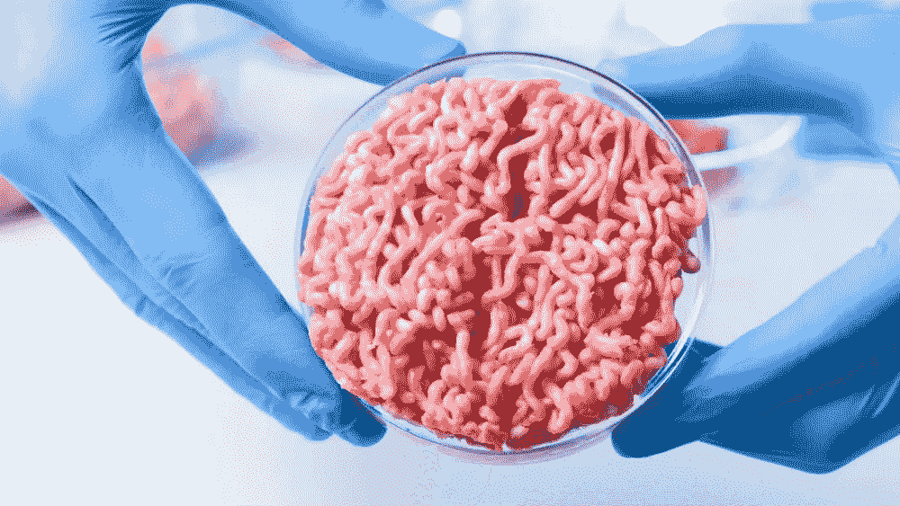
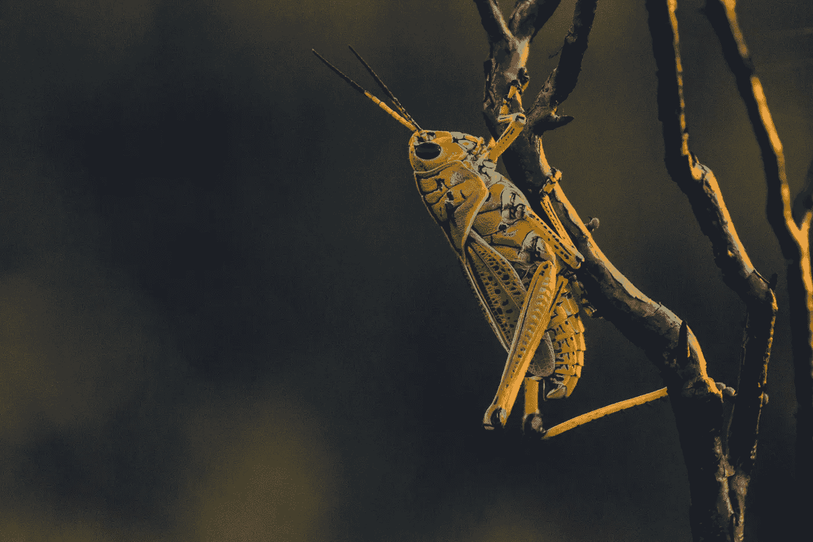
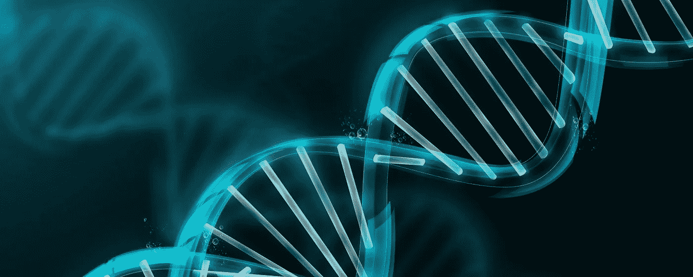
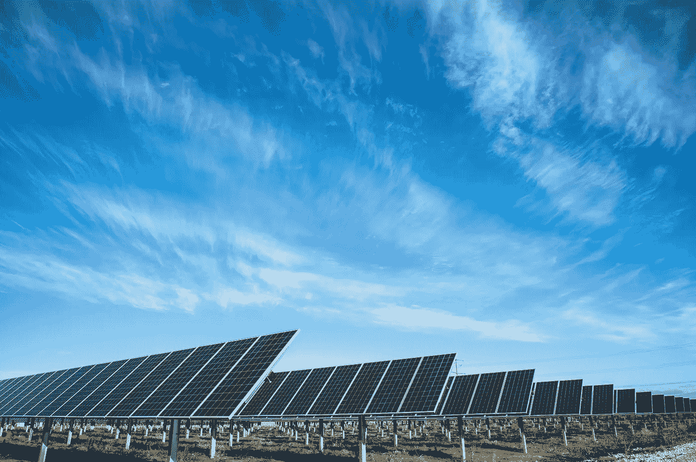
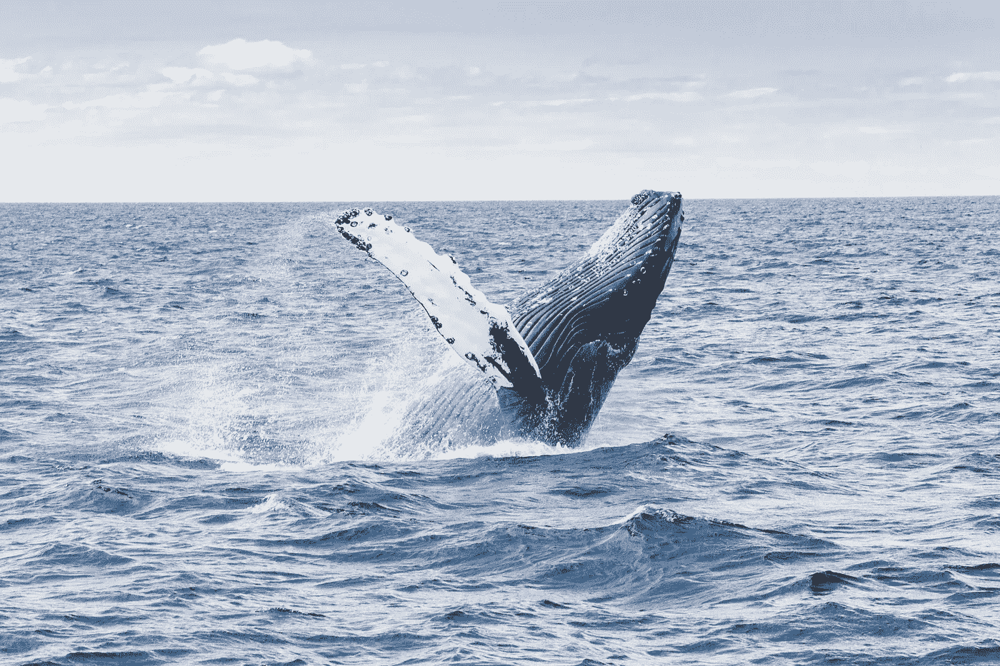

# 大自然百万美元的杰作🐳

> 原文：<https://medium.datadriveninvestor.com/natures-million-dollar-masterpiece-706d49fad6d8?source=collection_archive---------3----------------------->

## 鲸鱼如何帮助阻止气候变化，以及我们如何利用技术保护它们。

# 大自然解决气候变化的办法在于鲸鱼。

和其他光合生物。

(Credit: Andrew Bain)

是的，你没看错！

## 鲸鱼可以帮助阻止或逆转全球变暖的影响。

我知道这很神奇。

当我读到这个消息时，我大吃一惊。🤯

为什么这如此有趣？

**由于温室气体排放和地球大气水平以惊人的速度上升，全球变暖现在是一个巨大的问题**！

对此采取措施的时间已经不多了。⏰

事实上，联合国(UN)刚刚发布了一份新的气候报告，即《2019 年排放差距报告》，这给这个已经很紧迫的问题带来了更大的紧迫性。

**令人震惊的事实来自** [**本报道**](https://www.unenvironment.org/resources/emissions-gap-report-2019) **包括:**

*   尽管有科学警告和政治承诺，GHG(温室气体)的排放量仍在继续上升
*   除了一种以外，美国所有的 493 种濒危物种都将努力适应气候危机。那只是在美国。🥵
*   *我们不太可能将全球气温上升限制在 1.5 摄氏度以内。*

## 你为什么要关心全球变暖？

由于大气中温室气体含量增加导致全球气温上升，对我们的星球产生了许多毁灭性影响。这包括:自然灾害、栖息地丧失等对物种的威胁，等等。

 [## 气候变化、ESG 和对更好数据的追求|数据驱动的投资者

### 在地球上许多地方经历了另一个令人难以置信的炎热夏季后，来自 S&P 的最新发现…

www.datadriveninvestor.com](https://www.datadriveninvestor.com/2018/08/24/climate-change-esg-and-the-quest-for-better-data/) 

幸运的是，研究人员可能已经找到了部分解决方案。💡

# 鲸鱼拥有不可思议的沉碳超能力！

研究人员从国际货币基金组织的这份报告中发现:

*   **一个🐳一生中吸收 33 吨碳。**
*   **答🌳活 100 年的人会吸收 2.4 吨碳。**

一条鲸鱼比一棵树吸收的碳多 13 倍！

这打破了许多生态学家以前的信念，即树木是战胜气候变化的关键。

> “我们对抗气候变化最有力的武器。”— 生态学家托马斯·克罗泽在🌳s

托马斯宣布种植数万亿棵树可以抵消二氧化碳排放后，几场植树运动获得了动力。

# 鲸鱼是天然的碳汇。

据《国家地理》报道，鲸鱼是大自然价值百万美元的杰作，因为它们拥有超强的光合能力。✨

They have superpowers! 😍(Credit: Todd Craven)

我一直在写鲸鱼*是如何吸收大量碳的。*

你们中的一些人可能想知道…

## 什么是碳汇？

碳汇就是储存碳。这很简单。

鲸鱼将碳沉积在体内。更具体地说，它们有超能力将碳储存在富含脂肪和蛋白质的体内。当一条鲸鱼死亡时，它的尸体沉入海底，将碳封存在那里数百至数千年。他们是字面上的碳*汇*。😉

没有多少动物有光合能力。最常见的是，当我们想到经历光合作用过程的生物时，我们会想到植物。🌱

然而，有一些光合动物。其中大部分是海洋动物，比如鲸鱼！🌊

鲸鱼是天然碳汇的一个例子。天然碳汇是储存碳的天然水库。

**天然碳汇包括:**

*   **海洋:**有趣的事实——海洋吸收了全球大约 80%的碳。使它成为世界上最大的碳汇和氧气生产商！
*   **动物:**鲸鱼、微生物、贝类等。
*   **植物:**农作物、花卉、树木等。🌸

鲸鱼不仅在从我们的大气中沉淀碳方面起着重要的作用。它们在浮游植物和其他微生物的生产中也起着关键作用。

# 浮游植物是许多水生食物网的基础。

它们是一种微型海藻，为从水母到鲸鱼的各种海洋生物提供食物。

The whale — plankton food web.

为了让浮游植物(和其他微小生物)生长，它们需要鲸鱼的排泄物。

所有这些微小的生物，如浮游植物，都要对产生的大约 40%的二氧化碳负责，我们要部分感谢鲸鱼。😎

# 我们需要保护鲸鱼。

不言自明吧？

> “我们需要做的就是让鲸鱼活下去。”—国际货币基金组织报告的作者

这应该很容易。

然而，有一个巨大的问题。

## 捕鲸。

自 1987 年以来，每年有超过 16，000 头鲸鱼因为捕鲸而被杀死*又名*捕鲸*。😭*

*商业上捕杀鲸鱼是为了获取有用的产品，如鲸肉和鲸脂。*

*它们的肉+鲸脂可以变成油，自从工业革命以来，这变得越来越重要。🔥*

***捕杀鲸鱼的其他原因包括:***

*   ***文化传统🎣许多土著文化将捕鲸作为他们社区的传统。捕鲸的目的是为了*消费肉类和保护他们的文化传统。这种类型的捕鲸不是商业性的，而且通常更具可持续性。国际捕鲸委员会授权某些土著社区继续他们的捕鲸活动。****
*   ***香水/香水行业💄**——鲸鱼产生**龙涎香**，这种龙涎香在世界各地被用来制造香水、古龙水和其他有香味的产品。*龙涎香是鲸鱼产生的一种肠道混合物。*自 1972 年以来，在美国，在产品中使用这种物质是非法的，因为它必须从高度濒危的斯*彼尔姆鲸身上获取。然而，世界各地仍在继续捕鲸以获取这种稀有物质。**
*   ***划船事故**🚤**——很多时候，船夫意识不到一条鲸鱼正靠近他们的船，直到为时已晚，他们已经杀死了鲸鱼。***

***由于捕鲸行为，目前所有的鲸鱼都濒临灭绝，许多像抹香鲸一样的鲸鱼也面临灭绝的高风险(WWF)。***

***这不仅仅是为了保护鲸鱼。***

## ***我们需要优先照顾我们的地球。***

***保护鲸鱼是一回事，但是如果鲸鱼没有生活在一个平衡的生态系统中，它们就不会茁壮成长。***

***保护我们星球上的所有自然碳汇和剩余物种/生态系统需要成为优先事项。🔑***

***目前，每天有 150-200 种植物、动物、昆虫和其他生物灭绝！***

***当一种动物灭绝或濒临灭绝时，整个生态系统就会被破坏并永远改变。***

***需要做些什么来改变这种情况，答案可能就在新兴技术中。⬇️***

# ***利用新兴技术保护鲸鱼和其他海洋生物。***

***为了应对捕鲸等恶劣的环境行为，法律、法规和政策已经到位，以防止它们。***

***然而，目前保护鲸鱼等动物的方法不再减少了。***

***即使有众多的法律、法规和政策，许多人仍然找到漏洞继续商业捕鲸活动。😔***

## ***我认为新兴技术将改变世界！***

***人工智能、区块链、基因组学、垂直农业等技术可以用来破坏解决问题的方式和当前流程的完成方式。😎***

***我有一些想法，可以让我们利用这些指数级的技术来解决我们的捕鲸问题，保护我们的星球，并通过保护大自然的解决方案来减缓气候变化。🐋***

***查看它们:***

## ***1)肉类替代品(细胞农业)。***

******

***Hamburgers without the cows. 🤯***

***捕鲸的一个主要原因是为了它们的肉和鲸脂。如前所述，它们的肉和脂肪被用于生产油，但是它们的肉的另一个用途仅仅是供人类食用。***

***像日本这样的国家无视国际捕鲸法律，捕杀鲸鱼，有时甚至捕杀海豚。😭***

***通过使用更可持续的替代蛋白质技术，如*细胞农业和农业*，消费鲸鱼肉的需求可能会下降。***

*****细胞农业**是一种*替代蛋白质技术*，它专注于利用*组织工程、生物技术、分子生物学和合成生物学的结合，通过细胞培养生产农产品，如牛、猪，也许有一天会生产鲸鱼。****

***这些技术结合起来，设计出生产蛋白质、脂肪和组织的新方法，与目前的农业实践如畜牧业或日本捕鲸相比。***

***随着细胞农业的使用，鲸鱼肉可以在实验室里用创新的生物技术制造出来，而不需要杀死鲸鱼。***

***另一种可供选择的蛋白质是农业或昆虫养殖。***

******

***(Credit: Gouthaman Raveen)***

***就水的使用、土地的使用、饲料到蛋白质的转化以及其他一些因素而言，饲养昆虫(如蟋蟀)比目前的畜牧业更具可持续性。***

***通过食用昆虫来替代目前的牲畜(如对环境有巨大影响的奶牛)和捕杀鲸鱼，我们可以帮助保护大自然应对气候变化的解决方案。🐳***

***细胞农业、生物农业和其他蛋白质替代品都有助于阻止为食用肉类而捕鲸。***

## ***2)使用 CNN 追踪鲸鱼和非法活动(人工智能)。***

******

***(Credit: Unknown)***

***人工智能有可能颠覆几乎所有行业，非法偷猎/狩猎就是其中之一。***

***使用一种被称为 **CNN 或卷积神经网络的人工智能，可以更准确地阻止非法捕鲸，并防止涉及鲸鱼(和其他海洋生物)的划船事故。*****

***简而言之，CNN 可以在数据集上进行*训练，以学习如何对图像进行分类。****

***海洋卫星图像可以实时输入 CNN，并进行分类，以识别鲸鱼是否靠近船只或鲸鱼是否被猎杀。😎***

***这些数据可以用来让当地的船夫知道有一只鲸鱼靠近他们的船，这样他们就不会撞到它；非法捕鲸让当局知道捕鲸正在进行+在哪里。***

## ***3)受鲸鱼启发的基因研究和工程(遗传学)。***

******

***(Credit: Harvard)***

***我们已经知道鲸鱼有超强的碳汇能力！***

***他们的能力都在于他们的基因。***

***通过*测序和研究它们的基因组*，这是它们 DNA 的完整副本(点击此处了解更多[基因组](https://medium.com/datadriveninvestor/a-journey-into-the-genome-a6235c8eb81f?source=---------8------------------)，我们可以找到负责它们碳汇能力的特定*基因、等位基因和遗传途径。****

***利用基因工程，我们可以在其他生物中复制这些途径、基因和等位基因，帮助它们增加碳吸收能力。🎉***

## ***4)太阳能发电(替代能源)。☀️***

******

***Ouuu 😍***

***除了食用鲸鱼肉，捕杀鲸鱼是为了它们的肉和鲸脂，这样它们就可以变成有用的产品，比如我们用作能源的石油、塑料等。***

***在能源领域，我们可以开始使用更多的替代能源，如太阳能和核聚变+裂变，以取代目前的石油需求方法。***

***这不仅有助于降低对石油的需求，这可能有助于减少捕鲸活动，而且使用替代能源技术将有助于降低温室气体排放。***

# ***🔑外卖食品***

*   ***全球变暖现在是个大问题。***
*   *****鲸鱼是天然碳汇，一生有能力沉下 33 吨碳。相比之下，一棵活了 100 年的树最多能吸收 2.4 吨碳。*****
*   ***鲸鱼的排泄物帮助浮游植物茁壮成长。***
*   *****浮游植物和其他海洋微生物吸收了全球超过 40%的大气碳。*****
*   ***由于捕鲸等人类活动和全球气温上升，鲸鱼和其他物种正以惊人的速度消失。***
*   ***我们需要保护鲸鱼和我们的星球。替代蛋白质、替代能源、卷积神经网络和基因工程等技术可以帮助我们做到这一点。***

# *****对于感兴趣的读者，谁想了解更多:*****

*   ****阅读更多关于* [*联合国排放差距报告 2019*](https://www.unenvironment.org/resources/emissions-gap-report-2019) *。****
*   ****查看此发现背后的* [*研究*](https://www.imf.org/external/pubs/ft/fandd/2019/12/natures-solution-to-climate-change-chami.htm) *。****
*   ***你是高中生吗(和我一样),想了解可以用来解决你感兴趣的问题的新兴技术吗？ [查看*知识社会*](https://theksociety.com/) *。*😉***
*   ****了解更多关于* [*浮游植物和其他海洋生物*](https://marinebio.org/creatures/forests/) *。****

***结合当前保护鲸鱼和我们地球的法律、法规和政策，技术可以帮助我们改变保护地球的方式。🌎***

***我现在只有几个想法，即使它们可行，也需要大量的合作才能实现。***

***如果你有任何帮助保护鲸鱼、我们的星球或改变世界的想法，现在就开始着手吧，给我发电子邮件，联系一些可能有助于保护鲸鱼或任何其他相关技术的项目——电子邮件:astronautadara@gmail.com***

***我也鼓励你做出更多有环保意识的决定，比如如果可以的话，转而使用替代能源或蛋白质。或者更小的行动，比如步行去学校来减少你的碳足迹。***

***每一点小小的贡献都有助于并将结合解决潜在的气候问题，创造巨大的变化。***

***我将引用国际货币基金组织报告中的一段话:***

> ***"大自然花了数百万年来完善她基于鲸鱼的碳汇技术."***

***让我们确保这几百万年不会白过。🔑***

******

***One of Earth’s many majestical creatures we need to protect. (Credit: Thomas Kelley)***

***👋嘿，我是阿达拉！谢谢你来我的网络空间看这篇文章。❤️:我希望你学到了一些关于气候变化、地球和科技的新知识。***

***我是一名 16 岁的环保主义者、技术专家和作家。我渴望成为一名基因工程师、海洋生物学家和宇航员！***

***要继续我的旅程，你可以在 [Twitter](https://twitter.com/astro_adara) 、 [Linkedin](https://www.linkedin.com/in/adara-hagman-78a563171/) 上找到我，并查看[我的作品集](https://tks.life/profile/adara.hagman)。***

***更多关于环境、技术以及两者之间的文章，请关注我的媒体博客👏如果你喜欢看的话。***

***阻止气候变化的时间已经不多了，所以我必须跑起来，开始思考我们能做些什么来对抗它。😉***

***✌️Dara***