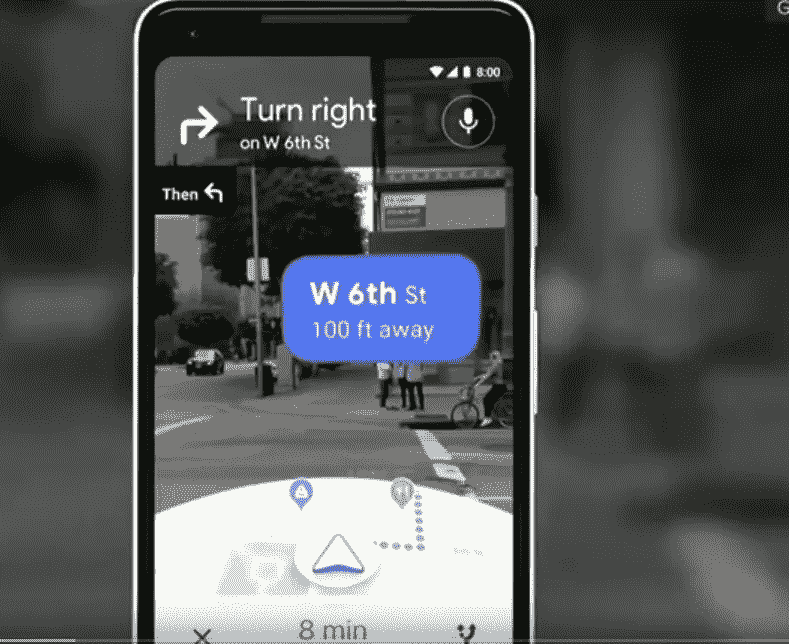
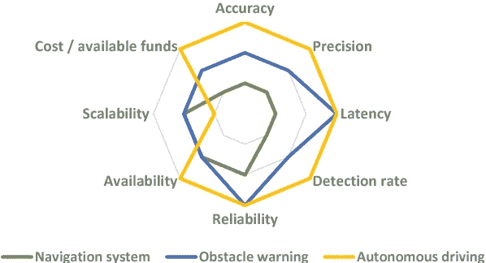

# 技术导航 VPS 的故事！！！

> 原文：<https://medium.datadriveninvestor.com/navigate-with-technology-the-vps-story-56aafc143533?source=collection_archive---------6----------------------->

曾经有一段时间，我们都依靠路人来寻找任何位置，同时试图到达不知名的地方或目的地。然后，新的时代来临了！！我们可以问坐在我们旁边的人，查看 GPS，确认我们是否走对了方向？只需输入目的地名称，然后沿着路线走就可以了。

在过去的几年里，这种技术创新改变了航海的方式。它提供了如此多的轻松和舒适，没有或很少依赖，慢慢地成为一种习惯。谷歌是导航行业的鼻祖；不断努力即兴导航服务。为了向用户提供更好的最新信息，导航服务巨头正在努力带来新的技术进步。其中一项正在试验的技术是“视觉定位系统”。

 [## 人工智能和虚拟现实的融合-你能期待什么|数据驱动的投资者

### 在技术领域，融合是合乎逻辑的一步。就在几十年前，你可能需要一个专门的…

www.datadriveninvestor.com](https://www.datadriveninvestor.com/2018/08/30/the-convergence-of-ai-rv-what-you-can-expect/) 

谷歌宣布了一个改进版的地图，它利用一个复杂的视觉定位系统来提供更好的导航。VPS 是人们外出时避免迷路的一种方法。相机会观察你周围的环境并为你做出判断，而不是伸长脖子看着你的手机，希望你和蓝色 GPS 点在同一个方向。与此同时，传统地图的缩小版将显示在手机屏幕的下半部分。此外，演示显示，在街道上平移摄像机会自动突出显示附近您感兴趣的区域，例如咖啡馆或零售店。

基本上，谷歌地图中新的视觉系统也可以在你的 GPS 不够用的时候使用，新创造的视觉定位系统功能。它使用你的手机摄像头和谷歌的大量后端数据来确定周围环境，以最大限度地准确评估你的当前位置。

VPS 使用你的手机摄像头和谷歌的大量后端数据来评估附近的环境。然后，它会更准确地确定你在哪里，你想去哪里。它还与增强现实重叠，以便获得额外的信息，而不仅仅是导航方向。同样，它允许摄像机根据附近的招牌、商店等来检测位置。然后为旅程的路径提供指导。视觉定位系统的优势是对于那些经历过 GPS 人口密集地区丢失的人。通过使用这一点，谷歌地图仍然可以发现你的当前位置，并提供适当的方向。

视觉定位系统被认为比 GPS 更精确和有效，因为它被设计来克服 GPS 的挑战。基本上，该技术在 GPS 经常被摩天大楼阻挡的城市地区是有用的。

事实上，2018 年 VPS 的价值为 53.5 亿美元，预计到 2025 年将达到 104.7 亿美元，整个预测期的 CAGR 为 10.7%。大多数公司都来投资这项技术，scape technologies 筹集了 80 亿美元的种子资金，用于进一步开发视觉定位服务。开发人员正试图为相机设备带来人工智能，因为它们可以很容易地找到附近的环境。

此外，谷歌还承认，它曾尝试过 AR(增强现实),可以看到一个卡通形象带你逛一个城镇。举个例子——它是一只树阴下的狐狸，你只需要被迫跟随它，直到你到达目的地。

谷歌的高级主管说，“只是为了好玩”，地图团队也一直在试验一种可以帮助进一步指导用户的数字化身，以卡通狐狸为例。

# 填写您的谷歌企业简介。

VPS 是一项新技术，但企业打算寻找帮助客户进入他们大门的方法。在谷歌上搜索你的企业，看看会出现什么，在搜索查询中提到企业名称后面的城市名称会很棒。如果您的企业简介已完成，您应该会看到这些项目，如企业名称、地址、徽标或图像、电话号码、社交媒体简介、网站链接、工作时间和评论。通常，谷歌会从网站和其他来源自动填写这些信息。然而，如果有任何信息丢失，那么你可以利用“谷歌我的业务”来添加或修改任何类型的信息。

为什么它很重要？因为个人在谷歌 VPS 服务上看到的关于你的业务的信息是基于这里提交的信息。

VPS 和 AR 的结合可以彻底改变很多行业

*   购物和零售-零售公司可以使用 acquire 这种技术将顾客指向商店的特定部分，例如，突出显示特定通道中的特定产品。有了这个，他们还可以在特定的地方添加现场宣传 AR 内容，例如——在餐厅的入口处显示评论。
*   娱乐和游戏化-该技术可用于使 AR 寻宝和游戏更有趣或更具吸引力，因为项目可以放置在准确的位置，以最大限度地提高用户在周围环境中的体验和享受。
*   旅游业——它可以通过虚拟导游促进旅游景点的 AR 旅游，并增加广阔的音乐会场地和体育场的 AR 娱乐。

**大众市场映射**

在来自像 Ubiquity6 这样的自由职业公司的激烈竞争中，谷歌宣布在 ARCore 1.2 中推出一个全新的云锚功能。这代表了完全实现的 VPS 的初步排序，利用国内捕获的图片作为关键的集中信息。然而，在全球范围内确定 VPS 基础设施并将复杂的图像处理任务卸载到云的竞赛仍在继续。竞争对手 Fantasmo 正试图制作一个 VPS 信息，使地图创建方法民主化。通过允许免费获取公共区域的图像知识，并将室内地图的全部管理交给房主，该公司希望对谷歌的集中管理方式产生不同的吸引力。

因此，随着这种技术的发展，服务的提供对于每个人来说都应该更加虚拟、定制和增强。我们很想知道在新的导航技术产业世界里，我们的未来会是怎样的。