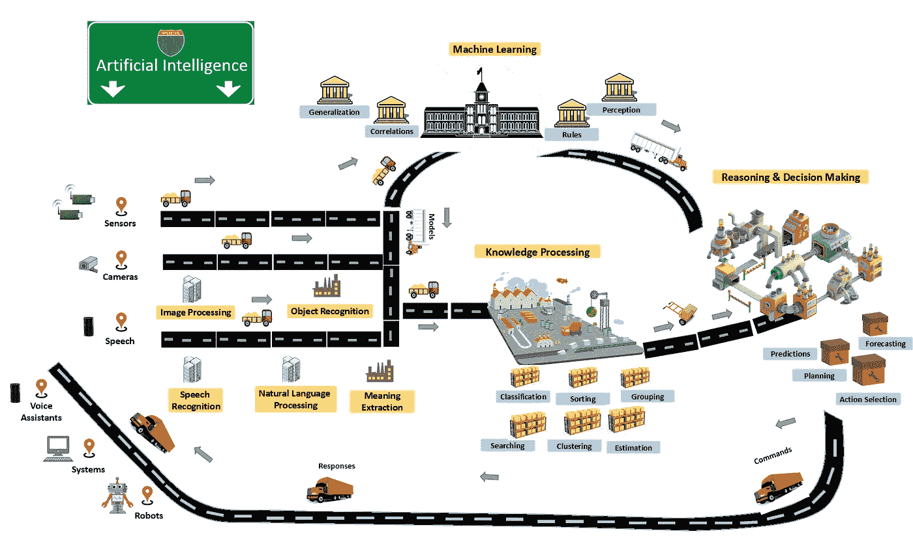
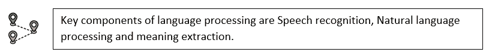

# 人工智能系统导航

> 原文：<https://medium.datadriveninvestor.com/navigating-the-artificial-intelligence-system-f335484087c9?source=collection_archive---------7----------------------->

人工智能市场预计到 2025 年将达到 1900 亿美元，年增长率超过 30%(marketsandmarkets . com)，福布斯估计直接和间接人工智能解决方案的市场价值为 3-5 万亿美元。人工智能的投资、发展和招聘都在上升。

一般来说，人工智能有一个大的范围和广泛的技术，技术和相关的研究。有时很难理解一个智能系统，以及人工智能系统的关键架构组件是什么，整个系统是如何到位的。

我试图捕捉人工智能系统的关键架构组件以及它们之间的交互，这应该有助于我们带着信心和方向感在这个广阔的范围内导航。

智能系统是一种能够分析可用信息并利用以前的经验来采取行动或提供最大可能成功的响应的系统。

Artificial Intelligence System Landscape

**感应**

作为人类，我们使用五种感觉器官来感知周围的世界，并在脑海中形成相同的画面。我们还利用感觉器官来收集关于我们行为的反馈，并不断调整我们的行为，以达到预期的目标。

典型的智能系统必须配备传感器，使系统能够感知周围的物理世界，并形成相同的数字表示(我们可以称之为世界模型)。

**计算机视觉**

计算机视觉不仅仅是捕捉图像，而是要能够分析和理解捕捉的图像，提供一个远比人眼强大的相机并不容易，但分析和解释仍然是一门发展中的科学。

执行图像处理以提取图像或视频的有用信息，例如大小、边缘、颜色等。

物体识别是一种使人工智能系统能够从图像或视频中识别物体的技术。

**语言/语音处理**

人类广泛使用语音和书面语言作为交流方式，一个与人类有效交互的智能系统需要具有处理语言的能力。处理语言不是简单的，即使是人类婴儿一般也需要 3 年左右的时间来学习和处理语言，并且我们大多数人在一生中不断学习语言。

语音识别使人工智能系统能够使用口语并将其转换为文本，它还能够提取额外的特征，如说话人的身份和情绪。

自然语言处理是解析非结构化语言以提取关键实体和信息。

意义提取，通常需要结合上下文和信息来推断自然语言的意义。

**机器学习**

人类从经验中学习，并根据经验做出决定。机器学习为智能系统做类似的工作，机器学习以以前和当前的信息为基础，它还接受来自行动的反馈以进行调整。

相关性是通过寻找数据中的模式来建立的，这些模式使得能够开发一种在多个特征之间建立依赖关系的模型。

概括，人类的一个关键能力是观察特定的经验，并从中得出概括，例如，识别紧急情况，即使一个人以前没有经历过完全相同的情况。机器学习算法能够分析数据，并生成可用于处理新特征情况的归纳，例如，如果我们知道人类有牙齿，则可以有把握地推断 Joe 也会有牙齿。

规则，机器学习提取信息处理和解释的规则，比如很容易看出，如果一种动物既能在陆地上生存，又能在水上生存，那它很可能是青蛙，不可能是鱼。

感知，人类的关键能力之一是吸收经验，并在新的情况下采取行动，试图将新的经验映射为知识，这些可以广泛地归类为感知。机器学习能够表示从数据学习中产生的知识。

**知识处理**

我们必须能够区分知识处理和机器学习。知识处理是利用机器学习产生的模型对传入的信息进行处理，比如将给定的花归类到一个花族就是对知识的处理，而基于一个带标签的图像提炼模型就是机器学习。这是人工智能系统的一部分，使它能够理解和理解传感器所感测的世界。

分类是将进入的实体分类到已知的对象组的过程。

排序，对序列进行排序以便进一步决策的过程

过滤，过滤掉输入的信息，只提取需要进一步处理的信息，人类通常会这样做，我们会拒绝不需要的信息，专注于手头的任务。

分组/聚类，很多时候我们看到一个陌生人，觉得我们很熟悉，或者我们进入一个场景，觉得似曾相识，这些都是我们的大脑将新信息分组到已知的经历或对象中，智能系统具有类似的功能，以便可以在不确定性的基础上做出决定，确定已知的数据。

搜索是非常重要的，以使传入的数据有意义，寻找已知的模式或关键实体或对象可以做出不同的推断。如果一个人看着一张人们围着火的照片，它可能会被解释为营火或火灾突发紧急情况，除非人工智能系统能够快速搜索其他属性，如恐惧或恐慌，否则它可能无法做出正确的推断。

聚合是从各个部分形成一个实体的过程，现实世界并不具备做出正确决策所需的所有信息，换句话说，它充满了不确定性。聚合有助于汇集可用信息和已知知识，以构建可操作的实体。

知识处理还有很多技术和过程，以上是这个功能的一些核心，当我们看到一个新的功能时，应该能够让我们很容易地识别。

**推理&决策**

作为人类，一旦我们理解了情况，我们就决定如何应对。战斗或逃跑反应是一个基本的决策引擎，甚至存在于原始大脑中。

人工智能系统中的决策引擎执行类似的功能，一旦输入的知识被处理并且意义被提取，决策引擎提供响应，该响应被带到外部代理。

预测/预报，人工智能系统必须能够预测和预报即将到来的情况，以采取积极主动的行动，没有这些行动，反应只是被动的，不能被认为是智能的。例如，一辆自动驾驶的汽车需要预测和预报一些情况，如基于标志牌的转弯或司机在下一条车道的下一步行动。

选择，给定人工智能系统可以为给定数据提供的一组响应，决策引擎必须能够选择最合适的响应，以使成功的概率最大化。

规划是人工智能系统选择一系列行动以达到预期结果的能力。这可能是计划一盘棋或应对紧急情况。

**机器人/系统/代理**

一旦感知了世界，理解了情况，并做出了反应的决定，人工智能系统将需要物理世界中的行动者或代理采取行动并作出反应。

机器人、软件系统或虚拟代理从人工智能系统获取命令响应，并在物理世界中执行该动作或提供响应(比如通过语音)。

传感器再次感测/收集所采取的行动的反馈，并将其提供回 AI 系统，以不断调整响应/命令，从而优化并最大化成功结果的概率。

**结论**

人工智能在未来仍然是一个非常令人兴奋的发展领域，它既广泛又深入。一个典型的人工智能系统必须能够感知世界，学习数据，处理和理解世界，基于理解做出决定，并能够在物理世界中以最大化成功结果概率的方式做出反应。