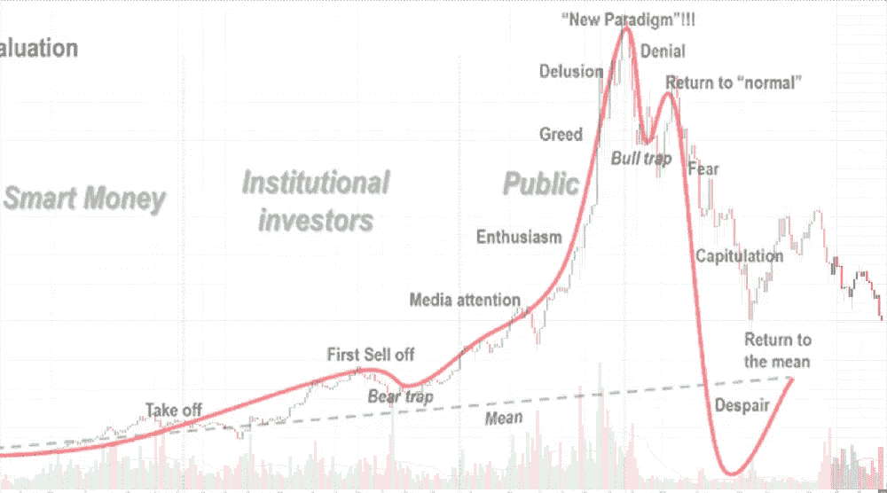

# 在这个迷宫中航行，我们称之为加密交易第一部分

> 原文：<https://medium.datadriveninvestor.com/navigating-this-maze-we-call-crypto-trading-part-i-1c2f8850572e?source=collection_archive---------4----------------------->

初露头角的密码交易商的密码市场概要。

已经在加密领域呆了将近一年，我学到了很多，犯了很多错误，受到了启发，得到了一大块谦卑的馅饼，但最重要的是，我已经转变为区块链技术未来潜力的真正信徒。虽然我绝不是专家，但我想分享我迄今为止的一些见解，希望能帮助一些人避免犯同样的错误。

这个两部分系列的第一篇文章将包括一些一般的提示和技巧，并通过分享一些基本的注意事项，以及快速浏览更大的图片，帮助任何现有的加密交易者在未来证明。第二篇文章将更倾向于如何降低风险和最大化利润的实际实用技巧。因此，无论你是否正在考虑进入加密市场，或者你已经在这个市场有一段时间了，但还没有获得你想要的利润，这是一个好的开始。

**注意事项**

*   **不要单干！在 twitter 上关注人们，查看**[**trading view**](https://www.tradingview.com/symbols/BTCUSD/)**，观看 youtube 视频。**

我会第一个承认。外面有大量的信息。很多都是低俗的营销，散播恐惧，无关紧要，或者只是简单的废话。然而，筛选它并培养从垃圾中辨别高质量信息的眼光是至关重要的。只是不要迷失在其中。关注像@TheCryptoDog、@VentureCoinist 和@crypto_rand 这样的人，你可以相对确定地收到一些高质量的信息(偶尔还有有趣的推文)。

*   **不要 FOMO(怕错过)！这一点怎么强调都不为过，但这可能是你必须亲自学习的一课。**

这可能是密码领域最难克服的心理障碍之一。会有可能一天涨 20，30，甚至 100%的币！尤其是在牛市中。然而，如果你还没有在这个硬币中找到位置，不要试图追逐它，而是专注于学习和识别下一个潜在的游戏。记住，总会有另一个机会。**千万不要买上衣！**在低点/底部买入，在顶部卖出。

*   不要迷失在外面的信息中。

我不能强调这一点不够，这个空间是成熟的过度分析，并发现自己大吃一惊，无法作出决定的结果。有无数次，我发现自己在兜圈子，试图找到“最佳途径”或最佳来源。我来告诉你；它不存在。

*   慢慢移动。耐心是关键。

开始时，你可能会发现自己急于开始交易。你可能会一头扎进图表，在硬币每移动 3、5、10%时开始买卖，同时监控 1 分钟图表。这是失败的秘诀。你应该始终保持冷静，记得边走边学，慢慢来(每天、每周、每月一次)。如果你是为了赚快钱，你可能会幸运地赢得一些，但是我几乎可以向你保证，贪婪或过度自信迟早会战胜你。如果你想在这个领域取得成功，长期的心态是关键。

*   **一定要对你所处的市场有一个感觉，即它是看涨、看跌还是横盘(上涨、下跌或只是跌跌撞撞)**

前往 [CoinMarketCap](https://coinmarketcap.com/) 分析总市值，是增加还是减少？过去一周、一个月或一个季度的趋势是什么？也去[交易视图](https://www.tradingview.com/symbols/BTCUSD/)看看一些对 BTC 价格的评估，专业人士是看涨还是看跌？这将是在任何市场环境下制定合理交易策略的关键(在本系列的第二部分会有更多的介绍)。你可能想开始跟踪总市值的变动，在最初几周制作自己的图表(excel 格式),即使只是为了感受市场的速度和方向。

*   请接受这是一个你永远无法做到完美的领域。

买得太晚或卖得太早。接受你会犯错误。限制这些错误的负面影响(风险)将对你在市场上的长期成功起到关键作用。另一个值得在 twitter 上关注的人是@PeterLBrandt，他经常分享智慧的金块，比如下面这个:

*   一定要创造一套适合你的活动。

我自己的包括:

1.  在 CoinMarketCap 上查看总市值。
2.  翻翻我的微博。
3.  阅读顶级交易视图分析。
4.  绘制硬币图，识别潜在的交易，评估我的头寸(买卖订单)
5.  学习！

每天花一些(很多)时间在上面，你会发现自己在交易中赢的比输的多，这就是成功交易者的一部分。

这只是留下了一个有待回答的大问题。市场下一步会做什么？剧透警报:没人真正知道。我们所能做的就是做出有根据的猜测。在我试图回答这个问题的时候，我将使用一个你们可能已经见过，并且可能会再次见到的图表。这是根据 BTC 图表绘制的市场周期心理学，摘自大卫·吉尔伯森[的一系列非常有趣的文章，第一部分可以在这里找到。](https://hackernoon.com/a-crypto-traders-diary-week-1-e2e1a1785895)

Psychology of market cycles

这种循环在过去重复过，将来也会重复。如你所见，BTC 市场也不例外。事实上，BTC 市场在投降点之前的表现惊人地接近。有些人会争辩说，我们仍然处于那个阶段，真正的绝望还没有到来，而其他人可能会暗示我们已经处于回归均值阶段。我甚至看到有人将 2017 年的泡沫称为最初的**起飞**阶段，暗示未来还会有更多泡沫。一些“保守”的估计认为，未来几年总市值约为 3 万亿美元。这意味着市值将从目前的约 5000 亿美元增加约 6 倍。

事情的真相只有时间能证明。不要陷入试图预测未来的困境。相反，要确保你采用的交易策略是多才多艺的，无论市场处于哪个周期，都能增加你的投资组合。

就这样，我希望你们喜欢这篇文章，更重要的是，我希望这能帮助一些人成为更好的全能交易者。请务必回来阅读第 2 部分，在这一部分中，我将更详细地介绍如何在未来的比特币场景中赢得交易策略。

干杯到那时！