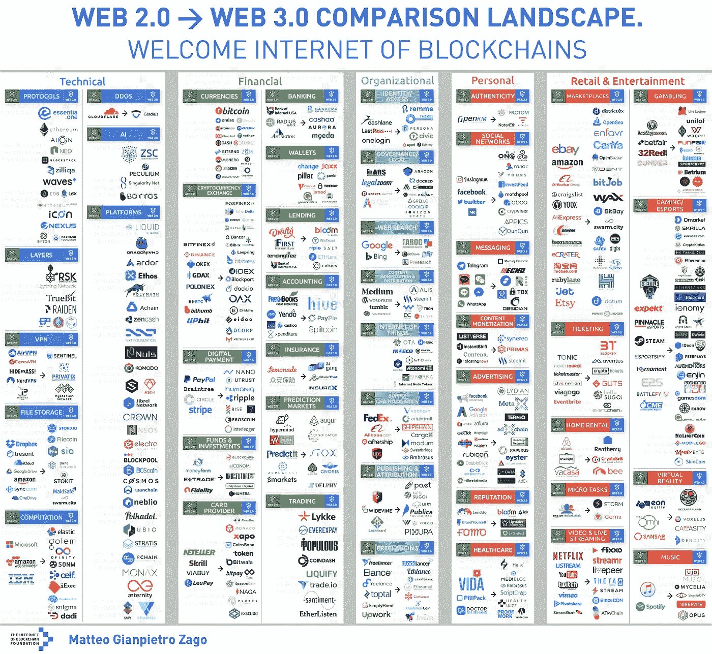

# 穿越这个迷宫，我们称之为密码交易第二部分

> 原文：<https://medium.datadriveninvestor.com/navigating-this-maze-we-call-crypto-trading-part-ii-562a1b8696c8?source=collection_archive---------11----------------------->

初露头角的密码交易员如何应对任何市场周期？

在我的上一篇文章中，[导航这个我们称之为加密交易的迷宫第一部分](https://medium.com/datadriveninvestor/navigating-this-maze-we-call-crypto-trading-part-i-1c2f8850572e)，我提到了加密货币市场周期作为一个整体在哪里，并得出了一个毫无收获的结论，那就是这真的是任何人的猜测。我还指出，最好的前进方式是为任何未来的情况提出合理的战略。在这篇文章中，我将这样做。

在我们进入场景之前，重要的是你要问自己，你想成为什么类型的交易者？更具体地说，你愿意并能够投入多少时间。本质上，有太多的因素在起作用，很难想出一个一站式的策略。诸如可用时间、投资资金、风险倾向和你的最终目标等因素将最终决定什么最适合你。然而，这是一个很好的起点，可以让你知道该怎么做。

未来情景:

## 1.密码市场进入另一轮疯狂的牛市

一旦 BTC 价格上涨到 11.600 美元到 12.400 美元之间(这一价格区间标志着从看跌到看涨的趋势反转得到确认)，加上总市值在短时间内迅速增加，这种情况很可能会发生。在这种情况下，以下是增加和保护收益的好策略:

*   **买和 HODL！！！** HODL 是加密社区中的常用术语。它始于一条流行推文中的一个错别字，很快就流行开来。这是一种买入硬币而不卖出的策略。
*   **千万不要买最上面的&千万不要 FOMO(怕错过)成币**。说起来容易做起来难，因为你永远不知道顶部是什么，如果你盯着一枚硬币，它又上涨了 10%、20%、30%、50%，你可能会想跳进去。不要！在大牛市中，总会有其他的机会，等待，分析，然后投入其中。
*   **在更长的时间框架内思考**。如果你只看 1 小时，15 分钟，甚至更短的时间图表，你会失败。用这些来选择一个好的进场，但是用更长的时间来判断交易的整体价值。
*   **止盈！我怎么强调这一点都不为过。让骰子滚动并看到你的投资组合增加是很容易的，然而在我们生活的这个世界中，我们仍然依赖于法令，这些利润都是未实现的，直到它进入你的银行账户。**
*   如果你一定要顶(设置高于和低于当前价格的可变卖出和买入订单)。但总体而言，持有策略将是更好的选择，因为市场往往会快速波动。
*   还要密切关注 Twitter 和 Tradingview 上的一些影响者。他们在分享什么样的感悟？他们是在警告末日即将来临吗？也许是时候调整你的策略了。多拿利润，想出退出策略。

## 2.熊市还没有完全结束/更多的横盘动作。

这可能是撰写本文时(2018 年 5 月)最有可能出现的情况。BTC 价格已经在 6.400 和 10.000 之间波动了两个月，没有明显的趋势反转迹象。在这个横盘市场中，最安全的做法是诚实地不要做任何交易。但是说实话，你不能袖手旁观，如果你有时间并且能够投入工作，你将能够找到有利可图的机会。

*   **从 BTC 波动中获利**。低买高卖。或者做空高点。
*   **逢低买入，密切关注 BTC，提前获利。**
*   **识别一枚硬币的所谓累积价格**。这个价格在过去的几天、几周甚至几个月里一直是一个强有力的支撑。在该区域内或附近下单。
*   永远不要全力以赴。对于大多数市场周期来说，一个合理的策略是不要一次性买入或卖出。例子:你正盯着硬币 A，它现在的价格是 1 美元。你有 100 美元可以花。不要以 1 美元购买 100 枚硬币，而是以 0.99 美元购买 30 枚。另外 30 个为 0.97 美元，另外 30 个为 0.92 美元，以此类推(当然，根据硬币最近显示的价格波动进行了调整)。这同样适用于销售。从你的进场点开始，在 20%，40%，50%的收益下一些卖单。卖出大约 10%到 20%的股份。这样，如果价格决定突然下跌，在这个横盘市场中，你仍然会领先。
*   **学习！**利用这段不确定的时间，研究你喜欢的币或细分市场。决定什么是好的切入点，并可能设置一些购买订单。

## 3.随着时间的推移，BTC 价格和总市值稳步上升

这就是有趣的地方。这将表明我们正处于本系列文章第一部分概述的均值周期的回归阶段，在这个阶段，市场将小麦从谷壳中分离出来。就像 21 世纪初的网络泡沫一样，一些提供真正价值的公司将从灰烬中崛起，成为下一个谷歌和亚马逊。这不是一个几乎 1600 种加密货币中的大多数是否会失败的问题，而是一个何时失败的问题！

那么，如何确定获胜者呢？幸运的是，我目前正在撰写一份关于各种市场细分和希望利用它们的硬币的深度分析。请继续关注该系列文章。但与此同时，马特奥·詹皮特罗·扎戈拍摄的以下照片是一个绝佳的起点。

[Read the full article here.](https://medium.com/@matteozago/why-the-net-giants-are-worried-about-the-web-3-0-44b2d3620da5)

一张图胜过千言万语这句话在这幅图中得到了很好的体现。它真正做得好的是让你了解区块链技术刚刚起步的不同市场/领域，或者已经存在激烈竞争的市场/领域。然后由你来决定 DYOR(自己做研究)选择一个你喜欢的领域，并找出一个潜在的赢家。

因为我预计这一阶段迟早会到来，所以我已经开始采取措施为不可避免的到来做准备。我的策略包括:

在一个有趣的细分市场中，拥有一个具有真实用例的混合硬币投资组合，加上良好的令牌指标，并将我投资组合的一部分分配给所谓的“炒作”硬币。有两个术语我可能需要详细说明。

**令牌指标**或令牌组学是硬币的统计数据。诸如市值、总供应量、发行供应量和价格之类的东西都包括加密货币的令牌指标。这在评估一个硬币的未来利润潜力中起着关键的作用。一枚总市值为 10 亿美元的硬币可能比一枚总市值为 100 万美元的硬币低 100 倍。

**炒作硬币**是指吸引了大量媒体关注的硬币，但往往包含可疑或未实现的技术，或者它们有悬而未决的重要问题。

*边注:Remy Stephens 定期更新所谓的* [*情绪分析*](https://steemit.com/cryptocurrency/@remystephens/monthly-sentiment-analysis-on-272-cryptocurrencies-top-15-coins-going-into-may) *，这是一个很好的起点来识别那些现在“热门”的硬币。*

有趣的是，当前市场(2018 年 5 月)似乎并不介意做出重大让步，因为这些“炒作”的硬币往往优于背后有实际工作产品或可行业务的硬币。这可能被解释为泡沫的迹象，或者只是市场由大量羊群资金组成(你先听到的)，这些资金只是跟随羊群的其余部分。要回答为什么是这样的问题，这本身就是一篇文章，所以我离题了。在两者(实际使用案例硬币和炒作硬币)之间找到正确的平衡，并调整你的短期(炒作硬币)和长期(实际使用案例硬币)目标以反映这一点，这很可能是最谨慎的获胜方式。

## 4.整个加密货币市场陷入了深深的绝望。

我很有偏见，因为我不相信这是一个可能的情况。但是这使得尝试去写它变得更加必要和有趣。就像一个辩论者会对自己的论点提出反驳一样，我将试图预见什么样的事件会让加密热戛然而止。可能阻碍区块链技术进步的因素:

*   这项技术未能实现。作为一名 IT 顾问，我无数次目睹了最新技术的承诺和魅力无法兑现。一项技术在纸面上看起来很有前途，但在现实世界中，这种优势即使没有消失，也会逐渐消失。幸运的是，如今已经有大量加密货币在现实世界中应用的例子，所以我会更快地将这归类为一个需要克服的障碍，而不是一个阻碍。
*   **监管审查。**我们已经看到很多这样的事情，中国禁止外汇交易，美国禁止其公民参与 ICO。然而，到目前为止，比特币和区块链技术的去中心化特性使其经受住了这场风暴。保持匿名可能是比特币的创造者 Satoshi 在这项技术中灌输的最有远见的观点。时间会证明一切。
*   **量子计算。**对未来深不可测的计算能力稍作展望，就有可能威胁到区块链的不变性。幸运的是，加密社区并没有停滞不前，他们正在期待所谓的[后量子加密。这也不过是一个需要克服的障碍。](https://en.wikipedia.org/wiki/Post-quantum_cryptography)

考虑到区块链技术和加密货币已经聚集了地球上一些最聪明的人的忠实追随者，以及在撰写本文时 3800 亿美元的市值，我非常有信心地说，加密热潮将会持续下去。这有两个主要原因。首先，区块链的基础技术是可靠的，并且有许多实际的好处。第二，加密货币实现了财富的再分配，这是我们从未见过的。

如果你已经做到了这一步，恭喜你！我希望我能够分享一些见解或给一些提示，你以前没有听说过。请随意分享你对这篇文章的想法，或者读一读我的其他作品。下次见！