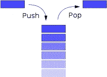
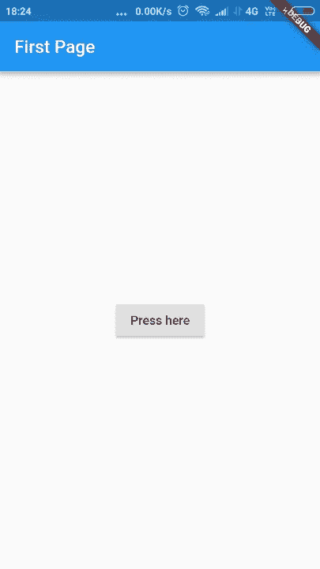
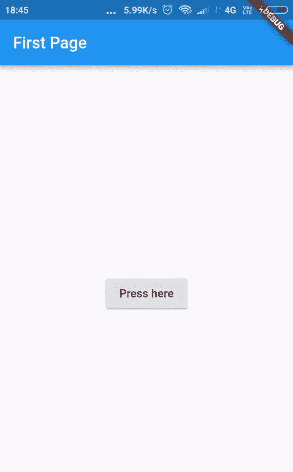

# 颤振中的导航

> 原文：<https://medium.datadriveninvestor.com/navigation-in-flutter-71e50ffc3a30?source=collection_archive---------1----------------------->

[](http://www.track.datadriveninvestor.com/1B9E)

在本文中，我将讨论在 flutter 应用程序中实现不同页面之间的导航。这将是一个初学者对堆栈，路线和导航类的介绍。理解了这个主题之后，就可以通过添加多个页面来开发更好的应用了。

> 我是 android 开发的初学者，在学习的过程中，我写了一些关于它的东西。如果你认为我文章的任何部分是错误的，请评论它以便我能改正它。谢谢！

# 为什么要学航海？

你见过的任何专业外观的应用程序可能都有多个屏幕。它可以包含一个欢迎屏幕，一个登录屏幕，然后进一步的屏幕。拥有多个屏幕提供了更多制作动画、平滑过渡和改善整体用户体验的机会。一个好的应用程序由多个页面组成，以使其美观、分布式(信息明智)并易于用户理解。

因此，对于初学者来说，了解如何在 flutter 中实现多页面功能是非常重要的。或者换句话说，理解'**导航**'。

# 先决条件:

显然，你需要 flutter SDK 和一个类似 VS Code 或 Android Studio 的 IDE。除此之外，您应该已经熟悉:

*   [无状态小工具](https://medium.com/datadriveninvestor/widgets-stateless-and-stateful-2e3b8adced71)
*   基本小部件(特别是 MaterialApp、Scaffold、RaisedButton)

话虽如此，如果你已经安装了设置，只是想找点乐子，请继续阅读。您可以稍后查找小部件。

# 路线和导航:

路线是一个屏幕或页面的抽象版本。想象一个只有一个屏幕的应用程序。也许它是一个无状态小部件中充满文本和图像的屏幕。或者想想你在 flutter 中启动新项目时看到的演示应用，即 StatefulWidget 应用。这些应用程序只有一个屏幕或一条路线。

`Navigator`类用于操纵不同的路线。在深入研究如何做到这一点之前，我们需要学习一些叫做“堆栈”的东西。

# 堆栈:

如果你已经进入了数据结构的领域，你可能听说过“栈”。堆栈是一种线性数据结构，它遵循特定的顺序来添加和删除元素。它被命名为堆栈，因为…嗯..它的行为就像现实世界中的堆栈，就像一堆一堆的石头。


Photo by Johnson Wang on Unsplash

堆栈允许两种操作来操纵自身:

*   **Push** :在现有栈顶添加一个元素是通过调用 Push 函数来完成的。要在堆叠中添加另一块石头，你只能想到在它上面添加它。
*   **Pop** :通过调用 Pop 函数从栈顶移除一个元素。移走一块石头也是类似的。你必须从头开始，一个一个地移除它们。

既然我们已经解决了这个问题，让我们进入有趣的部分。做 app。



Actions on Stack: Push and Pop

# 实施:

我们从简单开始。创建 void main 函数，在该函数内部调用带有 has `MyApp` 的 runApp 函数作为 StatelessWidget 类。在`MyApp`的`home:`部分把你的`FirstPage` 类带入画面。

```
**import 'package:flutter/material.dart'**;

**void** main() => runApp(**new** MyApp());

**class** MyApp **extends** StatelessWidget{
  @override
  Widget build(BuildContext context) {
    **return** MaterialApp(
      title: **'Flutter Navigation Medium'**,
      home: FirstPage(),
    );
  }
}
```

创建两个类 FirstPage 和 SecondPage 作为两个 StatelessWidget，在它们各自的构建方法中具有相似的结构。

```
**class** FirstPage **extends** StatelessWidget {
  @override
  Widget build(BuildContext context) {
    **return** Scaffold(
        appBar: AppBar(
          title: Text(**'First Page'**),
        ),
        body: **new** Center(
          child: RaisedButton(
            onPressed: () {}, //code this later
            child: Text(**'Press here'**),
          ),
        ));
  }
}

**class** SecondPage **extends** StatelessWidget {
  @override
  Widget build(BuildContext context) {
    **return** Scaffold(
        appBar: AppBar(
          title: Text(**'Second Page'**),
        ),
        body: **new** Center(
            child: RaisedButton(
          onPressed: () {}, //code this later
          child: Text(**'Press here'**),
        )));
  }
```

好吧，到目前为止应该很简单。这两个类返回 Scaffold 小部件，其主体中有一个 AppBar(带标题)和一个 RaisedButton。将 RaisedButton 包装在一个中心小部件中使我们的应用程序看起来更好一些。

这应该是你现在的展示。



Your first look at the app (Screenshot)

现在让我们试着通过`Navigation` 类连接这两个页面。我们从在`FirstPage`的`onPressed` 方法的范围内添加代码开始。

```
...//inside the first page class
onPressed: () {
  Navigator.*push*(
    context, **new** MaterialPageRoute(
      builder: (context) => **new** SecondPage()));
  },
...
```

现在热重新加载，并尝试按钮。

我们来过一遍背后的过程。`OnPressed` 方法使用导航类。看`push` 方法，想到一堆。该方法通过在第一页的基础上构建第二页，将第二页放到第一页上。过渡直观地解释了它。你可以看到第二页在第一页上面。

push 方法需要一个路由，这里我们使用`MaterialPageRoute`，它提供了默认的转换。

> 颤振中的过渡可以改变和调整，但现在，让我们用默认的。

现在，让我们对`SecondPage`进行编码。如果你还记得堆栈数据结构，它有两种方法用于两种相反的需求。为了回到第一页，我们需要从堆栈中移除`SecondPage` ，因此这里使用了 pop 方法。

```
...//inside the second page class
onPressed: () {
  Navigator.*pop*(context);
},
...
```

这样我们就完成了应用程序。结果:我们的应用程序包含一个按钮，通过它我们可以在两个页面之间来回切换。



App’s working as a GIF

注意:

*   不一定需要 pop 功能。安卓手机有后退按钮来执行这个特殊的功能。尝试一下，您会看到类似的输出。
*   一个看起来很专业的应用程序可能包含多条相互关系混乱的路线。在这种情况下，我们更进一步，为每条路线指定一个名称，以便于开发。
*   因为 pop 函数从堆栈中删除了一条路由，所以尝试将该函数放在 MyApp 类中并运行应用程序。你会看到应用程序本身终止了，你只剩下一个黑屏。
*   另一种方法是将第一个屏幕推回到已经存在的第二个屏幕上。这种方法不同于弹出，因为您是在现有的两个屏幕上添加另一个屏幕。

希望这篇文章能帮助你学习一些新的东西。

感谢阅读！

阿南特