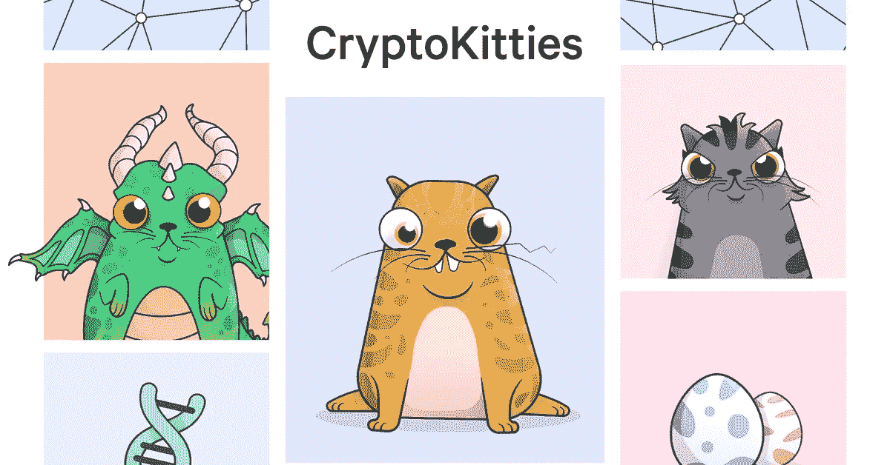

# NBA 与 CryptoKitties Creator 合作推出区块链收藏品游戏

> 原文：<https://medium.datadriveninvestor.com/nba-teams-up-with-cryptokitties-creator-to-launch-blockchain-collectibles-game-993ed248db1d?source=collection_archive---------14----------------------->

## NBA 与 CryptoKitties 的创造者 Dapper Labs 合作，在区块链技术上推出 NBA Top Shot

[https://www.cryptokitties.co/](https://www.cryptokitties.co/) CryptoKitties

在一份名为 [NBA、NBPA 和 Dapper Labs 为全球篮球迷带来首款区块链游戏的新闻稿中](https://nbpa.com/news/nba-nbpa-and-dapper-labs-bring-first-of-its-kind-blockchain-game-to-basketball-fans-around-the-globe)，2019 年 7 月 31 日，联盟宣布与 DAPPER LABS 合作，打造[NBA Top Shot](https://www.nbatopshot.com/)——一款基于加密收藏品的新加密名册构建竞技游戏。球迷将能够购买和交易 NBA 赛季独特的数字游戏时刻，利用剪辑建立一个竞争名册，或者球迷可以将它们作为收藏品。

> “我们相信区块链科技创造了一种真正独特的产品，球迷可以在一个有趣的环境中收集、管理和参与，我们很高兴与 Dapper Labs 合作，将这些开创性的数字资产引入 NBA 社区。”
> Josh Goodstadt，NBPA 商业部门 THINK450 授权执行副总裁。

 [## 正在改变行业的 5 个真实世界区块链应用|数据驱动的投资者

### 除非你一直生活在岩石下，否则我相信你现在已经听说过区块链了。而区块链…

www.datadriveninvestor.com](https://www.datadriveninvestor.com/2019/02/13/5-real-world-blockchain-applications/) 

CryptoKitties 是第一款基于 ERC 721 的区块链游戏，允许用户收集和繁殖小猫。ERC-721 令牌是以太坊令牌的一个子集，是一种不可替换的令牌——包含使其不同于任何其他令牌的数据的唯一令牌。据报道，CryptoKitties 的用户在发布的头几个月花了近 2300 万美元购买稀有的猫。

在 NBA Top Shot 中，区块链技术将使每个视频剪辑都能够被标上一个独特的代码，以将其标记为独特的，使该技术成为这款收藏品游戏和 [Dapper Labs](https://www.dapperlabs.com/) 的完美合作伙伴。

Photo by [TJ Dragotta](https://unsplash.com/@tjdragotta?utm_source=unsplash&utm_medium=referral&utm_content=creditCopyText) on [Unsplash](https://unsplash.com/search/photos/basketball?utm_source=unsplash&utm_medium=referral&utm_content=creditCopyText)

奥黛丽·奈斯比特

[奥黛丽·奈斯比特在领英上](https://www.linkedin.com/in/audrey-nesbitt-0388a52a/)

[@ audreynesbit 11 在推特上](https://twitter.com/AudreyNesbitt11)

[螺旋营销&公关](http://www.spinspirational.com/)