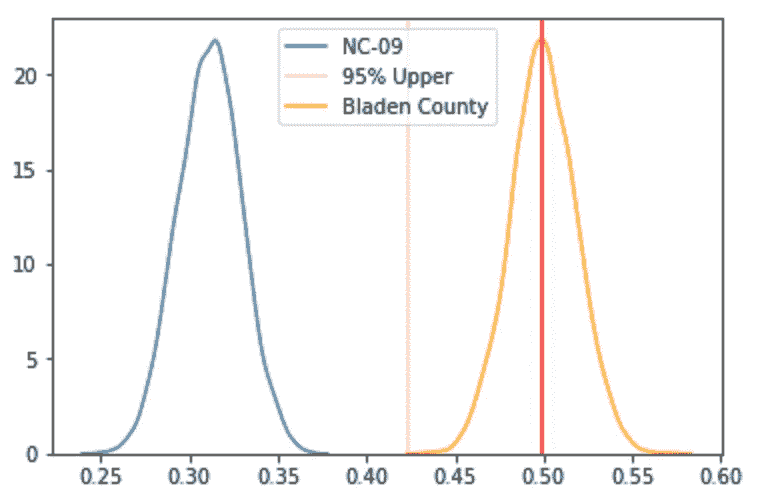
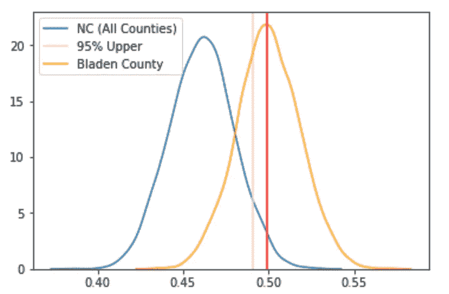
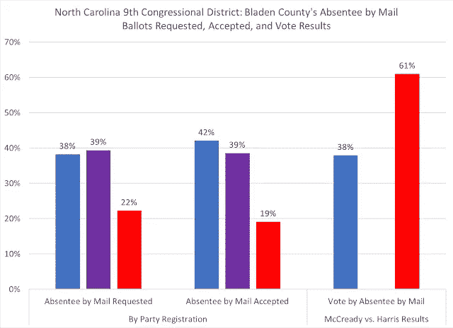

# NC-09 投票违规:从统计角度看

> 原文：<https://medium.datadriveninvestor.com/nc-9-voting-irregularities-statistically-speaking-56ac37defe00?source=collection_archive---------19----------------------->

2019 年 2 月 21 日更新:北卡罗来纳州选举委员会下令举行新的选举。NYT 文章的链接在页面底部。

原博客:上周晚些时候，我看到了《夏洛特观察家报》的一篇文章，内容是关于 2018 年 11 月中期选举期间北卡罗来纳州第 9 国会选区(NC-09)结果的可疑投票模式。

 [## 布拉登县的缺席投票可能会影响第九选区。《夏洛特观察家》

### 周四，对布拉登县及其周边地区投票违规行为的指控沸沸扬扬，北卡罗来纳州…

www.charlotteobserver.com](https://www.charlotteobserver.com/news/politics-government/election/article222363510.html) 

这篇文章概述说，在数周时间里，共和党候选人对选举中的最后一张选票进行了计数和重新计数，在 282，717 张选票中，共和党候选人以 905 票的优势击败了民主党对手。(少于总票数 0.5%的差额。)虽然势均力敌的竞选和极其艰难的决定在任何选举周期中都必然会发生，但由两党组成的州选举委员会一致拒绝证实选举结果。

争议的焦点是一个名叫麦克雷·道利斯的人，他是共和党竞选团队的合同工。在共和党圈子里，道利斯以其制造高缺席投票率的能力而闻名。然而，许多人站出来说，Dowless 和他的同伙在选举前几周挨家挨户上门，代表选民邮寄缺席选票。根据北卡罗来纳州的法律，除了缺席的选民或“近亲”在给定的投票中邮寄邮件，任何人都是非法的。

在过去的选举中，布拉登县的缺席投票率是全州最高的。在那里，7.5%的登记选民要求缺席投票，而所有其他县的平均水平不到 3%。

Catawba 学院政治学家 Michael Bitzer 发现，在第九区的八个县中的七个县，民主党候选人赢得了邮寄缺席选票的压倒性多数，在 Bladen 县，共和党候选人赢得了 61%的选票，尽管注册共和党人仅占该县可接受的缺席选票的 19%。

在通读了这篇文章并想磨练我的统计分析技能后，我决定我想看看 a 是否能重现比策教授的发现，所以我开始使用假设检验和正态分布分析来确定 Bladen 县的共和党缺席选票的比例相对于 NC-09 的其他县和整个州是否具有统计学意义。

我能够直接从北卡罗来纳州选举和道德执行委员会获得 NC-09 的原始投票总数，并着手测试这些假设:

Ho =相对于给定的人口数据集，Bladen 县共和党缺席选票的比例在统计上不显著。

Ha =相对于给定的人口数据集，Bladen 县共和党缺席投票的比例具有统计学意义。

从数学角度来说:

Ho: μ =布拉登县共和党缺席选票比例

哈:μ ≠布拉登县共和党缺席选票比例

原始数据包括北卡罗来纳州所有竞选的信息，因此我需要浏览选举结果来创建两个人口集:

1.  列出共和党在北卡罗来纳州 100 个县的选票份额。
2.  列出共和党在 NC-09 的每个县的选票份额。

创建这些数据集后，我使用它们各自的标准差来显示它们相对于从 Bladen County 采集的样本的分布曲线。

Expected share of Republican Absentee votes in NC-09 vs. Blanden County

右边的蓝色钟形曲线显示了 NC-09 各县的共和党缺席投票份额的人口分布，以及显示α= 0.05 的外部界限的粉红色线。

换句话说，我们可以有 95%的把握说 Bladen 县的结果是显著的，我们可以拒绝我们的零假设(Ho)。这种比较看起来有点奇怪，因为 NC-09 只包含北卡罗来纳州 100 个县中的 8 个，而且只有如此少量的观察值会导致置信区间看起来有偏差。

为了查看更大的数据集，我将布雷登县的结果与该州举行国会选举的所有其他县进行了对比。

Expected share of Republican Absentee votes in North Carolina vs. Blanden County

这里，蓝铃曲线代表北卡罗来纳州缺席投票中共和党份额的标准化分布，粉红色线显示α= 0.05 的上限。

即使有更大的数据集，我们也可以有 95%的信心说，Bladen 县缺席投票中共和党的份额很大，我们应该拒绝我们的另一个 Ho。

总是遵循这种分析的告诫是，它不能证明我们的选择(Ha)是真实的，而仅仅是我们的零假设是不真实的。所以，即使在拒绝了我们的无效假设之后，这个分析也没有说明是什么导致了这个重要的结果。在真空中，这一结果可能会使统计学家、数据科学、记者、政治学家和/或一般感兴趣的人找到额外的指标或叙述来解释这一结果。

自从《夏洛特观察家》的文章发表以来，这个故事已经爆炸了，我已经在这篇文章的底部包含了关于这种情况的其他故事的链接。截至发稿时，调查仍在进行中，尚不清楚选举委员会是否会要求再次选举。

最后，我想展示比策尔教授的更多作品，他已经写了两篇关于这场比赛的博文。

Source: [https://www.oldnorthstatepolitics.com/2018/12/NCs-9th-competitive-and-contested-CD.html](https://www.oldnorthstatepolitics.com/2018/12/NCs-9th-competitive-and-contested-CD.html)

他的博客中我最喜欢的一个图表在左边，前面提到过。它显示，登记的共和党人发出的缺席选票只占收到的缺席选票的 19%，但共和党候选人获得了缺席选票总数的 61%以上。

从本质上讲，这意味着绝大多数注册的无党派人士和大量注册的民主党人需要投票给共和党。

他的博客文章关注选举的背景数据和更大的北卡罗莱纳州的政治环境。我认为他展示发现的方式是数据可视化力量的最好例子。最后，这一切都构成了一个严重暗示谋杀的故事。

以下是比策教授博客文章的链接:

 [## 更新:北卡罗来纳州最接近的国会竞选获得最后一分钟的惊喜

### 11 月 29 日周四下午 3:53 更新了新信息:几乎所有关注北卡罗来纳州政治的人都得到了…

www.oldnorthstatepolitics.com](http://www.oldnorthstatepolitics.com/2018/11/ncs-closest-congressional-contest-gets.html#more)  [## 北卡罗莱纳州竞争激烈的第九国会选区

### 在过去的一周里，老北州的第九国会选区受到了全国的关注，并将…

www.oldnorthstatepolitics.com](https://www.oldnorthstatepolitics.com/2018/12/NCs-9th-competitive-and-contested-CD.html) 

以下是截至发帖时关于这个故事的文章:

 [## 北卡罗来纳州官员调查第九届国会选区选举中可能存在的违规行为

### 北卡罗莱纳州选举官员正在调查该州第 9 次选举中可能存在的缺席投票违规行为…

www.washingtonpost.com](https://www.washingtonpost.com/politics/nc-officials-investigating-irregularities-in-9th-congressional-district-election/2018/11/28/e5d77070-f338-11e8-aeea-b85fd44449f5_story.html?utm_term=.6d822d67557f)  [## 美国众议院第 9 区的比赛:第 9 频道揭示了美国众议院缺席选票的相似之处…

### 北卡罗来纳州布拉登县-第九频道周一回到北卡罗来纳州布拉登县，追查参与…

www.wsoctv.com](https://www.wsoctv.com/news/local/channel-9-uncovers-similarities-between-absentee-ballots-in-us-house-district-9-race/882660808)  [## 为什么北卡罗莱纳州的选举舞弊案很有说服力

### 北卡罗来纳州选举和道德委员会上周投票反对认证共和党人马克·哈里斯的 905…

www.cnn.com](https://www.cnn.com/2018/12/05/politics/north-carolina-election-fraud/index.html)  [## 共和党全国委员会主席:很清楚...这个国家存在着系统性的失败

### 丹·麦克里迪在北卡罗来纳州的国会竞选中撤回了他的让步，这似乎表明共和党竞选团队承诺…

www.msnbc.com](http://www.msnbc.com/all-in/watch/nc-gop-chair-it-is-clear-that-there-has-been-a-systematic-failure-in-the-state-1391009347883)  [## 皮鞋报道推动了北卡罗莱纳州爆炸性的选举舞弊调查

### 12 月 5 日这一消息是在一个星期二宣布的，当时只引起了一点小小的反响。北卡罗来纳大学董事会…

www.washingtonpost.com](https://www.washingtonpost.com/politics/2018/12/05/shoe-leather-reporting-boosting-north-carolinas-explosive-election-fraud-investigation/?utm_term=.9b967de5a2d8) 

# **2019 年 2 月 21 日更新:**

 [## 欺诈调查中心下令在北卡罗来纳州举行新的选举

### 北卡罗来纳州罗利-北卡罗来纳州选举当局周四下令在该州举行新的国会选举…

www.nytimes.com](https://www.nytimes.com/2019/02/21/us/mark-harris-nc-voter-fraud.html)