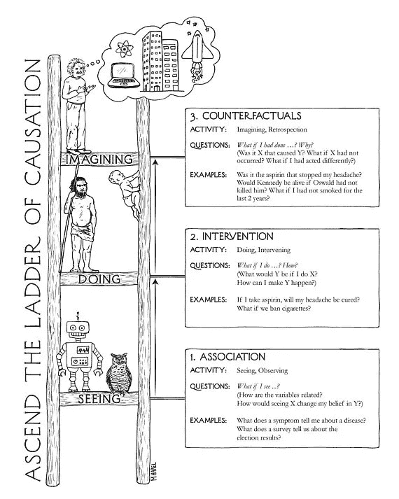
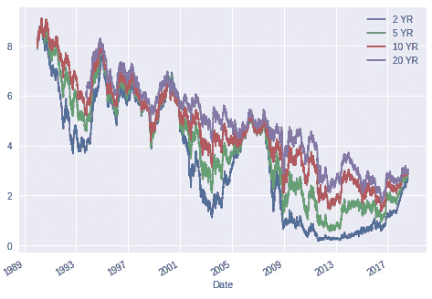
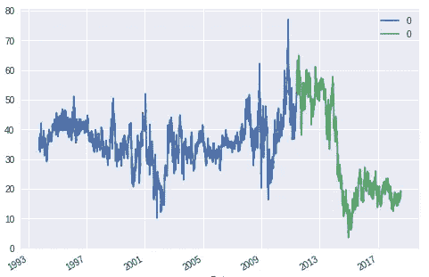
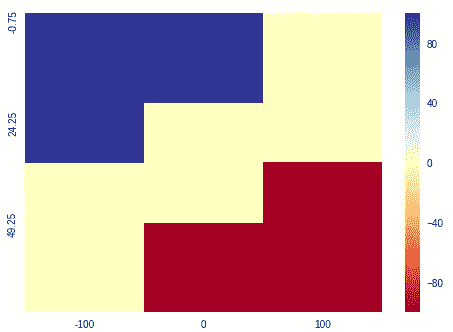
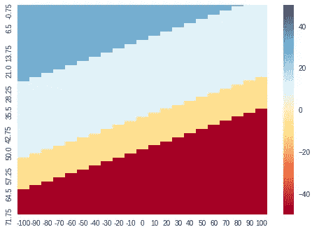
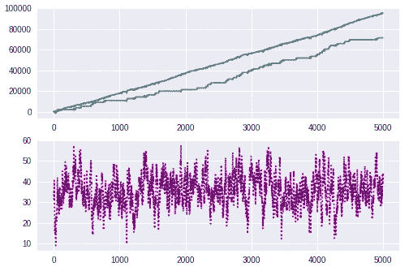
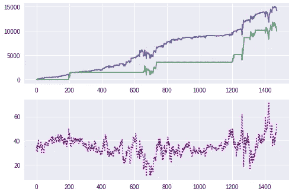
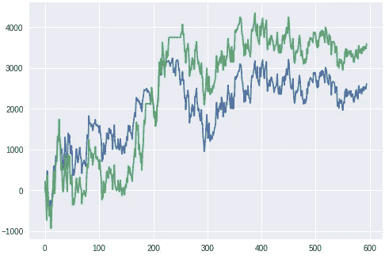
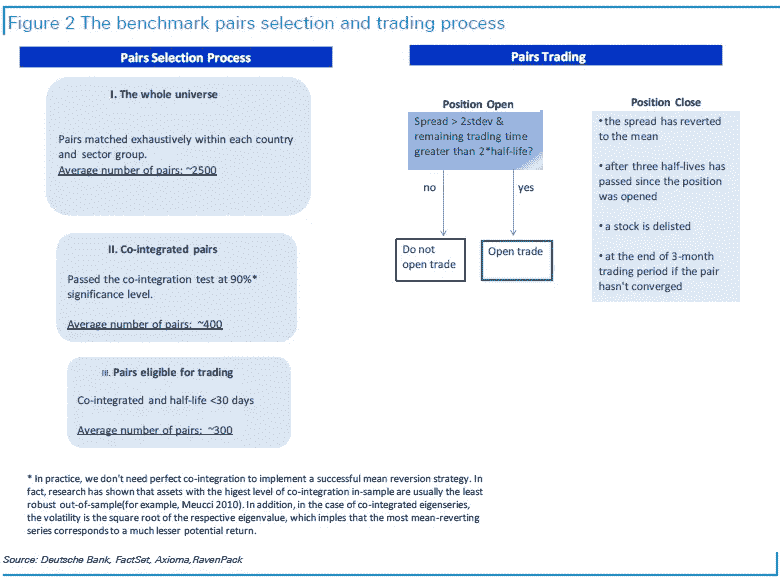
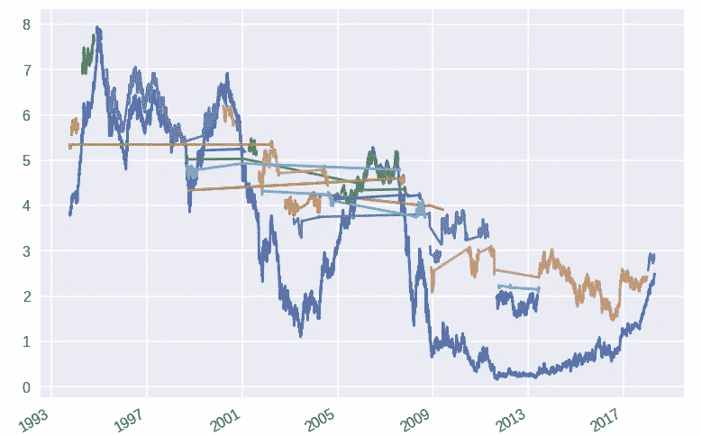

# 穴居人对 DeepQ 机器人(有真实价格)——第一轮

> 原文：<https://medium.datadriveninvestor.com/neanderthals-versus-deepq-robotraders-with-real-life-prices-round-1-28ab9100a505?source=collection_archive---------0----------------------->

Artwork created by [Maayan Harel](https://medium.com/@mh_83125). Neanderthals stand above robots on the ladder of causation

有一个著名的[球形奶牛](https://en.wikipedia.org/wiki/Spherical_cow)(或马，或鸡)比喻，强调了盲目将理论解决方案应用于现实生活的危险:

> 一个赌徒想在赛马中获得优势，所以她写信给当地大学，向学术界寻求帮助。组建了一个由理论物理学家领导的多学科教授小组，并进行了为期两周的密集现场调查。然后，学者们回到大学，笔记本上塞满了数据，写报告的任务就交给了团队领导。此后不久，物理学家回来了，对赌徒说，“我有解决办法，但它只适用于真空中的球形马”。

在我之前的博客中[教机器人‘低买高卖’](https://medium.com/@gjlr2000/teaching-a-robot-to-buy-low-sell-high-c8d4f061b93d)和[给交易机器人一个虫子的大脑](https://medium.com/@gjlr2000/giving-a-worms-brain-to-a-trading-robot-d55abccb4e8b)我复制了一篇关于强化学习的学术论文，然后通过添加一个神经网络作为‘大脑’来增强它。但是就像上面的笑话一样，论文只在假设价格的情况下工作

> 趋向于以均值回复率λ回复到其长期均衡水平 p_e，并且是奥恩斯坦-乌伦贝克过程的标准离散化

# 长出马的腿:

玩笑归玩笑，人类投资者已经开发出识别和交易资产组合的策略，这可能意味着回归。

人类开发的方法与深度学习同行相比如何？AlphaGo 已经表明，探索更大空间的能力使系统能够找到人类在 3000 年的游戏历史中没有想到的获胜策略。

在[寻找均值回归信号](https://medium.com/@gjlr2000/finding-mean-reverting-signals-part-2-dac1350aac16)中，我解释了如何从美国利率的期限结构中提取均值回归资产价格时间序列，例如，通过创建一个由四种密切协同变动的不同资产组成的投资组合:

Units are percentage points (6 => 6%)

应用 Johansen 方法的魔力找出“训练集”(我随意定义为历史的前 3/4)的权重(阅读[博客](https://medium.com/@gjlr2000/finding-mean-reverting-signals-part-2-dac1350aac16)中的解释),结果表明，通过做空 5 年期利率，对比 10 年期利率的 74%和 2 年期利率的 38.3%，加上 20 年期利率的 6.2%，我们得到了 Johansen 方法确定为均值回复的价格行为(预期均值为 36.25 个基点半

(blue: training set) (green: test set) (units are bps)

看看残差序列(单位表示‘bps’，1/100 个百分点)。蓝色的训练集似乎“生活”在不同于绿色测试集的一组频带中( [r **egime change**](https://medium.com/@gjlr2000/why-financial-time-series-lstm-prediction-fails-4d1486d336e0) **？)**。我决定相当随意地使用 3/4 的数据([其他人](https://stackoverflow.com/questions/13610074/is-there-a-rule-of-thumb-for-how-to-divide-a-dataset-into-training-and-validatio)使用从 50%到 20%的任何数据)。如果你只选取 1/2 的数据，你会发现均值回复参数和权重都非常不同——但让我们稍后讨论这个问题。

你不必使用利率；您可以将资产更改为您喜欢的任何内容——这就是我保留 python 笔记本的原因。在德意志银行的[均值回归 II:配对交易策略](https://app.ravenpack.com/research/mean-reversion-pairs-trading-strategy/)中，你可以读到使用股票的均值回归配对策略。

在[交易均值回归](https://medium.com/@gjlr2000/trading-mean-reversion-1493ba10460f)中，我解释了一些投资方法，一旦我们发现了一个神话般的均值回归序列(但是，请查看相关链接，这些链接强调了每当出现“[制度变化](https://medium.com/@gjlr2000/why-financial-time-series-lstm-prediction-fails-4d1486d336e0)”时，将这些技术应用于研究不充分的时间序列会带来灾难性后果的危险)。

## 尼安德特人的贸易规则

在[量子乌托邦](http://gekkoquant.com/2013/09/29/linear-regression-curves-vs-bollinger-bands/)中出现的一个常见策略是:

> 如果收盘价高于平均值+n *离差，做空(当你穿过平均值时平仓)
> 
> 如果收盘价低于平均值-n *离差，做多(当你穿过平均值时平仓)

让我们将这一战略转化为行动图。均值回复系列的标准差范围为 7.5bps，因此:

*   当我们没有头寸时，“买入”价格可能是 21.25 个基点，“卖出”价格可能是 51.25 个基点(如果我们的倍数 n 等于 2)，其余时间什么也不做。
*   当我们做多 100 个单位时，如果价格低于 36.25 个基点就卖出，否则什么也不做。
*   当我们短缺 100 个单位时，如果价格高于 36.25 个基点，就回购，否则什么也不做。
*   加上一些随意的(基于领域知识)或系统的经验法则，以避免进入交易或提前止损。

看起来像是:

x axis: holding position. y axis: price level. color: trade in dollars

(在代码中，你可以看到如何创建这个动作图，然后可以替代机器人的大脑)

**为什么是尼安德特人？**在[金融中的人工智能:穿透炒作](https://medium.com/datadriveninvestor/ai-in-finance-cutting-through-the-hype-with-case-studies-f361518b00d4)我详述了狭义人工智能无法确定因果关系:

> 完整的因果模型是一种形式的**先验**知识，你必须将其添加到你的分析中，以便在不实际进行干预的情况下获得因果问题的答案。**光靠数据推理是给不了你这个**。[ [来源](http://www.inference.vc/untitled/) ]

朱迪亚·佩尔写了《为什么尼安德特人(和一个婴儿)能爬上因果推理的第一级，并形成因果模型》一书。在交易中，德意志银行增加了以下规则来过滤虚假的均值回复:

> 为了构建股票对，我们的基准策略要求国家中立，即组成股票对的所有股票必须属于同一个国家。这是为了确保组成一对的所有股票以相同的货币计价，以避免跨市场的微观结构问题和货币风险。我们的基准策略还要求板块中立，这意味着所有股票对也必须属于同一个 GICS 板块。

所有上述规则都来自他们的**先验**知识，需要一个因果模型。我将把带有先验过滤器的 2 std 规则称为尼安德特人规则，因为成年尼安德特人很容易成为金融分析师(我抛弃了没有经验的婴儿)。

## Robotrader 交易规则:

将尼安德特人的地图与从 RoboTrader 得到的地图进行比较(在大约 8 万次模拟后):

正如我们所料，RoboTrader 可以探索更大的策略集，并可以使用更大的可能行动集(购买 20 或 30 个单位，出售 10 或 50 个单位，持有-100 至 100 个单位)来微调行动

现在我们可以开始策略了:

## 样本外模拟数据:

在最初的学术论文中，当策略在 5000 个模拟价格(在这种情况下对应于 41 年，因为每个周期对应于 3 天)上运行时,“布丁证据”被描述为一个漂亮的向上价格和损失(PNL)图。使用相同的基准并假设每个单位值一美元:

*   蓝色的是机器人雷达的性能。更高的 PNL(95k 美元)和略高的夏普比率(2std 规则的 113%)
*   绿色表示尼安德特人的 PNL 较低(71k 美元)。
*   紫色:模拟数据。

one period = 3 days

RoboTrader 会像在学术论文中一样返回漂亮的向上看的 PNL 图。夏普比率同样更好，但是可以通过进一步优先考虑夏普比率而不是预期的 PNL 来改善。在[教导机器人‘低买高卖’](https://medium.com/datadriveninvestor/teaching-a-robot-to-buy-low-sell-high-c8d4f061b93d)的适当学术跟进中，我们可以制作一个表格，将参数 *kappa* 更改为更高的值，并检查夏普比率的改善。

但是当我试图摆脱“球形马”的时候，我会继续前进。

## 回溯测试:

不出所料，使用历史训练数据来检查策略的比较情况会让 RoboTrader 轻松“获胜”,因为 PNL 和 Sharpe 比率都较高:

*   RoboTrader:14k 的 PNL，夏普比比 2std 法则高 30%。
*   尼安德特人:PNL 为 10k

但是，请注意在 1415 年至 1425 年期间，PNL 急剧下降了 20%(从 10.4 万美元降至 8.4 万美元)。现实生活中的风险管理者是否允许这种情况存在争议。

## 样本外真实性检查:

最后(鼓声响起)，让我们来看一下对于我们分开的历史数据(历史的最后 1/4)的策略表现如何:

*   尼安德特人打 PNL (3.5k)，
*   但 RoboTrader 的夏普比率高出 53%(PNL 仅为 2.6k)

PNL rudderless after period 350

然而，对于这两种策略，PNL 在周期 350 之后不会去任何地方。如果你把模拟数据 PNL 呈现给你的资本提供者，在 500 个周期之后，他应该期望有大约 10k 的利润和一个非常好的向上倾斜的 PNL。现在试着解释为什么 2 年来(250 个周期，每个周期对应 3 天)你的交易策略没有任何进展:

机器人雷达:“…”

尼安德特人:“在美联储于 2013 年 6 月宣布缩减 QE 的[后，制度发生了变化，改变了期限结构风险溢价等等等等，所以我决定提前结束这种交易”](https://en.wikipedia.org/wiki/Quantitative_easing#US_QE1,_QE2,_and_QE3)

现实检验是布丁的最终证明。RoboTrader 并没有明显地变好，正如我们之前注意到的，这些讨厌的政权变更会造成巨大的破坏。

尼安德特人可以做得更好的地方是利用先验知识来设计接受替代信号的“开箱即用”规则。正如我上面提到的，我从空气中挑选了 3/4 大小的训练数据——如果我采取不同的“制度”,我可能会得到非常不同的结果。

看看 DB 开发的其他规则:除了当价差达到均值时平仓，他们还会在股票被摘牌时平仓——如果发生这种情况，机器人交易员不知道自己会受到什么打击！

至于这笔交易，DB 会在 3 个月没有收敛后关闭它。

所以我不得不把它交给尼安德特人(他能识别因果关系并决定是否交易):

## 第一轮:穴居人 1 分，机器人 0 分

剧透:在第二轮中，我将让机器人交易员能够使用人工智能集群识别制度变化——(阅读我的' [Rates Clustering](https://medium.com/@gjlr2000/rates-clustering-611a3af9b294) '博客，其中识别了以下制度:

(鉴于我的哲学“[可重复研究](https://en.wikipedia.org/wiki/Reproducibility)”，我附上我用来获得图表的代码。这段代码相当混乱，所以如果你愿意帮我清理和扩展它，请给我写信)