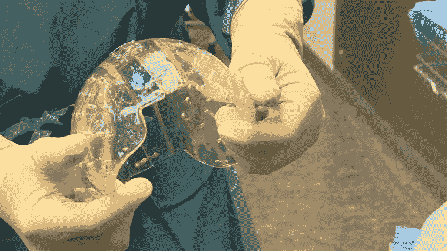

# 需要一个新头骨吗？试着打印一份。

> 原文：<https://medium.datadriveninvestor.com/need-a-new-skull-try-printing-one-435702fb9ded?source=collection_archive---------5----------------------->

如今，3d 打印可以做各种意想不到的事情，从假鼻子和婴儿监视器到漂浮的饮料架和军事装备。但是一家荷兰医院提高了赌注:乌特勒支大学医学中心的医生成功地用机器打印的塑料版本替换了一名 22 岁女子的整个头骨。

此前，医生们已经创造了头骨碎片，但这是第一次有人创造了完整的头盖骨。这名女性患有一种导致其颅骨异常增厚的疾病，导致严重头痛、失明，并可能导致死亡。

 [## 医疗保健的未来正在被一场巨大的技术入侵所塑造——数据驱动的投资者

### 过去十年，全球经济的所有部门都经历了大规模的数字颠覆，而卫生部门现在…

www.datadriveninvestor.com](https://www.datadriveninvestor.com/2018/11/02/the-future-of-healthcare-is-being-shaped-by-a-big-tech-invasion/) 

脑外科医生 Bon Verweij 博士说:“这种情况最初表现为严重的头痛。”"颅骨的增厚使大脑承受越来越大的压力."

“最终，她慢慢失去了视力，并开始遭受运动协调障碍。其他重要的大脑功能受损和她死亡只是时间问题。因此强化手术是不可避免的，但直到现在还没有针对这类患者的有效治疗方法。”

但在 23 小时的手术几个月后，她既恢复了视力，又重返工作岗位。

该医院希望使用类似的方法来重建在事故或肿瘤中受损的头骨，以及治疗其他骨骼畸形。

“手术后现在已经三个月了。患者已经完全恢复了视力，她不再有任何抱怨，她已经回去工作了，几乎没有任何她做过手术的痕迹，”Verweij 说。