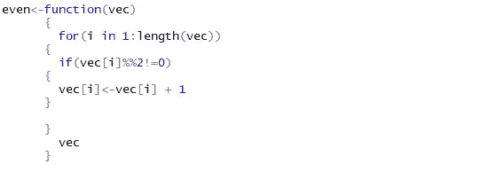
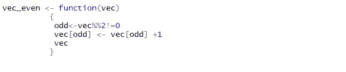

# 需要带 R 的速度！！！

> 原文：<https://medium.datadriveninvestor.com/need-for-speed-with-r-6f25a05b5576?source=collection_archive---------11----------------------->

数据科学|R 编程|矢量化编码|

Source: Google Image

Khangjrakpam Arjun |新德里南亚大学|

当我开始进入数据科学领域时，我经常听到的一件事是**对速度的需求，**以及 R 如何使用矢量化编码来加速。在我们的生活中，我们听说过许多美好的小事，但直到我们亲眼所见，我们才感觉到它。在本文中，我想与您分享昨晚我在编写 RStudio，Inc .的数据科学家和硕士讲师 Garrett Grolemund 所著的《用 R 编程的实践》一书中的代码时，发生的一件这样的事情如何让我震惊。

在此之前，我想和你分享一个有趣的解释，为什么每个数据科学家都应该学习如何用 R 编程，而不是只使用 R 函数。加勒特引用格雷格·斯诺的话来描述这个比喻。Greg 说使用 R 中的函数就像乘坐公共汽车，用 R 编写程序就像开车。

 [## 数据科学和软件工程哪个更有前途？-数据驱动型投资者

### 大约一个月前，当我坐在咖啡馆里为一个客户开发网站时，我发现了这个女人…

www.datadriveninvestor.com](https://www.datadriveninvestor.com/2019/01/23/which-is-more-promising-data-science-or-software-engineering/) 

> **公共汽车很容易使用，你只需要知道该上哪辆车，在哪里上车，在哪里下车(还需要付车费)。另一方面，汽车需要更多的工作:你需要某种地图或方向(即使地图在你的脑海中)，你需要不时地加油，你需要知道道路规则(有某种驾驶执照)。汽车的最大优点是它可以带你去很多公共汽车去不了的地方，而且对于一些需要在公共汽车之间换乘的旅行来说，它更快。**
> 
> **用这个比喻来说，像 SPSS 这样的程序是总线，对于标准的事情来说很容易使用，但是如果你想做一些没有被预先编程的事情，就非常令人沮丧了。r 是一辆 4 轮驱动的 SUV(虽然环保)，后面是自行车，上面是皮划艇，乘客座位上是很好的步行和跑鞋，后面是爬山和洞穴探险的装备。如果你花时间学习如何使用这个设备，r 可以带你去任何你想去的地方，但这比在 SPSS 中学习公共汽车站在哪里要花更长的时间。**
> 
> **—格雷格·斯诺**

Greg 将 R 比作 SPSS，但是他假设我们使用 R 的全部能力；换句话说，我们学习如何用 R 编程。我们不应该只使用 R 中已经存在的函数，因为这相当于将 R 用作 SPSS:它是一辆只能带我们去某些地方的公共汽车。这种灵活性对数据科学家很重要。具体情况因问题而异。如果我们不能建立一个适合我们需求的方法，你可能会发现我们自己倾向于做出不切实际的假设，这样我们就可以使用一个已经存在的不合适的方法。

现在，回到 R 如何加速的问题，作为一名数据科学家，我们需要速度。如果我们的代码运行得更快，我们就可以处理更大的数据，完成更多雄心勃勃的任务。我们可以用许多不同的方式编写代码，但是编写 R 代码最快的方式通常会利用三件事:**逻辑测试、子集化、**和**基于元素的执行**。使用这些东西的代码通常有一定的质量:它是矢量化的；该代码可以将一个值向量作为输入，同时操作向量中的每个值。

为了了解矢量化代码是什么样的，我们举两个函数的例子，每个函数取一个数字向量，检查所有数字是否都是偶数，然后给奇数加 1，并将其转换为偶数向量。首先，我们看到一个非矢量化的代码示例，函数 **even** 使用 for 循环一次一个地操作矢量的每个元素:

**Fig:1,** function **even**

第二个例子， **vec_even** ，是 **even** 的矢量化版本。它使用逻辑子设置同时操作向量中的每个奇数:

**Fig:2,** function **vec_even**

**vec_even** 比 **even** 快得多，因为它依赖于 R 快速完成的操作:
**逻辑测试、**和**元素式执行。**
我们可以使用 *system.time* 函数来看看这两个函数有多快。 **system.time** 获取一个 R 表达式，运行它，然后显示表达式运行所用的时间。为了比较 **vec_even** 和 **even** ，首先我们做一个奇偶数的*测试*向量。*测试*将包含一千万个值:
测试< - rep(c(3，4，5)，10000000)

> **注意:rep 多次重复一个值或值的向量。要使用 rep，我们给它一个值的向量，然后给这个向量重复的次数。r 将把结果作为一个新的更长的向量返回。**

然后，我们可以使用 *system.time* 来测量每个函数计算 long 所需的时间:

> 不要混淆 system.time 和 Sys.time，后者返回当前时间。

system.time 输出的前两列报告了我们的计算机在进程的用户端和系统端执行调用花费了多少秒，这种二分法因操作系统而异。最后一列显示 R 运行表达式所用的时间。结果显示，当应用于 1000 万个数字的向量时，函数 **vec_even** 计算值的速度比函数 **even** 快 7 倍。这只是一个简单的例子，展示了与使用 for 循环的代码相比，矢量化的编码方式如何加速代码。每当我们编写矢量化代码时，我们都可以期待类似的加速。这并不意味着应该取消 for 循环。很多时候，当矢量化代码无法使用或者不是最佳选择(耗时)时，我们会被迫使用 for 循环。因此，根据我们的需求和限制，使用矢量化代码可以帮助我们优化时间。

参考:用 R- *Garrett Grolemund* 动手编程