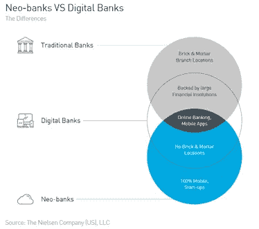
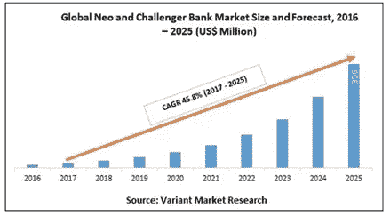
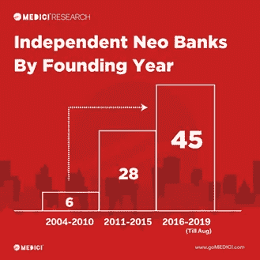
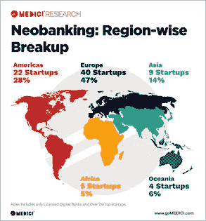
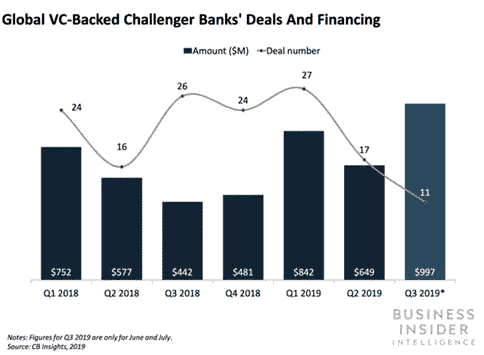
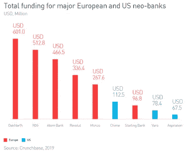
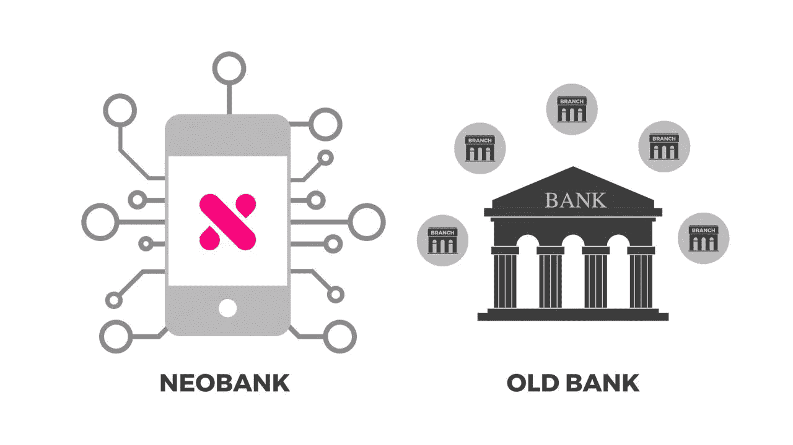

# 新银行业:银行业的未来在这里吗？

> 原文：<https://medium.datadriveninvestor.com/neobanking-is-the-future-of-banking-here-469148216d15?source=collection_archive---------0----------------------->

*“就利润而言，个人银行业务是美国最大的行业之一，同时也是受干扰最小、最不受消费者欢迎的行业之一，吸引了近百万客户。这三件事创造了一场完美的颠覆风暴。”-* Andrei Cherny，渴望创始人

最近，投资者对新银行业及其潜力(尤其是在印度市场)表现出了极大的乐观和兴趣。

 [## 分散金融的出现|数据驱动的投资者

### 当前的全球金融体系为拥有资源、知识和财富的人创造了巨大的财富

www.datadriveninvestor.com](https://www.datadriveninvestor.com/2019/03/14/the-emergence-of-decentralized-finance/) 

*什么是新银行？*

简而言之，neobank 是一家 100%数字化的直接银行，只通过移动应用和个人电脑平台**接触客户。**不运营传统的物理分支网络使他们摆脱了传统银行业竞争对手的遗留系统。

这个词在 2017 年变得非常突出，用来形容金融科技提供商挑战传统银行。这些银行最初起源于英国，随着 [Monzo](https://monzo.com/) 和 [Atom Bank](https://www.atombank.co.uk/) 等玩家的崛起。降低成本和扩大对无银行账户者的银行服务是它们诞生的两个主要原因。

Three broad categories in place

*全球市场规模和增长驱动因素*

根据 Allied Market Research 的数据，从 2017 年到 2020 年，全球新银行市场一直以 50.6%的 CAGR 增长。

Up and Over

与传统银行相比，便利性和较低的利率是最大的增长动力。其他因素包括透明度、更快和更小的贷款审批以及用户友好的界面。通过群组分类收集、分析数据和了解消费者行为的能力可能会成为新银行的强大“护城河”。

新银行也在尝试通过提供以客户为中心的服务来实现“思维转变”。愿景是改变公众和市场对银行业的看法，尤其是在 2008 年金融危机之后，那场危机在金融体系中产生了恐惧和不信任。

*不同市场的趋势*

欧洲被视为新银行的光辉典范。监管支持(支付服务指令法)创造了一个开放的环境，允许金融科技公司安全地访问客户账户数据，迄今为止这是传统银行的独有权利。政府。使得获得银行执照变得极其简单，为创业公司的创新打开了大门。

根据 ATK 研究，自 2011 年以来，欧洲新银行的客户群增长了 1500 多万，而零售客户群减少了 200 万。到 2023 年，这些银行可能会覆盖 20%的 14 岁以上人口，并俘获 8500 万客户。

其他成功的例子还有 Latam 的 [Nubank](https://nubank.com.br/en/) 估值 100 亿美元，客户数量呈指数级增长。最近，香港&台湾也推出了虚拟银行牌照，新加坡、泰国和马来西亚也有望在明年推出。总部设在英国的[革命](https://www.revolut.com/)也在[向 APAC 扩张](https://www.cnbc.com/2018/11/29/uk-fintech-firm-revolut-gets-license-to-expand-to-japan-and-singapore.html)。

然而，最具吸引力的市场仍然是中国，预计到 2025 年，中国将实现最高增长。大量银行服务不足的客户，加上手机银行客户的激增，将预示着这种变化。阿里巴巴、微众银行(WeBank)等其他传统电子商务参与者正通过一个名为 MyBank 的新银行平台悄然带来一场贷款革命。仅在 4 年内，该银行已经向 1600 万小公司支付了约 3000 亿美元，违约率为 1%!

然而，新银行在全球取得的成功喜忧参半。虽然美国拥有一些最古老的新银行(2009 年成立的简单银行和 2011 年成立的 T2 银行)，但在过去十年中，只有 3%的千禧一代开设了新账户。法规和银行执照是导致难以获得银行执照的主要原因，因为每家银行都必须利用现有银行的系统。简单的是[被 BBVA 收购](https://www.finextra.com/newsarticle/25757/bbva-buys-simple-for-117m)，而 Moven 转向成为一家技术供应商，帮助银行更好地获取、保留和发展客户。去年年底，直接股票交易平台 Robinhood 宣布了利率为 3%的支票和储蓄账户，但由于华尔街对监管问题的担忧，该平台不得不在一天内取消了这一决定。机会仍然诱人，最近德国银行 N26 [宣布与 Axos 银行合作在美国推出。](https://www.businessinsider.in/German-neobank-N26-is-set-to-make-its-US-debut/articleshow/70196596.cms)

Europe and US taken the lead

*全球融资统计*

2019 年上半年，55 笔交易获得了 25 亿美元的风险投资。这已经超过了 2018 年全年的 23 亿美元，表明投资者的势头仍在全力以赴。拉丁美洲和欧洲在资助方面处于领先地位。

美国等其它市场正在迅速赶上。根据 CB Insights 的数据，2018 年美国新银行获得的融资是 2017 年的 4 倍，是 2015 年的 10 倍。这是一个巨大的机会，它将超越美国和欧洲。一家中小企业挑战者银行筹集了 3 . 65 亿美元，成为今年澳大利亚最大的私人投资者。

*挑战*

在 2008 年金融危机引发的愤怒浪潮之后，信任尤其重要。根据 Yougov 年的一项调查，在意大利只有 37%的人信任他们的银行，而在法国有 27%的人认为银行是一股向善的力量。

盈利能力是另一个大问题。根据 Yogi 银行首席执行官 Sukhjot Basi 的说法，neobanks 提供低于成本的服务来吸引新成员。这个问题在免费和不加价的国际资金转移以及与现任者分享收入(支持他们的账户和交易)的过程中更加突出。

CAC 的进一步增长可能会超过收入的增长。总部位于英国的 neobank Monzo 在 2018 年 2 月 18 日的年度报告中透露，该公司的用户数量已增至 75 万，但同期亏损超过 3 倍，从 1000 万美元增至 4200 万美元。

然而，最大的问题是，新客户正在尝试新银行，但没有将它们作为主要账户，这意味着它们是财务负担，而不是资产。在英国，只有 12%的客户关闭了传统银行账户，转而完全使用网络。此外，平均而言，Monzo 客户的账户上只有不到 190 美元。

不可避免的是，尽管他们取得了惊人的增长，但找到一种可持续的商业模式仍然是一种幻想。一些公司正从“免费增值”模式转向订阅模式，以提高利润。这进一步增加了客户回流到现有公司的风险。

推出自己的纯移动应用银行的现有银行数量也在增加。2017 年 10 月，JPM 推出了针对年轻消费者的 Finn(一年后迅速[关闭](https://www.businessinsider.com/why-jpmorgan-got-finn-wrong-2019-6?IR=T))。富国银行(Wells Fargo)在 T2 推出了融合个人银行和资金管理的“温室 T3”。高盛推出了一款名为 [Marcus](https://www.cnbc.com/2018/11/21/goldman-sachs-marcus-is-shaking-up-retail-banking-in-the-uk-.html) 的贷款产品，为客户提供 2.05%的存款利率，并计划扩展到一家提供全面服务的网上银行。其他正在筹备中的项目包括汇丰银行推出的[冰山](https://ctmfile.com/story/hsbc-reveals-more-detail-on-project-iceberg)和 Natwest 与 Starling 合作推出的 [Bo](https://news.sky.com/story/rbs-plots-launch-of-standalone-digital-consumer-bank-bo-11510612) 。

*未来趋势*

*成为主流的高机会*:资本支出几乎为零，不需要设立分支机构和购买资产。neobanks 需要的只是一款出色的应用和按需扩展的云资源。

*人工智能将成为 Neobanks 的重要战略武器*:保持个人联系的能力(类似于分行服务所提供的)，复杂的虚拟个人助理体验将大大增强用户体验。跟踪行为模式以实时验证交易也有助于更快地发现欺诈，并在银行问题发生前为客户提供解决方案。

*拜访实体银行分行会慢慢结束*:想想你上一次拜访实体分行是什么时候。根据一项调查，75%的千禧一代要么从不去分行，要么一个月去一次或更少。

*解决痛点将是赢得竞争的法宝*:随着目标客户群对技术越来越有信心，新银行巩固了他们的信任，专注于拥有客户而不是解决问题和简化体验的传统银行可能会越来越失去优势。Gartner 副总裁戴维弗隆格(David Furlonger)表示，如果银行继续维持 20 世纪的业务和运营模式，它们将面临越来越大的失败风险。成熟的金融服务提供商将不得不通过建立数字平台或寻找利基产品和服务在其他平台上销售来加快数字业务的发展。

*整合势在必行*:随着新银行在近几年迅速膨胀，现有银行和挑战者都有可能进行战略性收购，整合是不可避免的。

*印度市场机遇*

有趣的是，印度初创公司已经从大型全球公司的剧本中学到了专注于没有银行账户的细分市场，并避免与现有公司进行正面的营销和现有用户之战。

著名的银行机构正在开发自己的平台，通过数字银行服务(Kotak 的 [811](https://www.businesstoday.in/sectors/banks/kotak-mahindra-bank-launches-811-zero-balance-app/story/248916.html) 、SBI 的 [YONO](https://www.thehindubusinessline.com/money-and-banking/sbi-launches-yono-an-integrated-app-for-financial-services/article9970915.ece) 、星展银行的 [Digibank](https://www.dbs.com/newsroom/DBS_breaks_new_ground_in_digital_banking) 等)来扩展其全服务模式。)

有趣的机会比比皆是，新银行提供惊人的会计，支付，应收账款等分析。以及通过简化的操作和成本提高贷款的灵活性。还有可能为商家、活期账户持有人和企业提供额外的价值，如记账和财务管理工具等免费功能。

借助现有在职者的广泛网络可以为这些初创公司带来丰厚的回报。8 月 19 日，Open [与 Visa](https://economictimes.indiatimes.com/small-biz/sme-sector/open-partners-with-visa-to-enhance-business-banking-for-smes/articleshow/70448087.cms?from=mdr) 合作推出面向中小企业的商业信用卡，用于小型企业的信贷、费用管理和支付处理。

有趣的是，从监管的角度来看，新银行在印度仍然是不可能的。根据印度退休支付委员会主席纳文·苏亚的说法，印度央行不允许虚拟银行模式或许可证。

不过，这个问题并没有困扰投资者，因为现有的新银行已经采取了“合作者方式”与现任银行合作。现有项目的融资已经加快，这可能会吸引更多项目的到来。

*印度引人注目的交易*

NiYo:它提供了两种解决方案，Bharat Payroll 解决方案，为印度蓝领劳动力提供现代工资账户，以及 Global Card，为旅行者提供银行服务。它自称是新银行领域最大的金融科技公司，拥有约 100 万用户。7 月 19 日，它从 Horizons Ventures 和腾讯获得了 3500 万美元的 B 轮 T2 融资。

开放:服务于中小企业中服务不足的群体，提供银行服务、发票和自动记账服务。拥有 11 家银行作为合作伙伴，平台上的分析交易收入超过 40 亿美元。它也有 10 万以上的用户，每月增加 2 万。2019 年 6 月，它在[B 轮](https://yourstory.com/2019/06/fintech-startup-open-funding-tiger-global-management-tanglin-venture-partners)中从老虎环球和唐林副总裁那里筹集了 3000 万美元。

Yelo:最新成立的 neobank，为月薪低于 3 万英镑的消费者提供储蓄、汇款和小额信贷解决方案。9 月 19 日，它从 Matrix Partners 和 Omidyar Network 筹集了第一轮[。](https://economictimes.indiatimes.com/small-biz/startups/newsbuzz/matrix-leads-1st-funding-round-in-neo-bank-yelo/articleshow/70969727.cms')

Ezoto:专注于中小企业的银行预计[将于近期](https://www.business-standard.com/article/pti-stories/india-s-sme-focused-digital-neo-bank-ezoto-gearing-up-for-launch-in-june-2019-119061800253_1.html')推出。它通过为中小企业提供 API 驱动的数字银行，实现银行和会计的自动化

*未来趋势:*

*关注渠道转变*:现有银行向数字银行的转变只会增加新银行的动力，因为它启动了从分行向数字银行转变的行为变化。

*机会比比皆是*:随着对数字服务的认识转化为采用，中小型企业、蓝领阶层以及其他许多群体都有巨大的机会等待着我们

*有利的监管政策*:印度储备银行采取金融创新监管沙盒的举措将推动现任者调整其商业模式，并鼓励初创公司进入。随着 NPCI 政府推出合众国际社和 BHIM。在全球范围内引领支付创新。新银行领域也有望出台此类优惠政策，以鼓励创新。

*挑战:*

建立信任需要大量的时间和“耐心资本”,尤其是在印度,[高度信任赤字](https://www.cnbctv18.com/views/the-webs-trust-deficit-why-indians-prefer-cash-for-online-purchases-4287981.htm)以数字形式保存/存储资金。考虑到这些初创公司将在印度迎合的目标群体，这个问题将被放大。对于没有银行账户的群体(蓝领阶层，零工经济工作者)来说，他们更害怕在网上交易中赔钱。

根据万事达卡去年进行的研究，目前只有 11%的英国消费者使用 neobank，或者表示他们“很可能”在未来三年内使用 neo bank。鉴于 neo bank 是该细分市场中资金最多的市场，请阅读该调查。

金融知识是另一个主要障碍，因为该目标仍然在网上银行设施的范围之外。有必要使用当地语言，并与用户保持联系/培养理解流程的信心。这就是与数字聊天机器人合作的优势所在，比如 Niki.ai 和 Jiny 等。

其他挑战包括长期现金流、数据隐私和安全问题，以及创建一种替代的分发机制。

*总结:*

RBI 对数字化的日益关注、印度堆栈的日益成熟、金融科技与传统银行之间的更大合作，以及在智能手机普及率和数字意识提高的帮助下，无银行账户群体进入金融网络的机会，将预示着印度金融科技的下一波增长，这将通过新银行的崛起来实现

长期以来，传统银行机构的垄断一直是一种不受挑战的霸权。随着新时代、敏捷、纯数字银行的崛起，看到随之而来的战斗和合作将是令人兴奋的。总体而言，最大的受益者将是消费者，尤其是那些没有银行账户的群体，他们有机会成为正规金融体系的一部分，体验真正的核心创新。

来自 CrowdfundUP 团队、Worldfinance、NYT、PA Consulting、Entrepreneur、GoMedici、Valustrat、BusinessInsider、HinduBusinessLine 的意见

澳大利亚金融科技公司图片

本文所表达的观点和意见仅代表作者个人，并不代表其所属的任何机构或组织的观点和意见。