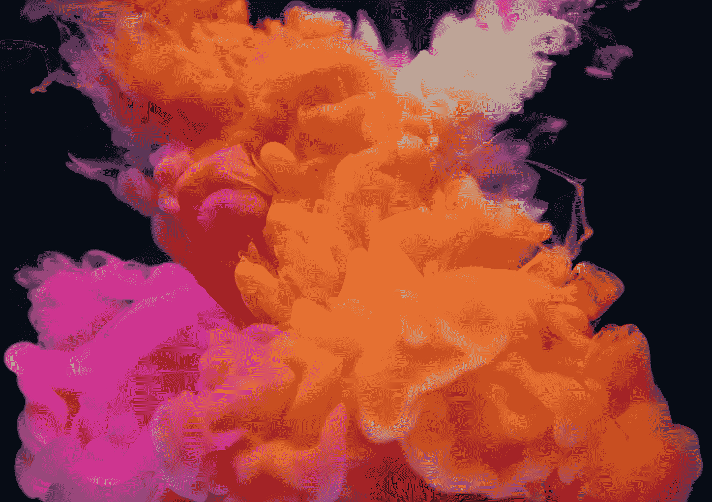

# 内斯塔的 2019 年预测:“新常态”的冲击

> 原文：<https://medium.datadriveninvestor.com/nestas-2019-predictions-the-shock-of-the-new-normal-48bb16c5df00?source=collection_archive---------12----------------------->

Image courtesy of Rawpixel via Unsplash

## 在今年的 Nesta 预测系列中，我们将关注那些正在从荒谬王国向“新常态”飞跃的想法、技术或趋势。我们还能改变他们的路线吗？

西莉亚·汉南

五年前，你可能会对你的[肠道微生物群可能掌握治疗健康状况的线索](https://www.nesta.org.uk/feature/ten-predictions-2019/mot-your-gut/)，或者[机器可以处理你的离婚](https://www.nesta.org.uk/feature/ten-predictions-2019/robolawyers-make-legal-services-cheap-and-cheerful/)和胜任的[评估你孩子的学习成绩](https://www.nesta.org.uk/feature/ten-predictions-2019/beginning-end-exams/)的建议抱有合理的怀疑。今年，内斯塔的预测系列是对未来学古老格言的完美诠释，即荒谬有一种令人不安的习惯，似乎在一夜之间成为“新常态”。

虽然预测特定技术的进步道路可能(相对)简单，但我们发现，要想象文化价值观和人类行为的更深层次转变要困难得多，部分原因是这样做涉及挑战我们自己内在的假设。因此，专家们或许能够预测移动技术和 3G 的发展，但要预见建立在 Tinder 等平台上的服务的崛起，以及它们为约会带来的社会习俗变化，要困难得多。

因此，如果一个关于未来的“预测”或陈述没有一丝古怪，这意味着它现在对我们来说是陌生的，那么它就没有达到它的主要目的之一——即产生可以改变我们对现在的看法的替代愿景。期货研究名誉教授詹姆斯·达特(James Dator)甚至将这一原则编入了他的《期货三定律》之一，他认为:“任何关于未来的有用想法都应该是荒谬的。”

Nesta 今年的预测系列介绍了一系列技术和实践，这些技术和实践曾被视为纯粹的科幻小说，但现在正被主流接受。考试是教育体系中引发焦虑基石。托比·贝克和劳瑞·史密斯指出，最近的进展使得人工智能对学生的实时连续评估不仅成为可能，而且大规模实用。虽然这些发展伴随着大量的伦理考虑，但他们认为，人工智能工具可能会改变*我们评估的*以及*我们评估的*方式——潜在地导致测量范围的扩大，包括团队合作或解决问题技能的分析。

Geoff Mulgan、Eva Grobbink 和 Vincent 施特劳布在他们的文章中探讨了中国建设能够管理整个城市系统的人工智能“城市大脑”的努力，并将其与 20 世纪 60 年代苏联和美国之间的太空竞赛进行了比较。众所周知，苏联在 1958 年发射的人造卫星 Sputnik 1 引发了美国的信任危机，并促使 JFK 做出了非同寻常的声明，即美国将在 20 世纪 60 年代末把人送上月球。这篇演讲产生了一个著名的术语“登月”，用来指雄心勃勃的任务，如果实现了，就重新定义了什么是可能的或者实际上是“正常的”。

虽然全知城市大脑的概念听起来像是乔治·奥威尔(George Orwell)或赫伯特·乔治·威尔斯(HG Wells)虚构出来的，但它体现了今年预测中一个反复出现的主题:人工智能融入我们的日常生活。在他的预测中，马特·斯托克斯考虑了这个勇敢的新世界是如何为个人产生新形式的不确定性和焦虑的。我们曾经想当然地认为，向银行贷款或申请工作意味着与人交往。但是，随着越来越多关于我们生活的决定由不透明的算法控制或调节，Matt 预计[当我们与聊天机器人等机器](https://www.nesta.org.uk/feature/ten-predictions-2019/who-do-you-think-youre-talking-to/)交谈时，以及当人类坐在驾驶座上时，我们要求知情权将成为惯例。

Caroline Purslow 和 Daniel Berman 也探讨了新常态的黑暗面，他们关注了越来越多的人现在面临的现实，即患有由耐药性超级细菌引起的慢性感染。他们预测，2019 年将是这种激增开始触及家庭并在我们的个人生活、社区和卫生系统中体现出来的一年。

在他们的预测中，特奥·菲尔波和劳瑞·史密斯观察到突破性创新(比如感染人类以便为他们接种同种疾病疫苗的想法)往往与公认的智慧或逻辑背道而驰。他们对 2019 年的预测也将让一些人感到反直觉:[如果创新资金更加随机](https://www.nesta.org.uk/feature/ten-predictions-2019/random-approach-innovation/)它实际上会更有效吗？作为对冗长的同行评议评估系统的偏见和耗时本质的回应，他们预测，更多的资助机构可能会开始尝试部分随机的方法:超过一定门槛的有前途的研究申请将在抽签的基础上获得资金。

卡佳·贝戈在她对后真理时代下一阶段的预测中也提出了一些问题。虽然我们习惯于将视觉证据视为真理的同义词(毕竟是《眼见为实》)，但 deepfakes 的兴起可能会破坏我们对我们亲眼所见的材料的信心。准入门槛的大幅降低(理论上，任何拥有消费级电脑和基本技术技能的人都可以制作一个知名个人或政治家的深度赝品)加上狂热、两极分化的政治环境，导致卡佳警告[我们应该做好准备，一个深度赝品将引发一场非常真实的地缘政治事件](https://www.nesta.org.uk/feature/ten-predictions-2019/deepfake-videos-get-weaponised/)。

我们的两个预测预见了可能早就应该出现的发展。虽然我们已经习惯了技术变革的狂热步伐，但夏洛特·麦肯指出，高昂的 R&D 成本和艰难的市场路径意味着支持移动性的辅助技术(如轮椅，可追溯到公元 525 年)的发展通常要慢得多。随着第四次工业革命的到来，她预测[这可能会改变](https://www.nesta.org.uk/feature/ten-predictions-2019/mobility-revolution-gathers-speed/)——因为眼球注视控制、人工智能和传感器等技术为更智能的移动解决方案铺平了道路。但和以往一样，这引发了这样一个问题:这场革命的成果将如何公平分配。

我们现在理所当然地倾向于提出更难的问题，即谁将从技术创新中受益——去年[对 2018 年](https://www.nesta.org.uk/blog/predictions-for-2018-i-predict/)的预测的一个主题是应对新的权力失衡的“技术冲击”。一个恰当的例子是平台经济的零工，他们是近年来劳动力市场变化的最大受害者。

在我们所知的“T4”周末中，乔治亚·沃德·戴尔认为这只是众多趋势中的一个，这些趋势正在削弱我们认为理所当然的五天朝九晚五制度的概念(但这实际上是相对较新的 20 世纪发明)。英国职工大会现在呼吁一周工作四天，许多有自主权的工人正在重新组织他们的工作周，以便有更多的时间进行创造性的追求、志愿活动或关心他人。当然——这些令人鼓舞的发展必须与那些在永无止境的工作周中打几份工的黑暗、更不稳定的经历放在一起。格鲁吉亚认为，除非我们采取行动，使我们的工人权利和保护体系现代化，否则这种趋势非但不会解放 21 世纪的工人，反而会加深原有的不平等。

正如今年的几个预测一样，在工作/生活平衡的问题上，我们正在接近一个重要的转折点——在人们简单地适应新的现实而不问谁输谁赢的难题之前，这是一个反思的时刻。大多数期货工具和方法都只是处理这种不确定性的方式，远远没有对未来的发展给出一个“准确”的愿景。无论是 [Robolawyers](https://www.nesta.org.uk/feature/ten-predictions-2019/robolawyers-make-legal-services-cheap-and-cheerful/) 还是对我们[肠道健康的个性化管理](https://www.nesta.org.uk/feature/ten-predictions-2019/mot-your-gut/)，通过我们的预测系列，我们正在关注就在之前*的那个特别不确定的时刻，一个想法、技术或趋势从“荒谬”的领域飞跃到“正常”的领域，此时仍然有机会改变它的路径。*

一如既往，让我们知道你对今年预测的看法，并告诉我们你对 2019 年的预测。

*原载于*[*www.nesta.org.uk*](https://www.nesta.org.uk/blog/nestas-2019-predictions-the-shock-of-the-new-normal/)*。*