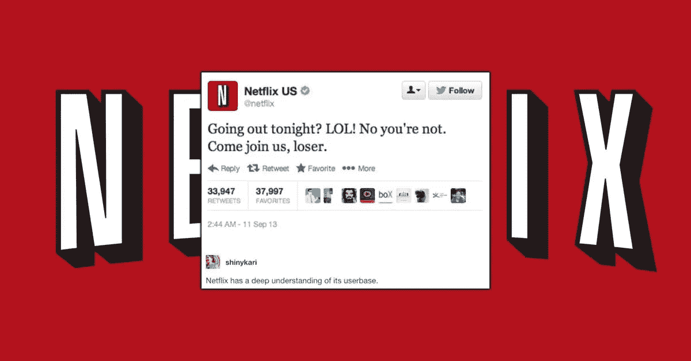
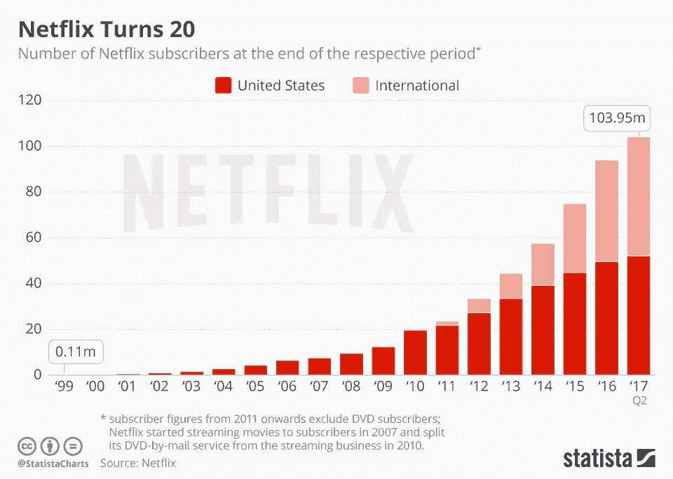

# 网飞和寒意

> 原文：<https://medium.datadriveninvestor.com/netflix-and-chill-87ff33439dde?source=collection_archive---------22----------------------->

没有人说过让我们冷静下来。成为 SVOD 平台上流媒体电影和连续剧的同义词意味着两种情况之一，要么该公司是第一个推出这项服务的公司，用户习惯于将该品牌作为该行为的同义词，要么它是联盟中的领先企业，用户已经将它的产品应用到他们的日常生活中，现在很难区分这两者。就网飞而言，这是由于这两种情况。准备好赌红色了吗？

雷德·哈斯汀斯，网飞的联合创始人兼首席执行官，多年前押注于网飞，并以一种极其聪明的方式推出了它。他首先推出了 DVD 邮寄服务，以实现从 Blockbuster 商业模式的平稳过渡，在 Blockbuster 的商业模式中，每部电影都需要租赁，当归还延迟时，最终要支付 40 美元。仅仅是为了让用户有机会通过邮件订购 DVD，并且想看多久就看多久，每月的订阅费大约是 9 美元。与此同时，里德学院推出了网飞·SVOD 平台，面向更适应新时代的观众。这是真正的爆炸发生的地方。网飞在线人数飙升，正好赶上该公司保持 1530 亿美元的历史最高净值。

现在，有很多关于雷德·哈斯汀斯应该做什么的问题。他应该停止邮寄 DVD，专注于网飞的 SVOD 平台吗？既然所有主要电影公司都在从现有的 SVOD 平台上获取内容，并创建自己的内容，他应该开发新的原创内容吗？或者他应该兑现网飞的净资产吗？

为了准确而合理地回答这个问题，让我们从这位联合创始人兼首席执行官的话开始。

> 大多数企业家的想法听起来会很疯狂、愚蠢、不经济，然后它们会被证明是正确的。–雷德·哈斯汀斯

雷德·哈斯汀斯在 DVD-by-mail 和网飞·SVOD 平台上赌了一把，骰子对他有利。20 年后，他的公司拥有历史上最高的净值。如果雷德·哈斯汀斯没有以这个速度兑现呢？万一他又赌红了，把公司身家翻倍了呢？你在米奇之前听说过沃尔特吗？这是网飞 2.0 之前的里德。难道你们不想现在就体验你们最喜欢的节目，并来到一个完全不同的现实中吗？这场赌博可能既疯狂又不划算，但我赌红色，我迫不及待地想知道答案。

 [## 网飞原创系列和电影

### 尽情观看。没有广告。没有承诺。

www.netflix.com](https://www.netflix.com/ae-en/originals)